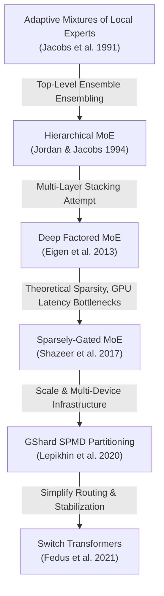
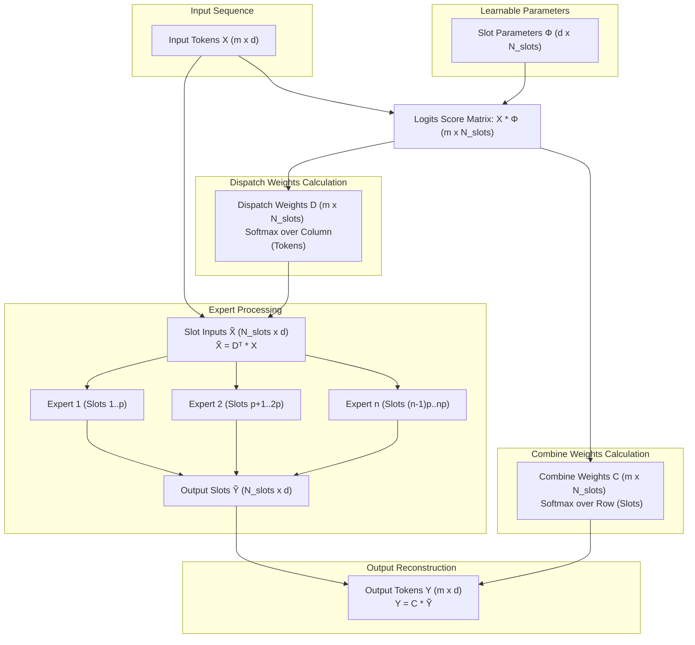
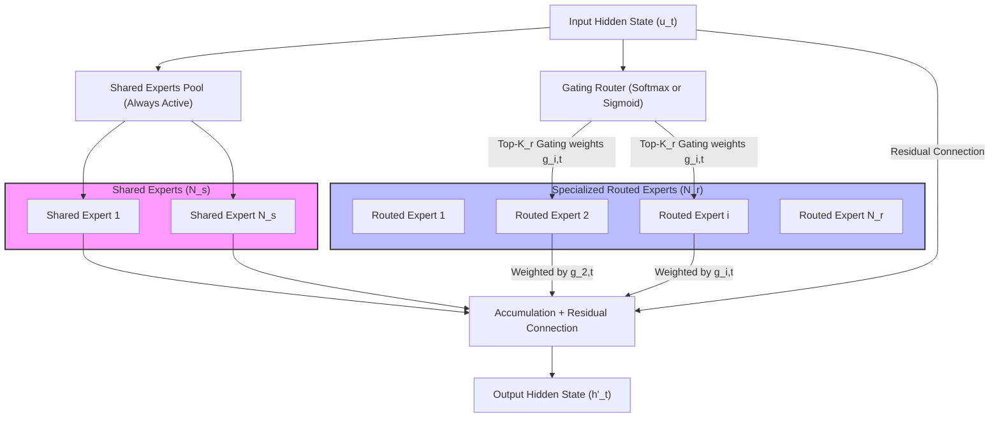
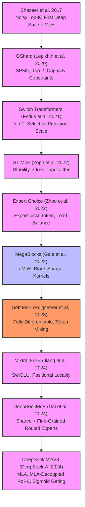

# Mixture of Experts (MoE) Models: A Technical Report

This report covers mathematical, algorithmic, and systems-level breakthroughs in sparsely-gated Mixture of Experts (MoE) models. This document traces the trajectory of conditional computation from foundational scaling theory to state-of-the-art production architectures, training stability mechanics, distributed parallelisms, dropless block-sparse GPU kernels, and KV-cache optimization guides.

## Table of Contents

- [Section 1: Introduction and Theoretical Foundations of Mixture of Experts (MoE)](#section-1-introduction-and-theoretical-foundations-of-mixture-of-experts-moe)
- [Section 2: Token-Choice Routing: Mechanics, Scaling, and Key Limitations](#section-2-token-choice-routing-mechanics-scaling-and-key-limitations)
- [Section 3: Alternative Gating Paradigms: Expert-Choice Routing](#section-3-alternative-gating-paradigms-expert-choice-routing)
- [Section 4: Differentiable and Continuous Gating: Soft MoE](#section-4-differentiable-and-continuous-gating-soft-moe)
- [Section 5: DeepSeekMoE and Hybrid Architectures: Shared & Specialized Experts](#section-5-deepseekmoe-and-hybrid-architectures-shared-specialized-experts)
- [Section 6: Load Balancing, Router Regularization, and Training Stability](#section-6-load-balancing-router-regularization-and-training-stability)
- [Section 7: Systems & Distributed Compilation at Scale: GShard and Expert Parallelism](#section-7-systems-distributed-compilation-at-scale-gshard-and-expert-parallelism)
- [Section 8: Overcoming Systems Waste: Dropless Sparse Kernels & MegaBlocks](#section-8-overcoming-systems-waste-dropless-sparse-kernels-megablocks)
- [Section 9: Production MoE LLMs, Synthesis & Structural Comparison](#section-9-production-moe-llms-synthesis--structural-comparison)

---

# Section 1: Introduction and Theoretical Foundations of Mixture of Experts (MoE)

Mixture of Experts (MoE) architecture represents a pivotal paradigm shift in deep learning. Traditional neural networks operate under a **dense compute paradigm**, where every parameter in the model is activated for every input token. In contrast, MoE introduces the **sparse compute paradigm** via conditional computation, decoupling the parameter capacity of a network from its computational budget per forward pass.

This section details the historical context of conditional computation, mathematically analyzes the scaling dynamics of active vs. total parameters, formalizes the routing gating mechanisms, and unpacks the fundamental engineering and compiler-level orchestration strategies that make outrageously large neural networks viable on modern hardware clusters.

---

## 1.1 Historical Context of Conditional Computation

The concept of conditional computation—activating distinct subnetworks dynamically on a per-example or per-token basis—has a rich history aimed at overcoming the hardware and data-scaling bottlenecks of deep learning.



### 1.1.1 The Classical MoE Foundations (1991–2013)
The Mixture of Experts paradigm originated in the early 1990s with the work of [Jacobs et al. 1991](https://arxiv.org/abs/1701.06538) and was extended to hierarchical structures by [Jordan & Jacobs 1994](https://arxiv.org/abs/1701.06538). In these early architectures:
*   The MoE acted as a global ensembling model where a central gating network calculated softmax probabilities to weight the outputs of a set of localized experts.
*   The entire system was trained jointly via gradient descent or the Expectation-Maximization (EM) algorithm.
*   However, these early models were applied as **top-level** ensembles of the entire model, rather than as modular layers embedded within deep architectures, limiting their representation capacity.

The first attempt to stack multiple MoE layers deep within a neural network was proposed by [Eigen et al. 2013](https://arxiv.org/abs/1701.06538), who introduced the *Deep Factored MoE*. While they succeeded in using stacked MoEs inside convolutional and feed-forward networks, their model activated **all** experts to some degree (non-sparse, dense gating), which did not yield the computational savings required to justify the massive parameter overhead.

### 1.1.2 The Bottlenecks of Early Sparsity
Prior to 2017, multiple conditional computation schemes were proposed (e.g., binary stochastic gates, reinforcement learning-based routers, and block-wise dropout) by researchers like Bengio et al. However, these models failed to demonstrate wall-clock speedups or massive capacity scaling in practice. The field was stalled by several fundamental challenges:
1.  **Hardware Branching Latency:** GPUs and modern accelerators are optimized for high-throughput, regular, and dense matrix arithmetic. Conditional computation introduces dynamic branching, leading to divergent execution paths that severely underutilize SIMD (Single Instruction, Multiple Data) architectures.
2.  **The Shrinking Batch Problem:** As a batch is dynamically routed among $N$ experts, the effective batch size routed to each individual expert shrinks proportionally. Small batch sizes fail to amortize the latency of memory access, degrading arithmetic intensity (FLOPs per byte of memory transfer) and causing the experts to execute in memory-bandwidth-bound regimes.
3.  **Inter-Device Bandwidth Bottlenecks:** Distributing experts across a cluster requires sending intermediate representations across the network. If the computational cost of the expert is low relative to the size of the tensor being routed, inter-device network bandwidth becomes the primary bottleneck, neutralizing the benefits of parallelization.
4.  **Training Instabilities and Load Imbalance:** Trainable gating networks naturally converge to a pathological "rich-get-richer" state. A few highly-performing experts receive a disproportionate share of the tokens, accelerating their specialization, while the remaining experts remain undertrained and underutilized.

### 1.1.3 The Sparse MoE Breakthrough (2017)
The breakthrough that realized the promise of conditional computation was the *Sparsely-Gated Mixture-of-Experts Layer* by [Shazeer et al. 2017](https://arxiv.org/abs/1701.06538). They successfully scaled models to over 137 billion parameters with high computational efficiency on GPU clusters by:
*   Embedding the MoE layer convolutionally between recurrent (LSTM) layers, executing gating decisions independently at each sequence token position.
*   Introducing **Noisy Top-K Gating** to inject tunable Gaussian noise into the router logits. This noise allowed the model to explore routing pathways, smoothing the non-differentiable $k$-selection and preventing early expert collapse.
*   Defining global **importance-weighting** and **load-balancing** auxiliary losses to enforce uniform resource utilization.
*   Addressing the shrinking batch problem by combining data-parallel and model-parallel paradigms, grouping tokens from multiple data replicas before dispatching them synchronously to expert shards.

### 1.1.4 Modern Evolution: GShard and Switch Transformers
While Shazeer et al. established sparse MoE within recurrent networks, the architecture was scaled to gargantuan limits within the Transformer framework by:
*   **GShard ([Lepikhin et al. 2020](https://arxiv.org/abs/2006.16668)):** Scaled Transformer models beyond 600 billion parameters. GShard replaced every other Feed-Forward Network (FFN) layer of the Transformer with a Position-wise MoE layer using a refined **Top-2 gating** mechanism. They pioneered **Single Program Multiple Data (SPMD)** compiler-level partitioning via XLA, abstracting device-specific communication away from model definition.
*   **Switch Transformers ([Fedus et al. 2021](https://arxiv.org/abs/2101.03961)):** Simplified routing by using **Top-1 gating (Switch Routing)**. They proved that routing to a single expert preserves model quality while dramatically reducing router computation, halving expert capacity buffers, and slashing cross-device communication volume. They also introduced key stabilization techniques like **selective precision** and **reduced initialization scale**, making the training of trillion-parameter sparse models stable in lower-precision (bfloat16) formats.

---

## 1.2 Scaling Dynamics: Active vs. Total Parameters

The core mathematical appeal of MoE models lies in their ability to scale capacity sublinearly with computational cost. We formalize this by defining the difference between **Total Parameters ($P_{\text{total}}$)** and **Active Parameters ($P_{\text{active}}$)**.

### 1.2.1 Parameter Formulations in Transformers
Consider a standard dense Transformer layer with hidden dimension $d_{\text{model}}$ and an intermediate FFN dimension $d_{\text{ff}}$ (typically $d_{\text{ff}} = 4 \cdot d_{\text{model}}$). The FFN block consists of two linear projections:
$$h = \text{Activation}\left(X \cdot W_1 + b_1\right)$$
$$Y = h \cdot W_2 + b_2$$
Where $W_1 \in \mathbb{R}^{d_{\text{model}} \times d_{\text{ff}}}$ and $W_2 \in \mathbb{R}^{d_{\text{ff}} \times d_{\text{model}}}$. Neglecting the bias terms, the parameters of the dense FFN block are:
$$P_{\text{dense\_FFN}} = 2 \cdot d_{\text{model}} \cdot d_{\text{ff}}$$

In an MoE Transformer layer, the dense FFN is replaced by a Sparsely-Gated MoE FFN layer containing $E$ independent experts, where each expert $\text{FFN}_e$ is an FFN block with parameters identical in shape to $P_{\text{dense\_FFN}}$. 

```
Standard Dense Transformer Layer FFN:
[Input: d_model] ──> ┌──────────────────────────────────────┐ ──> [Output: d_model]
                     │         Dense FFN (P_dense)          │
                     └──────────────────────────────────────┘

Sparsely-Gated MoE Transformer Layer FFN:
                     ┌──────────────────────────────────────┐
                     │          Router (W_r)                │
                     └──────────────────┬───────────────────┘
                                        │ (Select k of E)
                                        ▼
[Input: d_model] ──> ├─── [Dispatch Mask & All-to-All] ───┤
                           ├── Expert 1 (P_FFN)  ──┤
                           ├── Expert 2 (P_FFN)  ──┤
                           │         ...         │
                           └── Expert E (P_FFN)  ──┘
                     ├─── [Combine Mask & All-to-All] ────┤ ──> [Output: d_model]
```

The router network parameters $W_r \in \mathbb{R}^{d_{\text{model}} \times E}$ are negligible in scale. Therefore, the parameter counts are formulated as follows:

#### 1.2.1.1 Total Parameters ($P_{\text{total}}$)
The total parameters in the MoE layer represent the storage footprint required in memory (SRAM or HBM across devices):
$$P_{\text{total}} = E \cdot \left( 2 \cdot d_{\text{model}} \cdot d_{\text{ff}} \right) + d_{\text{model}} \cdot E \approx E \cdot P_{\text{dense\_FFN}}$$

#### 1.2.1.2 Active Parameters ($P_{\text{active}}$)
The active parameters represent the subset of weights executed per individual token during the forward pass:
$$P_{\text{active}} = k \cdot \left( 2 \cdot d_{\text{model}} \cdot d_{\text{ff}} \right) + d_{\text{model}} \cdot E \approx k \cdot P_{\text{dense\_FFN}}$$
Where $k$ is the number of experts activated per token ($k \ll E$). 

When scaling the model by increasing the number of experts $E$, $P_{\text{total}}$ scales **linearly** with $E$, whereas $P_{\text{active}}$ remains virtually **constant**.

### 1.2.2 Mathematical Complexity and FLOPs
Let $N$ be the sequence length (number of tokens in the batch). The computational complexity of the dense and MoE FFN layers can be formalized in terms of floating-point operations (FLOPs). Assuming 2 FLOPs per multiply-accumulate operation:

$$\text{FLOPs}_{\text{dense}} = 2 \cdot N \cdot P_{\text{dense\_FFN}} = 4 \cdot N \cdot d_{\text{model}} \cdot d_{\text{ff}}$$

$$\text{FLOPs}_{\text{MoE}} = \underbrace{2 \cdot N \cdot d_{\text{model}} \cdot E}_{\text{Router Layer}} + \underbrace{2 \cdot k \cdot N \cdot P_{\text{dense\_FFN}}}_{\text{Expert Computation}} + \underbrace{O(\text{Communication Overhead})}_{\text{All-to-All / Partition Resharding}}$$

Since $E \ll d_{\text{model}}$ and the communication overhead scales sublinearly with hardware size when properly partitioned, we get:
$$\text{FLOPs}_{\text{MoE}} \approx 2 \cdot k \cdot N \cdot P_{\text{dense\_FFN}} = k \cdot \text{FLOPs}_{\text{dense}}$$

For $k=1$ (Switch Transformer), the computational complexity per token of a sparse MoE model with hundreds of billions of total parameters is mathematically identical to a small dense model containing only a single expert's worth of parameters.

### 1.2.3 Empirical Scaling Laws and the Pareto Frontier
Empirical results from [Shazeer et al. 2017](https://arxiv.org/abs/1701.06538), [Lepikhin et al. 2020](https://arxiv.org/abs/2006.16668), and [Fedus et al. 2021](https://arxiv.org/abs/2101.03961) demonstrate that scaling parameters sparsely yields a dramatic shift in the Pareto frontier of quality vs. compute cost:

1.  **Sample Efficiency on a Step-Basis:** For a fixed training step budget, sparse models achieve significantly lower perplexity (loss) than dense baseline counterparts. As shown in the Switch Transformer experiments:
    *   A Switch-Base model with 64 experts (14.7B parameters) achieves the same pre-training perplexity as a dense T5-Base baseline (223M parameters) in only **$13.3\%$ of the steps** (a $7.5\times$ sample-efficiency speedup).
2.  **Wall-Clock Time Savings:** Despite cross-device network communication overhead, the sparse parameterization translates into substantial wall-clock speedups:
    *   The Switch-Base 64-expert model achieves the same quality as T5-Base in **one-seventh of the training time** ($7\times$ speedup) under identical hardware budgets (32 TPU v3 cores).
    *   When compared to a larger dense model like T5-Large, which consumes $3.5\times$ more FLOPs per token, the Switch-Base model is still more sample-efficient and delivers a **$2.5\times$ wall-clock speedup**.

---

## 1.3 Core Architectural Components of MoE Models

An MoE layer is comprised of three essential pillars: the gating routing network, the partitioned expert neural networks, and the load-balancing optimization framework.

```
                  ┌────────────────────────┐
                  │      Input Token x     │
                  └───────────┬────────────┘
                              │
                              ▼
            ┌───────────────────────────────────┐
            │       Gating Network (Router)     │
            │   h(x) = W_r * x + Noise (Expl)   │
            └─────────────────┬─────────────────┘
                              │
                              ▼
            ┌───────────────────────────────────┐
            │        Sparse Softmax Filter      │
            │  KeepTopK(Softmax(h(x)), k)       │
            └──────────┬──────────────┬─────────┘
                       │              │
             Expert 1  │              │ Expert 2
             (Gate p1) │              │ (Gate p2)
                       ▼              ▼
                ┌──────────┐    ┌──────────┐
                │ Expert 1 │    │ Expert 2 │
                │  FFN_1   │    │  FFN_2   │
                └────┬─────┘    └────┬─────┘
                     │               │
                     │  Weighted Sum │
                     └───────┬───────┘
                             ▼
            ┌───────────────────────────────────┐
            │     Output: y = Sum p_i * E_i     │
            └───────────────────────────────────┘
```

### 1.3.1 Gating Network (The Router) Mathematical Formulations

The router maps an input representation $x \in \mathbb{R}^{d_{\text{model}}}$ to a sparse probability distribution $G(x) \in \mathbb{R}^E$. We detail the evolution of these gating functions:

#### 1.3.1.1 Classic Softmax Gating (Non-Sparse)
The simplest gating mechanism applies a parameterized projection followed by a softmax activation:
$$G_{\sigma}(x) = \text{Softmax}(x \cdot W_r)$$
This results in a dense routing vector where $G_{\sigma}(x)_i > 0$ for all experts. It offers no computational savings, as all $E$ experts must be evaluated.

#### 1.3.1.2 Noisy Top-K Gating
To enforce sparsity while maintaining a differentiable formulation, [Shazeer et al. 2017](https://arxiv.org/abs/1701.06538) introduced noisy top-$k$ gating:
$$H(x)_i = (x \cdot W_r)_i + \epsilon \cdot \text{Softplus}\left((x \cdot W_{\text{noise}})_i\right)$$
Where $W_r, W_{\text{noise}} \in \mathbb{R}^{d_{\text{model}} \times E}$, and $\epsilon \sim \mathcal{N}(0, 1)$ is standard Gaussian noise drawn independently per step. The routing vector is defined by keeping only the top-$k$ pre-activation elements and setting the rest to $-\infty$:
$$\text{KeepTopK}(v, k)_i = \begin{cases} v_i & \text{if } v_i \text{ is in the top } k \text{ elements of } v, \\ -\infty & \text{otherwise.} \end{cases}$$
$$G(x) = \text{Softmax}\left(\text{KeepTopK}(H(x), k)\right)$$
*   **Gradient Flow:** If $k > 1$ (e.g., $k=2$), the gating weights $W_r$ receive active gradients because the gate outputs for the top-$k$ experts are continuously dependent on the inputs and weights via the softmax function. Gradients backpropagate directly through the gating network to the preceding layers.

#### 1.3.1.3 GShard Top-2 Gating with Capacity Constraints
[Lepikhin et al. 2020 (GShard)](https://arxiv.org/abs/2006.16668) enforces a group-level parallel Top-2 routing strategy to ensure deterministic behavior on massive TPU clusters. Given a group of tokens $x_S$ of size $S$:
1.  Calculate standard gates: $g_{S,E} = \text{Softmax}(w_g \cdot x_S)$.
2.  Select the top-2 experts $e_1$ and $e_2$ with logits $g_1, g_2$.
3.  **First Expert Dispatch:** The token is sent to the first expert $e_1$ with a normalized weight $g_1' = \frac{g_1}{g_1 + g_2}$ if the expert's current token count $c_{e_1}$ has not exceeded the strict expert capacity threshold $C$.
4.  **Second Expert Randomized Routing:** To conserve overall expert capacity, GShard dispatches the token to the second expert $e_2$ with probability proportional to its relative weight $g_2$:
    $$\text{rnd} \sim \mathcal{U}(0, 1)$$
    $$\text{Dispatch if: } c_{e_2} < C \quad \wedge \quad 2 \cdot g_2' > \text{rnd}$$
    If dispatched, it receives a normalized weight $g_2' = \frac{g_2}{g_1 + g_2}$. If an expert is over capacity, the token is marked as overflown and bypasses the expert layer entirely via a residual connection.

#### 1.3.1.4 Switch Routing (Top-1 Gating)
[Fedus et al. 2021 (Switch Transformers)](https://arxiv.org/abs/2101.03961) simplified the routing strategy to $k=1$:
$$p_i(x) = \text{Softmax}\left(W_r \cdot x + \text{Noise}\right)_i$$
$$i^* = \text{argmax}_i \, p_i(x)$$
The token is routed solely to expert $i^*$, and the layer output is scaled by its gate value:
$$Y = p_{i^*}(x) \cdot \text{FFN}_{i^*}(x)$$
*   **Justification:** While Shazeer et al. conjectured that $k > 1$ was necessary to generate non-trivial routing gradients (to compare at least two experts), Fedus et al. empirically demonstrated that Top-1 routing performs stably, preserves model quality, halves the required expert buffer sizes, and scales cleanly to hundreds of experts while minimizing All-to-All network communication.

---

### 1.3.2 The Expert Layer Integration
The experts are typically parameterized as identical Feed-Forward Networks (FFNs) but operate with independent weight matrices. The output of the MoE layer $Y$ is the weighted sum over all $E$ experts:
$$Y = \sum_{e=1}^{E} G(x)_e \cdot \text{FFN}_e(x)$$

In Transformer architectures, the MoE layer is typically substituted into **every other** Transformer block (i.e., replacing the FFN in alternate layers) or inserted at specified regular intervals. The self-attention layers remain shared (dense) to preserve global contextual processing, while FFN layers are sparsely scaled.

---

### 1.3.3 Load Balancing and Gating Optimization

Unconstrained routing optimization naturally collapses into a degenerative state where the router routes all tokens to the same expert. To force uniform utilization, models incorporate auxiliary loss terms into the training objective:
$$\mathcal{L}_{\text{total}} = \mathcal{L}_{\text{task}} + w_{\text{aux}} \cdot \mathcal{L}_{\text{aux}}$$

#### 1.3.3.1 Shazeer et al. 2017: Importance and Load Losses
Shazeer et al. used two separate loss terms:
1.  **Importance Loss ($\mathcal{L}_{\text{importance}}$):** Pushes the total gate weights per expert toward uniform allocation:
    $$\text{Importance}(X) = \sum_{x \in X} G(x)$$
    $$\mathcal{L}_{\text{importance}}(X) = w_{\text{importance}} \cdot \text{CV}\left(\text{Importance}(X)\right)^2$$
    Where $\text{CV}(v)$ is the Coefficient of Variation, defined as the standard deviation divided by the mean:
    $$\text{CV}(v) = \frac{\sqrt{\frac{1}{N}\sum_{j=1}^N (v_j - \bar{v})^2}}{\bar{v}}$$
2.  **Load Loss ($\mathcal{L}_{\text{load}}$):** Pushes the actual number of examples processed by each expert to be uniform. Since the counting of examples is discrete and non-differentiable, they formulated a smooth, differentiable estimator of the probability $P(x, i)$ that token $x$ is selected in the top-$k$:
    $$P(x, i) = \Phi\left( \frac{(x \cdot W_r)_i - \text{kth\_excluding}(H(x), k, i)}{\text{Softplus}\left((x \cdot W_{\text{noise}})_i\right)} \right)$$
    Where $\Phi(z)$ is the standard normal Cumulative Distribution Function (CDF), and $\text{kth\_excluding}(v, k, i)$ returns the $k$-th largest element of vector $v$ excluding index $i$. The load and its loss are defined as:
    $$\text{Load}(X) = \sum_{x \in X} P(x, i)$$
    $$\mathcal{L}_{\text{load}}(X) = w_{\text{load}} \cdot \text{CV}\left(\text{Load}(X)\right)^2$$

#### 1.3.3.2 GShard Group-Level Auxiliary Loss
GShard groups tokens into $G$ parallel groups of size $S$. To enforce uniform routing across the $E$ experts, they minimize:
$$\mathcal{L}_{\text{aux}} = \frac{1}{E} \sum_{e=1}^E \frac{c_e}{S} \cdot m_e$$
Where $c_e$ is the discrete count of tokens in the group routed to expert $e$ (non-differentiable), and $m_e$ is the differentiable average routing probability assigned to expert $e$ across the group tokens:
$$m_e = \frac{1}{S} \sum_{s=1}^S g_{s, e}$$
By multiplying the non-differentiable actual routing fraction $c_e/S$ with the fully differentiable probability proxy $m_e$, gradient descent can propagate updates back to the router weights to shift probability mass away from overloaded experts.

#### 1.3.3.3 Switch Transformer Simplified Load-Balancing Loss
Switch Transformers consolidated load balancing into a single, clean auxiliary loss. Given $N$ experts and a batch $B$ with $T$ tokens, the loss is the scaled dot-product between the token dispatch fraction vector $f$ and the router probability fraction vector $P$:
$$\mathcal{L}_{\text{bal}} = \alpha \cdot N \cdot \sum_{i=1}^N f_i \cdot P_i$$
Where:
*   $f_i$ is the actual fraction of tokens dispatched to expert $i$:
    $$f_i = \frac{1}{T} \sum_{x \in B} \mathbb{1}_{\{\text{argmax } p(x) = i\}}$$
*   $P_i$ is the fraction of total router probability allocated to expert $i$:
    $$P_i = \frac{1}{T} \sum_{x \in B} p_i(x)$$

The loss is minimized under a uniform distribution where $f_i = 1/N$ and $P_i = 1/N$ for all experts. Pushing both distributions toward uniform routing ensures that the computational load is balanced evenly across all hardware devices hosting the experts. The hyperparameter $\alpha$ is a multiplier, typically set to $10^{-2}$ (or $0.01$).

---

## 1.4 Engineering and System Orchestration Challenges

Translating theoretical MoE formulations into high-performance execution requires deep system-level optimizations that address parallel computing bottlenecks.

### 1.4.1 The Shrinking Batch and Communication Bottlenecks
In standard distributed training, data-parallel replicas process distinct batches of size $b$ synchronously across $d$ devices. If an MoE layer contains $E$ experts, a naive local implementation means each expert receives a micro-batch of size:
$$b_{\text{local\_expert}} \approx \frac{k \cdot b}{E}$$
For large clusters with hundreds of experts, $b_{\text{local\_expert}} \to 0$, causing execution to become memory-bandwidth bound. 

To solve this, Shazeer et al. introduced a critical engineering paradigm: **mixing data parallelism and model parallelism**.
1.  Standard Transformer layers and routing networks are executed in a standard data-parallel configuration across $d$ replicas.
2.  Each device hosts exactly one (or a subset of) the $E$ experts (model-parallel sharding).
3.  Before the MoE computation, a global communication barrier consolidates the tokens from all $d$ replicas. 
4.  The combined batch of size $b \cdot d$ is routed synchronously. Each expert now receives a highly optimized, computationally dense batch of size:
    $$b_{\text{efficient\_expert}} \approx \frac{k \cdot b \cdot d}{E}$$
5.  This achieves a factor of $d$ improvement in expert batch size, restoring high arithmetic intensity on the hardware accelerators.

```
Device 1 (Data Replica 1): ──> [Token 1a, Token 1b] ──┐
Device 2 (Data Replica 2): ──> [Token 2a, Token 2b] ──┼─> [All-to-All Resharding] ─> [Expert 1 Batch] ─> [Device 1 (Expert 1)]
Device 3 (Data Replica 3): ──> [Token 3a, Token 3b] ──┘                             [Expert 2 Batch] ─> [Device 2 (Expert 2)]
                                                                                     [Expert 3 Batch] ─> [Device 3 (Expert 3)]
```

---

### 1.4.2 Expert Capacity and Token Dropping
Because token routing is dynamic, some experts will naturally receive more tokens than average in any given batch. Since accelerators require statically shaped tensors at compile time, we must define a rigid buffer size per expert, termed the **Expert Capacity ($C_e$)**:

$$C_e = \left( \frac{\text{Tokens Per Batch}}{\text{Number of Experts}} \right) \times C_f$$
Where $C_f$ is the **Capacity Factor**.
*   **$C_f = 1.0$ (Minimum Capacity):** If tokens are not perfectly balanced, any expert receiving more than its fair share will drop tokens.
*   **$C_f > 1.0$ (Buffer Capacity):** Standard capacity factors (e.g., $1.25$, $1.5$, or $2.0$) create an extra buffer to accommodate routing variance, mitigating token dropping at the cost of memory overhead (padding empty slots with zeros).

When the number of tokens routed to an expert exceeds its capacity $C_e$, the excess tokens are marked as **overflown (dropped)**. The computation for these dropped tokens is skipped, and their hidden representation passes directly to the next layer unchanged via the residual connection. 

Empirical trade-offs of the capacity factor are measured below:

| Routing Type | Capacity Factor ($C_f$) | Token Dropping Rate | Rel. Training Speed | Memory Overhead |
| :--- | :--- | :--- | :--- | :--- |
| **Top-2 (GShard)** | $2.0$ | $\approx 0.0\%$ | $100\%$ (Baseline) | High (Zero Padding) |
| **Top-2 (GShard)** | $1.25$ | $< 1.0\%$ | $94\%$ (Slower due to overhead) | Moderate |
| **Top-1 (Switch)** | $2.0$ | $0.0\%$ | $102\%$ | High |
| **Top-1 (Switch)** | $1.0$ | $< 1.0\%$ | $119\%$ (Fastest) | None (Dense Pack) |

---

### 1.4.3 GShard SPMD Parallelism and XLA Compiler
To orchestrate this dynamic routing and model partitioning across thousands of hardware accelerators, GShard pioneered a **Single Program Multiple Data (SPMD)** compiler partitioning pipeline.

#### 1.4.3.1 SPMD vs. MPMD Scalability
*   **MPMD (Multiple Program Multiple Data):** Traditionally, model parallelism generated distinct computation graphs for each individual device. This approach causes the compilation graph size to explode linearly ($O(D)$ or quadratic $O(D^2)$ due to communication links) as the cluster scale $D$ increases, resulting in prohibitive compilation times.
*   **SPMD (Single Program Multiple Data):** SPMD generates a **single program** that runs identically on all devices. The logical tensors represent the global dimensions of the model, and the compiler automatically shards the operations based on lightweight user annotations. The graph size and compilation overhead remain **constant ($O(1)$)**, scaling easily to thousands of devices.

```
MPMD Approach (Graph scales with device count D):
┌──────────┐      ┌──────────┐      ┌──────────┐
│ Device 0 │      │ Device 1 │      │ Device 2 │
│ Program  │      │ Program  │      │ Program  │
└────┬─────┘      └────┬─────┘      └────┬─────┘
     └─────────┬───────┘                 │ (Explicit inter-device channels)
               ▼                         ▼
          Collective 1              Collective 2

SPMD Approach (Single program compiled once, constant O(1) graph complexity):
              ┌───────────────────────────────┐
              │    Logical SPMD Graph         │
              │  Split dim 0 across D devices │
              └───────────────┬───────────────┘
                              ▼ (XLA Compiler HLO Pipeline)
              ┌───────────────────────────────┐
              │  Unified SPMD Executable      │
              │  Executes on all D devices    │
              └───────────────────────────────┘
```

#### 1.4.3.2 GShard Sharding Annotation APIs
GShard exposes three critical tensor partition annotations to the compiler:
1.  `replicate(tensor)`: Restores or maintains the tensor in a replicated state across all devices (used for standard Transformer weights).
2.  `split(tensor, split_dimension, num_partitions)`: Partitions the tensor along the specified dimension across the physical devices.
3.  `shard(tensor, device_assignment)`: Generalizes partitioning to multi-dimensional layouts and specific hardware topologies.

#### 1.4.3.3 XLA Collective Communication Primitives
The compiler translates sharding mismatch boundaries in the dataflow graph into highly optimized collective communications:
*   `AllToAll`: Logically splits the input of each participant along one dimension and distributes the pieces to different participants, concatenating them. This is the **workhorse** of MoE, used to reshard intermediate representations from the data-parallel dimension (Group/Tokens) to the model-parallel dimension (Experts) and back.
*   `AllReduce`: Sums up partial results across all devices. Used in MoE when inputs are contracted along partitioned dimensions.
*   `AllGather`: Concatenates shards from all participants, converting a sharded tensor back into a replicated layout.
*   `CollectivePermute`: Executes targeted point-to-point source-destination transfers, typically used for halo exchange in specialized window operations.

---

### 1.4.4 Step-by-Step MoE Gating and All-to-All Communication Trace

Below is a detailed trace of the tensor layouts, shapes, and communication transitions through an SPMD MoE layer, mirroring the implementation within Mesh TensorFlow and the XLA partitioner:

1.  **Input Formulation:** 
    *   Let the global input tensor shape be `[Batch, Seq_Len, d_model]`.
    *   The input is annotated with `split` along the batch dimension:
        $$\text{Layout on device } c: \quad X_{\text{local}} \in \mathbb{R}^{\frac{\text{Batch}}{D} \times \text{Seq\_Len} \times d_{\text{model}}}$$
    *   This is reshaped locally into:
        $$\text{Shape: } \quad [G, S, d_{\text{model}}]$$
        Where $G$ is the group count (aligned to device count $D$), and $S$ is the tokens per core.

2.  **Router Logits and Gating:**
    *   The router weights $W_r \in \mathbb{R}^{d_{\text{model}} \times E}$ are annotated with `replicate` and are present on all devices.
    *   Compute logits via local einsum:
        $$\text{logits} = \text{einsum}\left([G, S, d_{\text{model}}], [d_{\text{model}}, E]\right) \to [G, S, E]$$
    *   Calculate gating probabilities and Top-1 selection:
        $$G(x) \to [G, S, E] \quad (\text{one-hot mask})$$

3.  **Dynamic Dispatch and Local Token Packing:**
    *   Compute cumulative sum over tokens to calculate local position in expert buffers:
        $$\text{position\_in\_expert} = \text{cumsum}(G(x), \text{dim}=S) \cdot G(x) \to [G, S, E]$$
    *   Filter out tokens exceeding expert capacity $C$:
        $$\text{dispatch\_mask} \to [G, S, E, C] \quad (\text{binary matrix})$$

4.  **All-to-All Dispatch Phase (Global Comm Barrier):**
    *   The local inputs are multiplied with the dispatch mask:
        $$\text{expert\_inputs\_local} = \text{einsum}\left([G, S, d_{\text{model}}], [G, S, E, C]\right) \to [E, G, C, d_{\text{model}}]$$
        *   At this stage, the tensor is partitioned along the group dimension $G$ (`Layout: [1, n, 1, 1]`).
    *   An **`AllToAll` collective communication** is triggered to change the sharding dimension from the group ($G$) dimension to the expert ($E$) dimension.
    *   This reorganizes the buffers across devices:
        $$\text{expert\_inputs\_sharded} \to [E, G, C, d_{\text{model}}] \quad (\text{Layout: [n, 1, 1, 1]})$$
        *   *Result:* Each device $i$ now hosts all the tokens routed globally to the specific expert $e_i$ it is responsible for.

5.  **Expert FFN Execution:**
    *   The local expert executes standard FFN projections:
        $$H = \text{ReLU}\left(\text{einsum}\left([E_{\text{local}}, G, C, d_{\text{model}}], W_{\text{in}}\right)\right)$$
        $$Y_{\text{expert}} = \text{einsum}\left(H, W_{\text{out}}\right) \to [E, G, C, d_{\text{model}}]$$
        *   *Computational Density:* Since the cores are sharded along $E$ (`Layout: [n, 1, 1, 1]`), this FFN matrix multiplication executes at maximum arithmetic throughput on local device accelerators.

6.  **All-to-All Recombine Phase:**
    *   A second **`AllToAll` collective communication** is triggered to return the layout back to core-partitioning.
    *   This reshards the tensor back from expert dimension $E$ to group dimension $G$:
        $$\text{expert\_outputs\_local} \to [E, G, C, d_{\text{model}}] \quad (\text{Layout: [1, n, 1, 1]})$$

7.  **Final Token Recombination:**
    *   The outputs are recombined with the gating probabilities ($combine\_weights$):
        $$\text{outputs\_local} = \text{einsum}\left([E, G, C, d_{\text{model}}], G(x)_{\text{combine}}\right) \to [G, S, d_{\text{model}}]$$
    *   Reshape back to the original layout:
        $$\text{outputs} \to [\text{Batch}, \text{Seq\_Len}, d_{\text{model}}]$$

---

## 1.5 Architectural Comparison Matrix

The following matrix contrasts the theoretical and structural differences across key landmark sparsely-gated MoE architectures:

| Architectural Metric | Outrageously Large Neural Networks <br>[Shazeer et al. 2017](https://arxiv.org/abs/1701.06538) | GShard <br>[Lepikhin et al. 2020](https://arxiv.org/abs/2006.16668) | Switch Transformers <br>[Fedus et al. 2021](https://arxiv.org/abs/2101.03961) |
| :--- | :--- | :--- | :--- |
| **Base Architecture** | LSTM / Recurrent Network | Transformer (Encoder-Decoder) | Transformer (T5-based Encoder-Decoder) |
| **Gating Routing Mechanism** | Noisy Top-$K$ ($K \ge 4$ typically) | Top-$2$ with Capacity Constraints | Switch Routing (Top-$1$ Gating) |
| **Active Experts per Token ($k$)** | $k \ge 4$ | $k = 2$ | $k = 1$ |
| **Auxiliary Losses** | Importance Loss + Load Loss (Coefficient of Variation) | Group-Level Load Loss ($c_e \cdot m_e$) | Consolidated Load-Balancing Loss ($f_i \cdot P_i$) |
| **Precision Formats** | FP32 | FP32 throughout router/experts | Selective Mixed Precision (FP32 in Router, BF16 elsewhere) |
| **Compilation Abstraction** | Manual partitioning, Parameter Servers | SPMD Auto-Partitioning (XLA Compiler) | SPMD Partitioning (Mesh TensorFlow) |
| **Expert Dropout Regularization** | Standard LSTM dropout | No specialized expert dropout | Expert Dropout ($0.4$ on expert layers, $0.1$ elsewhere) |
| **Peak Model Scale Tested** | $137 \text{ Billion Parameters}$ | $600 \text{ Billion Parameters}$ | $1.6 \text{ Trillion Parameters}$ |
| **Scale Hardware Target** | $16\text{–}32 \text{ Tesla K40 GPUs}$ | $2048 \text{ TPU v3 Cores}$ | $2048 \text{ TPU v3 Cores}$ |

---

## 1.6 Optimization and Training Stability Tricks

Sparsity introduces sharp, non-differentiable routing transitions, which often trigger severe training instability in deep architectures. We detail the three foundational stabilization techniques established in the literature:

### 1.6.1 Selective Precision
Standard low-precision training (bfloat16) is highly susceptible to divergence in sparse routers due to numerical overflow and underflow in the softmax probability calculations. GShard bypassed this by running the entire MoE layer in float32, which doubled the required inter-device communication bandwidth.

[Fedus et al. 2021](https://arxiv.org/abs/2101.03961) resolved this bottleneck via **Selective Precision**:
1.  The input hidden states $X \in \mathbb{R}^{d_{\text{model}}}$ are cast to `float32` locally on each device.
2.  The router weights $W_r$ are maintained in `float32`.
3.  The pre-softmax addition of exploration noise, softmax routing probabilities $p_i(x)$, and token capacity cumsum calculations are all executed in `float32`.
4.  Once the dispatch and combine tensors are constructed, they are cast back to `bfloat16` before being sent across the network via `AllToAll` communication.
5.  All heavy expert matrix multiplications are executed in `bfloat16`.
*   *Benefit:* Restores absolute numerical stability during pre-training while preserving the full $2\times$ memory throughput advantage of bfloat16 communications.

### 1.6.2 Reduced Initialization Scale
Deep sparse models are prone to early gradient explosions. Switch Transformers demonstrated that standard initialization scales (e.g., $s = 1.0$) for truncated normal distributions do not scale stably to hundreds of experts.
*   **Remedy:** Reduce the weight initialization scale by a factor of 10 ($s = 0.1$). Elements are drawn from a truncated normal distribution with mean $\mu = 0$ and standard deviation:
    $$\sigma = \sqrt{\frac{0.1}{n_{\text{in}}}}$$
    Where $n_{\text{in}}$ is the fan-in (number of input units) of the weight matrix.
*   *Impact:* Reduces the standard deviation of initial quality metric outputs from $0.68$ to $0.01$, stabilizing initialization and allowing models to scale seamlessly to over a trillion parameters.

### 1.6.3 Expert Dropout Regularization
During the fine-tuning of pre-trained MoE models on smaller downstream datasets (e.g., GLUE benchmarks), the vast parameter count of the experts quickly leads to severe overfitting. 
*   **Remedy:** Set a standard low dropout rate ($0.1$) at all non-expert layers (attention blocks, shared FFNs) and a significantly higher dropout rate (**$0.4$**) exclusively at the internal feed-forward projection within the experts (**Expert Dropout**).
*   *Impact:* Prevents overparameterized experts from memorizing small-scale downstream corpora, unlocking significant quality improvements across knowledge-heavy reasoning tasks.


---


# Section 2: Token-Choice Routing: Mechanics, Scaling, and Key Limitations

Sparsely-activated Mixture-of-Experts (MoE) layers replace traditional dense Feed-Forward Networks (FFNs) in Transformer architectures, scaling parameter capacity by several orders of magnitude while maintaining near-constant floating-point operations (FLOPs) per token. The critical engine enabling this decoupling of parameter capacity from compute cost is the **Routing (Gating) Network**. This section provides a mathematically rigorous formulation of token-choice routing, explores the landmark Switch routing ($k=1$) simplification, details the systems-level execution and balancing mechanics, and addresses the fundamental scaling limitations of this paradigm.

---

## 2.1 Introduction and Theoretical Foundations

### 2.1.1 The Conditional Computation Paradigm
Under the standard dense neural network paradigm, every parameter is activated for every input example, leading to a linear (or quadratic, if width and depth are scaled simultaneously) coupling between model capacity and computational cost. Conditional computation, first formalized in the context of deep learning by [Bengio et al. (2013)](https://arxiv.org/abs/1308.3432) and [Bengio et al. (2015)](https://arxiv.org/abs/1511.06297), proposes to dynamically activate distinct sub-networks on a per-example or per-token basis. 

In a Sparse MoE layer, the model consists of a set of $N$ independent expert networks $\{E_1, E_2, \dots, E_N\}$, typically parameterized as identical FFN blocks but with separate weights. A trainable gating network $G(x)$ determines a sparse routing vector over these experts for a given token representation $x \in \mathbb{R}^{d_{\text{model}}}$. The mathematical output $y \in \mathbb{R}^{d_{\text{model}}}$ of the MoE layer is written as:

$$y = \sum_{i=1}^N G(x)_i E_i(x) \quad \text{(Eq. 1)}$$

where $G(x)_i \ge 0$ is the gating coefficient for expert $i$, and $\sum_{i=1}^N G(x)_i = 1$ (if fully normalized) or represents a sparse subset. Computational savings are realized directly from the sparsity of $G(x)$: whenever $G(x)_i = 0$, the corresponding expert output $E_i(x)$ does not need to be computed, eliminating the associated FLOPs ([Shazeer et al. 2017](https://arxiv.org/abs/1701.06538)).

### 2.1.2 Softmax Gating (Jordan & Jacobs, 1994)
In classical hierarchical mixtures of experts ([Jordan & Jacobs, 1994](https://arxiv.org/abs/2006.16668)), the gating network is parameterized as a simple linear projection followed by a softmax activation:

$$G_{\sigma}(x) = \text{Softmax}(x \cdot W_g) \quad \text{(Eq. 2)}$$

where $W_g \in \mathbb{R}^{d_{\text{model}} \times N}$ represents the routing parameters. 
**Limitation:** While theoretically elegant, $G_{\sigma}(x)$ is non-sparse. Every expert receives a non-zero gating value for every token. Consequently, all $N$ experts must be evaluated, failing to achieve the conditional computation objective of reducing active step computation.

---

## 2.2 Top-k Token-Choice Routing: Mathematical Mechanics

To introduce true sparsity while maintaining end-to-end differentiability via backpropagation, [Shazeer et al. (2017)](https://arxiv.org/abs/1701.06538) formulated **Noisy Top-k Gating**. This routing architecture introduces two key modifications to Eq. 2: noise injection for exploration/load balancing and hard-sparsification via a top-$k$ filter.

### 2.2.1 The Mathematical Formulation
Let $W_g \in \mathbb{R}^{d_{\text{model}} \times N}$ be the gating weight matrix, and $W_{\text{noise}} \in \mathbb{R}^{d_{\text{model}} \times N}$ be a secondary noise control weight matrix. For a token vector $x$, the raw logit scores before sparsification, denoted by $H(x) \in \mathbb{R}^N$, are computed as:

$$H(x)_i = (x \cdot W_g)_i + \epsilon \cdot \text{Softplus}\left((x \cdot W_{\text{noise}})_i\right) \quad \text{(Eq. 3)}$$

where $\epsilon \sim \mathcal{N}(0, 1)$ is standard Gaussian noise sampled dynamically at each forward pass, and $\text{Softplus}(z) = \log(1 + e^z)$ acts as a differentiable constraint ensuring positive scaling of the noise term. 

To enforce sparsity, the gating network applies the $\text{KeepTopK}$ operator, which retains only the $k$ highest logit components of $H(x)$ and sets all remaining components to $-\infty$:

$$\text{KeepTopK}(v, k)_i = \begin{cases} 
      v_i & \text{if } v_i \text{ is in the top } k \text{ elements of } v, \\
      -\infty & \text{otherwise}
   \end{cases} \quad \text{(Eq. 4)}$$

The final sparse gating vector $G(x)$ is obtained by applying the standard softmax function to this pruned logit representation:

$$G(x) = \text{Softmax}\left(\text{KeepTopK}(H(x), k)\right) \quad \text{(Eq. 5)}$$

Because $\text{Softmax}(-\infty) = 0$, Eq. 5 guarantees that exactly $k$ experts receive non-zero weights for any token $x$. The standard configuration in large-scale models such as GShard ([Lepikhin et al. 2020](https://arxiv.org/abs/2006.16668)) and Mixtral ([Jiang et al. 2024](https://arxiv.org/abs/2401.04088)) is $k=2$, which provides a balance between routing flexibility and computational budget.

```
Token Input (x)
      │
      ├───> Linearly Gated Logits: (x · W_g)
      │                               │
      │                               ▼
      ├───> Noise Control Logits:  (x · W_noise) ──> Softplus ──> Multiply by ε ~ N(0,1)
      │                                                                  │
      │                                                                  ▼
      └───────────────────────────────────────────────────────────> Sum Logits: H(x)_i
                                                                         │
                                                                         ▼
                                                                 KeepTopK Filter (k)
                                                                         │
                                                                         ▼
                                                                  Softmax Function
                                                                         │
                                                                         ▼
                                                              Sparse Gating Vector G(x)
```

### 2.2.2 Gradient Flow and Backpropagation
The $\text{KeepTopK}$ operator introduces discontinuities in the routing space, which could theoretically disrupt backpropagation. However, for any token $x$, let $\mathcal{T}(x) \subset \{1, \dots, N\}$ be the active set of top-$k$ indices. For any $i \in \mathcal{T}(x)$, the derivative of the output $y$ with respect to the gating parameters $W_g$ is non-zero and propagates through the standard softmax Jacobian:

$$\frac{\partial G(x)_i}{\partial W_g} = G(x)_i \left( \mathbb{1}_{\{i = j\}} - G(x)_j \right) \frac{\partial H(x)_j}{\partial W_g} \quad \text{for } j \in \mathcal{T}(x)$$

Because the gradients are non-zero only for the active top-$k$ experts, the routing network learns to prioritize the specialized capabilities of specific experts based on the token representation. Additionally, the inputs to the gating network receive gradients backpropagated from the MoE layer, enabling joint representation learning between the standard layers and the routing parameters ([Shazeer et al. 2017](https://arxiv.org/abs/1701.06538)).

---

## 2.3 The Switch Routing (k=1) Simplification

[Shazeer et al. (2017)](https://arxiv.org/abs/1701.06538) conjectured that routing to $k > 1$ experts was strictly necessary to produce non-trivial gradients and enable comparisons between different experts during training. However, [Fedus et al. (2021) (Switch Transformers)](https://arxiv.org/abs/2101.03961) challenged this assumption, simplifying the gating mechanism to $k=1$ (Switch Routing).

### 2.3.1 Gating Formulations and Mechanics
In the Switch Transformer, the noisy gating mechanism is stripped of its noise terms to yield a deterministic, lightweight routing function:

$$h(x) = W_r \cdot x \quad \text{(Eq. 6)}$$

$$p_i(x) = \frac{e^{h(x)_i}}{\sum_{j=1}^N e^{h(x)_j}} \quad \text{(Eq. 7)}$$

The token $x$ is dispatched solely to the single expert matching the argmax of the probability distribution:

$$i^* = \text{argmax}_i \, p_i(x) \quad \text{(Eq. 8)}$$

The gating coefficient used in the final scaling of the FFN output is $p_{i^*}(x)$, preserving the differentiability of the router:

$$y = p_{i^*}(x) E_{i^*}(x) \quad \text{(Eq. 9)}$$

### 2.3.2 Computational, System, and Communication Benefits of $k=1$
The reduction from $k=2$ to $k=1$ introduces major structural improvements across several layers of the deep learning stack:

1. **Halving of Gating Computations:** The router only executes a single expert activation per token, reducing the computational footprint of the routing step.
2. **halving of Expert Capacity Requirements:** Under $k=2$ routing, each token generated two dispatches. This necessitated an expert capacity (buffer size) at least twice as large as the average tokens per expert to avoid overflow. With $k=1$, the active capacity requirements are halved, saving substantial GPU/TPU memory allocation ([Fedus et al. 2021](https://arxiv.org/abs/2101.03961)).
3. **Communication Footprint Simplification:** In distributed MoE training, token routing requires a massive `All-to-All` communication primitive, where each processor sends its local token hidden states to the devices hosting the target experts. Under $k=1$ routing, the volume of data sent across the network is drastically reduced compared to $k=2$ routing, removing communication bottlenecks.
4. **Improved Generalization:** The hard partitioning of $k=1$ routing acts as a regularizer, reducing co-adaptation between expert networks and improving pre-training sample efficiency ([Zoph et al. 2022](https://arxiv.org/abs/2202.08906)).

---

## 2.4 System-Level Implementation and Performance Scaling

### 2.4.1 Expert Capacity and the Capacity Factor
To perform efficient static compilation (mandatory on TPU hardware and highly optimized for GPU tensor engines), the shape of all tensors must be statically defined at compile time. However, routing decisions are dynamic, depending entirely on the token-to-expert mapping calculated at runtime. 

To bridge this gap, modern MoE frameworks use **Expert Capacity**, defining the maximum number of tokens that can be sent to an individual expert during a single forward pass. This capacity is parameterized by the **Capacity Factor ($C$)**:

$$\text{Expert Capacity} = \left( \frac{\text{Total Tokens in Batch}}{N} \right) \times C \quad \text{(Eq. 10)}$$

where $N$ is the number of experts.

```
Tokens Dispatched (perfect balance) -> [▄][▄][▄][▄] -> Capacity Factor C = 1.0 (No waste, no drops)
Tokens Dispatched (unbalanced load) -> [▄][▄][▄][▄][▄][▄] -> Overload! Extra 2 tokens are DROPPED.
With Capacity Factor C = 1.5       -> [▄][▄][▄][▄][▄][▄][ ][ ] -> Accommodates overload, but has 2 empty slots (padded waste).
```

* **The $C > 1.0$ Regime:** Creates an extra buffer within each expert's input tensor to accommodate variations in load imbalance. For example, if $C = 1.25$ or $C = 2.0$, experts can process more tokens than average. However, empty buffer slots must be padded with zeros, resulting in wasted computation (FLOPS) and redundant memory transfer ([Zoph et al. 2022](https://arxiv.org/abs/2202.08906)).
* **The $C < 1.0$ Regime:** Restricts the buffer size below the uniform distribution threshold (e.g., $C = 0.75$). This guarantees significant computational savings and high TPU execution speeds, but increases the probability of **Token Dropping**.
* **Token Dropping Mechanics:** If the number of tokens routed to an expert exceeds its static `Expert Capacity`, the excess tokens are flagged as overflow. These dropped tokens bypass the expert FFN computational block entirely and are passed directly to the next layer through the residual connection (identity mapping):
  
  $$y_{\text{dropped}} = x$$

  While [Zoph et al. (2022)](https://arxiv.org/abs/2202.08906) showed that downstream performance is surprisingly robust to token dropping rates of up to 10-15% during fine-tuning, severe token dropping during pre-training hinders semantic learning and degrades downstream model quality.

### 2.4.2 GShard Top-2 Gating with Local Group Dispatching
To implement Top-2 routing at scale without experiencing sequential bottlenecks, [Lepikhin et al. (2020) (GShard)](https://arxiv.org/abs/2006.16668) formulated a parallelizable dispatch algorithm (detailed in Algorithm 1 of the paper) with the following features:

1. **Local Group Partitioning:** To maintain constant compiler graph size and parallel execution independent of batch scaling, the total training batch of $N_{\text{tokens}}$ is split evenly into $G$ groups of size $S = N_{\text{tokens}} / G$. Gating and dispatching are computed locally within each group in parallel.
2. **Group-Level Capacity Constraint:** Each expert is allocated a fractional capacity within each group:
   
   $$\text{Group Expert Capacity } (C_{\text{group}}) = \frac{2 \cdot S}{N} \times \text{Capacity Factor}$$

3. **Stochastic Second-Best Routing:** For a token $x$, if the gate values of the top-2 experts are $g_1$ and $g_2$ respectively:
   * The top-1 expert gate is normalized: $g_1' = \frac{g_1}{g_1+g_2}$. The token is assigned to $e_1$ if the expert's group buffer is not full ($c_{e_1} < C_{\text{group}}$).
   * GShard dispatches the token to the second-best expert $e_2$ with a probability proportional to its relative weight $g_2' = \frac{g_2}{g_1+g_2}$. A random variable $rnd \sim \text{Uniform}(0, 1)$ is sampled. If $2 \cdot g_2' > rnd$ and the second expert's buffer is not full ($c_{e_2} < C_{\text{group}}$), the token is routed to $e_2$ with gating weight $g_2'$. This conserves global capacity by probabilistically filtering out tokens with weak affiliations to their second-choice experts.

### 2.4.3 Auxiliary Load Balancing Losses
Because the selection of the top-$k$ experts is a non-differentiable discrete operation ($\text{argmax}$ or $\text{TopK}$), gradient descent cannot directly optimize the discrete token count per expert. Consequently, routing networks are prone to a self-reinforcing imbalance: a few experts are favored early on, receive more updates, specialize faster, and are chosen even more by the router, leaving other experts under-utilized and untrained. To combat this, three distinct balancing losses have been formulated:

#### 2.4.3.1 A. Shazeer et al. (2017) Auxiliary Loss
This method employs a dual-loss objective consisting of an importance-weighting loss and a load-balancing loss, using standard normal cumulative distribution functions ($\Phi$) as smooth estimators:

1. **Importance Loss:** Defined as the square of the coefficient of variation ($CV^2$) of the batch-wise sum of the gate values:
   
   $$\text{Importance}(X) = \sum_{x \in X} G(x) \quad \text{(Eq. 11)}$$
   
   $$\mathcal{L}_{\text{importance}}(X) = w_{\text{importance}} \cdot \text{CV}(\text{Importance}(X))^2 \quad \text{(Eq. 12)}$$

2. **Load Loss:** To optimize the actual discrete load, a smooth probability estimator $P(x, i)$ is formulated, representing the probability that $H(x)_i$ is in the top $k$ components given noise variations:
   
   $$P(x, i) = \Phi\left( \frac{(x \cdot W_g)_i - \text{kth\_excluding}(H(x), k, i)}{\text{Softplus}\left((x \cdot W_{\text{noise}})_i\right)} \right) \quad \text{(Eq. 13)}$$
   
   where $\text{kth\_excluding}(v, k, i)$ denotes the $k$-th highest component of vector $v$ excluding index $i$.
   
   $$\text{Load}(X)_i = \sum_{x \in X} P(x, i) \quad \text{(Eq. 14)}$$
   
   $$\mathcal{L}_{\text{load}}(X) = w_{\text{load}} \cdot \text{CV}(\text{Load}(X))^2 \quad \text{(Eq. 15)}$$

The coefficient of variation $\text{CV}(v)$ for a vector $v \in \mathbb{R}^d$ is defined as the ratio of the standard deviation to the mean:

$$\text{CV}(v) = \frac{\sigma(v)}{\mu(v)} = \frac{\sqrt{\frac{1}{d}\sum_{j=1}^d (v_j - \bar{v})^2}}{\frac{1}{d}\sum_{j=1}^d v_j}$$

#### 2.4.3.2 B. GShard Auxiliary Loss
GShard simplifies the load-balancing objective into a single loss term that couples the differentiable mean gate probability $m_e$ with the non-differentiable group-dispatch fraction:

$$\mathcal{L}_{\text{aux}} = \frac{1}{N} \sum_{e=1}^N \left( \frac{c_e}{S} \cdot m_e \right) \quad \text{(Eq. 16)}$$

where $c_e$ is the final token dispatch count for expert $e$ (treated as a constant during backpropagation), and $m_e = \frac{1}{S} \sum_{s=1}^S g_{s, e}$ is the mean gate probability across the group.

#### 2.4.3.3 C. Switch Transformer Simplified Balancing Loss
Switch Transformers adapt the GShard load balancing loss to top-1 routing, scaling the scaled dot product between the fraction of tokens dispatched ($f$) and the average routing probability ($P$):

$$\mathcal{L}_{\text{aux}} = \alpha \cdot N \cdot \sum_{i=1}^N f_i \cdot P_i \quad \text{(Eq. 17)}$$

where $f_i$ is the exact fraction of tokens routed to expert $i$:

$$f_i = \frac{1}{T} \sum_{x \in B} \mathbb{1}_{\{\text{argmax } p(x) = i\}} \quad \text{(Eq. 18)}$$

and $P_i$ is the average gating probability allocated to expert $i$:

$$P_i = \frac{1}{T} \sum_{x \in B} p_i(x) \quad \text{(Eq. 19)}$$

Setting $\alpha = 10^{-2}$ provides strong load balancing without degrading the primary cross-entropy objective ([Fedus et al. 2021](https://arxiv.org/abs/2101.03961)).

---

## 2.5 Key Limitations and Critical Failures of Token-Choice Routing

While token-choice routing has enabled scaling models to trillions of parameters, it exhibits severe algorithmic and system limitations that have catalyzed the research of alternative routing paradigms.

### 2.5.1 Routing Imbalance and Self-Reinforcing Bias
The primary algorithmic challenge in token-choice routing is its intrinsic **load imbalance**. The routing network is highly sensitive to initialization parameters. If an expert receives slightly more tokens in the early steps of training, it undergoes faster optimization, specialized learning, and parameter updates. Consequently, the router increases its affinity toward this expert, generating a positive feedback loop (the "rich-get-richer" effect). If auxiliary losses are uncalibrated or set too low ($\alpha < 10^{-5}$), the system collapses to a state where a tiny subset of experts (typically 1 or 2) process 100% of the tokens, causing the remaining parameters to starve and remain untrained ([Shazeer et al. 2017](https://arxiv.org/abs/1701.06538)).

### 2.5.2 Token Dropping Under Capacity Constraints
Because physical memory is hard-allocated for static expert buffers (Eq. 10), any token that overflows the capacity is dropped, skipping the FFN computation block entirely. This causes significant semantic loss:
* In downstream **fine-tuning** and **sequence-to-sequence generation**, dropping important verbs or proper nouns degrades context modeling, leading to hallucinations or grammar errors.
* Dropping tokens reduces representation capacity, forcing the model to rely solely on residual connections to carry complex token representations.

### 2.5.3 Representation Collapse and Under-Specialization
To prevent routing imbalance, auxiliary balancing losses (Eq. 16, 17) force the routing network to distribute tokens uniformly. However, this introduces a fundamental tension between **load-balancing** and **semantic specialization**:
* If the balancing coefficient $\alpha$ is too high, the routing network prioritizes uniform distribution over actual semantic affinity, routing tokens based on capacity rather than matching capabilities.
* **Expert/Representation Collapse:** When forced to route uniformly, experts receive a heterogeneous, noisy mixture of tokens. As a result, experts cannot specialize in specific syntactic structures, semantics, or grammatical entities. Instead, all experts learn broad, overlapping representations, collapsing back into a redundant dense parameter state.
* **Decoder Specialization Failures:** Empirically, [Zoph et al. (2022)](https://arxiv.org/abs/2202.08906) analyzed expert specialization by tracing routed tokens through pre-trained models. While encoder experts exhibited clear specialization (e.g., specific experts dedicated to punctuation, verbs, visual descriptions, proper names, and sentinel tokens), **decoder experts exhibited virtually zero specialization**, behaving almost identically to a uniform random router (see Table 14 in ST-MoE). This is attributed to smaller decoder group sizes (longer context in encoders reduces decoder token batch sizes to ~456 tokens vs. ~2048 in encoders) and a higher ratio of repetitive sentinel tokens, making decoders susceptible to representation collapse.

```
Token-Choice Routing:
Tokens (Variable Importance) ──> [ Router Decision ] ──> Fixed Expert Capacities (Overflows dropped!)

Expert-Choice Routing:
Experts (Fixed Capacity)     ──> [ Top-K Token Select ] ──> Variable Tokens per Expert (No drops!)
```

### 2.5.4 The Alternative: Expert-Choice Routing (Zhou et al., 2022)
To bypass the issues of token dropping and routing imbalance, [Zhou et al. (2022)](https://arxiv.org/abs/2202.09368) introduced **Expert-Choice Routing**. Instead of having tokens choose the top-$k$ experts, **experts select the top-$k$ tokens**.

#### 2.5.4.1 The Formulation
Given $n$ input tokens $X \in \mathbb{R}^{n \times d_{\text{model}}}$, a gating projection $W_g \in \mathbb{R}^{d_{\text{model}} \times E}$ produces a token-to-expert affinity matrix $S$:

$$S = \text{Softmax}(X \cdot W_g), \quad S \in \mathbb{R}^{n \times E} \quad \text{(Eq. 20)}$$

Each expert $i$ is allocated a fixed bucket capacity $k = \frac{n \cdot C}{E}$, where $C$ is the capacity factor. The routing matrices are computed by executing the $\text{TopK}$ operator along the token dimension of the transposed affinity matrix $S^T$:

$$G, I = \text{TopK}(S^T, k), \quad G \in \mathbb{R}^{E \times k}, \, I \in \mathbb{R}^{E \times k} \quad \text{(Eq. 21)}$$

where $I[i, j]$ denotes the index of the $j$-th selected token for expert $i$, and $G[i, j]$ is its routing weight.

#### 2.5.4.2 Why Expert-Choice Outperforms Token-Choice:
1. **Guaranteed Load Balancing by Design:** Because each expert selects exactly $k$ tokens, every expert receives an identical batch size, ensuring perfect load balancing without requiring auxiliary losses.
2. **Zero Token Dropping:** No tokens are dropped due to capacity overflow, as experts pull exactly $k$ tokens directly from the input pool.
3. **Flexible Computation Allocation (Heterogeneity):** Important tokens (e.g., highly informative words) can be selected by multiple experts simultaneously, while less important tokens (e.g., punctuation, stop words) are routed to a single expert or skipped entirely. Empirically, [Zhou et al. (2022)](https://arxiv.org/abs/2202.09368) found that 23% of tokens are routed to 3-4 experts and 3% to more than 4, which improves training convergence speeds by over 2x compared to GShard and Switch routing.

### 2.5.5 Router Instability and Lower-Precision Training Failures
At massive scales, training MoE models in lower precision formats (e.g., `bfloat16`) often causes severe training instabilities, manifesting as sudden, catastrophic divergences in training loss (see Figure 1 in [Zoph et al. 2022](https://arxiv.org/abs/2202.08906)). 

#### 2.5.5.1 Rationale for Instability:
* `bfloat16` has identical dynamic range to `float32` but features a significantly smaller mantissa (7 bits vs. 23 bits), leading to roundoff errors that are up to 65,536x worse.
* Gating networks rely on exponentiated softmax computations. If gating logits scale too high, small roundoff errors in the logits propagate exponentially through the softmax function, drastically altering routing probability assignments. For example, a roundoff error of 0.5 in `bfloat16` can alter softmax routing outputs by over 36% ([Zoph et al. 2022](https://arxiv.org/abs/2202.08906)).

#### 2.5.5.2 The Solution: Selective Precision and Router Z-Loss
To stabilize massive sparse models (e.g., ST-MoE-269B) without sacrificing execution speed, researchers use a two-part stabilization protocol:

1. **Selective Precision:** The gating logits and softmax probabilities are cast and computed locally in high-precision `float32`. Once the sparse routing indices and weights are resolved, they are cast back to `bfloat16` for cross-device `All-to-All` communication, avoiding bandwidth overhead ([Fedus et al. 2021](https://arxiv.org/abs/2101.03961)).
2. **Router Z-Loss:** To prevent logits from drifting into high numerical ranges where roundoff errors dominate, [Zoph et al. (2022)](https://arxiv.org/abs/2202.08906) introduced the **Router Z-Loss** as an auxiliary regularization term:
   
   $$\mathcal{L}_z(x) = \frac{1}{B} \sum_{i=1}^B \left( \log \sum_{j=1}^N e^{x_i^{(j)}} \right)^2 \quad \text{(Eq. 22)}$$
   
   where $B$ is the number of tokens, $N$ is the number of experts, and $x \in \mathbb{R}^{B \times N}$ are the input logits. By penalizing the squared log-sum-exp of the router logits, the model is penalized for producing excessively large logits, keeping routing numbers in accurate ranges and preventing numerical divergence during scale-up.

---

## 2.6 Comprehensive Routing Comparison Matrix

The table below provides a detailed structural comparison of the four key routing architectures discussed in this section.

| Feature / Dimension | Shazeer et al. (2017) Noisy Top-k | GShard Top-2 Gating | Switch Gating ($k=1$) | Expert-Choice Routing |
| :--- | :--- | :--- | :--- | :--- |
| **Routing Paradigm** | Token-Choice (Top-k) | Token-Choice (Top-2) | Token-Choice (Top-1) | Expert-Choice (Top-k Tokens) |
| **Gating Equation** | $\text{Softmax}(\text{KeepTopK}(H(x), k))$ | normalized stoch. top-2 | $i^* = \text{argmax } p_i(x)$ | $\text{TopK}(S^T, k)$ along tokens |
| **Balance Strategy** | Dual $CV^2$ (Importance & Load) | Combined $\frac{1}{N}\sum (\frac{c_e}{S} m_e)$ | Simplified $\alpha N \sum f_i P_i$ | Intrinsically balanced by design |
| **Token Dropping Risk** | High (if $C < 2.0$) | High (if $C < 1.25$) | Moderate (if $C < 1.0$) | Zero Risk (by definition) |
| **Tokens per Expert** | Variable (bounded by Capacity) | Variable (bounded by Capacity) | Variable (bounded by Capacity) | Statically Fixed ($k = \frac{nC}{E}$) |
| **Experts per Token** | Statically Fixed ($k$) | Statically Fixed ($2$) | Statically Fixed ($1$) | Dynamic & Variable ($0$ to $E$) |
| **Selective Precision** | No (Not formulated) | Float32 throughout routing | Yes (Float32 local router) | Yes (Float32 local router) |
| **Z-Loss Stabilization**| No | No | Optional / ST-MoE formulation | Optional |
| **Execution Complexity**| High (due to noise & top-k sorting) | High (stochastic 2nd gate & group dispatch) | Low (deterministic argmax) | Moderate (Top-k along tokens) |
| **Communication Scaling**| $O(k \cdot B_{\text{local}} \cdot d_{\text{model}})$ | $O(2 \cdot B_{\text{local}} \cdot d_{\text{model}})$ | $O(1 \cdot B_{\text{local}} \cdot d_{\text{model}})$ | $O(C \cdot B_{\text{local}} \cdot d_{\text{model}})$ |

---

## 2.7 References

* **Shazeer et al. 2017:** *Outrageously Large Neural Networks: The Sparsely-Gated Mixture-of-Experts Layer.* [PDF Citation](https://arxiv.org/abs/1701.06538)
* **Lepikhin et al. 2020 (GShard):** *GShard: Scaling Giant Models with Conditional Computation and Automatic Sharding.* [PDF Citation](https://arxiv.org/abs/2006.16668)
* **Fedus et al. 2021 (Switch Transformers):** *Switch Transformers: Scaling to Trillion Parameter Models with Simple and Efficient Sparsity.* [PDF Citation](https://arxiv.org/abs/2101.03961)
* **Zoph et al. 2022 (ST-MoE):** *ST-MoE: Designing Stable and Transferable Sparse Expert Models.* [PDF Citation](https://arxiv.org/abs/2202.08906)
* **Zhou et al. 2022 (Expert Choice):** *Mixture-of-Experts with Expert Choice Routing.* [PDF Citation](https://arxiv.org/abs/2202.09368)


---


# Section 3: Alternative Gating Paradigms: Expert-Choice Routing

## 3.1 Paradigm Shift: Token-Choice vs. Expert-Choice

In conventional sparse Mixture-of-Experts (MoE) architectures—such as those introduced by [Shazeer et al. 2017](https://arxiv.org/abs/1701.06538), [Lepikhin et al. 2020 (GShard)](https://arxiv.org/abs/2006.16668), and [Fedus et al. 2021 (Switch Transformers)](https://arxiv.org/abs/2101.03961)—routing is framed as a **token-choice** decision. In this setup, each token independently selects the top-$k$ (typically $k \in \{1, 2\}$) experts from a pool of $e$ available experts based on routing affinity scores. Although intuitive, this independent token-choice paradigm introduces several fundamental engineering and algorithmic bottlenecks that degrade training efficiency and model quality.

### 3.1.1 Pitfalls of Conventional Token-Choice Routing

1. **Load Imbalance and Expert Under-Utilization**:
   Because tokens make routing decisions independently, they naturally tend to favor a small subset of experts (e.g., those processing common syntactic structures or highly frequent subwords). This results in a highly skewed distribution where a few "hot" experts are over-utilized, while the remaining majority of experts are under-utilized. Under-utilized experts waste significant parameter capacity and remain under-trained, leading to poor parameter efficiency.
   
2. **Token Dropping and Training Inefficiency**:
   To prevent out-of-memory (OOM) errors and ensure parallel efficiency on accelerator clusters (e.g., TPUs/GPUs), hardware implementations impose a hard constraint on the maximum number of tokens an expert can receive during a single forward pass, known as the **Expert Capacity** ($C$). If the number of tokens routed to an expert exceeds this capacity, the excess tokens are discarded ("dropped") and bypassed via residual connections without passing through the MoE layer. Empirically, in conventional token-choice architectures, the over-capacity ratio can reach **20% to 40%** during the crucial early stages of training, resulting in a substantial fraction of tokens missing the specialized FFN computation.
   
3. **Inefficacy of Auxiliary Balancing Losses**:
   To mitigate load imbalance, conventional models introduce auxiliary objectives (e.g., the load and importance balancing losses in [GShard](https://arxiv.org/abs/2006.16668) and [Switch Transformers](https://arxiv.org/abs/2101.03961)). These auxiliary loss terms must be carefully weighted via a hyperparameter $\lambda_{aux}$. If $\lambda_{aux}$ is too small, load imbalance and token dropping persist. If it is too large, the auxiliary loss dominates the training signal, forcing the router to optimize for uniform token distribution rather than semantic affinity, which leads to **expert under-specialization** and severely degrades model performance.
   
4. **Homogeneous Computational Budgets**:
   Token-choice routing allocates exactly $k$ experts to every token. This uniform compute allocation ignores the inherent variance in token complexity. Intuitively, highly informative tokens (e.g., rare entities, core verbs, or complex nouns) require more capacity and representation power than highly frequent or syntactic tokens (e.g., punctuation marks, prepositions, or stop words). 

### 3.1.2 The Expert-Choice Alternative

To resolve these limitations, [Zhou et al. 2022](https://arxiv.org/abs/2202.09368) proposed a paradigm shift: **Expert-Choice Routing (ECR)**. Instead of letting tokens select experts, ECR lets **experts select tokens**. By reversing the selection direction:
- Each expert is guaranteed to receive a fixed, pre-defined number of tokens, ensuring **perfect load balancing by construction** and eliminating the need for unstable auxiliary losses.
- Tokens can be selected by a variable number of experts (heterogeneous compute allocation), allowing the model to naturally allocate more capacity to complex tokens.

```
Token-Choice Gating (GShard/Switch):
  Tokens ------------> Gating Network ------------> Select Top-K Experts
  [Token 1]  ===>  Softmax over Experts  ===>  Routes to Expert A (Overloaded!)
  [Token 2]  ===>  Softmax over Experts  ===>  Routes to Expert A (Dropped!)
  [Token 3]  ===>  Softmax over Experts  ===>  Routes to Expert B (Under-utilized)

Expert-Choice Gating (Zhou et al. 2022):
  Experts -----------> Gating Network -----------> Select Top-K Tokens
  [Expert A] ===> Top-K over Token dimension ===> Selects [Token 1, Token 3]
  [Expert B] ===> Top-K over Token dimension ===> Selects [Token 1, Token 2]
  (Perfect load balance: Each expert receives exactly K tokens; Token 1 gets 2 experts, Token 2 gets 1, Token 3 gets 1)
```

---

## 3.2 Mathematical Formulation of Expert-Choice Routing

Let the input representations to the MoE layer be denoted by a matrix $X \in \mathbb{R}^{n \times d}$, where $n$ represents the total number of tokens in the current batch (i.e., $\text{batch size} \times \text{sequence length}$) and $d$ denotes the hidden dimension of the model. Let $e$ be the total number of experts in the MoE layer, and $c$ be the user-defined **capacity factor**, which specifies the average number of experts routed to each token.

### 3.2.1 Capacity Determination
The expert capacity $k$, representing the exact number of tokens that each expert must select, is defined as:
$$k = \left\lceil \frac{n \times c}{e} \right\rceil \tag{1}$$

### 3.2.2 Affinity Score Computation
The token-to-expert affinity matrix $S \in \mathbb{R}^{n \times e}$ is computed via a gating projection matrix $W_g \in \mathbb{R}^{d \times e}$ followed by a softmax activation over the expert dimension:
$$S = \text{Softmax}(X \cdot W_g) \tag{2}$$
Each element $S[l, i]$ represents the affinity score of token $l$ for expert $i$.

### 3.2.3 Column-Wise Top-K Routing
Unlike token-choice models that perform a row-wise $\text{TopK}$ on $S$ (selecting the best experts for each token), Expert-Choice Routing transposes $S$ to obtain $S^\top \in \mathbb{R}^{e \times n}$ and performs a row-wise $\text{TopK}$ operation on the transposed matrix. This is equivalent to performing a **column-wise $\text{TopK}$ over the token dimension of the original affinity matrix $S$**:
$$G, I = \text{TopK}(S^\top, k) \tag{3}$$
- **Index Matrix ($I \in \mathbb{R}^{e \times k}$)**: $I[i, j]$ specifies the absolute token index $l \in \{1, \dots, n\}$ selected as the $j$-th token for expert $i$.
- **Gating Matrix ($G \in \mathbb{R}^{e \times k}$)**: $G[i, j]$ denotes the gating weight (affinity score) of expert $i$ for its $j$-th selected token.

### 3.2.4 Permutation Matrix Formulation
The assignment indices are mapped to a three-dimensional one-hot permutation tensor $P \in \{0, 1\}^{e \times k \times n}$, defined as:
$$P[i, j, l] = \begin{cases} 
1 & \text{if } I[i, j] = l \\ 
0 & \text{otherwise} 
\end{cases} \tag{4}$$

### 3.2.5 Dispatch / Permutation Operation
Using the permutation tensor $P$, the input token representations $X$ are gathered and permuted into the expert input tensor $X_{in} \in \mathbb{R}^{e \times k \times d}$, where $X_{in}[i] \in \mathbb{R}^{k \times d}$ is the input matrix for expert $i$:
$$X_{in} = P \cdot X \tag{5}$$
In tensor index notation, this gather operation is represented as:
$$X_{in}[i, j, m] = \sum_{l=1}^{n} P[i, j, l] X[l, m] \tag{6}$$

### 3.2.6 Expert Computation
Let $W_1[i] \in \mathbb{R}^{d \times d_{ff}}$ and $W_2[i] \in \mathbb{R}^{d \times d_{ff}}$ represent the weight parameters of the feed-forward sub-network for expert $i$. The intermediate expert activation $X_e[i] \in \mathbb{R}^{k \times d}$ is computed using the $\text{GeLU}$ activation function:
$$X_e[i] = \text{GeLU}(X_{in}[i] \cdot W_1[i]) \cdot W_2[i]^\top \tag{7}$$
*(Note: To maximize model quality, modern implementations can substitute the standard FFN with a Gated Linear Unit, such as SwiGLU).*

### 3.2.7 Combine / Scatter Operation
The final output of the MoE layer, $X_{out} \in \mathbb{R}^{n \times d}$, is reconstructed by scattering the expert outputs back to their original token positions, scaled by their respective gating values in $G$. This is computed via the following Einstein summation (einsum) formulation:
$$X_{out}[l, m] = \sum_{i=1}^{e} \sum_{j=1}^{k} P[i, j, l] G[i, j] X_e[i, j, m] \tag{8}$$

---

## 3.3 The Mechanics of Perfect Load Balancing

By framing routing from the perspective of the experts, Expert-Choice Routing fundamentally bypasses the structural issues of load imbalance and token dropping:

1. **Guaranteed Capacity Utilization**: 
   Since each of the $e$ experts selects exactly $k$ tokens using the $\text{TopK}$ operator, there is absolutely zero variance in the workload per expert. Every expert processes a batch of size exactly $k$, completely eliminating under-utilization.
   
2. **Zero Token Drop Rate**:
   In traditional MoE models, when an expert's capacity factor is exceeded, excess tokens are silently dropped. In ECR, because the expert capacity $k$ is fixed and experts choose tokens, the concepts of "overflowing" and "dropping" are physically eliminated from the execution graph.
   
3. **Elimination of Stragglers and 20% Speedup**:
   In distributed training, experts are partitioned across different hardware devices (expert parallelism). Under token-choice gating, the speed of a training step is bounded by the slowest device (the one hosting the most heavily overloaded expert). ECR guarantees that every device executes exactly the same amount of computation ($k$ tokens through its FFN). Consequently, [Zhou et al. 2022](https://arxiv.org/abs/2202.09368) demonstrated that ECR achieves a **20% step time speedup** compared to [GShard](https://arxiv.org/abs/2006.16668) top-2 gating at identical theoretical FLOPS, solely by removing distributed execution stragglers.

### 3.3.1 Variable Token Allocation and Compute Heterogeneity

While ECR ensures that every expert receives an identical workload, it introduces a highly desirable **heterogeneity on the token side**. Since a token $l$ can appear in the top-$k$ lists of multiple experts or none at all, the number of experts allocated to a specific token varies dynamically. 

Let $N_e(l) = \sum_{i=1}^{e} \sum_{j=1}^{k} P[i, j, l]$ represent the number of experts assigned to token $l$. Under ECR:
- **Punctuation & Syntax Tokens**: Are often ignored by specialized experts ($N_e(l) = 0$), relying entirely on the residual connection. This saves compute on simple tokens.
- **Semantic & Focus Tokens**: Are selected by multiple experts ($N_e(l) > 2$), receiving deep, multi-expert representation.

The paper's empirical tracking of this token distribution in a 100M/64E model reveals a highly structured division of labor:

| Number of Assigned Experts ($N_e(l)$) | Fraction of Tokens | Semantic / Syntactic Role |
| :--- | :--- | :--- |
| **0** | ~23% | Punctuation, highly frequent stop words, determiners |
| **1** | ~26% | Prepositions, common pronouns, standard adjectives |
| **2** | ~25% | Common nouns, regular verbs |
| **3** | ~15% | Technical terminology, subject nouns, tense-carrying verbs |
| **4** | ~8% | High-information content words, core entities in the sequence |
| **>4** | ~3% | Critical contextual anchors, polysemous words requiring rich disambiguation |

This adaptive allocation allows the model to fluidly concentrate its parameters on the most difficult parts of the sequence.

---

## 3.4 Constrained Expert-Choice Routing (EC-CAP)

A potential issue with vanilla ECR is that a small fraction of highly influential tokens could be selected by an excessively large number of experts (e.g., $N_e(l) > 10$), which over-concentrates compute and reduces the diversity of tokens each expert sees. To prevent this, the authors introduced **Capped Expert-Choice Routing**, which limits the maximum number of experts assigned to any single token to an upper bound $b > 0$.

### 3.4.1 Optimization Formulation
This routing restriction is formulated as an **entropy-regularized linear programming problem**. Let $A \in \mathbb{R}^{e \times n}$ be the continuous assignment matrix, where $A[i, j] \in [0, 1]$ represents the affinity score/routing probability of routing expert $i$ to token $j$. The objective is to find an optimal assignment $A$ that maximizes token-expert affinity while respecting both expert and token capacity constraints:

$$\max_{A} \sum_{i=1}^e \sum_{j=1}^n S^\top[i, j] A[i, j] + \lambda H(A) \tag{9}$$

Subject to the constraints:
1. **Expert Capacity Constraint**: Each expert must receive exactly $k$ tokens:
   $$\sum_{j=1}^n A[i, j] = k \quad \forall i \in \{1, \dots, e\} \tag{10}$$
2. **Token Capacity Cap**: No token can be selected by more than $b$ experts:
   $$\sum_{i=1}^e A[i, j] \leq b \quad \forall j \in \{1, \dots, n\} \tag{11}$$
3. **Bound Constraints**:
   $$0 \leq A[i, j] \leq 1 \quad \forall i, j \tag{12}$$

Here, $H(A) = -\sum_{i, j} A[i, j] \log A[i, j]$ is the element-wise Shannon entropy of the routing matrix, and $\lambda > 0$ is a regularization parameter (set to $0.001$). The addition of the entropy term serves two purposes:
- It guarantees that the objective function is strictly concave, ensuring a unique global maximum.
- It enables the use of fast, highly parallelizable iterative solvers that are compatible with accelerator architectures (e.g., TPUs).

### 3.4.2 Dykstra’s Projection Algorithm
To solve this optimization problem during the forward pass, [Zhou et al. 2022](https://arxiv.org/abs/2202.09368) employ **Dykstra's Projection Algorithm** [Dykstra 1985](https://arxiv.org/abs/2202.09368). The solution space is defined as the intersection of three convex constraint sets:
$$\mathcal{C}_1 = \left\{ A \;\middle|\; \forall i, \sum_{j} A[i, j] = k \right\}, \quad \mathcal{C}_2 = \left\{ A \;\middle|\; \forall j, \sum_{i} A[i, j] \leq b \right\}, \quad \mathcal{C}_3 = \{ A \;|\; 0 \leq A[i, j] \leq 1 \}$$

The algorithm iteratively projects the intermediate matrix onto each of these sets sequentially:
1. **Projection onto $\mathcal{C}_1$**: Scaling the rows of the exponentiated matrix to sum to $k$.
2. **Projection onto $\mathcal{C}_2$**: Capping and scaling columns to ensure they do not exceed $b$.
3. **Projection onto $\mathcal{C}_3$**: Clipping values to $[0, 1]$.

Using $\lambda = 0.001$, the projection converges to a high-precision near-integer solution within **100 iterations**, which is executed fast and efficiently on TPU hardware. Once the optimal continuous assignment matrix $A$ is computed, the discrete routing indices $I$ are extracted using a standard $\text{TopK}$ operation:
$$I = \text{TopK}(A, k) \tag{13}$$

---

## 3.5 Quantitative Evaluation and Comparison

The empirical validations conducted by [Zhou et al. 2022](https://arxiv.org/abs/2202.09368) showcase the substantial pre-training efficiency and downstream fine-tuning gains of Expert-Choice Routing.

### 3.5.1 Pre-Training Convergence Efficiency
When pre-trained on a massive 1.6-trillion-token corpus, ECR with a capacity factor of 2 (`EC-CF2`) achieved a **>2× training convergence speedup** compared to `GShard Top-2` and `Switch Transformer Top-1`. Specifically, `EC-CF2` reached the final evaluation perplexity of `GShard Top-2` in **less than 45% of the training steps**. When step latency is factored in—where ECR steps are **20% faster** due to the elimination of load imbalance stragglers—the real-wall-clock training efficiency gain exceeds **2.4×**.

### 3.5.2 Downstream Fine-Tuning Performance (GLUE & SuperGLUE)

The tables below present the downstream performance of ECR compared against `Switch Transformer (ST) Top-1` and `GShard (GS) Top-2` across a suite of 11 GLUE and SuperGLUE tasks.

#### 3.5.2.1 Downstream Performance across Varied Model Scales (Dev Accuracy)

| Scale / Model | BoolQ | CB | CoLA | MNLI | MRPC | QNLI | QQP | RTE | SST2 | WiC | WNLI | **Avg** |
| :--- | :---: | :---: | :---: | :---: | :---: | :---: | :---: | :---: | :---: | :---: | :---: | :---: |
| **100M / 32E** | | | | | | | | | | | | |
| *ST Top-1* | 74.5 | 80.6 | 87.5 | 83.1 | 82.3 | 91.6 | 90.1 | 75.0 | 93.3 | 62.5 | 65.6 | **80.6** |
| *GS Top-2* | 79.0 | 81.3 | 92.2 | 87.8 | 85.2 | 91.9 | 91.5 | 79.1 | 94.4 | 65.9 | 64.1 | **83.5** |
| *EC-CF2 (Ours)* | 79.3 | 92.2 | 93.8 | 88.0 | 84.4 | 92.5 | 92.0 | 78.1 | 95.4 | 69.8 | 68.8 | **85.0** |
| **100M / 64E** | | | | | | | | | | | | |
| *ST Top-1* | 73.2 | 85.9 | 64.1 | 80.8 | 81.3 | 89.4 | 88.9 | 74.1 | 91.8 | 64.4 | 68.8 | **78.4** |
| *GS Top-2* | 77.5 | 84.4 | 85.2 | 85.2 | 81.3 | 89.7 | 90.5 | 79.3 | 95.1 | 67.8 | 68.8 | **82.2** |
| *EC-CF2 (Ours)* | 79.7 | 89.1 | 88.3 | 86.7 | 84.4 | 91.3 | 91.0 | 81.6 | 95.1 | 65.6 | 71.7 | **84.0** |
| **100M / 128E** | | | | | | | | | | | | |
| *ST Top-1* | 77.4 | 87.5 | 78.9 | 82.3 | 82.6 | 89.5 | 90.6 | 77.0 | 92.0 | 67.8 | 65.6 | **81.0** |
| *GS Top-2* | 76.5 | 80.9 | 84.0 | 83.6 | 81.0 | 88.6 | 90.3 | 78.9 | 94.5 | 65.5 | 70.3 | **81.3** |
| *EC-CF2 (Ours)* | 76.9 | 89.1 | 86.7 | 84.9 | 83.1 | 89.0 | 90.4 | 78.5 | 94.6 | 68.1 | 67.2 | **82.6** |
| **8B / 64E** | | | | | | | | | | | | |
| *ST Top-1* | 89.1 | 93.8 | 88.3 | 90.7 | 89.3 | 94.5 | 92.1 | 91.0 | 97.1 | 74.5 | 78.1 | **88.9** |
| *GS Top-2* | 89.5 | 96.7 | 87.5 | 91.4 | 91.7 | 94.9 | 92.5 | 92.2 | 98.0 | 76.4 | 82.8 | **90.3** |
| *EC-CF2 (Ours)* | 89.2 | 100.0| 89.1 | 91.1 | 90.6 | 95.0 | 93.8 | 95.2 | 97.7 | 83.8 | 92.8 | **92.6** |

#### 3.5.2.2 Downstream Comparison: Dense 8B vs. MoE EC-CF2 8B/64E
To evaluate downstream quality improvements against dense baselines under equal computing envelopes, the table below compares the 8B dense model with the `8B/64E EC-CF2` MoE model:

| Model | BoolQ | CB | CoLA | MNLI | MRPC | QNLI | QQP | RTE | SST2 | WiC | WNLI | **Avg** |
| :--- | :---: | :---: | :---: | :---: | :---: | :---: | :---: | :---: | :---: | :---: | :---: | :---: |
| **Dense 8B** | 88.2 | 100.0 | 86.4 | 91.3 | 86.7 | 94.7 | 91.2 | 92.2 | 97.2 | 75.6 | 78.1 | **89.2** |
| **EC-CF2 8B/64E** | 89.2 | 100.0 | 89.1 | 91.1 | 90.6 | 95.0 | 93.8 | 95.2 | 97.7 | 83.8 | 92.8 | **92.6** |

### 3.5.3 Crucial Empirical Insights

1. **Pre-Training Perplexity vs. Downstream Task Performance**:
   An interesting finding in Table 2 is that the **100M/32E** model outperforms both **100M/64E** and **100M/128E** in downstream accuracy for both `GS Top-2` and `EC-CF2`, despite the larger models achieving superior pre-training perplexity. This represents a vital architectural lesson: **excessive sparse scaling can lead to downstream generalization limits**. If experts are scaled too aggressively on relatively smaller datasets or models, each expert receives fewer gradient updates during fine-tuning, leading to under-specialized representations on narrow tasks.
   
2. **Impact of Compute Heterogeneity (Capped Routing Ablation)**:
   Ablation studies on capping the number of experts per token ($b$) demonstrate that routing flexibility is critical to ECR's performance:
   - **EC-CAP2 ($b=2$)**: Restricting the maximum number of experts per token to 2 degraded the downstream average score to **83.2%** (a **0.8% loss** compared to vanilla ECR).
   - **EC-CAP3 ($b=3$)**: Allowing a maximum of 3 experts per token recovered the performance completely, matching the vanilla `EC-CF2` average score of **84.0%**.
   This confirms that allowing a small fraction of key tokens (~23% receiving 3-4 experts, and ~3% receiving >4 experts) to leverage more capacity is a major driver of the model's expressiveness.

3. **Comparison with Non-Learned Balanced Baselines (Hash Layers)**:
   To isolate the benefits of learned routing, the authors compared ECR with **Hash Layers** [Roller et al. 2021](https://arxiv.org/abs/2202.09368), which route tokens to experts via a deterministic hash function ($\text{mod } x$ of the token ID). While Hash Layers guarantee perfect load balancing, they ignore semantic token-expert affinity. As shown in the ablation studies:
   - `Hash Layers` achieved an average score of only **81.3%** with high variance ($\pm 1.0$).
   - `EC-CF2` achieved **84.0%** with low variance ($\pm 0.2$).
   This demonstrates that the downstream superiority of ECR is a joint product of **perfect load balance** and **learned semantic affinity**.

---

## 3.6 Downstream Limits and Architectural Bottlenecks of ECR

Despite its superior training efficiency, Expert-Choice Routing exhibits structural characteristics that make it difficult to integrate into standard downstream inference pipelines, particularly for generative tasks.

### 3.6.1 The Autoregressive Decoding Conflict (Causal Masking)
The most critical bottleneck of ECR is its **incompatibility with causal, token-by-token generation**. 
- ECR determines routing by running a global `TopK` operation across the token dimension of the batch ($n = \text{batch size} \times \text{sequence length}$).
- During auto-regressive decoding, tokens are generated sequentially, one step at a time. The future tokens are physically unavailable, making the global token-wise `TopK` computation impossible to evaluate.
- Furthermore, if historical tokens are cached (KV caching), their relative affinity rankings change dynamically with each newly generated token. Re-running the global `TopK` at each step would require re-routing all past tokens through the MoE layers, which destroys the compute savings of MoE.

#### 3.6.1.1 Proposed Mitigation Strategies
To deploy ECR models for autoregressive inference, several engineering approximations are required:
- **Sequence Grouping / Batch Syncing**: Collecting a fixed buffer of generated tokens before executing a batched forward pass. This introduces a trade-off between decoding latency and routing optimality.
- **Token-Choice Fallback**: Pre-training the model with ECR to exploit its speed and convergence benefits, but using a student token-choice router trained to mimic the expert-choice routing decisions during sequential inference.

### 3.6.2 Small Batch Serving Degradation
In real-time inference serving (e.g., online chat applications), the serving system often operates under a low-batch-size regime (e.g., batch size = 1, sequence length = 1).
- Under this regime, the token pool size $n$ is extremely small.
- The expert capacity $k = \lceil \frac{n \times c}{e} \rceil$ drops below 1. For instance, in an 8B/64E model with $n=1$, $k$ is tiny, meaning most experts are forced to receive 0 tokens, and the global `TopK` degenerates into selecting the single active token for a single expert.
- The model capacity degrades drastically because the massive expert parallel compute is wasted on a tiny token pool, making ECR highly inefficient for low-latency, small-batch serving.

#### 3.6.2.1 Proposed Mitigation Strategies
- **Global Thresholding**: Replacing the hard `TopK` selection with a sigmoid thresholding router where experts select all tokens with affinity scores above a fixed scalar $\tau$, capping the maximum tokens per expert to manage memory constraints.

### 3.6.3 High Parameter Footprint and Memory Overheads
While ECR solves the computational inefficiencies (FLOPS) and load imbalances of MoE training, it does not alleviate the memory footprint bottleneck. An 8B/64E MoE model contains **143 billion parameters** in total, even though only **9.8 billion parameters** are activated per token. 
- Distributing these 143B parameters requires a massive TPU/GPU cluster solely to hold the model weights in High Bandwidth Memory (HBM).
- ECR does not reduce this memory constraint. While dynamic power is saved by only executing the active parameters, static power (device provisioning and leakage) remains high, presenting a severe financial and ecological barrier for deployment compared to dense architectures of equivalent active sizes.


---


# Section 4: Differentiable and Continuous Gating: Soft MoE

Sparse Mixture of Experts (MoE) architectures traditionally rely on discrete routing mechanisms, such as Token Choice gating ([Shazeer et al. 2017](https://arxiv.org/abs/1701.06538)) or Expert Choice gating ([Zhou et al. 2022](https://arxiv.org/abs/2202.09368)), to scale model capacity while maintaining a constant computational budget per token. However, these hard routing algorithms introduce severe optimization, algorithmic, and engineering challenges—including training instability, token dropping, expert load imbalance, and non-differentiable operations.

To address these limitations, **Soft MoE**, introduced by [Puigcerver et al. 2023](https://arxiv.org/abs/2308.00951), presents a paradigm shift: it replaces discrete token-to-expert assignment with a continuous, fully-differentiable routing algorithm. Instead of routing individual raw tokens to experts, Soft MoE computes *soft assignments* via convex combinations of all input tokens, maps these combinations to dedicated "slots" assigned to each expert, and reconstructs the output sequence as a weighted combination of the processed slots.

---

## 4.1 Theoretical Limitations of Sparse Routing

Discrete routing algorithms are fundamentally constrained by the optimization problems they attempt to solve:

1. **Non-Differentiability**: Selecting the top-$k$ experts for a token (Token Choice) or the top-$C$ tokens for an expert (Expert Choice) requires discrete `argmax` or sorting operations. These operations have zero gradients almost everywhere, preventing direct end-to-end backpropagation through the routing decision itself. Consequently, models rely on heuristic gating approximations and auxiliary losses to guide routing optimization.
2. **Token Dropping**: Under strict hardware capacity limits (where each expert has a fixed buffer size), Token Choice routers drop tokens when their preferred experts are full, wasting computation and discarding semantic information.
3. **Expert Unbalance**: Unbalanced expert routing leads to under-utilization of parameters, where a few experts perform the bulk of the computation while others starve, leading to representing capacity collapse.
4. **Sequence-Level Non-Determinism**: To achieve efficient packing on hardware accelerators, sparse MoEs group tokens across multiple sequences in a batch. Because tokens compete for expert capacity across the entire batch, the output for a given sequence is dependently tied to other sequences in the same batch, violating sequence-level determinism and complicating autoregressive decoding, inference, and debugging.

Soft MoE sidesteps these challenges entirely by formulating routing as a pair of continuous, fully-differentiable matrix multiplications.

---

## 4.2 The Soft MoE Routing Mechanism

Rather than conceptualizing experts as discrete modules that process independent tokens, Soft MoE conceptualizes each expert as possessing a fixed number of **input slots**. Each slot represents a learnable "template" that ingests a weighted combination of *all* input tokens.



### 4.2.1 Mathematical Formulation

Let the input sequence be represented by $X \in \mathbb{R}^{m \times d}$, where $m$ is the sequence length (number of tokens) and $d$ is the hidden dimension.

The MoE layer consists of $n$ expert functions $\{f_i: \mathbb{R}^d \to \mathbb{R}^d\}_{i=1}^n$, where each expert is typically a multi-layer perceptron (MLP). Each expert processes $p$ slots, defining the total number of slots as $N_{\text{slots}} = n \cdot p$.

To learn the routing, we introduce a parameter tensor $\Phi \in \mathbb{R}^{d \times (n \cdot p)}$ (or $d \times n \times p$), representing the $d$-dimensional parameter vector associated with each slot.

#### 4.2.1.1 Step 1: Logit Generation
First, we compute the compatibility score (logits) between every token $i$ and slot $j$:
$$S = X \Phi \in \mathbb{R}^{m \times (n \cdot p)}$$

#### 4.2.1.2 Step 2: Slot Dispatching
To construct the inputs for each slot, we perform a softmax normalization over the columns of $S$ (over the input tokens $m$ for each slot $j$). This produces the **dispatch weights** $D \in \mathbb{R}^{m \times (n \cdot p)}$:
$$D_{ij} = \frac{\exp(S_{ij})}{\sum_{i'=1}^m \exp(S_{i'j})}$$

The input for slot $j$, denoted as $\tilde{X}_j \in \mathbb{R}^d$, is computed as a convex combination of all input tokens weighted by $D_{*, j}$:
$$\tilde{X} = D^\top X \in \mathbb{R}^{(n \cdot p) \times d}$$
$$\tilde{X}_j = \sum_{i=1}^m D_{ij} X_i$$

Because $\sum_{i=1}^m D_{ij} = 1$, each slot is guaranteed to receive a normalized, stable combination of the input sequence.

#### 4.2.1.3 Step 3: Expert Processing
Each slot input is processed by its corresponding expert. If expert functions are mapped round-robin or in contiguous blocks, the output slots $\tilde{Y} \in \mathbb{R}^{(n \cdot p) \times d}$ are computed as:
$$\tilde{Y}_j = f_{\lfloor j/p \rfloor}(\tilde{X}_j) \quad \text{for } j \in [0, n \cdot p - 1]$$

#### 4.2.1.4 Step 4: Token Combination
To reconstruct the original sequence shape, the output tokens $Y \in \mathbb{R}^{m \times d}$ are generated by mixing the processed output slots $\tilde{Y}$. The mixing weights are determined by normalizing the logits $S$ over the rows (over all $n \cdot p$ slots for each token $i$). This yields the **combine weights** $C \in \mathbb{R}^{m \times (n \cdot p)}$:
$$C_{ij} = \frac{\exp(S_{ij})}{\sum_{j'=1}^{n \cdot p} \exp(S_{ij'})}$$

The final output token $Y_i \in \mathbb{R}^d$ is computed as:
$$Y = C \tilde{Y} \in \mathbb{R}^{m \times d}$$
$$Y_i = \sum_{j=1}^{n \cdot p} C_{ij} \tilde{Y}_j$$

Since $\sum_{j=1}^{n \cdot p} C_{ij} = 1$, each output token is reconstructed as a convex combination of the expert outputs.

---

## 4.3 Differentiability and Optimization Advantages

The core innovation of Soft MoE is its absolute continuity. Because the dispatch weights $D$ and combine weights $C$ are computed using standard softmax operations, every operation in the routing pipeline is continuous and fully differentiable.

### 4.3.1 Resolution of Sparse MoE Limitations

| Feature / Challenge | Token Choice (Sparse MoE) | Expert Choice (Sparse MoE) | Soft MoE (Continuous MoE) |
| :--- | :--- | :--- | :--- |
| **Routing Nature** | Discrete & Non-Differentiable | Discrete & Non-Differentiable | Continuous & Fully Differentiable |
| **Token Dropping** | Yes (when expert capacity is exceeded) | No (all tokens can be processed) | **No** (tokens mixed continuously) |
| **Expert Unbalance** | Yes (requires auxiliary balance loss) | No (by definition of fixed capacity) | **No** (all slot inputs are filled) |
| **Determinism** | Batch-dependent (non-deterministic) | Batch-dependent (non-deterministic) | **Strictly Per-Sequence Deterministic** |
| **Auxiliary Losses** | Highly sensitive to scaling factors | Not strictly required, but drops tokens | **None required** |
| **Throughput Scaling** | Degrades heavily at high expert counts | Degrades heavily at high expert counts | **Virtually flat throughput scaling** |

### 4.3.2 Backpropagation Mechanics
The gradient of the loss $\mathcal{L}$ with respect to the slot parameters $\Phi$ is computed directly using the chain rule:
$$\frac{\partial \mathcal{L}}{\partial \Phi} = \frac{\partial \mathcal{L}}{\partial D} \frac{\partial D}{\partial S} \frac{\partial S}{\partial \Phi} + \frac{\partial \mathcal{L}}{\partial C} \frac{\partial C}{\partial S} \frac{\partial S}{\partial \Phi}$$

This mathematical continuity allows the routing parameters $\Phi$ to receive strong, direct gradient signals during training, enabling the network to learn smooth routing topologies and align expert specialization with token-semantic templates.

---

## 4.4 The Layer Normalization Collapse Phenomenon

Modern Transformers employ Pre-LayerNorm configurations where layer inputs are normalized prior to multi-head attention and MLP/MoE blocks ([Xiong et al. 2020](https://arxiv.org/abs/2006.16668)). [Puigcerver et al. 2023](https://arxiv.org/abs/2308.00951) identified a critical stability failure when combining Layer Normalization with standard softmax gating as the model dimension $d$ scales.

### 4.4.1 Mathematical Proof of Softmax Collapse

Let $x \in \mathbb{R}^d$ be a token representation entering the routing block. The Layer Normalization output $\text{LN}(x)$ is defined as:
$$\text{LN}(x)_k = \alpha_k \frac{x_k - \mu(x)}{\sigma(x)} + \beta_k$$
where $\mu(x) = \frac{1}{d} \sum_{i=1}^d x_i$ and $\sigma(x) = \sqrt{\frac{1}{d} \sum_{i=1}^d (x_i - \mu(x))^2}$.

We can express this centered vector as $\tilde{x} = x - \mu(x)$ and its unit-norm counterpart as $\hat{x} = \tilde{x}/\|\tilde{x}\|_2$. Since the standard deviation is related to the L2-norm by $\sigma(x) = \frac{\|\tilde{x}\|_2}{\sqrt{d}}$, we rewrite LayerNorm as:
$$\text{LN}(x)_k = \sqrt{d} \alpha_k \hat{x}_k + \beta_k$$

Now, consider applying the softmax gating projection using parameter matrix $\Theta \in \mathbb{R}^{n \times d}$:
$$\text{softmax}(\Theta \text{LN}(x))_i = \frac{\exp \left( \sum_{k=1}^d \theta_{ik} \text{LN}(x)_k \right)}{\sum_{j=1}^n \exp \left( \sum_{k=1}^d \theta_{jk} \text{LN}(x)_k \right)}$$

Substituting the expression for LayerNorm:
$$\sum_{k=1}^d \theta_{ik} \text{LN}(x)_k = \sum_{k=1}^d \theta_{ik} (\sqrt{d} \alpha_k \hat{x}_k + \beta_k) = \sqrt{d} \sum_{k=1}^d \theta_{ik} \alpha_k \hat{x}_k + \sum_{k=1}^d \theta_{ik} \beta_k$$

Let us define:
$$\vartheta_i = \sum_{k=1}^d \theta_{ik} \alpha_k \hat{x}_k \quad , \quad \delta_i = \sum_{k=1}^d \theta_{ik} \beta_k$$

Substituting these back into the softmax equation yields:
$$\text{softmax}(\Theta \text{LN}(x))_i = \frac{\exp(\sqrt{d} \vartheta_i + \delta_i)}{\sum_{j=1}^n \exp(\sqrt{d} \vartheta_j + \delta_j)}$$

Now, define $m = \max_{j \in [n]} (\sqrt{d} \vartheta_j + \delta_j)$, and let $M$ be the set of indices that achieve this maximum:
$$M = \{ i \in [n] : \sqrt{d} \vartheta_i + \delta_i = m \}$$

Dividing the numerator and denominator by $\exp(m)$:
$$\text{softmax}(\Theta \text{LN}(x))_i = \frac{\exp(\sqrt{d} \vartheta_i + \delta_i - m)}{\sum_{j=1}^n \exp(\sqrt{d} \vartheta_j + \delta_j - m)}$$

As the model dimension $d \to \infty$:
$$\lim_{d \to \infty} \exp(\sqrt{d} \vartheta_i + \delta_i - m) = \begin{cases} 1 & \text{if } i \in M \\ 0 & \text{if } i \notin M \end{cases}$$

Therefore, the limit of the softmax output is:
$$\lim_{d \to \infty} \text{softmax}(\Theta \text{LN}(x))_i = \begin{cases} \frac{1}{|M|} & \text{if } i \in M \\ 0 & \text{if } i \notin M \end{cases}$$

If the maximum is unique ($|M| = 1$), the softmax output collapses to a **one-hot vector**.

### 4.4.2 Impact of Collapse
In standard models, this collapse turns the continuous Soft MoE router into a discrete, hard-routing operator. As a result, the benefits of differentiability are lost, the gradients saturate, and the training becomes highly unstable. Empirical evaluations confirm that for dimensions $d \ge 1024$ (e.g., Large, Huge, and Giant backbones), accuracy severely degrades without proper normalization (see Figure 13 and 14).

### 4.4.3 The L2 Normalization Solution
To prevent the scaling factor $\sqrt{d}$ from saturating the softmax, Soft MoE normalizes both the input tokens $X$ and the slot parameters $\Phi$ before computing the scores. 

For a sequence matrix $X \in \mathbb{R}^{m \times d}$ and slot parameters $\Phi \in \mathbb{R}^{d \times (n \cdot p)}$:
$$\bar{X}_{i,:} = \frac{X_{i,:}}{\| X_{i,:} \|_2 + \epsilon}$$
$$\bar{\Phi}_{:,j} = \gamma \cdot \frac{\Phi_{:,j}}{\| \Phi_{:,j} \|_2 + \epsilon}$$

where $\gamma$ is a learnable scalar scale parameter. The logits $S$ are then computed as:
$$S = \bar{X} \bar{\Phi}$$

Because both inputs and parameters are mapped to unit L2-spheres, their dot product is strictly bounded in $[-1, 1]$ before scaling by $\gamma$. This breaks the mathematical dependence of the softmax input magnitude on the dimension $d$, completely preventing softmax collapse and allowing stable training of massive networks with high learning rates.

---

## 4.5 JAX Concrete Implementation

The following complete JAX code shows how the Soft MoE layer is constructed, including L2 normalization, trainable scaling, multi-dimensional einsum projections, and expert mapping.

```python
import jax
import jax.numpy as jnp

def l2_normalize(x, axis, eps=1e-6):
    """Normalizes the input tensor along a specific axis to have unit L2 norm."""
    norm = jnp.sqrt(jnp.square(x).sum(axis=axis, keepdims=True))
    return x * jnp.reciprocal(norm + eps)

def soft_moe_layer(X, Phi, scale, experts):
    """
    Implements a Soft MoE layer using L2 normalization and einsum routing.
    
    Args:
        X: Input tokens of shape (m, d), where m is the sequence length, 
           and d is the hidden dimension.
        Phi: Learnable slot parameters of shape (d, n, p), where n is the 
             number of experts, and p is the number of slots per expert.
        scale: Trainable scalar parameter (gamma) to scale normalized logits.
        experts: List of expert functions, each accepting a tensor of shape (p, d)
                 and returning a tensor of shape (p, d).
                 
    Returns:
        Y: Reconstructed output tokens of shape (m, d).
    """
    # 1. Apply L2 normalization to stabilize logits and prevent softmax collapse
    X_norm = l2_normalize(X, axis=1)                          # Shape: (m, d)
    Phi_norm = scale * l2_normalize(Phi, axis=0)              # Shape: (d, n, p)
    
    # 2. Compute Routing Logits
    # 'md' (X) x 'dnp' (Phi) -> 'mnp' (Logits)
    logits = jnp.einsum('md,dnp->mnp', X_norm, Phi_norm)      # Shape: (m, n, p)
    
    # 3. Compute Dispatch Weights D (softmax over the sequence length axis = 0)
    # Summing over axis 0 means: for each slot (n, p), token weights sum to 1.0.
    D = jax.nn.softmax(logits, axis=0)                         # Shape: (m, n, p)
    
    # 4. Compute Combine Weights C (softmax over the expert & slot axes = (1, 2))
    # Summing over (1, 2) means: for each token m, slot weights sum to 1.0.
    C = jax.nn.softmax(logits, axis=(1, 2))                   # Shape: (m, n, p)
    
    # 5. Dispatch: compute input slots (weighted average of all input tokens)
    # 'md' (X) x 'mnp' (D) -> 'npd' (Slot inputs Xs)
    Xs = jnp.einsum('md,mnp->npd', X, D)                      # Shape: (n, p, d)
    
    # 6. Apply expert functions to their respective input slots
    # Xs is split along the expert dimension (axis 0).
    Ys = jnp.stack([
        f_i(Xs[i, :, :]) for i, f_i in enumerate(experts)
    ], axis=0)                                                # Shape: (n, p, d)
    
    # 7. Combine: reconstruct output tokens from output slots
    # 'npd' (Ys) x 'mnp' (C) -> 'md' (Output tokens Y)
    Y = jnp.einsum('npd,mnp->md', Ys, C)                      # Shape: (m, d)
    
    return Y
```

---

## 4.6 Computational Complexity & Hardware Efficiency

Discrete MoEs suffer from high overheads on modern AI accelerators due to sorting, dynamic memory allocation, and load-balancing operations. Soft MoE utilizes purely static, dense matrix multiplications, which align with GPU and TPU hardware architectures.

### 4.6.1 FLOP and Time Complexity Analysis
Assuming the cost of applying a single expert function on a token of dimension $d$ is $O(k)$ (where $k \approx 2 \cdot d \cdot d_{\text{ff}}$ for an MLP), we compare the routing and compute costs.

* **Soft MoE Routing Cost**: Generating logits and applying dispatch/combine weights has a complexity of $O(m \cdot n \cdot p \cdot d) = O(m \cdot N_{\text{slots}} \cdot d)$.
* **Soft MoE Expert Compute Cost**: Applying the expert MLPs on all slots has a complexity of $O(n \cdot p \cdot k) = O(N_{\text{slots}} \cdot k)$.

If we set the total number of slots $N_{\text{slots}} = m$ (equal to the sequence length, matching the compute cost of a standard dense Transformer), and choose $p = m/n$ slots per expert, the complexity reduces to:
$$\text{Complexity}_{\text{layer}} = O(m^2 d + m k)$$

In deep models, the expert MLP cost $mk$ dominates the routing cost $m^2d$. Thus, a Soft MoE block matches the FLOP count of a dense block, while scaling the parameters to billions of parameters across hundreds of experts.

### 4.6.2 Scaling Throughput
Because Soft MoE replaces dynamic routing partitions with dense einsums, there are no thread-divergence, dynamic-shaping, or sorting operations. 

As shown in [Puigcerver et al. 2023](https://arxiv.org/abs/2308.00951), scaling the number of experts from 8 to 4096 in Sparse MoEs (both Token Choice and Expert Choice) causes a severe drop in hardware throughput due to communication and partition imbalances. In contrast, the hardware throughput of Soft MoE remains **virtually flat**, enabling the deployment of massive expert counts without sacrificing execution speed.

---

## 4.7 Empirical Results and Scaling Performance

Soft MoE achieves Pareto-dominance in vision tasks, offering significantly higher representation quality than both dense ViTs and classical sparse MoEs for a given training time or inference budget.

### 4.7.1 Long Training Run Performance (JFT-4B & ImageNet)

The following table summarizes long pre-training runs (4 million steps, with Huge models trained for 2 million steps) optimized for downstream quality and inference efficiency.

| Model Architecture | Params | Train Steps | Train Cost (TPUv3-days) | Train Compute (exaFLOP) | Eval Speed (ms/img) | Eval Cost (GFLOP/img) | JFT-4B (P@1) | ImageNet (10-shot) | ImageNet (Finetuned) |
| :--- | :--- | :--- | :--- | :--- | :--- | :--- | :--- | :--- | :--- |
| **ViT S/16** | 33M | 4M | 153.5 | 227.1 | 0.5 | 9.2 | 51.3% | 67.6% | 84.0% |
| **Soft MoE S/14 (256E)** | 1.8B | 10M | 494.7 | 814.2 | 0.9 | 13.2 | **60.1%** | **80.6%** | **87.5%** |
| **ViT B/16** | 108M | 4M | 410.1 | 864.1 | 1.3 | 35.1 | 56.2% | 76.8% | 86.6% |
| **Soft MoE B/16 (128E)** | 3.7B | 9M | 1011.4 | 1769.5 | 1.5 | 32.0 | **62.4%** | **82.9%** | **88.5%** |
| **ViT L/16** | 333M | 4M | 1290.1 | 3025.4 | 4.9 | 122.9 | 59.8% | 81.5% | 88.5% |
| **Soft MoE L/16 (128E)** | 13.1B | 4M | 1355.4 | 2734.1 | 4.8 | 111.1 | **63.0%** | **84.3%** | **89.2%** |
| **ViT H/14** | 669M | 2M | 2039.8 | 4120.3 | 8.6 | 334.2 | 59.7% | 83.3% | 88.9% |

*Data compiled from [Puigcerver et al. 2023, Table 1 & Table 8](https://arxiv.org/abs/2308.00951).*

### 4.7.2 Key Architectural Takeaways
* **Soft MoE B/16 vs. ViT H/14**: Soft MoE B/16 matches the performance of the massive ViT H/14 model on ImageNet 10-shot (82.9% vs. 83.3%) and ImageNet Finetuning (88.5% vs. 88.9%), while being **5.7× faster at inference** in terms of wall-clock time (1.5 ms vs. 8.6 ms per image) and requiring **10.4× fewer GFLOPs** (32.0 vs. 334.2 GFLOPs/img).
* **Soft MoE L/16 vs. ViT H/14**: Soft MoE L/16 achieves superior performance to ViT H/14 across all metrics while being **1.8× faster at inference** (4.8 ms vs 8.6 ms per image).

---

## 4.8 Inner Workings: Slot Allocation and Correlation Analysis

### 4.8.1 The Case for One Slot Per Expert ($p = 1$)
A critical hyperparameter in Soft MoE is the number of slots per expert, $p$. Intuitively, adding more slots per expert should allow each expert to process more distinct token combinations, increasing representational capacity. However, empirical results show that **one slot per expert ($p=1$) is the optimal configuration**, yielding the highest accuracy and efficiency (see Figure 6).

### 4.8.2 Slot Parameter Alignment Proof
To understand this behavior, [Puigcerver et al. 2023](https://arxiv.org/abs/2308.00951) analyzed the slot correlation matrix by taking the inner product between each pair of (normalized) slot parameters:
$$R_{ij} = \frac{\Phi_{:,i}^\top \Phi_{:,j}}{\|\Phi_{:,i}\|_2 \|\Phi_{:,j}\|_2}$$

```
Slot Correlation Matrix R when p > 1:
+-----------------------------------+
|  Expert 1   |             |       |
| [1.0 0.98]  |    ~0.1     |  ...  |
| [0.98 1.0 ] |             |       |
+-------------+-------------+-------+
|             |  Expert 2   |       |
|    ~0.1     | [1.0 0.97]  |  ...  |
|             | [0.97 1.0 ] |       |
+-------------+-------------+-------+
|    ...      |     ...     |  ...  |
+-----------------------------------+
(Note the extreme alignment of slot parameters within the same expert blocks)
```

In configurations where $p > 1$ (e.g., 4 or 16 slots per expert), the correlation matrix exhibits a strong block-diagonal structure:
1. **Across Different Experts**: The correlation between slots belonging to different experts remains low ($\approx 0.1$), indicating that different experts learn to specialize in distinct semantic components of the data.
2. **Within the Same Expert**: The correlation between consecutive slots belonging to the same expert is extremely high ($\ge 0.95$, often reaching $0.99$).

This extreme alignment indicates that slots belonging to the same expert learn redundant parameter weights. They project and combine almost identical mixtures of tokens. Consequently, increasing $p$ increases computational and memory overhead without providing additional representation capacity. 

Therefore, the most parameter-efficient design is to scale the model capacity by increasing the number of experts $n$ while fixing the number of slots per expert to $p = 1$.

---

## 4.9 Current Limitations of Soft MoE

While Soft MoE demonstrates exceptional performance in encoder-only and vision-focused pipelines, it has two primary limitations:

### 4.9.1 Autoregressive Decoding Compatibility
Soft MoE requires mixing *all* tokens in the sequence to compute the dispatch and combine weights. In autoregressive decoders (e.g., causal language models), a token at position $t$ must not attend to or depend on any future token $t' > t$ to preserve causality.

$$\text{Causal Soft MoE Requirement: } D_{it} = 0 \quad \text{for all } i > t$$

Applying causal masking directly to the routing logits $S$ introduces index-dependent constraints:
* **Slot Bias**: Since different slots are computed over varying sequence subsets, slots will learn to bias their parameters based on token indices rather than semantic content.
* **Dynamic Capacity**: The effective token sequence length increases as generation progresses, violating the static-allocation properties of Soft MoE slots.

Designing causal-safe, unbiased continuous routing remains an active research direction.

### 4.9.2 Memory vs. FLOP Asymmetry
To scale the parameters of a Soft MoE layer, one must scale the number of experts $n$ (since $p=1$ is optimal). 

$$\text{Total Parameters} \propto n \cdot d_{\text{mlp}}$$
$$\text{Inference FLOPs} \propto m \cdot d_{\text{mlp}}$$

While the computational cost (FLOPs) remains bounded and equivalent to a dense model, the memory footprint scales linearly with $n$. For instance, **Soft MoE H/14 with 256 experts** utilizes **54.1 billion parameters** but runs at the computational cost of a dense **669 million parameter** model. 

Fitting 54B parameters in GPU/TPU memory requires sharding parameters across multiple devices using Expert Parallelism. For small sequence lengths or small batch sizes, this asymmetry between memory requirements and FLOPs can lead to communication bottlenecks and low device utilization.


---


# Section 5: DeepSeekMoE and Hybrid Architectures: Shared & Specialized Experts

Mixture of Experts (MoE) architectures have emerged as the dominant paradigm for scaling the parameter capacity of Large Language Models (LLMs) without a proportional increase in computational cost ([Shazeer et al. 2017](https://arxiv.org/abs/1701.06538)). However, conventional Sparse MoE architectures, such as GShard ([Lepikhin et al. 2020 (GShard)](https://arxiv.org/abs/2006.16668)) and Switch Transformers ([Fedus et al. 2021](https://arxiv.org/abs/2101.03961)), suffer from two severe fundamental challenges: **knowledge redundancy** and **routing collapse / parameter under-utilization**. 

To resolve these problems, [Dai et al. 2024](https://arxiv.org/abs/2401.06066) introduced the **DeepSeekMoE** architecture. This hybrid MoE design splits the FFN parameters into isolated *shared experts* (always active to capture common, task-agnostic knowledge) and highly *fine-grained routed experts* (dynamically activated to capture highly specialized knowledge). To further stabilize routing and accelerate learning, DeepSeek-V3 replaced the standard softmax gating with **Normalized Sigmoid Gating**, yielding dramatic statistical and empirical benefits.

This report section details the mathematical, statistical, and empirical properties of DeepSeekMoE and its hybrid gating architectures, drawing from the landmark papers [DeepSeek-V2 2024](https://arxiv.org/abs/2405.04434) and the recent convergence analysis by [Nguyen et al. 2026](https://arxiv.org/abs/2401.06066).

---

## 5.1 Architectural Foundations of DeepSeekMoE

### 5.1.1 The Core Problem: Knowledge Redundancy and Sparse Routing
In standard sparse MoEs, each token selects a subset of experts (typically $K=1$ or $K=2$) from a pool of $N$ homogeneous experts. Because the routing is dynamically learned from scratch, several experts often end up acquiring overlapping, redundant representations of common linguistic or factual knowledge (e.g., punctuation, grammar, and basic syntactic structures). This redundancy prevents these experts from fully specializing in distinct domains, resulting in:
1. **Inefficient Parameter Utilization**: A significant fraction of each expert's capacity is wasted representing identical "common" knowledge.
2. **Routing Fluctuation**: The gating network experiences high volatility during training as experts compete to represent the same broad concepts.

### 5.1.2 The DeepSeekMoE Strategy
DeepSeekMoE partitions the MoE layer into two distinct functional categories:
* **Shared Experts ($N_s$)**: A set of experts that are always activated for every single token, regardless of the routing decisions. They serve as a dedicated repository for common, task-agnostic knowledge across all domains.
* **Specialized Routed Experts ($N_r$)**: A larger pool of highly fine-grained experts, of which only a small subset ($K_r$) is dynamically activated per token. By isolating the common knowledge in the shared experts, the routed experts are freed to specialize deeply in narrow, distinct concepts.



### 5.1.3 Mathematical Formulation
Let $\mathbf{u}_t \in \mathbb{R}^d$ be the input hidden state of the $t$-th token at a given Transformer layer. The output of the DeepSeekMoE FFN layer, denoted by $\mathbf{h}'_t \in \mathbb{R}^d$, is formulated as:

$$\mathbf{h}'_t = \mathbf{u}_t + \sum_{i=1}^{N_s} \text{FFN}_i^{(s)}(\mathbf{u}_t) + \sum_{j=1}^{N_r} g_{j,t} \text{FFN}_j^{(r)}(\mathbf{u}_t)$$

where:
* $\text{FFN}_i^{(s)}(\cdot)$ is the $i$-th shared expert.
* $\text{FFN}_j^{(r)}(\cdot)$ is the $j$-th specialized routed expert.
* $g_{j,t}$ is the gate value for the $j$-th routed expert, defined via a sparse routing mechanism.

#### 5.1.3.1 Gating Mechanics:
Let $s_{j,t}$ denote the token-to-expert affinity score for the $j$-th routed expert. In DeepSeek-V2 ([DeepSeek-V2 2024](https://arxiv.org/abs/2405.04434)), the affinity is computed using a softmax over the projection centroids:

$$s_{j,t} = \text{Softmax}_j\left(\mathbf{u}_t^T \mathbf{e}_j\right) = \frac{\exp\left(\mathbf{u}_t^T \mathbf{e}_j\right)}{\sum_{m=1}^{N_r} \exp\left(\mathbf{u}_t^T \mathbf{e}_m\right)}$$

where $\mathbf{e}_j \in \mathbb{R}^d$ is the centroid embedding vector of the $j$-th routed expert. The top-$K_r$ active gate values are then given by:

$$g_{j,t} = \begin{cases} s_{j,t}, & s_{j,t} \in \text{Topk}\left(\{s_{m,t} \mid 1 \le m \le N_r\}, K_r\right) \\ 0, & \text{otherwise} \end{cases}$$

### 5.1.4 Fine-Grained Expert Segmentation Parameters
DeepSeekMoE achieves superior representation capacity by segmenting standard experts into a much finer granularity. Under a constant computational budget (i.e., keeping the number of active parameters per token constant), the expert intermediate hidden dimension $D_{FFN}$ is scaled down by a factor $m$, and the total number of specialized experts is scaled up by $m$. 

#### 5.1.4.1 Concrete Architectural Specifications:
To illustrate the extreme sparsity and granularity, we compare the architectural parameters of the feed-forward networks (FFNs) of **DeepSeek-V2 (236B total parameters, 21B activated parameters)** with typical dense or sparse MoE baselines:

| Parameter | Standard MoE (GShard-like) | DeepSeek-V2 ([DeepSeek-V2 2024](https://arxiv.org/abs/2405.04434)) | DeepSeek-V2-Lite |
| :--- | :--- | :--- | :--- |
| **Hidden Dimension ($d$)** | 5120 | 5120 | 2048 |
| **Standard Expert Intermediate Dim** | 13824 (SwiGLU) | 13824 (SwiGLU) | 5632 (SwiGLU) |
| **Shared Experts ($N_s$)** | 0 | 2 | 2 |
| **Shared Expert Intermediate Dim** | N/A | 1536 | 1408 |
| **Total Specialized Routed Experts ($N_r$)** | 64 | 160 | 64 |
| **Routed Expert Intermediate Dim** | 13824 | 1536 (Segmentation factor $m=9$) | 1408 (Segmentation factor $m=4$) |
| **Active Specialized Experts ($K_r$)** | 1 or 2 | 6 | 6 |
| **Activated Intermediate Dim per Token** | $2 \times 13824 = 27648$ | $(2 \times 1536) + (6 \times 1536) = 12288$ | $(2 \times 1408) + (6 \times 1408) = 11264$ |
| **Sparsity (Activated / Total FFN)** | $\sim 3.1\%$ | $\mathbf{8.8\%}$ (Only 21B / 236B parameters active) | $\mathbf{15.3\%}$ (Only 2.4B / 15.7B active) |

By setting the intermediate dimension of each expert to $1536$ (instead of $13824$), DeepSeek-V2 segments the knowledge space extremely finely. This allows the model to activate more specialized combinations of experts (selecting $6$ out of $160$, which offers $\binom{160}{6} \approx 2.05 \times 10^{10}$ possible pathways) compared to standard MoE (selecting $2$ out of $64$, offering $\binom{64}{2} = 2016$ pathways), dramatically boosting combinatorial representation power.

---

## 5.2 Statistical Convergence and Sample Complexity Analysis

A foundational question in deep learning theory is: **Why does the shared expert strategy work so well?** 
[Nguyen et al. 2026](https://arxiv.org/abs/2401.06066) addressed this from a statistical perspective by conducting a convergence analysis of the expert estimation task. They proved that the shared expert strategy yields a **massive leap in sample efficiency** for parameter estimation.

### 5.2.1 Mixture of Experts Conditional Density under Softmax Gating
Let $(X_1, Y_1), \dots, (X_n, Y_n) \in \mathbb{R}^d \times \mathbb{R}$ be $i.i.d.$ samples generated from a Gaussian DeepSeekMoE conditional density $f_{G_1^*, G_2^*}(y|x)$ defined as:

$$f_{G_1^*, G_2^*}(y|x) = \frac{1}{2} \sum_{i=1}^{k_1^*} \omega_i^* \pi(y \mid h_1(x, \kappa_i^*), \tau_i^*) + \frac{1}{2} \sum_{i=1}^{k_2^*} \frac{\exp\left((\beta_{1i}^*)^T x + \beta_{0i}^*\right)}{\sum_{j=1}^{k_2^*} \exp\left((\beta_{1j}^*)^T x + \beta_{0j}^*\right)} \pi(y \mid h_2(x, \eta_i^*), \nu_i^*)$$

where:
* $\pi(y \mid \mu, \nu)$ is the Gaussian density with mean $\mu$ and variance $\nu$.
* $h_1(x, \kappa_i^*)$ and $h_2(x, \eta_i^*)$ are the shared and routed experts, respectively.
* $G_1^* = \sum_{i=1}^{k_1^*} \omega_i^* \delta(\kappa_i^*, \tau_i^*)$ is the mixing measure representing the $k_1^*$ ground-truth shared experts.
* $G_2^* = \sum_{i=1}^{k_2^*} \exp(\beta_{0i}^*) \delta(\beta_{1i}^*, \eta_i^*, \nu_i^*)$ is the mixing measure representing the $k_2^*$ ground-truth routed experts.

The Maximum Likelihood Estimator (MLE) $(\hat{G}_n^1, \hat{G}_n^2)$ is obtained over the parameter space $\mathcal{G}_{k_1, k_2}(\Theta)$ where the number of fitted experts is over-specified (i.e., $k_1 > k_1^*$ and $k_2 > k_2^*$):

$$(\hat{G}_n^1, \hat{G}_n^2) = \arg\max_{(G_1, G_2) \in \mathcal{G}_{k_1, k_2}} \frac{1}{n} \sum_{i=1}^n \log f_{G_1, G_2}(Y_i \mid X_i)$$

Under mild universal compactness and boundedness assumptions, the MLE density $f_{\hat{G}_n^1, \hat{G}_n^2}$ converges to the true density $f_{G_1^*, G_2^*}$ in Total Variation (TV) distance at the standard nearly parametric rate:

$$\mathbb{E}_X\left[ V\left(f_{\hat{G}_n^1, \hat{G}_n^2}(\cdot \mid X), f_{G_1^*, G_2^*}(\cdot \mid X)\right) \right] = \tilde{O}_P\left(n^{-1/2}\right)$$

However, the rate at which the *underlying parameters* $(\hat{\kappa}_n, \hat{\eta}_n)$ of individual experts converge depends heavily on the expert functions and the gating mechanism.

### 5.2.2 The Strong Identifiability Condition
To characterize the convergence of expert parameters, the expert functions must satisfy a strict linear independence property on their partial derivatives.

> **Definition 1 (Strong Identifiability).** The expert functions $x \mapsto h_1(x, \kappa)$ and $x \mapsto h_2(x, \eta)$ are strongly identifiable if they are twice differentiable with respect to $\kappa$ and $\eta$, and for any distinct parameters $\kappa_1, \dots, \kappa_{k_1}$ and $\eta_1, \dots, \eta_{k_2}$, each of the following sets of functions (in $x$) consists of linearly independent functions:
>
> 1. $\left\{ \frac{\partial h_1}{\partial \kappa^{(u_1)}}(x, \kappa_i) : i \in [k_1], u_1 \in [d_1] \right\}$
> 2. $\left\{ \frac{\partial h_1}{\partial \kappa^{(u_1)}}(x, \kappa_i) \frac{\partial h_1}{\partial \kappa^{(v_1)}}(x, \kappa_i), 1 : i \in [k_1], u_1, v_1 \in [d_1] \right\}$
> 3. $\left\{ \frac{\partial h_2}{\partial \eta^{(u_2)}}(x, \eta_j), \frac{\partial^2 h_2}{\partial \eta^{(u_2)} \partial \eta^{(v_2)}}(x, \eta_j), x^{(u)} \frac{\partial h_2}{\partial \eta^{(v_2)}}(x, \eta_j) : j \in [k_2], u_2, v_2 \in [d_2], u \in [d] \right\}$

#### 5.2.2.1 Strongly Identifiable Experts:
Two-layer feed-forward networks (FFNs) of the form:

$$h(x, (\theta_2, \theta_1, \theta_0)) = \theta_2 \cdot \text{GELU}\left(\theta_1^T x + \theta_0\right)$$

are strongly identifiable. This property also holds for other non-linear activations like $\text{sigmoid}$ and $\text{tanh}$.

#### 5.2.2.2 Non-Identifiable Experts (Failure of Linear Experts):
In contrast, standard **linear experts** $h_1(x, (\kappa_1, \kappa_0)) = \kappa_1^T x + \kappa_0$ **fail** to satisfy the strong identifiability condition. This is because their partial derivatives exhibit strict partial differential equation (PDE) relationships:

$$\frac{\partial h_1}{\partial \kappa_0} \cdot \frac{\partial h_1}{\partial \kappa_0} = 1 \quad \text{and} \quad \frac{\partial h_2}{\partial \eta_1} = x \frac{\partial h_2}{\partial \eta_0}$$

These PDEs introduce severe linear dependencies, causing strong parameter interactions that degrade parameter convergence rates.

### 5.2.3 Voronoi Loss and Convergence Rates
To analyze parameter convergence under over-specification (where multiple fitted experts map to a single true expert), [Nguyen et al. 2026](https://arxiv.org/abs/2401.06066) utilized the framework of Voronoi cells. For any fitted measure $G$, the atoms are grouped into Voronoi cells $V_{1,j}$ and $V_{2,j}$ centered around the true expert parameters.

#### 5.2.3.1 Voronoi Loss $D_1$ (For Strongly Identifiable Experts):
$$D_1\left((G_1, G_2), (G_1^*, G_2^*)\right) := \sum_{j=1}^{k_1^*} \left| \sum_{i \in V_{1,j}} \omega_i - \omega_j^* \right| + \sum_{j=1}^{k_2^*} \left| \sum_{i \in V_{2,j}} \exp(\beta_{0i}) - \exp(\beta_{0j}^*) \right|$$

$$+ \sum_{j: |V_{1,j}|=1} \sum_{i \in V_{1,j}} \omega_i \left( \|\Delta \kappa_{ij}\| + |\Delta \tau_{ij}| \right) + \sum_{j: |V_{2,j}|=1} \sum_{i \in V_{2,j}} \exp(\beta_{0i}) \left( \|\Delta \beta_{1ij}\| + \|\Delta \eta_{ij}\| + |\Delta \nu_{ij}| \right)$$

$$+ \sum_{j: |V_{1,j}|>1} \sum_{i \in V_{1,j}} \omega_i \left( \|\Delta \kappa_{ij}\|^2 + |\Delta \tau_{ij}\|^2 \right) + \sum_{j: |V_{2,j}|>1} \sum_{i \in V_{2,j}} \exp(\beta_{0i}) \left( \|\Delta \beta_{1ij}\|^2 + \|\Delta \eta_{ij}\|^2 + |\Delta \nu_{ij}\|^2 \right)$$

where $\Delta \theta_{ij} = \theta_i - \theta_j^*$.

Under strongly identifiable expert functions, the lower bound $\mathbb{E}_X[V(f_{G_1, G_2}, f_{G_1^*, G_2^*})] \gtrsim D_1((G_1, G_2), (G_1^*, G_2^*))$ holds, yielding the following convergence rates:

$$\text{Shared/Routed Experts (Exactly-Specified, } |V|=1\text{): } \mathbf{\tilde{O}_P\left(n^{-1/2}\right)}$$

$$\text{Shared/Routed Experts (Over-Specified, } |V|>1\text{): } \mathbf{\tilde{O}_P\left(n^{-1/4}\right)}$$

#### 5.2.3.2 Voronoi Loss $D_2$ (For Linear Experts):
Due to the PDE relationships of linear experts, the parameter interactions require a modified loss $D_2$ which incorporates higher-order powers of the parameter differences:

$$\sum_{i \in V_{1,j}} \omega_i \left( \|\Delta \kappa_{1ij}\|^2 + |\Delta \kappa_{0ij}|^{r_1,j} + |\Delta \tau_{ij}|^{r_1,j/2} \right)$$

$$\sum_{i \in V_{2,j}} \exp(\beta_{0i}) \left( \|\Delta \beta_{1ij}\|^{r_2,j} + \|\Delta \eta_{1ij}\|^{r_2,j/2} + |\Delta \eta_{0ij}|^{r_2,j} + |\Delta \nu_{ij}\|^{r_2,j/2} \right)$$

Here, $r_1,j = r_1(|V_{1,j}|)$ and $r_2,j = r_2(|V_{2,j}|)$ represent the minimum degree of solvability for systems of polynomial equations. Specifically:
* For $|V|=2$, $r_2 = 4$.
* For $|V|=3$, $r_2 = 6$.
* For $|V| \ge 4$, $r_2 \ge 7$.

This yields the following convergence rates for over-specified linear experts:

$$\text{Linear Shared Experts: } \mathbf{\tilde{O}_P\left(n^{-1/2r_1,j}\right)} \ge \mathbf{\tilde{O}_P\left(n^{-1/4}\right)} \quad (\text{since } |V_{1,j}| = 2 \implies r_1=4)$$

$$\text{Linear Routed Experts: } \mathbf{\tilde{O}_P\left(n^{-1/2r_2,j}\right)} = \mathbf{\tilde{O}_P\left(n^{-1/12}\right)} \quad (\text{for } |V_{2,j}| = 3)$$

### 5.2.4 Statistical Benefits of the Shared Expert Strategy
The mathematical analysis reveals a profound statistical rationale for isolating shared experts:

1. **Faster Parameter Convergence**: Shared experts are shared globally and are thus far less prone to high over-specification. Even when over-specified, their convergence rate is bounded at $\tilde{O}_P\left(n^{-1/4}\right)$.
2. **Avoiding the Polynomial Complexity Trap**: In standard MoE models without shared experts, *all* experts are subjected to dynamic routing. This results in heavy over-specification ($|V| \ge 3$), which collapses the parameter convergence rate of routed experts to $\tilde{O}_P\left(n^{-1/12}\right)$ under linear expert representations.
3. **Data Complexity Reduction**: To estimate a shared expert within an approximation error of $\epsilon > 0$, the sample complexity is:

   $$N_{\text{samples}}^{\text{shared}} = \mathcal{O}\left(\epsilon^{-4}\right)$$

   In contrast, a dynamically routed expert in standard MoE requires:

   $$N_{\text{samples}}^{\text{standard}} = \mathcal{O}\left(\epsilon^{-r_2}\right) = \mathbf{\mathcal{O}\left(\epsilon^{-12}\right)} \quad (\text{for } |V|=3)$$

**The Punchline**: Shared experts require **orders of magnitude less data** to reach the same level of statistical estimation accuracy. By dedicating fixed parameters to capture common representations, the model rapidly stabilizes the shared base, allowing specialized routed experts to specialize more efficiently.

---

## 5.3 Normalized Sigmoid Gating: The Sparse vs. Dense Regimes

While DeepSeek-V2 utilized standard softmax gating, DeepSeek-V3 introduced **Normalized Sigmoid Gating** for routing specialized experts. [Nguyen et al. 2026](https://arxiv.org/abs/2401.06066) proved that this gating choice leads to a **spectacular mathematical leap** in routed expert convergence.

### 5.3.1 Gating Mechanics in DeepSeek-V3
Under normalized sigmoid gating, the conditional density $g_{G_1^*, G_2^*}(y|x)$ is formulated as:

$$g_{G_1^*, G_2^*}(y|x) = \frac{1}{2} \sum_{i=1}^{k_1^*} \omega_i^* \pi(y \mid h_1(x, \kappa_i^*), \tau_i^*) + \frac{1}{2} \sum_{i=1}^{k_2^*} \frac{\sigma\left((\beta_{1i}^*)^T x + \beta_{0i}^*\right)}{\sum_{j=1}^{k_2^*} \sigma\left((\beta_{1j}^*)^T x + \beta_{0j}^*\right)} \pi(y \mid h_2(x, \eta_i^*), \nu_i^*)$$

where $\sigma(z) = \frac{1}{1 + \exp(-z)}$ is the sigmoid function, and $G_2^* = \sum_{i=1}^{k_2^*} \sigma(\beta_{0i}^*) \delta(\beta_{1i}^*, \eta_i^*, \nu_i^*)$.

### 5.3.2 Sparse vs. Dense Regimes under Over-Specification
Under over-specification ($k_2 > k_2^*$), multiple fitted experts converge to a single true specialized expert. The sum of their dynamic gate weights must converge to the true expert's gate weight:

$$\sum_{i \in V_{2,1}} \frac{\sigma\left((\hat{\beta}_{1i}^n)^T x + \hat{\beta}_{0i}^n\right)}{\sum_{j=1}^{k_2} \sigma\left((\hat{\beta}_{1j}^n)^T x + \hat{\beta}_{0j}^n\right)} \longrightarrow \frac{\sigma\left((\beta_{11}^*)^T x + \beta_{01}^*\right)}{\sum_{j=1}^{k_2^*} \sigma\left((\beta_{1j}^*)^T x + \beta_{0j}^*\right)} \quad \text{a.e. } x$$

Because the sigmoid function does not sum to 1 naturally, this asymptotic convergence forces the denominator to converge, implying:

$$\sum_{i \in V_{2,1}} \sigma\left((\hat{\beta}_{1i}^n)^T x + \hat{\beta}_{0i}^n\right) \longrightarrow \sigma\left((\beta_{11}^*)^T x + \beta_{01}^*\right) \quad \text{a.e. } x$$

This constraint can only be solved easily if the over-specified gating parameters $\beta_{1i}^*$ are static. This leads to two highly distinct mathematical regimes:
1. **Sparse Regime**: All over-specified gating parameters $\beta_{1i}^*$ equal the zero vector ($\mathbf{0}_d$). The gating weights become static (input-independent).
2. **Dense Regime**: At least one of the over-specified gating parameters $\beta_{1i}^*$ is non-zero. The gating weights remain fully dynamic (input-dependent).

> [!NOTE]
> The sparse regime is highly unrealistic in practice, as the very definition of MoE relies on dynamic, input-dependent routing. Thus, the **dense regime** is the practically relevant scenario in large-scale LLM training.

### 5.3.3 Misspecification in the Dense Regime
In the realistic **dense regime**, the dynamic convergence equation cannot be strictly satisfied under over-specification. As a result, the ground-truth model is **misspecified**. 
Rather than converging to the true mixing measure $G_2^*$, the MLE converges to a misspecified parameter set $\check{G}_2 \in \mathcal{G}_{k_2}(\Theta_2) \setminus \mathcal{G}_{k_2^*}(\Theta_2)$ that minimizes the Kullback-Leibler (KL) divergence to the ground-truth:

$$\check{G}_2 = \arg\min_{G_2} \text{KL}\left(g_{G_1^*, G_2^*} \ \Big\|\ g_{G_1^*, G_2}\right)$$

Importantly, because $\check{G}_2$ lies in the boundary of the over-specified space, the atoms of $\check{G}_2$ represent **distinct, well-separated parameters** $(\check{\beta}_{1j}, \check{\beta}_{0j}, \check{\eta}_j, \check{\nu}_j)$.

### 5.3.4 Weak Identifiability Condition
Under normalized sigmoid gating, the required linear independence on the routed expert $h_2$ is dramatically relaxed to a first-order condition:

> **Definition 2 (Weak Identifiability).** A routed expert function $x \mapsto h_2(x, \eta)$ is weakly identifiable if it is differentiable with respect to $\eta$, and for any distinct parameters $\eta_1, \dots, \eta_{k_2}$, the following set of functions (in $x$) consists of linearly independent functions:
>
> $$\left\{ \frac{\partial h_2}{\partial \eta^{(u)}}(x, \eta_i) : i \in [k_2], u \in [d_2] \right\}$$

Crucially, **linear experts** $h_2(x, (\eta_1, \eta_0)) = \eta_1^T x + \eta_0$ **fully satisfy** weak identifiability, even though they violate strong identifiability.

### 5.3.5 The Voronoi Loss $D_4$ and the Parametric Leap
Because the misspecified target parameters in $\check{G}_2$ are distinct and well-separated, the Taylor expansion of the density difference is performed around a point with no overlapping atoms. Consequently, the parameter interactions and higher-order polynomial complexities completely vanish!

The corresponding Voronoi loss $D_4$ for the dense regime is defined as:

$$D_4\left((G_1, G_2), (G_1^*, \check{G}_2)\right) := \sum_{j=1}^{k_1^*} \left| \sum_{i \in V_{1,j}} \omega_i - \omega_j^* \right| + \sum_{j: |V_{1,j}|=1} \sum_{i \in V_{1,j}} \omega_i \left( \|\Delta \kappa_{ij}\| + |\Delta \tau_{ij}| \right)$$

$$+ \sum_{j: |V_{1,j}|>1} \sum_{i \in V_{1,j}} \omega_i \left( \|\Delta \kappa_{ij}\|^2 + |\Delta \tau_{ij}\|^2 \right) + \sum_{j=1}^{k_2^*} \sum_{i \in V_{2,j}} \left( \|\beta_{1i} - \check{\beta}_{1j}\| + |\beta_{0i} - \check{\beta}_{0j}| + \|\eta_i - \check{\eta}_j\| + |\nu_i - \check{\nu}_j| \right)$$

Notice that **all routed expert parameter terms in $D_4$ are strictly first-order (linear)**. There are no squared or higher-order terms for over-specified routed experts!

This yields a spectacular convergence rate (Theorem 4 of Nguyen et al. 2026):

$$\text{Shared Experts (Over-Specified): } \mathbf{\tilde{O}_P\left(n^{-1/4}\right)}$$

$$\text{Routed Experts (Exactly or Over-Specified): } \mathbf{\tilde{O}_P\left(n^{-1/2}\right)}$$

### 5.3.6 Explaining the Parametric Leap: Softmax vs. Sigmoid Gating
The theoretical comparison of expert estimation rates highlights the profound sample efficiency gains of normalized sigmoid gating:

| Gating Mechanism | Expert Type | Sparse / Softmax Regime | Dense Sigmoid Regime (Practical) | Sample Complexity |
| :--- | :--- | :--- | :--- | :--- |
| **Softmax Gating** | GELU FFN | $\tilde{O}_P\left(n^{-1/4}\right)$ | N/A | $\mathcal{O}\left(\epsilon^{-4}\right)$ |
| **Softmax Gating** | Linear FFN | $\tilde{O}_P\left(n^{-1/12}\right)$ | N/A | $\mathbf{\mathcal{O}\left(\epsilon^{-12}\right)}$ |
| **Normalized Sigmoid** | GELU FFN | $\tilde{O}_P\left(n^{-1/4}\right)$ | $\mathbf{\tilde{O}_P\left(n^{-1/2}\right)}$ | $\mathbf{\mathcal{O}\left(\epsilon^{-2}\right)}$ |
| **Normalized Sigmoid** | Linear FFN | $\tilde{O}_P\left(n^{-1/12}\right)$ | $\mathbf{\tilde{O}_P\left(n^{-1/2}\right)}$ | $\mathbf{\mathcal{O}\left(\epsilon^{-2}\right)}$ |

#### 5.3.6.1 The Underlying Mathematical Reason:
In standard softmax gating, the gating weights sum to $1$ globally. Under over-specification, the model can perfectly match the ground-truth distribution by splitting weights across overlapping experts. This creates a singularity where the parameters are non-identifiable, forcing the Taylor expansion to rely on higher-order derivatives, leading to complex systems of polynomial equations and extremely slow convergence rates.

In **Normalized Sigmoid Gating**, the sigmoid functions act independently before normalization. In the realistic dense regime, this independent structure makes it mathematically impossible for over-specified experts to perfectly match the ground truth. This **forces a misspecification**, shifting the convergence target to a boundary point $\check{G}_2$ where the expert parameters are **strictly distinct and well-separated**. Because the parameters are separated, there is no parameter overlap, and the convergence rate collapses back to the optimal, first-order parametric rate of **$\tilde{O}_P\left(n^{-1/2}\right)$**.

**The Practical Impact**: By switching to normalized sigmoid gating, the specialized routed experts are estimated at the **optimal parametric rate**, requiring only $\mathcal{O}\left(\epsilon^{-2}\right)$ data points instead of $\mathcal{O}\left(\epsilon^{-12}\right)$. This mathematically explains why DeepSeek-V3 converges significantly faster and achieves superior training stability over DeepSeek-V2.

---

## 5.4 Empirical Validation and Router Dynamics

[Nguyen et al. 2026](https://arxiv.org/abs/2401.06066) conducted extensive empirical validation on synthetic and real-world datasets (SlimPajama and vision-language benchmarks) to verify these theoretical bounds.

### 5.4.1 Simulated Numerical Experiments
The convergence behavior of the MLE towards the true mixing measure was evaluated using the Expectation-Maximization (EM) algorithm across sample sizes $n \in [10^2, 10^5]$:

* **Theorem 1 Validation (Softmax, GELU Experts)**: Under Voronoi loss $D_1$, the MLE achieved an empirical convergence rate of **$\mathcal{O}\left(n^{-0.45}\right)$**, matching the theoretical $\tilde{O}_P\left(n^{-1/4}\right)$ rate.
* **Theorem 2 Validation (Softmax, Linear Experts)**: Under Voronoi loss $D_2$, the MLE achieved an empirical rate of **$\mathcal{O}\left(n^{-0.517}\right)$**, aligning with the polynomial interaction rate.
* **Theorem 4 Validation (Dense Sigmoid, Linear Experts)**: Under Voronoi loss $D_4$, the MLE achieved a rapid convergence rate of **$\mathcal{O}\left(n^{-0.55}\right)$**, confirming the theoretical parametric leap to **$\tilde{O}_P\left(n^{-1/2}\right)$**.

### 5.4.2 Language Modeling (SlimPajama) and Vision-Language Pretraining
The four configurations—**Vanilla SMoE**, **DeepSeek-V2** (Shared + Softmax), **DeepSeek-V3** (Shared + Sigmoid), and **SMoE Sigmoid Gating** (Sigmoid, No Shared)—were trained on the SlimPajama corpus at small (158M) and large (679M) scales:

* **Downstream Zero-Shot Accuracy**: DeepSeek-V3 and DeepSeek-V2 consistently outperformed Vanilla SMoE, achieving a lower perplexity and higher zero-shot accuracy.
* **Convergence Acceleration**: The DeepSeek variants achieved the final task performance of Vanilla SMoE using only **$70\% \text{ to } 80\%$** of the total training steps, empirically demonstrating the sample efficiency of the shared expert strategy.
* **Sigmoid Superiority**: Integrating Sigmoid Gating alone (SMoE Sigmoid Gating) achieved a convergence rate and final performance closely matching DeepSeek-V2, showing the power of the gating mechanism. DeepSeek-V3 (combining both Shared Experts and Sigmoid Gating) achieved the highest overall performance and fastest convergence.

### 5.4.3 Router Saturation
**Router Saturation** measures the proportion of expert routing decisions that have converged to their final state at an intermediate checkpoint $t$ relative to the final checkpoint $T$:

$$\text{Router Saturation}(t) = \frac{1}{N} \sum_{i=1}^N \frac{\left| E_i(t) \cap E_i(T) \right|}{K_r}$$

where $E_i(t)$ is the set of active experts for the $i$-th token at checkpoint $t$.

#### 5.4.3.1 Key Findings:
* **Sigmoid-Gated Faster Saturation**: Models equipped with normalized sigmoid gating (DeepSeek-V3 and SMoE Sigmoid Gating) exhibit significantly steeper saturation curves compared to softmax-gated models. After just $5\%$ of training, **$\sim 60\%$** of routing decisions had already saturated.
* **Layer-wise Profile**: Later layers saturate significantly earlier than initial layers. Under normalized sigmoid gating, the layer-wise saturation profile is highly uniform, indicating that sigmoid routing stabilizes the entire network's allocation faster.

### 5.4.4 Router Change Rate
To measure routing volatility, the **Router Change Rate** calculates the fraction of active experts that fluctuate between consecutive checkpoints $t$ and $t+1$:

$$\text{Router Change Rate}(t) = \frac{1}{N} \sum_{i=1}^N \frac{\left| E_i(t+1) \setminus E_i(t) \right|}{K_r}$$

#### 5.4.4.1 Key Findings:
* **Volatily Suppression**: Models using normalized sigmoid gating exhibit a **significantly lower change rate** throughout training. This suppresses the "routing fluctuation" problem, ensuring that specialized experts receive a stable stream of similar tokens, which is crucial for deep parameter specialization.
* **Steady Specialization**: Later layers maintain highly stable routing with negligible fluctuations, fostering an optimal environment for expert parameter convergence.

### 5.4.5 Expert Utilization (Jain's Fairness Index)
To measure the load-balance and determine if any experts are under-utilized or collapsing, **Jain's Fairness Index** is applied to the expert utilization vector $\mathbf{R} = (r_1, \dots, r_{N_r})$:

$$J(\mathbf{R}) = \frac{\left( \sum_{i=1}^{N_r} r_i \right)^2}{N_r \sum_{i=1}^{N_r} r_i^2}$$

where $r_i$ is the proportion of total tokens routed to expert $i$. $J(\mathbf{R}) \in [1/N_r, 1]$, where $1$ represents perfectly uniform utilization.

#### 5.4.5.1 Key Findings:
* **Sigmoids Prevent Collapse**: Models with normalized sigmoid gating maintain a **significantly higher fairness index** across all layers, particularly in the later layers of the model. This guarantees that the fine-grained routed experts are utilized evenly, preventing routing collapse without relying on destructive auxiliary balance penalties.

---

## 5.5 Practical Implementation and Parallelism Strategies

While fine-grained routing and shared experts offer massive statistical advantages, they introduce substantial engineering challenges, particularly regarding **communication overheads** and **load imbalance** during distributed training. DeepSeek-V2 implemented several innovative systems solutions to address these.

### 5.5.1 Device-Limited Routing
When employing Expert Parallelism (EP), routed experts are sharded across different devices. For a given token, its communication frequency is proportional to the number of distinct devices its active experts reside on. Due to the fine-grained segmentation in DeepSeekMoE, a token activating $K_r = 6$ experts could potentially communicate with $6$ different devices, leading to prohibitive All-to-All communication latency.

To bound this communication overhead, DeepSeek-V2 employs **Device-Limited Routing**:
1. For each token, the router first identifies the top-$M$ devices ($M < K_r$) that contain experts with the highest affinity scores.
2. The router then restricts its top-$K_r$ expert selection *strictly* to the experts residing on these $M$ devices.

Empirically, setting **$M \ge 3$** achieves downstream performance that is virtually indistinguishable from unrestricted top-$K_r$ routing, while strictly bounding the communication latency to at most $3$ destinations.

### 5.5.2 Auxiliary Load Balancing Losses
To maintain high hardware utilization and prevent routing collapse, DeepSeek-V2 incorporates three distinct balance losses:

1. **Expert-Level Balance Loss ($L_{\text{ExpBal}}$)**: Mitigates the risk of individual expert collapse:

   $$L_{\text{ExpBal}} = \alpha_1 \sum_{i=1}^{N_r} f_i P_i \quad \text{where} \quad f_i = \frac{N_r}{K_r T} \sum_{t=1}^T \mathbb{I}(\text{Token } t \text{ selects Expert } i), \quad P_i = \frac{1}{T} \sum_{t=1}^T s_{i,t}$$

2. **Device-Level Balance Loss ($L_{\text{DevBal}}$)**: Ensures balanced computational loads across the $D$ devices. Specialized experts are partitioned into $D$ groups $\{\mathcal{E}_1, \dots, \mathcal{E}_D\}$, each group deployed on a single device:

   $$L_{\text{DevBal}} = \alpha_2 \sum_{i=1}^D f'_i P'_i \quad \text{where} \quad f'_i = \frac{1}{|\mathcal{E}_i|} \sum_{j \in \mathcal{E}_i} f_j, \quad P'_i = \sum_{j \in \mathcal{E}_i} P_j$$

3. **Communication Balance Loss ($L_{\text{CommBal}}$)**: Ensures that the volume of received tokens is balanced across devices, preventing network congestion:

   $$L_{\text{CommBal}} = \alpha_3 \sum_{i=1}^D f''_i P''_i \quad \text{where} \quad f''_i = \frac{D}{M T} \sum_{t=1}^T \mathbb{I}(\text{Token } t \text{ is sent to Device } i), \quad P''_i = \sum_{j \in \mathcal{E}_i} P_j$$

During pretraining, these balance coefficients are set to $\alpha_1 = 0.003$, $\alpha_2 = 0.05$, and $\alpha_3 = 0.02$.

### 5.5.3 Token-Dropping Strategy
To handle extreme load spikes on individual devices without stalling the entire training pipeline, DeepSeek-V2 utilizes a device-level token-dropping strategy. 
* The system allocates a strict computational budget corresponding to a capacity factor of $1.0$ per device.
* If a device receives more tokens than its budget, tokens with the lowest affinity scores are dropped.
* To prevent severe performance degradation on individual sequences, **$10\%$ of sequences** are flagged as "safe" and their tokens are never dropped.

### 5.5.4 Parallelism and Overlapping Computation
DeepSeek-V2 is trained using a highly optimized distributed paradigm:
* **Zero-Bubble Pipeline Parallelism (16-way)** and **Expert Parallelism (8-way)** are combined with ZeRO-1 Data Parallelism.
* **Computation Overlapping**: The heavy All-to-All communication required for specialized routed experts is overlapped directly with the local forward-pass computation of the always-active **shared experts**. Because the shared experts are executed locally on every device, their computation does not require network transfers, providing a perfect communication hide.
* **FP8 Quantization**: For serving, the weights are converted to FP8, and the Key-Value (KV) cache is quantized to an average of 6 bits per element, boosting generation throughput to **$5.76\times$** that of dense baselines.

---

## 5.6 Discussion and Open Questions

The mathematical and empirical success of DeepSeekMoE's shared & specialized expert design leaves several promising avenues for future research:

1. **Optimal Shared Expert Allocation (Model Selection)**: While the statistical analysis proves that shared experts accelerate convergence, it does not prescribe the optimal ratio between $N_s$ and $N_r$. Using too few shared experts limits generalization; using too many compromises routing sparsity, moving the model closer to a dense architecture. Developing rigorous scaling laws for this trade-off is an active area of research.
2. **Dynamic Sparsity Adaptivity**: While $K_r = 6$ is fixed throughout training, the optimal number of active routed experts might vary dynamically based on the token's syntactic or semantic complexity. Integrating entropy-based routing thresholds with normalized sigmoid gating presents a highly compelling direction.
3. **Multimodal Specialization**: Extending the shared-specialized division of labor to vision, audio, and reasoning tokens represents a natural next frontier for hybrid MoE architectures.

---

## 5.7 References

* **Shazeer et al. 2017**: *Outrageously Large Neural Networks: The Sparsely-Gated Mixture-of-Experts Layer.* [[PDF Link](https://arxiv.org/abs/1701.06538)]
* **Lepikhin et al. 2020 (GShard)**: *GShard: Scaling Giant Models with Conditional Computation and Automatic Sharding.* [[PDF Link](https://arxiv.org/abs/2006.16668)]
* **Fedus et al. 2021 (Switch Transformers)**: *Switch Transformers: Scaling to Trillion Parameter Models with Simple and Efficient Sparsity.* [[PDF Link](https://arxiv.org/abs/2101.03961)]
* **Zhou et al. 2022 (Expert Choice Routing)**: *Mixture-of-Experts with Expert Choice Routing.* [[PDF Link](https://arxiv.org/abs/2202.09368)]
* **Nguyen et al. 2026 / Dai et al. 2024**: *On DeepSeekMoE: Statistical Benefits of Shared Experts and Normalized Sigmoid Gating.* [[PDF Link](https://arxiv.org/abs/2401.06066)]
* **DeepSeek-V2 2024**: *DeepSeek-V2: A Strong, Economical, and Efficient Mixture-of-Experts Language Model.* [[PDF Link](https://arxiv.org/abs/2405.04434)]


---


# Section 6: Load Balancing, Router Regularization, and Training Stability

Sparsely-Gated Mixture-of-Experts (MoE) models represent a paradigm shift in deep learning scaling, enabling models to absorb trillions of parameters at near-constant computational cost per token. However, this capacity expansion introduces major optimization challenges. Unlike dense architectures, where gradient flow is continuous and uniform across all parameters, sparse MoE architectures rely on dynamic, discrete routing decisions. This dynamic routing introduces three fundamental issues:
1. **Load Imbalance**: The gating network naturally tends to converge to a degenerate state where a tiny subset of "favorite" experts receives the vast majority of tokens. This creates a self-reinforcing feedback loop—favored experts are updated more frequently and become highly specialized, while other experts remain under-trained and under-utilized.
2. **Token Overflow and Dropping**: To compile sparse architectures into static computational graphs optimized for high-performance hardware (like TPU/GPU clusters), experts are allocated a fixed maximum buffer size called the *Expert Capacity*. If too many tokens are routed to a single expert, the excess tokens overflow, bypassing the expert layer entirely via residual connections. High token drop rates degrade down-stream model quality.
3. **Training Instability**: The hard-switching routing decisions at expert boundaries introduce severe training instabilities, manifesting as sudden loss spikes or divergence ($NaN$ values) in large-scale training, particularly when using low-precision formats such as bfloat16.

This section provides a rigorous mathematical and engineering analysis of the load-balancing losses, advanced regularization techniques, and numerical precision strategies developed to address these issues.

---

## 6.1 The Evolution of Auxiliary Load-Balancing Losses

To enforce equal expert utilization and prevent load imbalance, deep learning researchers have designed increasingly refined auxiliary loss terms. These terms are added to the primary objective (e.g., cross-entropy loss) and minimized jointly during training.

### 6.1.1 Shazeer et al. 2017: Noisy Top-K & Soft Constraints

In their seminal work, [Shazeer et al. 2017](https://arxiv.org/abs/1701.06538) pioneered the sparsely-gated MoE layer using **Noisy Top-K Gating**. To prevent routing collapse, they introduced two distinct soft constraints: $L_{\text{importance}}$ and $L_{\text{load}}$.

```
                     +---------------------------+
                     |    Input Representation   |
                     +-------------+-------------+
                                   |
                                   v
                    +--------------+--------------+
                    |   Wg * x  +  Noise Generator|  <-- Standard normal noise scaled by 
                    +--------------+--------------+      Softplus(Wnoise * x) in FP32
                                   |
                                   v
                    +--------------+--------------+
                    |      KeepTopK( H(x), k )    |  <-- Set non-top-k indices to -inf
                    +--------------+--------------+
                                   |
                                   v
                    +--------------+--------------+
                    |      Softmax Normalization  |
                    +--------------+--------------+
                                   |
                                   +--------+--------------------+
                                   |                             |
                                   v                             v
                       +-----------+-----------+     +-----------+-----------+
                       |      Importance(X)    |     |         Load(X)       |
                       | Batchwise sum of gates|     | Batchwise sum of P(x,i|
                       +-----------+-----------+     +-----------+-----------+
                                   |                             |
                                   v                             v
                       +-----------+-----------+     +-----------+-----------+
                       |   L_importance loss   |     |      L_load loss      |
                       +-----------------------+     +-----------------------+
```

#### 6.1.1.1 Mathematical Formulation of Noisy Top-K Gating
Before applying the softmax activation, tunable Gaussian noise is added to the gating logits. Only the top $k$ values are retained; all other components are set to $-\infty$, zeroing out the corresponding gate values after normalization:

$$H(x)_i = (x \cdot W_g)_i + \epsilon \cdot \text{Softplus}((x \cdot W_{\text{noise}})_i)$$

$$G(x) = \text{Softmax}\left(\text{KeepTopK}\left(H(x), k\right)\right)$$

$$\text{KeepTopK}(v, k)_i = \begin{cases} v_i & \text{if } v_i \text{ is in the top } k \text{ elements of } v \\ -\infty & \text{otherwise} \end{cases}$$

where $\epsilon \sim \mathcal{N}(0, 1)$ is standard normal noise generated at each forward step.

#### 6.1.1.2 The Importance Loss ($L_{\text{importance}}$)
The "importance" of an expert $i$ over a batch of input representations $X$ is defined as the sum of its gate values across the batch:

$$\text{Importance}(X) = \sum_{x \in X} G(x)$$

To encourage equal importance across all $N$ experts, [Shazeer et al. 2017](https://arxiv.org/abs/1701.06538) defined $L_{\text{importance}}$ as the square of the **Coefficient of Variation (CV)** of the importance vector:

$$L_{\text{importance}}(X) = w_{\text{importance}} \cdot \text{CV}\left(\text{Importance}(X)\right)^2$$

where the squared Coefficient of Variation is calculated as:

$$\text{CV}(v)^2 = \frac{\text{Var}(v)}{\mu(v)^2} = \frac{\frac{1}{N} \sum_{i=1}^N (v_i - \bar{v})^2}{\bar{v}^2} = \frac{N \sum_{i=1}^N v_i^2}{\left(\sum_{i=1}^N v_i\right)^2} - 1$$

This loss is minimized (yielding $0$) when all experts receive exactly equal average gating scores across the batch ($\text{Importance}(X)_i = \bar{v}$ for all $i$).

#### 6.1.1.3 The Load Loss ($L_{\text{load}}$)
While $L_{\text{importance}}$ balances gating weights, experts can still receive highly uneven distributions of tokens (e.g., one expert receives a few examples with very large gate weights, while another receives many examples with tiny weights). This causes memory bottlenecks and device under-utilization on distributed hardware. 

To solve this, [Shazeer et al. 2017](https://arxiv.org/abs/1701.06538) introduced $L_{\text{load}}$. The number of tokens assigned to an expert is a discrete quantity, which is non-differentiable. To allow backpropagation, they formulated a smooth, differentiable estimator of the load based on the probability $P(x, i)$ that $H(x)_i$ falls in the top $k$ components of $H(x)$.

Let $\text{kth\_excluding}(v, k, i)$ denote the $k$-th highest component of the vector $v$, excluding component $i$. The $i$-th component of the gating input $H(x)_i$ is in the top $k$ elements if and only if it is strictly greater than $\text{kth\_excluding}(H(x), k, i)$. The probability of this event, conditioned on the already-sampled choices of noise on all other elements, simplifies to:

$$P(x, i) = \mathbb{P}\left( (x \cdot W_g)_i + \epsilon \cdot \text{Softplus}((x \cdot W_{\text{noise}})_i) > \text{kth\_excluding}\left(H(x), k, i\right) \right)$$

By using the Cumulative Distribution Function (CDF) of the standard normal distribution, denoted as $\Phi(z) = \frac{1}{\sqrt{2\pi}} \int_{-\infty}^{z} e^{-t^2/2} dt$, this probability is written in analytical, differentiable form:

$$P(x, i) = \Phi\left( \frac{(x \cdot W_g)_i - \text{kth\_excluding}\left(H(x), k, i\right)}{\text{Softplus}\left((x \cdot W_{\text{noise}})_i\right)} \right)$$

The smooth load estimator for the batch $X$ is then defined as:

$$\text{Load}(X)_i = \sum_{x \in X} P(x, i)$$

The load loss is the squared coefficient of variation of this load vector:

$$L_{\text{load}}(X) = w_{\text{load}} \cdot \text{CV}\left(\text{Load}(X)\right)^2$$

### 6.1.2 Lepikhin et al. 2020 (GShard): Group-Level Top-2 Gating and the stop_gradient Trick

To scale massively multilingual Transformers, [Lepikhin et al. 2020 (GShard)](https://arxiv.org/abs/2006.16668) shifted to a **Group-Level Top-2 Gating** routing mechanism. They introduced two critical improvements:
1. **Expert Capacity Constraints**: The number of tokens routed to a single expert is strictly capped. If the total number of tokens in a batch is $N$, and each token is routed to at most two experts, the expert capacity per group is bounded by $O(N/E)$.
2. **Local Group Dispatching**: To perform high-throughput parallel dispatching across distributed devices, the total batch $N$ is divided into $G$ groups of size $S = N/G$. All groups are processed in parallel, and each group enforces a fractional expert capacity constraint $C = \frac{2S}{E}$.

```
Input Tokens (Batch size N)
       |
       v
Split into G local groups of size S = N/G
       |
       v
Compute Softmax Gates in parallel:  g_{s,e} = Softmax( Wg * x_s )
       |
       v
Find top-2 expert candidates (e1, e2) and their routing weights (g1, g2)
       |
       +------------------------------------+------------------------------------+
       |                                                                         |
       v (Normalize top gates: g1 = g1/(g1+g2))                                  v (Normalize: g2 = g2/(g1+g2))
Dispatch to best expert e1?                                               Dispatch to second-best expert e2?
       |                                                                         |
       +---> If Count(e1) < Capacity C:                                          +---> If Count(e2) < Capacity C
       |         Route to e1 with weight g1                                      |         AND rnd_uniform < 2 * g2:
       |     Else:                                                               |             Route to e2 with weight g2
       |         Token e1 overflows (dropped)                                    |         Else:
       |                                                                         |             Token e2 overflows (dropped)
       v                                                                         v
Increment Count(e1) = Count(e1) + 1                                       Increment Count(e2) = Count(e2) + 1
       |                                                                         |
       +------------------------------------+------------------------------------+
                                            |
                                            v
                         Calculate GShard Differentiable Loss:
                         L_aux = (1 / E) * sum_{e=1}^E ( c_e / S ) * m_e
                         * c_e/S is treated as a non-differentiable constant
                         * m_e is the fully differentiable mean gate weight
```

#### 6.1.2.1 GShard Auxiliary Loss Formulation
Since the discrete dispatching counts $c_e$ (the number of times expert $e$ is chosen as the first or second candidate) are non-differentiable, [Lepikhin et al. 2020 (GShard)](https://arxiv.org/abs/2006.16668) introduced a mathematical formulation that uses the `stop_gradient` trick to decouple the discrete dispatch selection from the continuous gating probabilities. 

Let $m_e$ represent the average routing probability assigned to expert $e$ across the group of tokens:

$$m_e = \frac{1}{S} \sum_{s=1}^S g_{s,e}$$

The auxiliary loss is formulated as:

$$\ell_{\text{aux}} = \frac{1}{E} \sum_{e=1}^E \left(\text{sg}\left[\frac{c_e}{S}\right] \cdot m_e\right)$$

where $\text{sg}[\cdot]$ denotes the `stop_gradient` operator. Minimizing this product forces the differentiable probability mass $m_e$ to follow the empirical load distribution. If an expert receives a large fraction of tokens ($\frac{c_e}{S}$ is high), its gating probability $m_e$ is penalized heavily, shifting routing probability to other, under-utilized experts.

### 6.1.3 Fedus et al. 2021 (Switch Transformers): Top-1 Routing and Scale-Invariant Loss

[Fedus et al. 2021 (Switch Transformers)](https://arxiv.org/abs/2101.03961) simplified the routing mechanism by selecting only the single best expert ($k=1$). By routing to a single expert, they reduced the routing computation, decreased the communication payload of the `all-to-all` cross-device exchanges, and cut the required expert capacity buffer size in half.

To ensure uniform load balance across $N$ experts in the Switch layer, they simplified the GShard auxiliary loss into a unified, scale-invariant objective. For a batch $B$ consisting of $T$ tokens, the auxiliary loss is defined as:

$$L_{\text{aux}} = \alpha \cdot N \cdot \sum_{i=1}^N f_i \cdot P_i$$

where:
- $f_i$ is the empirical fraction of tokens dispatched to expert $i$:

$$f_i = \text{sg}\left[ \frac{1}{T} \sum_{x \in B} \mathbb{1}_{\{\text{argmax } p(x) = i\}} \right]$$

- $P_i$ is the fraction of total routing probability allocated to expert $i$:

$$P_i = \frac{1}{T} \sum_{x \in B} p_i(x)$$

- $\alpha$ is a scaling hyperparameter (empirically set to $10^{-2}$ or $0.01$).

#### 6.1.3.1 Mathematical Proof of Scale Invariance
Under perfect routing balance, all experts receive exactly the same number of tokens, and the gating probabilities are uniform:

$$f_i = \frac{1}{N} \quad \text{and} \quad P_i = \frac{1}{N} \quad \forall i \in \{1, \dots, N\}$$

Substituting these ideal values into the auxiliary loss equation yields:

$$L_{\text{aux}} = \alpha \cdot N \cdot \sum_{i=1}^N \left( \frac{1}{N} \cdot \frac{1}{N} \right) = \alpha \cdot N \cdot N \cdot \frac{1}{N^2} = \alpha$$

By multiplying the dot-product $\sum f_i P_i$ by the expert count $N$, the loss scale remains invariant to changes in expert count. This ensures that the same hyperparameter value ($\alpha = 0.01$) works reliably across models scaling from a few experts to thousands of experts.

---

## 6.2 Advanced Stabilization Techniques for Ultra-Scale MoE Models

As models scale to hundreds of billions of parameters, training dynamics become increasingly volatile. [Zoph et al. 2022 (ST-MoE)](https://arxiv.org/abs/2202.08906) conducted a systematic investigation of these instabilities. They showed that while certain architectural variations (like GEGLU activations and RMS Normalization scale parameters) provide large quality boosts, they also exacerbate training instability. 

### 6.2.1 The Softmax Gating Exploding Logit Problem

The routing decisions in sparse models rely heavily on exponentiation within the softmax function. In lower-precision formats like bfloat16, numerical roundoff errors are up to $65,536\times$ larger than in float32. When the routing logits $x \in \mathbb{R}^{B \times N}$ grow large, these roundoff errors are amplified exponentially.

$$\text{Softmax}(x)_k = \frac{e^{x_k - x_{\max}}}{\sum_j e^{x_j - x_{\max}}}$$

If the logits $x$ have large absolute magnitudes, minor perturbations due to bfloat16 roundoff errors drastically alter the resulting routing probabilities. This triggers discrete routing shifts, leading to token dropping and sudden loss spikes. 

### 6.2.2 The Router z-loss

To solve this, [Zoph et al. 2022 (ST-MoE)](https://arxiv.org/abs/2202.08906) introduced the **Router z-loss**, which stabilizes training by penalizing large inputs to the softmax activation function.

#### 6.2.2.1 Mathematical Formulation
Given a batch of $B$ tokens, $N$ experts, and $x \in \mathbb{R}^{B \times N}$ representing the pre-softmax logits entering the gating network:

$$L_z(x) = \frac{1}{B} \sum_{i=1}^B \left( \log \sum_{j=1}^N e^{x_{i,j}} \right)^2$$

This loss is added directly to the total training objective:

$$L_{\text{total}} = L_{\text{CE}} + c_B L_B + c_z L_z$$

where $L_{\text{CE}}$ is the cross-entropy loss, $L_B$ is the auxiliary load-balancing loss with coefficient $c_B$, and $L_z$ is the router z-loss with coefficient $c_z$ (empirically set to $10^{-3}$ or $0.001$).

#### 6.2.2.2 Router z-loss vs. Naive Logit Clipping
One might assume that the z-loss can be replaced by simple logit clipping (e.g., capping $|x_{i,j}| \le \text{threshold}$). However, as analyzed by [Zoph et al. 2022 (ST-MoE)](https://arxiv.org/abs/2202.08906), logit clipping is mathematically inferior for two reasons:
1. **Discontinuities**: Hard clipping introduces sharp mathematical discontinuities in the loss landscape, generating zero-valued gradients inside the clipped region and impeding gating parameter updates.
2. **Post-error Application**: Clipping acts as a hard ceiling applied *after* roundoff errors have occurred. In contrast, the z-loss acts as a smooth, continuous regularization term that encourages the model to naturally output small, well-bounded logits, preserving numerical precision during the forward pass.

### 6.2.3 Input Jitter

To smooth the routing landscape and promote exploration of non-dominant experts early in training, [Fedus et al. 2021](https://arxiv.org/abs/2101.03961) introduced **Input Jitter**. 

#### 6.2.3.1 Mechanism
Input Jitter injects multiplicative uniform noise directly into the input representations before they enter the gating network. The input $x$ is modulated as follows:

$$x_{\text{jitter}} = x \cdot U(1 - \epsilon, 1 + \epsilon)$$

where $\epsilon$ is a noise scale hyperparameter (typically set to $10^{-2}$ or $10^{-1}$).

#### 6.2.3.2 Evaluation at Scale
While input jitter is highly effective in stabilizing smaller models, [Zoph et al. 2022 (ST-MoE)](https://arxiv.org/abs/2202.08906) discovered that at massive scales (XL/XXL scale and beyond), the noise injected by input jitter degrades model representation learning and hurts downstream performance. Consequently, they recommended ablating input jitter in ultra-large MoE configurations and relying on the z-loss for numerical stabilization.

---

## 6.3 Numerical Precision, Memory, and Communication Tradeoffs

Efficiently training sparsely-gated MoEs on modern accelerators requires balancing numerical stability with training speed. This section analyzes **Selective Precision** and the tradeoffs of distributed routing.

### 6.3.1 Selective Precision

Mixed-precision pipelines commonly use bfloat16 for matrix multiplications and activation storage, while master weights are kept in float32. 

Because the gating network relies on exponentiating routing logits, running routing computations entirely in bfloat16 causes catastrophic underflow or overflow, destabilizing the training run. However, casting the entire MoE layer to float32 is extremely expensive. It doubles the required activation memory and communication volume across the high-speed network interconnect.

To resolve this conflict, [Fedus et al. 2021 (Switch Transformers)](https://arxiv.org/abs/2101.03961) developed **Selective Precision**:

```
                       Local Device (FP16/BF16 Activations)
                                     |
                                     v
                       +-------------+-------------+
                       | Cast Router Inputs to FP32 |  <-- Local precision upgrade
                       +-------------+-------------+
                                     |
                                     v
                       +---------------------------+
                       |  Compute Routing Logits   |
                       |  Apply Softmax & Top-k    |  <-- High-precision math avoids
                       +-------------+-------------+      BF16 roundoff errors
                                     |
                                     v
                       +-------------+-------------+
                       |   Generate Gating Masks   |
                       | (dispatch_mask, combine)  |
                       +-------------+-------------+
                                     |
                                     v
                       +-------------+-------------+
                       |  Cast Gating Masks to BF16|  <-- Downgrade prior to transfer
                       +-------------+-------------+
                                     |
                                     v
                       +-------------+-------------+
                       |   All-to-All Dispatch     |  <-- Cuts network bandwidth payload
                       |  Collective Communication |      in half (BF16 vs. FP32)
                       +---------------------------+
```

1. **Local FP32 Promotion**: The input tokens local to a device are cast to float32. The router logits, standard deviation noise (if noisy gating is active), softmax probabilities, and gating decisions are computed entirely in float32.
2. **Local BF16 Demotion**: Immediately before token dispatch, the resulting `dispatch_mask` and `combine_weights` are cast back to bfloat16.
3. **Collective Transfer**: The tokens are distributed to their target experts across devices using `all-to-all` collective communication in bfloat16.

This selective precision approach provides the numerical stability of float32 gating without increasing the inter-device network communication payload.

### 6.3.2 Engineering Tradeoff Matrix

The selection of the routing algorithm (Top-1 vs. Top-2), numerical precision format, and capacity factor (CF) creates direct trade-offs between FLOP efficiency, memory bandwidth, and network communication volume:

| Routing Configuration | Gating Precision | Train Capacity Factor | FLOPS per Token | Local Activation Memory | Communication Payload (`all-to-all`) | Training Stability | Downstream Generalization |
| :--- | :--- | :--- | :--- | :--- | :--- | :--- | :--- |
| **Top-1 Gating** (Switch) | Pure BF16 | 1.0 - 1.25 | $1 \times \text{FFN}$ | $1.0\times$ (Lowest) | $1.0\times$ (Base) | Poor (unstable at scale) | Moderate (prone to overfitting) |
| **Top-1 + Selective Precision** | Selective FP32 | 1.0 - 1.25 | $1 \times \text{FFN}$ | $1.05\times$ | $1.0\times$ (Base) | High (stable at scale) | Moderate |
| **Top-1 + Selective + z-loss** | Selective FP32 + z-loss | 1.0 - 1.25 | $1 \times \text{FFN}$ | $1.05\times$ | $1.0\times$ (Base) | **Excellent** | High |
| **Top-2 Gating** (GShard) | Pure BF16 | 1.25 - 2.0 | $2 \times \text{FFN}$ | $2.0\times$ | $2.0\times$ | Poor (unstable at scale) | High |
| **Top-2 + Selective Precision** | Selective FP32 | 1.25 - 2.0 | $2 \times \text{FFN}$ | $2.10\times$ | $2.0\times$ | **Excellent** | **Highest** |

---

## 6.4 Diagnosing MoE Training Health & Debugging Protocols

Maintaining healthy training runs at massive scale requires continuous monitoring of specialized metrics. This section outlines the key performance indicators (KPIs) and debugging protocols for large-scale MoE architectures.

```
                                    Monitoring Pipeline
                                             |
                   +-------------------------+-------------------------+
                   |                         |                         |
                   v                         v                         v
       +-----------+-----------+ +-----------+-----------+ +-----------+-----------+
       |   Token Overflow %    | |   Expert Gating Entropy | |   Max Router Logit   |
       |  Goal: < 1% (Ideally) | |  Goal: Near ln(N)       | |  Goal: Bounded (< 10)   |
       +-----------+-----------+ +-----------+-----------+ +-----------+-----------+
                   |                         |                         |
                   +-------------------------+-------------------------+
                                             |
                                             v
                           Training Anomalies Detected?
                                             |
                       +---------------------+---------------------+
                       |                                           |
                       v YES                                       v NO
            Apply Debugging Recipes                         Continue Training
            * Lower initialization scale (0.1x)
            * Scale auxiliary losses (alpha)
            * Clip gating gradients
            * Tighten router z-loss (c_z)
```

### 6.4.1 Key Metrics to Monitor

1. **Token Overflow / Drop Rate (Target: $<1.0\%$)**
   - **Definition**: The percentage of tokens that exceed the allocated expert capacity $C$ and bypass the MoE layer via the residual connection without expert computation.
   - **Diagnostic Value**: A sudden spike in the token drop rate (e.g., to $>10\%$) indicates that the gating network has collapsed to a subset of experts, overwhelming their buffers despite the auxiliary load-balancing loss.
2. **Expert Gating Entropy (Target: $\approx \ln(N)$)**
   - **Definition**: The Shannon entropy of the average routing distribution across experts:

$$H_g = -\sum_{i=1}^N P_i \ln(P_i)$$

   - **Diagnostic Value**: If $H_g$ drops significantly below the uniform entropy score $\ln(N)$ (e.g., $H_g \to 0$), the routing decisions have collapsed to a small subset of experts, signaling representation collapse.
3. **Maximum Router Logit Magnitude (Target: $<10.0$)**
   - **Definition**: The maximum absolute value of the logits entering the softmax layer of the router:

$$x_{\max} = \max_{i,j} |x_{i,j}|$$

   - **Diagnostic Value**: Logit magnitudes exceeding $10.0$ indicate that the router outputs are becoming overly confident, leading to vanishing gradients and numerical instability in bfloat16.
4. **Coefficient of Variation of Expert Load (Target: $<0.1$)**
   - **Definition**: The empirical coefficient of variation (CV) of the token counts dispatched to each expert.
   - **Diagnostic Value**: A rising CV indicates that the load is becoming unbalanced across devices, which degrades training throughput and increases execution step times.

### 6.4.2 Systematic Debugging and Mitigation Recipes

When training anomalies or loss divergences occur, the following interventions should be applied:

- **Reduce Initialization Scale ($s \le 0.1$)**
  - **Problem**: Standard weight initialization (e.g., $s=1.0$) yields large starting activation norms, causing routing logits to exceed numerical bounds and destabilize the softmax gradients early in training.
  - **Mitigation**: Scale down the standard deviation of the weight matrices initialization by a factor of 10:

$$\sigma = 0.1 \times \sqrt{\frac{1}{n_{\text{in}}}}$$

  - This maintains stable activation scales throughout deep networks and prevents early training divergence.
- **Tune the Load-Balancing Coefficient ($\alpha$)**
  - **Problem**: If $\alpha$ is too small (e.g., $<10^{-4}$), load balancing is ineffective, causing token drop rates to rise. If $\alpha$ is too large (e.g., $>10^{-1}$), the auxiliary loss dominates the primary objective, degrading perplexity.
  - **Mitigation**: Conduct a grid sweep of $\alpha$ between $10^{-1}$ and $10^{-5}$ in powers of 10. Empirically, $\alpha = 10^{-2}$ represents the Pareto-optimal balance point for most scales.
- **Scale Gating Gradient Clipping**
  - **Problem**: Sharp transitions at routing boundaries can generate extremely large gradients in the gating parameters, causing gradient explosion in the routing weights $W_g$.
  - **Mitigation**: Apply a local gradient clipping factor specifically to the gating network parameters $W_g$, capping their maximum gradient norm to $0.1$ or $0.2$, independent of the global clipping threshold.
- **Adjust the Router z-loss Coefficient ($c_z$)**
  - **Problem**: Severe numerical instabilities occur during scaling.
  - **Mitigation**: Tighten the z-loss penalty by increasing $c_z$ from $10^{-4}$ to $10^{-3}$ or $10^{-2}$. This forces the logits to remain small and bounded, resolving bfloat16 roundoff errors at the cost of a minimal regularization penalty.


---


# Section 7: Systems & Distributed Compilation at Scale: GShard and Expert Parallelism

In the pursuit of scaling deep learning architectures, dense models eventually hit a hard wall of physical hardware constraints. A single modern accelerator is restricted by its high-bandwidth memory (HBM) capacity, typically limiting the parameter size of a standard dense model to under 10–20 billion parameters without employing model parallel strategies. 

Traditional model parallel schemes such as intra-operator tensor parallelism (e.g., Megatron-LM) require extremely high-bandwidth, low-latency interconnects (such as NVLink) to perform frequent, blocking collectives across devices, making them difficult to scale across separate nodes over standard ethernet fabrics. Alternatively, inter-operator pipeline parallelism (e.g., GPipe) introduces pipeline "bubbles" where devices sit idle waiting for activations or gradients, requires massive memory to cache activations for backward passes, and demands complex partitioning heuristics.

The paradigm of conditional computation—specifically via Sparsely-Gated Mixture-of-Experts (MoE) layers—offers an elegant mathematical alternative: scaling model capacity (parameter count) by orders of magnitude while keeping the per-token computational cost (FLOPS) roughly constant. However, executing such conditional models at a scale of hundreds of billions or trillions of parameters over thousands of distributed accelerators poses massive systems engineering challenges. 

This section explores the groundbreaking system design and compilation mechanics introduced by **GShard** ([Lepikhin et al. 2020](https://arxiv.org/abs/2006.16668)), which enabled scaling sparsely gated Transformer models beyond 600 billion parameters. We detail the shift from Multiple Program Multiple Data (MPMD) to Single Program Multiple Data (SPMD) compilation, the lightweight sharding API, the implementation of group-level top-2 routing, and the mathematical and physical analysis of distributed communication overheads.

---

## 7.1 The GShard Architectural Formulation & Mixture of Experts Layer

GShard implements a sparsely scaled Transformer architecture by replacing every other position-wise feed-forward network (FFN) layer with a Sparsely-Gated Mixture-of-Experts (MoE) layer in both the encoder and the decoder. While the self-attention layer remains replicated on all devices to capture global sequence context, the MoE layers are sharded across the cluster.

```
       [Standard Transformer Layer]                  [GShard MoE Transformer Layer]
             +-----------------+                           +-----------------+
             |  Self-Attention | (Replicated)              |  Self-Attention | (Replicated)
             +--------+--------+                           +--------+--------+
                      |                                             |
             +--------v--------+                           +--------v--------+
             |  Feed-Forward   | (Replicated)              |  MoE Routing    | (Replicated)
             +-----------------+                           +---+---+---+---+---+
                                                               |   |   |   |   |
                                                               v   v   v   v   v  (All-to-All Dispatch)
                                                             +---+---+---+---+---+
                                                             |E1 |E2 |E3 |E4 |E5 | (Expert Parallel Sharded)
                                                             +---+---+---+---+---+
                                                               |   |   |   |   |
                                                               v   v   v   v   v  (All-to-All Combine)
                                                           +--------v--------+
                                                           | Residual Add    |
                                                           +-----------------+
```

### 7.1.1 Mathematical Formulation of the Gating Network
The original sparsely-gated Mixture-of-Experts formulation ([Shazeer et al. 2017](https://arxiv.org/abs/1701.06538)) routes tokens to the top-$k$ experts selected from a total pool of $E$ experts. GShard builds upon this with a highly optimized top-2 gating network that incorporates several mechanisms tailored specifically for training efficiency and load balancing at cluster scale.

For each token $x_s$, the gating network computes a sparse weight vector $G_{s}$ over the experts:

$$G_{s} = \text{GATE}(x_s)$$

Each expert $FFN_e(x)$ is a standard 2-layer Feed-Forward Network:

$$FFN_e(x_s) = W_{o,e} \cdot \text{ReLU}(W_{i,e} \cdot x_s)$$

The output of the MoE layer $y_s$ is the weighted sum of the activations returned by the selected experts:

$$y_s = \sum_{e=1}^E G_{s,e} \cdot FFN_e(x_s)$$

### 7.1.2 Group-Level Top-2 Gating with Auxiliary Loss
To scale efficiently to thousands of devices, a sequential gating mechanism is a massive bottleneck. GShard partitions the global training batch of $N$ tokens into $G$ physical groups, so that each group has exactly $S = N/G$ tokens. GShard's gating algorithm (Algorithm 1) runs independently and in parallel across all groups.

The algorithm must satisfy two core systems design requirements:
1. **Balanced Expert Load:** Prevent "hotspotting" where a few experts are overloaded with tokens, leaving other experts idle and untrained.
2. **Efficiency at Scale:** The gating routing must run in parallel without executing expensive sequential global scans of tokens.

To achieve this, GShard implements a multi-stage load-balancing policy:

#### 7.1.2.1 Expert Capacity Constraints
For a total batch of $N$ tokens and $E$ experts, each expert has an enforced capacity limit on the maximum number of tokens it is allowed to process. Assuming each token is routed to at most 2 experts, the ideal balanced distribution assigns $2N/E$ tokens to each expert. 

At the group level, each group is allocated a fractional capacity $C$:

$$C = \text{round}\left(m \cdot \frac{2N}{G \cdot E}\right) = O\left(\frac{S}{E}\right)$$

where $m \ge 1.0$ is a capacity slack factor (typically $1.0$ to $1.5$) to accommodate local statistical variances in token routing distributions. GShard keeps a running counter $c_e$ of tokens dispatched to each expert $e$. If both the first and second-choice experts selected by a token have reached their capacity $C$, the token is designated as **overflown**. An overflown token bypasses the expert computation entirely; its representation $x_s$ is passed directly to the next layer through the residual connection, and its corresponding entry in $G_s$ is zeroed out.

#### 7.1.2.2 Differentiable Auxiliary Loss ($\ell_{\text{aux}}$)
Because the hard selection of experts (e.g., `top-2`) is a non-differentiable operation, standard gradient descent cannot directly optimize the routing network to balance load. GShard defines an auxiliary loss term $\ell_{\text{aux}}$ added to the primary objective $L = \ell_{\text{nll}} + k \cdot \ell_{\text{aux}}$ (with $k$ usually set to a small constant like $0.01$).

The auxiliary loss is computed over a group of size $S$ and $E$ experts as:

$$\ell_{\text{aux}} = \frac{1}{E} \sum_{e=1}^E \frac{c_e}{S} \cdot m_e$$

Where:
* $c_e$ is the non-differentiable count of tokens in the group assigned to expert $e$ (specifically, $c_e = \sum_{s=1}^S \mathbb{I}(\text{expert } e \text{ is selected})$).
* $m_e$ is the *differentiable* average gate probability for expert $e$ over the tokens in the group:

$$m_e = \frac{1}{S} \sum_{s=1}^S g_{s,e}$$

$$g_{s} = \text{softmax}(W_g \cdot x_s)$$

By multiplying the constant, non-differentiable count fraction $\frac{c_e}{S}$ with the differentiable average probability $m_e$, the optimizer can compute gradients with respect to the routing weights $W_g$. Minima of this quadratic formulation are achieved when both $c_e$ and $m_e$ are uniformly distributed across all experts, driving the routing network towards a balanced state.

#### 7.1.2.3 Random Routing
To conserve expert capacity, GShard introduces a probabilistic element to the selection of the second-best expert. The first-best expert $e_1$ is selected deterministically based on the largest softmax gate weight $g_1$. However, the second-best expert $e_2$ (with weight $g_2$) is only selected with a probability proportional to its relative weight:

$$P(\text{dispatch to } e_2) = \min(1.0, 2 \cdot g_2')$$

where $g_2' = g_2 / (g_1 + g_2)$. If the second gate value is negligible, it is highly likely to be skipped, saving capacity for other tokens.

---

## 7.2 Linear Algebra Formulation of the MoE Forward Pass

To run efficiently on hardware accelerators like Google's Tensor Processing Units (TPUs), the entire gating, dispatching, expert computation, and combination stages must be expressed as highly parallel linear algebra operations. GShard heavily leverages **Einstein Summation Notation** (`einsum`) to represent these multi-dimensional tensor operations.

The complete MoE forward pass is formalized in Algorithm 2:

```python
# Algorithm 2: Forward pass of the Position-wise MoE Layer (expressed in Einstein Summation)
# Dimension Legend:
# G = Group Count (sharded across data-parallel devices)
# S = Tokens per Group (sequence/batch dimension)
# M = Model Hidden Dimension (d_model)
# E = Expert Dimension (number of physical experts)
# C = Expert Capacity (maximum buffer size per expert per group)
# H = Expert Intermediate Projection Dimension (d_ff)

# 1. Compute gating logits and softmax probabilities
gates = softmax(einsum("GSM, ME -> GSE", inputs, wg))

# 2. Extract routing decisions, capacities, and masks from group-level top-2 gating
# combine_weights shape: [G, S, E, C] - weights for each token routed to (expert, capacity_idx)
# dispatch_mask shape: [G, S, E, C] - binary mask indicating token placement
combine_weights, dispatch_mask = Top2Gating(gates)

# 3. Dispatch tokens from Data-Parallel layout to Expert-Parallel layout
# [G, S, E, C] x [G, S, M] -> [E, G, C, M]
dispatched_expert_inputs = einsum("GSEC, GSM -> EGCM", dispatch_mask, inputs)

# 4. Expert Hidden Projection (wi)
# [E, G, C, M] x [E, M, H] -> [E, G, C, H]
h = relu(einsum("EGCM, EMH -> EGCH", dispatched_expert_inputs, wi))

# 5. Expert Output Projection (wo)
# [E, G, C, H] x [E, H, M] -> [G, E, C, M]
expert_outputs = einsum("EGCH, EHM -> GECM", h, wo)

# 6. Combine Expert Outputs back to Data-Parallel layout
# [G, S, E, C] x [G, E, C, M] -> [G, S, M]
outputs = einsum("GSEC, GECM -> GSM", combine_weights, expert_outputs)
```

### 7.2.1 Mathematical Proof of Per-Device FLOPS Complexity
Let us analyze the computational scaling of Algorithm 2 as we scale the number of devices $D$. We assume:
* The training batch size scales linearly with the number of devices, keeping the tokens per device constant: $\frac{N}{D} = O(1)$.
* The number of groups is proportional to the device count: $G = O(D)$, meaning the tokens per group is constant: $S = \frac{N}{G} = O(1)$.
* The model hidden dimensions $M$ and $H$ are constants: $M = O(1)$, $H = O(1)$.
* The number of experts is scaled proportionally to the device count: $E = O(D)$.
* The fractional per-group expert capacity $C$ scales inversely with $D$: $C = O\left(\frac{2S}{E}\right) = O\left(\frac{1}{D}\right)$.

We compute the total floating-point operations (FLOPS) across the entire cluster for each stage:

1. **Softmax & Logits:** $\text{FLOPS}_{\text{softmax}} = O(G \cdot S \cdot M \cdot E) = O(D \cdot 1 \cdot 1 \cdot D) = O(D^2)$
2. **Top-2 Gating Routing Calculations:** $\text{FLOPS}_{\text{gating}} = O(G \cdot S \cdot E \cdot C) = O\left(D \cdot 1 \cdot D \cdot \frac{1}{D}\right) = O(D)$
3. **Dispatch & Combine:** $\text{FLOPS}_{\text{dispatch}} = O(G \cdot S \cdot E \cdot C \cdot M) = O\left(D \cdot 1 \cdot D \cdot \frac{1}{D} \cdot 1\right) = O(D)$
4. **Expert FFN Layers (wi & wo projection):** $\text{FLOPS}_{\text{FFN}} = O(E \cdot G \cdot C \cdot H \cdot M) = O\left(D \cdot D \cdot \frac{1}{D} \cdot 1 \cdot 1\right) = O(D)$

Summing all terms, the total FLOPS across all devices is:

$$\text{FLOPS}_{\text{total}} = O(D^2) + O(D) + O(D) + O(D) = O(D^2) + O(D)$$

To find the computational cost *per device*, we divide the total FLOPS by the device count $D$:

$$\text{FLOPS}_{\text{per-device}} = \frac{O(D^2) + O(D)}{D} = O(D) + O(1)$$

The only term scaling with $D$ is the per-device softmax projection: $\text{FLOPS}_{\text{softmax\_per\_device}} = O(D)$. However, in practice, because $D \ll H$ and $D < S$, this linear cost is dominated by the huge constant matrices of the FFN and attention layers (represented by the $O(1)$ terms). Consequently, for all practical scaling regimes, the per-device computational cost remains virtually flat at $O(1)$, satisfying the sub-linear scaling requirements.

---

## 7.3 Separation of Concerns: GShard's Lightweight Annotation APIs

A fundamental design principle of GShard is the complete separation of the logical model description from the actual physical execution and partitioning strategy on the hardware cluster. Model developers write code assuming a single, unified device with infinite memory. They partition the model by placing lightweight annotations on key tensors.

### 7.3.1 GShard Sharding APIs
GShard introduces three core primitive APIs:

* **`replicate(tensor)`:** Annotates a tensor to be replicated across all physical devices. This is used for non-MoE weights (attention matrices, layer normalization parameters) to ensure data-parallel execution.
* **`split(tensor, split_dimension, num_partitions)`:** Partitions a tensor along a specific dimension across `num_partitions` devices. For example, splitting a batch tensor along dimension 0 partitions the batch across the data-parallel workers.
* **`shard(tensor, device_assignment)`:** Generalizes the `split` API to support multi-dimensional sharding. The `device_assignment` is a multi-dimensional array representing the physical grid of accelerators (e.g., a 2D grid of $2 \times 4$ TPUs).

### 7.3.2 Automatic Sharding Propagation
Developers are not required to annotate every single tensor in a computational graph. The developer typically annotates only a few crucial inputs, weights, or outputs. The XLA compiler then runs an **iterative data-flow analysis** to propagate sharding choices throughout the rest of the graph:

```
     [Annotated Input]                   [Annotated Weights]
(Split along Batch Dim G)             (Replicated across Cluster)
           |                                     |
           +-----------------+-------------------+
                             |
                             v
                 [Implicit Operator (Einsum)]
          (Compiler infers: Shard Output along G)
                             |
                             v
                  [Downstream Elementwise]
          (Compiler propagates sharding automatically)
```

Starting from the user annotations, the compiler propagates sharding properties across operators (elementwise operations, transposes, reductions, activations) to minimize the insertion of resharding operations (cross-device copies). The objective is to align adjacent operations to share the same physical layouts.

### 7.3.3 Escape Hatch: Mixing Manual and Automatic SPMD Sharding
While automatic propagation handles standard layer configurations, compilers can be overly conservative due to a lack of run-time semantic knowledge. For example, standard intermediate representations like XLA HLO or TensorFlow operations do not convey whether index arrays in a `Gather` operator are strictly bounded within local partitions. 

To prevent the compiler from generating unnecessary and expensive all-to-all communication patterns, GShard allows developers to escape automatic sharding. The user can manually partition an operator locally, and then switch back to the automatic pipeline.

Below is the conceptual GShard pseudocode for mixing manual and automatic sharding on the dispatch step:

```python
# 1. Inputs start in the auto-sharded framework
# logical shape: [G, S, M], split along group dimension G across D devices
input = split(input, 0, num_devices)

# s_indices shape: [E, G, C, 1], split along the group dimension G
s_indices = split(s_indices, 1, num_devices)

# 2. Escape to manual partitioning
# This shrinks the logical shapes inside the block to the local physical partition shapes:
# partitioned_input shape becomes: [G / num_devices, S, M]
# partitioned_s_indices shape becomes: [E, G / num_devices, C, 1]
partitioned_input = auto_to_manual_spmd_partition(input)
partitioned_s_indices = auto_to_manual_spmd_partition(s_indices)

# 3. Perform manual local calculations on the local shape
# Compute physical grid coordinates inside the partition via iota
partitioned_gs_indices = concat(
    iota([E, G / num_devices, C, 1], 1), 
    partitioned_s_indices, 
    axis=3
)

# Execute the local physical gather without cross-device overhead
# partitioned_data shape: [E, G / num_devices, C, M]
partitioned_data = gather(partitioned_input, partitioned_gs_indices)

# 4. Return to the compiler's auto-sharding pipeline
# Logical shape is restored to: [E, G, C, M]
data = manual_to_auto_spmd_partition(partitioned_data)
```

---

## 7.4 The XLA SPMD Partitioner & Distributed Compilation

Historically, massive model scaling relied on **Multiple Program Multiple Data (MPMD)** execution models, where compilers generated unique binaries for each device. This MPMD approach suffered from severe scaling bottlenecks:
* The compilation time scaled linearly $O(D)$ with device count.
* Representation graphs grew to $O(D)$ nodes and up to $O(D^2)$ communication channels (e.g., cross-device gathers and transposes).
* This led to infeasible compilation times and memory exhaustions when scaling to thousands of devices.

GShard completely bypasses this by implementing a **Single Program Multiple Data (SPMD)** partitioner in the XLA compiler. The SPMD partitioner takes the logical, annotated graph and generates a **single, unified binary** that is loaded and executed in parallel on all devices. Each device executes the same instructions, operating on its local slice of the data, and using its physical partition ID (provided at runtime) to handle routing offsets. Consequently, compiler graph size and compilation times are kept entirely constant $O(1)$, independent of the physical cluster size.

### 7.4.1 Collective Communication Primitives
Because SPMD enforces that every device runs identical code, all cross-device communication must occur via highly regular, synchronous MPI-style collective operators:

| Collective Primitive | Description | Systems Role in MoE |
| :--- | :--- | :--- |
| `CollectivePermute` | Transmits data directly between a list of specified physical source-destination device pairs. | Used for asymmetric point-to-point transfers, routing data to neighboring devices, and halo exchanges. |
| `AllGather` | Concatenates tensors from all physical devices along a specified dimension, replicating the full tensor on all workers. | Converts expert-parallel sharded weights or activations to replicated layouts. |
| `AllReduce` | Performs an element-wise reduction (e.g., sum, max) across inputs from all participants, broadcasting the result. | Aggregates gradients from replicated weights or combines partially reduced intermediate tensors. |
| `AllToAll` | Logically splits each device's input tensor along one dimension, distributes the split pieces to their target devices, and concatenates received pieces along a different dimension. | **The primary MoE engine.** Redistributes tokens from the data-parallel layout (group-sharded) to the expert-parallel layout (expert-sharded). |

### 7.4.2 Einsum Case Study: Compiler-Driven Communication Insertion
To illustrate how the XLA SPMD partitioner automatically injects these communication primitives, consider three distinct physical scenarios generated during high-dimensional Einsum operations:

#### 7.4.2.1 Resharding (All-to-All)
During MoE token dispatch, the compiler must perform a matrix transformation where the token tensor's sharding dimension switches from the data group dimension ($G$) to the expert dimension ($E$). 

Since both operands are sharded on different dimensions, the compiler automatically schedules local intermediate compute, inserts a highly optimized `AllToAll` collective to route the slices across the network interconnect, and then runs the final local tensor layouts.

```
[Tokens (Sharded by Group G)] ---> [Local Intermediate Einsum] ---> [All-to-All Resharding] ---> [Tokens (Sharded by Expert E)]
```

#### 7.4.2.2 Accumulating Partial Results (All-Reduce)
If an Einsum contracting dimension (the dimension being summed over, such as the inner dimension of a matrix multiplication) is sharded across devices, each device can only compute a partial, incomplete local sum:

$$\text{Output}_{\text{local}} = \text{LHS}_{\text{partitioned}} \times \text{RHS}_{\text{partitioned}}$$

Recognizing this, the compiler automatically inserts an `AllReduce-Sum` collective immediately after the local multiplication to aggregate the partial results across the physical cluster and reconstruct the mathematically correct global tensor.

```
[LHS (Sharded on Contracting Dim)] \
                                     ---> [Local MatMul (Partial Sum)] ---> [All-Reduce-Sum] ---> [Full Mathematically Correct Tensor]
[RHS (Sharded on Contracting Dim)] /
```

#### 7.4.2.3 Slicing in a Loop (Collective-Permute)
When operands are sharded along non-contracting dimensions, executing the global operation directly would require replicated operand storage. If a partitioned weight matrix is too large to fit into an accelerator's local HBM, an `AllGather` to replicate the weight is impossible.

In this scenario, the XLA partitioner implements a distributed version of **Cannon's Matrix Multiplication Algorithm**. It establishes a virtual ring topology across the devices. It inserts a bounded `while` loop that dynamically shifts activation slices around the device ring using `CollectivePermute`, calculating local matrix sub-blocks incrementally and writing results using `DynamicUpdateSlice`. This guarantees execution without ever staging full-sized tensors in local memory.

```
       Step 0: Compute Local Slice       Step 1: Shift Activations via Ring       Step 2: Compute Next Slice
      +----------------------------+       +----------------------------+        +----------------------------+
      | Local Activations [Part 0] |       | Local Activations [Part 0] |        | Local Activations [Part 3] |
      |             x              | ====> |             |  (Collective | =====> |             x              |
      |   Local Weights [Part 0]   |       |             v   Permute)   |        |   Local Weights [Part 0]   |
      +----------------------------+       +----------------------------+        +----------------------------+
```

### 7.4.3 Handling Complex Operators & Halo Exchanges
To support general neural workloads (like image models or convoluted token embeddings) without modifying the model shape specifications, the SPMD compiler has to resolve complex boundary issues:

#### 7.4.3.1 Uneven Partitioning & Static Shapes
XLA compiler operations require strictly static tensor shapes to run efficiently on TPUs. However, if a dimension $L$ is partitioned across $D$ devices and $L$ is not evenly divisible by $D$, the split sizes are irregular. The partitioner resolves this by rounding the local partition shape up to the nearest multiple of $D$:

$$\text{Shape}_{\text{partition}} = \text{ceil}\left(\frac{L}{D}\right)$$

Any padding regions are filled with garbage data. To prevent this garbage data from corrupting numerical correctness during downstream reductions (such as `Reduce-Add`), the partitioner automatically generates mask tensors. It uses a combination of `Iota` operations, physical `PartitionId` offsets, and comparison predicates to dynamic-select the identity value (e.g., zero for addition) in the padded regions prior to executing collectives.

#### 7.4.3.2 Halo Exchanges in Window-Based Operators
In windowed operations such as convolutions or spatial pooling, sliding windows cross the physical boundaries of device partitions. To resolve this, neighboring devices must exchange overlapping boundary data, known as **halos**.

```
              Device Partition 0                Device Partition 1
          +------------------------+        +------------------------+
          |         Base Data      | [Halo] |         Base Data      |
          |                        | <====> |                        |
          +------------------------+        +------------------------+
```

To coordinate halo exchanges dynamically under a strictly unified SPMD program, GShard implements a multi-step sequence:
1. **Compute Maximum Halo Size:** The compiler calculates the maximum possible left and right halo sizes across all physical partitions.
2. **Execute Static CollectivePermute:** It schedules a static-shaped `CollectivePermute` to exchange these maximum halo blocks across boundaries.
3. **Local Dynamic Slicing:** Since some boundary partitions (such as the leftmost and rightmost accelerators in a mesh) require fewer halo elements than the physical maximum, each device computes its exact dynamic slice using its runtime `PartitionId` and extracts the precise valid region.
4. **Masking:** Any out-of-bounds padding elements are zeroed out via dynamic predicates.

#### 7.4.3.3 Base Dilation Challenges
When convolutions incorporate base dilation (inserting spacing/holes between elements in the input), coordinating spatial partitioning becomes highly complex. If the stride and partitioning size are not perfectly divisible by the dilation factor, different partitions will start their window computations at different relative spatial phase shifts, which cannot be expressed statically in a uniform SPMD program.

GShard resolves this through three compiler-driven strategies based on the mathematical properties of the dimensions:

* **Case 1: Divisible Strides ($(\text{stride} \times \text{window\_count}) \bmod \text{dilation} = 0$):** All partitions share the identical spatial start offset. The partitioner runs halo exchanges on the raw, non-dilated base region, calculating the right halo index statically as:

$$\text{Halo}_{\text{right}} = \frac{\text{stride} \times \text{window\_count} \times i + \text{window\_size} - \text{low\_pad} + \text{dilation} - 1}{\text{dilation}}$$

* **Case 2: Constant Stride of 1 with Indivisible Window Count:** The low padding shifts across partitions. Since padding is a static convolution property, XLA cannot specialize it per device. The compiler resolves this by enforcing the maximum global low padding on *all* devices. It executes the partitioned convolution on the padded bounds, and then dynamically slices the redundant offset elements from the output tensor.
* **Case 3: Indivisible Strides ($\text{stride} \ne 1$ and Indivisible Window Count):** This is the most complex scenario, as naive padding would skip valid windows. The compiler solves this by padding both the base input area *and* the window itself. It applies a physical `Pad` and `DynamicSlice` directly to the window weights at runtime, shifting the window filter internally to align perfectly with the unaligned base data on each accelerator.

---

## 7.5 Mathematical & Physical Analysis of Distributed Communication Costs

In a distributed environment, the interconnect topology dictates the cost of communication collectives. We analyze the latency and bandwidth scaling of GShard's core primitives on a multidimensional **2D Torus** physical network topology.

### 7.5.1 The Mathematical Derivation of All-to-All $O(\sqrt{D})$ Scaling
We prove why the communication cost of an `AllToAll` operation scales as $O(\sqrt{D})$ on a 2D physical grid of $D$ devices.

#### 7.5.1.1 Physical Parameters:
* Let $D$ be the total number of physical devices in the 2D grid torus.
* Let each device hold a local chunk of data of size $B$ bytes to transmit.
* The total data injected into the physical network fabric across the entire cluster is $d = D \cdot B$.
* In a 2D grid network, the average coordinate distance (hop count $h$) that any individual data packet must travel from its source to its destination is:

$$h = O(\sqrt{D})$$

* The total number of bidirectional physical communication links $l$ connecting the accelerators in a 2D torus network scales linearly with the device count:

$$l = O(D)$$

#### 7.5.1.2 Bandwidth-Bound Execution Time ($t_{\text{bandwidth}}$):
The execution time of a network transfer is determined by the total network load (total data transmitted multiplied by the average hop distance) divided by the total available network capacity (number of physical links multiplied by the physical link bandwidth):

$$t_{\text{bandwidth}} \propto \frac{\text{Total Network Load}}{\text{Total Link Capacity}} = \frac{d \cdot h}{l} = \frac{O(D \cdot B) \cdot O(\sqrt{D})}{O(D)}$$

Since $B$ is a constant local buffer size:

$$t_{\text{bandwidth}} = O\left(\frac{D \cdot \sqrt{D}}{D}\right) = O(\sqrt{D})$$

#### 7.5.1.3 Latency-Bound Execution Time ($t_{\text{latency}}$):
In the latency-dominated regime (small packet sizes), execution time is bounded by the network serialization delay along the longest routing path, which is directly proportional to the physical hop distance:

$$t_{\text{latency}} = O(h) = O(\sqrt{D})$$

#### 7.5.1.4 Empirical Verification:
This $O(\sqrt{D})$ scaling is highly efficient. When scaling a cluster from $16$ devices to $2048$ devices—a **128-fold increase** in physical machine count—the communication execution time of GShard's `AllToAll` collective increases by **only 9-fold** (matching $\sqrt{128} \approx 11.3$). This sub-linear scaling profile is what makes large-scale token routing physically viable.

```
       All-to-All Time vs Cluster Size (Empirical Data)
       Time (μs)
       ^
10000 -|                                          / (32MB)
       |                                      /--
 5000 -|                                  /---
       |                              /---
 1000 -|                          /---
       |                      /---
  500 -|                  /---
       |              /---
  100 -|          /---
       +---------------------------------------------> Number of Devices (D)
              16  32  64  128  256  512  1024  2048
```

### 7.5.2 Scalability Matrix of Partitioned Operators
The XLA SPMD partitioner's performance characteristics for common neural network operators are summarized below:

| Operator | Dimension Configuration | Sharding Dimension | Total Cluster Compute | Per-Partition Compute | Communication Primitive | Communication Scaling |
| :--- | :--- | :--- | :--- | :--- | :--- | :--- |
| **Elementwise Add** | `Add(A, A -> A)` | Dimension `A` | $O(D)$ | $O(1)$ | *None* | $0$ |
| **Batch MatMul** | `Matmul(AB, BC -> AC)` | Batch Dim `B` | $O(D)$ | $O(1)$ | `AllReduce` (AR) | $O(1)$ |
| **Batch MatMul** | `Matmul(AB, BC -> AC)` | Contracting Dim `B` | $O(D)$ | $O(1)$ | `AllReduce` (AR) | $O(1)$ |
| **Weight-Sharded MatMul** | `Matmul(AB, BC -> AC)` | Non-Contracting `A`, `B` | $O(D^2)$ | $O(D)$ | `AllGather` or `CollectivePermute` | $O(D)$ |
| **Activation-Sharded MatMul** | `Matmul(AB, BC -> AC)` | Non-Contracting `A`, `C` | $O(D^2)$ | $O(D)$ | `AllGather` or `CollectivePermute` | $O(D)$ |
| **Reduce** | `Reduce(AB -> A)` | Dimension `A` | $O(D)$ | $O(1)$ | *None* | $0$ |
| **Reduce** | `Reduce(AB -> B)` | Dimension `A` | $O(D)$ | $O(1)$ | `AllReduce` (AR) | $O(1)$ |
| **MoE Dispatch Einsum** | `Einsum(GSEC, GSM -> EGCM)` | `G`, `E` (with $C = O(1/D)$) | $O(D)$ | $O(1)$ | `AllToAll` (AA) | $O(\sqrt{D})$ |
| **Spatial Convolution** | `Conv(BIXY, xyIO -> BOXY)` | Spatial Dim `X` | $O(D)$ | $O(1)$ | `CollectivePermute` (CP) | $O(1)$ |

---

## 7.6 Performance, Memory, and Translation Evaluation (M4)

To evaluate the system efficacy of GShard, Lepikhin et al. conducted extensive experiments scaling models up to 600 billion and 1 trillion parameters on the Web-Scale Massively Multilingual Machine Translation (M4) corpus. The dataset spans 100 languages to and from English, containing 25 billion parallel training sentences.

### 7.6.1 Per-Device Memory Consumption
Under GShard's SPMD partitioning scheme, memory consumption on each individual device exhibits ideal scaling. Weight memory and activation memory remain **strictly constant ($O(1)$)** as the number of experts $E$ and physical devices $D$ are scaled proportionally.

```
       Per-Device Memory Consumption (GB)
       15 -|-----------------------------------------------------------------+
           |  [Activation Memory]                                            |
       10 -|  [Weight Memory]                                                |
           |                                                                 |
        5 -|=================================================================|
           |  MoE(128E,12L)    MoE(512E,12L)    MoE(2048E,12L)  MoE(2048E,36L)|
           +-----------------------------------------------------------------> Model Config
```

However, both weight and activation memory scale linearly with the depth (number of layers $L$). When the capacity of a single accelerator's HBM is exceeded, GShard utilizes compiler-driven **rematerialization** (activation checkpointing), which recalculates activations during the backward pass rather than caching them. For the 36-layer and 60-layer models, rematerialization introduces an execution overhead of 28% and 34% total cycle time, respectively, but prevents Out-of-Memory (OOM) errors.

### 7.6.2 Roofline Efficacy and Bottlenecks
GShard achieves high floating-point efficiency on TPUs:
* **Dense Matrix Operations:** Standard Feed-Forward layers and attention projections achieve **$>85\%$ of peak physical hardware FLOPS** due to large, regular matrix operations that saturate TPU matrix-multiply units (MXUs).
* **Attention Blocks:** Multi-Head Attention blocks are restricted to **$>30\%$ of peak FLOPS** due to being memory-bandwidth bound rather than compute bound.
* **Gating Execution Bottlenecks:** The sequential and logical components of routing (such as physical `ArgMax` and prefix-sum `Cumsum` operations to invert the routing matrices) have a theoretical compute cost of $O(D)$. While this cost increases linearly with the physical expert count, it features a small constant factor, occupying **under 10% of total execution time** even at a massive scale of 2048 experts.

### 7.6.3 Massively Multilingual Translation Performance
The primary goal of M4 translation is to strike a balance between maximizing positive transfer for low-resource languages and mitigating the capacity bottleneck (negative task interference) for high-resource languages within a single, unified model.

```
Translation Quality Comparison (smoothed ΔBLEU over monolingual baselines)
ΔBLEU
 ^
15 -|                                                            /-- MoE(2048E, 36L) - 600B
    |                                                        /---
10 -|                                                    /---    /-- MoE(512E, 36L) - 150B
    |                                                /---    /---
 5 -|  --\                                       /---    /---    /-- MoE(128E, 36L) - 37B
    |     \---\                              /---    /---    /---
 0 -|----------\------------------------/--------/-------/-------/---> Languages (High -> Low Resource)
            [High Resource]                 [Mid Resource]                 [Low Resource]
```

* **Capacity Bottleneck Relaxation:** In low-capacity multilingual models, high-resource languages experience degraded quality due to shared parameters being overwritten by other language pairs. Scaling the number of experts per layer from 128 to 512 relaxes this capacity bottleneck, delivering a major **+3.3 average BLEU** jump across all 100 languages.
* **Positive Transfer for Low-Resource Languages:** Dense-deep models (like the 2.3B parameter 96-layer dense Transformer) maximize parameter sharing, leading to strong positive transfer for low-resource languages. However, the 37B parameter MoE model (with 128 experts) achieves identical low-resource transfer quality while requiring a fraction of the training resources.

### 7.6.4 Training Efficiency: MoE vs. Dense Scaling
The table below contrasts the end-to-end training efficiency of different scaled configurations:

| Model ID | Model Configuration | Physical Device Cores | Parameter Count | Steps per Second | Batch Size (Tokens) | TPU Core Years | Wall-Clock Training Time | Average BLEU |
| :---: | :--- | :---: | :---: | :---: | :---: | :---: | :---: | :---: |
| **(1)** | `MoE(2048E, 36L)` | $2048$ | $600\text{ Billion}$ | $0.72$ | $4\text{ Million}$ | **22.4** | **4.0 Days** | **44.3** |
| **(2)** | `MoE(2048E, 12L)` | $2048$ | $200\text{ Billion}$ | $2.15$ | $4\text{ Million}$ | $7.5$ | $1.4\text{ Days}$ | $41.3$ |
| **(3)** | `MoE(512E, 36L)` | $512$ | $150\text{ Billion}$ | $1.05$ | $1\text{ Million}$ | $15.5$ | $11.0\text{ Days}$ | $43.7$ |
| **(4)** | `MoE(512E, 12L)` | $512$ | $50\text{ Billion}$ | $3.28$ | $1\text{ Million}$ | $4.9$ | $3.5\text{ Days}$ | $40.0$ |
| **(5)** | `MoE(128E, 36L)` | $128$ | $37\text{ Billion}$ | $0.67$ | $1\text{ Million}$ | $6.1$ | $17.3\text{ Days}$ | $39.0$ |
| **(6)** | `MoE(128E, 12L)` | $128$ | $12.5\text{ Billion}$ | $2.16$ | $1\text{ Million}$ | $1.9$ | $5.4\text{ Days}$ | $36.7$ |
| **\*** | Dense `T(96L)` | $2048$ | $2.3\text{ Billion}$ | *Pipeline* | $4\text{ Million}$ | **235.5** | **42.0 Days** | $36.9$ |
| **\*** | Monolingual Baselines | $100 \times 1$ | $100 \times 0.4\text{B}$ | — | — | **29.0** | — | $30.8$ |

#### 7.6.4.1 Key Systems Efficiency Insights:
* **The Sparse Scaling Advantage:** The 600-billion-parameter MoE model (1) trained to convergence in **only 4.0 days** utilizing 2048 TPU cores (22.4 core-years), achieving the highest translation score of 44.3 BLEU.
* **Dense Scaling Inefficiency:** In comparison, the dense 96-layer baseline `T(96L)` required **42.0 days** to converge on the same cluster (consuming 235.5 core-years)—a **10-fold increase in training cost**—while delivering a translation quality of only 36.9 BLEU, lagging behind the MoE model by **7.4 BLEU points**.
* **Multilingual Consolidation:** Training all 100 bilingual dense baseline models independently consumed a total of 29 TPU core-years. GShard's unified 600B MoE consolidated all 100 language pairs into a single, high-performing model at a lower aggregate compute budget (22.4 core-years), demonstrating the ultimate economic viability of massive sparse systems compilation.


---


# Section 8: Overcoming Systems Waste: Dropless Sparse Kernels & MegaBlocks

Sparsely-gated Mixture-of-Experts (MoE) architectures offer a powerful mechanism to scale the capacity of Deep Learning models without a proportional increase in computational cost. However, executing these models efficiently on modern hardware accelerators (such as GPUs and TPUs) is a major systems challenge. Because deep learning frameworks are highly optimized for dense, regular computation, the dynamic routing and load imbalance inherent in MoEs introduce severe performance bottlenecks.

To address these limitations, [Gale et al. 2022 (MegaBlocks)](https://arxiv.org/abs/2211.15841) proposed a redesign of MoE layers based on block-sparse GPU execution. This section provides a comprehensive, technically rigorous analysis of the system waste in traditional MoE frameworks, the mathematical reformulation of MoEs as block-sparse operations, the engineering details of MegaBlocks' custom GPU kernels, the design of the `ParallelLinear` component, and the resulting training throughput and speedup benchmarks.

---

## 8.1 The Capacity-Padding Dilemma in Traditional MoE Frameworks

Traditional MoE frameworks—such as [Lepikhin et al. 2020 (GShard)](https://arxiv.org/abs/2006.16668) and [Fedus et al. 2021 (Switch Transformers)](https://arxiv.org/abs/2101.03961)—rely on **Batched Matrix Multiplication (Batch GEMM)** to compute all experts within a layer in parallel. While Batch GEMM is highly optimized on accelerators, it places rigid structural constraints on the underlying computations:
1. **Identical Expert Shapes**: All expert weight matrices must share the exact same dimensions.
2. **Identical Token Counts**: Every expert must be assigned the exact same number of tokens.

The second constraint is highly problematic because learned routing algorithms (e.g., top-$k$ gating) provide no guarantees of a load-balanced assignment of tokens to experts. The number of tokens routed to each expert varies dynamically and unpredictably across training steps and inputs.

### 8.1.1 The Expert Capacity Equation
To map this dynamic load to the static shapes required by Batch GEMM, traditional frameworks enforce a fixed **Expert Capacity** ($C$). For a micro-batch containing $T$ tokens, routed to $E$ experts with top-$k$ gating, the expert capacity $C$ is computed as:

$$C = \left\lceil \frac{T \cdot k}{E} \cdot f \right\rceil$$

where $f \ge 1$ is the **Capacity Factor** hyperparameter. The capacity factor represents a multiplier on the expected number of tokens that would be assigned to each expert under a perfectly uniform distribution.

### 8.1.2 The Procrustean Trade-off: Token Dropping vs. Capacity Padding
This formulation forces a rigid trade-off between model quality and hardware efficiency:

```
                            Dynamic Token Routing
                                      |
                +---------------------+---------------------+
                |                                           |
     Token Count > Capacity                      Token Count < Capacity
                |                                           |
                v                                           v
         [TOKEN DROPPING]                            [CAPACITY PADDING]
  Excess tokens are discarded.                Unused slots filled with zeros.
  * Degrades representation learning          * Wastes GPU compute (zero-FLOPs)
  * Relies on weak residual bypass            * Padded activations bloat memory
  * Loss of downstream quality                * Constrains micro-batch sizes
```

*   **Token Dropping (Token Count > $C$)**: If the router assigns more than $C$ tokens to a particular expert, the excess tokens are **dropped**. They bypass the expert layer entirely via a residual connection. This severely degrades representation learning, as the model cannot process the dropped tokens' semantic context at that layer.
*   **Capacity Padding (Token Count < $C$)**: If an expert receives fewer than $C$ tokens, its input buffer is **padded with zeros** to fill the remaining capacity. The GPU performs full forward and backward matrix multiplications on these dummy tokens, wasting computational resources (FLOPs) and bloating activation memory.

### 8.1.3 Quantifying the Trade-off and Memory Overhead
As analyzed by [Gale et al. 2022 (MegaBlocks)](https://arxiv.org/abs/2211.15841), load-balancing auxiliary losses do not prevent severe routing imbalances. Minimizing token dropping requires scaling the capacity factor ($f$), which incurs significant overheads:
*   **Model Quality Impact**: In experiments on *The Pile* dataset, a top-1 MoE with a capacity factor of 1 achieved a validation loss reduction of 0.15. However, avoiding token dropping entirely (using dynamic capacity) achieved a reduction of 0.26—a **1.73× larger gain** that surpassed a standard dense Transformer-Medium model.
*   **Computational Waste**: To completely avoid dropping tokens, the MoE layer FLOPs increased by over **2×** due to zero-padding. In extreme cases, models required capacity factors as high as **11** to eliminate token dropping, wasting the vast majority of computed FLOPs.
*   **Memory-Induced Batch Constraints**: Padding expert batches to a global maximum capacity dramatically increases the activation memory footprint. Because MoE weights are already massive, this memory bloat forces a drastic reduction in the maximum **micro-batch size** that can fit on a device. 
    
    As shown in the table below, the state-of-the-art [Tutel](https://arxiv.org/abs/2211.15841) library (which uses padding-based dropless execution) is forced to use micro-batch sizes **2× to 8× smaller** than MegaBlocks, which severely reduces GPU hardware efficiency due to decreased occupancy.

| Model Size | Megatron-LM Micro-Batch | MegaBlocks Micro-Batch | Tutel (Padding Dropless) Micro-Batch | Tutel Memory Bottleneck vs. MegaBlocks |
| :--- | :---: | :---: | :---: | :---: |
| **MoE-XS** (839M params) | 64 | 64 | 32 | **2× reduction** |
| **MoE-Small** (3.69B params) | 32 | 32 | 8 | **4× reduction** |
| **MoE-Medium** (13.04B params) | 16 | 8 | 1 | **8× reduction** |

---

## 8.2 Reformulating MoE as Block-Sparse Computation

To overcome the capacity-padding dilemma, [Gale et al. 2022 (MegaBlocks)](https://arxiv.org/abs/2211.15841) reformulate MoE layer execution as **Block-Sparse Matrix Multiplication**. Under this view, the dynamic routing in MoE layers is treated as a form of **dynamic, structured, activation sparsity**.

### 8.2.1 Structural Comparison of Expert Execution Paradigms

```
(A) Batched GEMM (Traditional)     (B) Block-Diagonal GEMM (Dense)   (C) Block-Sparse GEMM (MegaBlocks)
------------------------------     -------------------------------   ----------------------------------
   Expert-0      Expert-1             Expert-0                          Expert-0 (size T_0)
+------------+ +------------+      +------------+                    +--------+
|  C x H     | |  C x H     |      |  C x H     |                    |        |
+------------+ +------------+      +------------+                    +--------+
                                                 Expert-1                       Expert-1 (size T_1)
   Weights-0     Weights-1                      +------------+                 +------------+
+------------+ +------------+                   |  C x H     |                 |            |
|  H x F     | |  H x F     |                   +------------+                 +------------+
+------------+ +------------+                                 ...                            ...
                                                                                * Dynamic, variable-sized
* All expert batches must be       * Equivalent to a block-dense     blocks aligned to a block
  padded or dropped to size C.       diagonal matrix of size EC x EH.  size b = 128. Zero padding.
```

Instead of scaling a dense tensor to fit Batch GEMM, MegaBlocks groups the routed tokens by expert assignment and pads each expert's token count *locally* to the nearest multiple of the block size $b = 128$. 

Let $T_e$ be the actual number of tokens routed to expert $e$. The padded token count for expert $e$ is:

$$M_e = \left\lceil \frac{T_e}{b} \right\rceil \cdot b$$

The total number of rows across all local experts is $M = \sum_{e=0}^{E-1} M_e$. The permuted token activation matrix is $X_{\text{perm}} \in \mathbb{R}^{M \times H}$. The expert weights are packed into a single large dense weight matrix $W_1 \in \mathbb{R}^{H \times E \cdot F}$ (where $F$ is the FFN hidden dimension). The output of the first linear layer is a block-sparse matrix $Y \in \mathbb{R}^{M \times E \cdot F}$ with block-diagonal structure.

### 8.2.2 Mathematical Formulation of the dMoE Layer

The forward and backward passes of a two-layer Multi-Layer Perceptron (MLP) MoE layer in MegaBlocks are formulated strictly through sparse-dense matrix primitives. We denote the block diagonal sparse topology as $\mathcal{T}$.

```
                 FORWARD PASS                             BACKWARD PASS
                 ------------                             -------------
             Permuted Input: X_perm                   Output Gradient: dO
                       |                                       |
                       v                                       v
               [ sdd(X, W1, T) ]                       [ sdd(dO, W2^T, T) ]
                       |                                       |
                       v                                       v
             Sparse Activation: Y                     Sparse Gradient: dZ
                       |                                       |
                       v                                       v
                   [ gelu ]                               [ dZ * gelu' ]
                       |                                       |
                       v                                       v
             Sparse Activation: Z                     Sparse Gradient: dY
                       |                                       |
                       v                                       +----------+----------+
               [ dsd(Z, W2) ]                                  |                     |
                       |                                       v                     v
                       v                               [ dsdt(dY, W1) ]      [ ddts(X, dY) ]
             Dense Output: O                                   |                     |
                                                               v                     v
                                                        Data Gradient: dX    Weight Gradient: dW1
```

#### 8.2.2.1 The Forward Pass
1.  **First Linear Layer (SDD)**: The permuted token matrix $X_{\text{perm}} \in \mathbb{R}^{M \times H}$ is multiplied by the dense weight matrix $W_1 \in \mathbb{R}^{H \times E \cdot F}$. Because only the tokens corresponding to expert $e$ should be multiplied by expert $e$'s weights, the output $Y$ is block-sparse with topology $\mathcal{T}$. This is computed via Sampled Dense-Dense Matrix Multiplication (SDD):

    $$Y = \text{sdd}(X_{\text{perm}}, W_1, \mathcal{T})$$

2.  **Activation Function**: An element-wise activation function $\sigma$ (e.g., GeLU) is applied strictly to the non-zero elements of $Y$, preserving the block-sparse topology $\mathcal{T}$:

    $$Z = \sigma(Y), \quad Z \in \mathbb{R}^{M \times E \cdot F} \text{ (Block-Sparse with topology } \mathcal{T}\text{)}$$

3.  **Second Linear Layer (DSD)**: The block-sparse activation matrix $Z$ is multiplied by the dense second-layer weight matrix $W_2 \in \mathbb{R}^{E \cdot F \times H}$. This sparse-dense product results in a dense output matrix $O \in \mathbb{R}^{M \times H}$, computed via Sparse-Dense Matrix Multiplication (DSD):

    $$O = \text{dsd}(Z, W_2)$$

#### 8.2.2.2 The Backward Pass Derivation
Given the incoming dense gradient of the loss with respect to the output, $\nabla_O \mathcal{L} \in \mathbb{R}^{M \times H}$, the gradients for all parameters and activations are derived below:

1.  **Gradient with respect to second-layer weights ($W_2$)**:
    Since $O = Z \cdot W_2$, the weight gradient $\nabla_{W_2} \mathcal{L} \in \mathbb{R}^{E \cdot F \times H}$ is a dense matrix:
    
    $$\nabla_{W_2} \mathcal{L} = Z^T \cdot \nabla_O \mathcal{L}$$
    
    Since $Z$ is block-sparse, $Z^T$ is a transposed block-sparse matrix of shape $(E \cdot F, M)$. This is a Sparse$^T$-Dense product resulting in a Dense matrix, which is a **DSTD** operation:
    
    $$\nabla_{W_2} \mathcal{L} = \text{dstd}(Z, \nabla_O \mathcal{L})$$

2.  **Gradient with respect to second-layer activations ($Z$)**:
    The activation gradient $\nabla_Z \mathcal{L} \in \mathbb{R}^{M \times E \cdot F}$ is block-sparse with topology $\mathcal{T}$:
    
    $$\nabla_Z \mathcal{L} = \nabla_O \mathcal{L} \cdot W_2^T$$
    
    This is a Dense-Dense product resulting in a Sparse output, which is an **SDDT** operation (SDD with a transposed right operand):
    
    $$\nabla_Z \mathcal{L} = \text{sdd}(\nabla_O \mathcal{L}, W_2^T, \mathcal{T})$$

3.  **Gradient with respect to first-layer pre-activations ($Y$)**:
    Applying the chain rule through the activation function $\sigma$:
    
    $$\nabla_Y \mathcal{L} = \nabla_Z \mathcal{L} \odot \sigma'(Y)$$
    
    where $\odot$ represents the element-wise Hadamard product. Since both $\nabla_Z \mathcal{L}$ and $Y$ share the block-sparse topology $\mathcal{T}$, $\nabla_Y \mathcal{L} \in \mathbb{R}^{M \times E \cdot F}$ is also block-sparse with topology $\mathcal{T}$.

4.  **Gradient with respect to first-layer activations ($X_{\text{perm}}$)**:
    Since $Y = X_{\text{perm}} \cdot W_1$, the data gradient $\nabla_{X_{\text{perm}}} \mathcal{L} \in \mathbb{R}^{M \times H}$ is a dense matrix:
    
    $$\nabla_{X_{\text{perm}}} \mathcal{L} = \nabla_Y \mathcal{L} \cdot W_1^T$$
    
    This is a Sparse-Dense product resulting in a Dense matrix, which is a **DSDT** operation (DSD with a transposed right operand):
    
    $$\nabla_{X_{\text{perm}}} \mathcal{L} = \text{dsdt}(\nabla_Y \mathcal{L}, W_1)$$

5.  **Gradient with respect to first-layer weights ($W_1$)**:
    The first-layer weight gradient $\nabla_{W_1} \mathcal{L} \in \mathbb{R}^{H \times E \cdot F}$ is a dense matrix:
    
    $$\nabla_{W_1} \mathcal{L} = X_{\text{perm}}^T \cdot \nabla_Y \mathcal{L}$$
    
    This is a Dense-Sparse product resulting in a Dense matrix, which is a **DDTS** operation (DDS with a transposed left operand):
    
    $$\nabla_{W_1} \mathcal{L} = \text{ddts}(X_{\text{perm}}, \nabla_Y \mathcal{L})$$

### 8.2.3 Sparse Primitives Reference Matrix

The table below summarizes all sparse-dense operations required for the dMoE layer forward and backward passes, mapping their mathematical expressions to MegaBlocks sparse operations:

| Step | Operation | Mathematical Formula | Tensor Dimensions | Left Operand | Right Operand | Output | Op Class |
| :--- | :--- | :--- | :--- | :--- | :--- | :--- | :--- |
| **Forward** | Layer 1 Linear | $Y = X_{\text{perm}} \cdot W_1$ | $X_{\text{perm}}: (M \times H)$<br>$W_1: (H \times E \cdot F)$<br>$Y: (M \times E \cdot F)$ | Dense | Dense | Block-Sparse ($\mathcal{T}$) | **SDD** |
| **Forward** | Layer 2 Linear | $O = Z \cdot W_2$ | $Z: (M \times E \cdot F)$<br>$W_2: (E \cdot F \times H)$<br>$O: (M \times H)$ | Block-Sparse ($\mathcal{T}$) | Dense | Dense | **DSD** |
| **Backward** | $W_2$ Gradient | $\nabla_{W_2} \mathcal{L} = Z^T \cdot \nabla_O \mathcal{L}$ | $Z^T: (E \cdot F \times M)$<br>$\nabla_O \mathcal{L}: (M \times H)$<br>$\nabla_{W_2} \mathcal{L}: (E \cdot F \times H)$ | Block-Sparse$^T$ | Dense | Dense | **DSTD** |
| **Backward** | $Z$ Gradient | $\nabla_Z \mathcal{L} = \nabla_O \mathcal{L} \cdot W_2^T$ | $\nabla_O \mathcal{L}: (M \times H)$<br>$W_2^T: (H \times E \cdot F)$<br>$\nabla_Z \mathcal{L}: (M \times E \cdot F)$ | Dense | Dense | Block-Sparse ($\mathcal{T}$) | **SDDT** |
| **Backward** | $X_{\text{perm}}$ Gradient | $\nabla_{X_{\text{perm}}} \mathcal{L} = \nabla_Y \mathcal{L} \cdot W_1^T$ | $\nabla_Y \mathcal{L}: (M \times E \cdot F)$<br>$W_1^T: (E \cdot F \times H)$<br>$\nabla_{X_{\text{perm}}} \mathcal{L}: (M \times H)$ | Block-Sparse ($\mathcal{T}$) | Dense | Dense | **DSDT** |
| **Backward** | $W_1$ Gradient | $\nabla_{W_1} \mathcal{L} = X_{\text{perm}}^T \cdot \nabla_Y \mathcal{L}$ | $X_{\text{perm}}^T: (H \times M)$<br>$\nabla_Y \mathcal{L}: (M \times E \cdot F)$<br>$\nabla_{W_1} \mathcal{L}: (H \times E \cdot F)$ | Dense | Block-Sparse ($\mathcal{T}$) | Dense | **DDTS** |

---

## 8.3 MegaBlocks High-Performance GPU Kernels

Implementing dynamic block-sparse execution requires specialized high-performance GPU kernels. Standard sparse libraries are highly unsuitable for the dynamic workloads of MoE training.

### 8.3.1 Limitations of Existing Sparse Libraries
*   **NVIDIA cuSPARSE**:
    *   Designed primarily for inference or static sparse patterns; cuSPARSE provides a DSD kernel using the blocked-ELL format, but it **does not support transposition** of the sparse input operand as of CUDA 11.8.
    *   It provides no SDD primitive for blocked-ELL matrices, which is required for the first linear layer forward pass and the second-layer activation gradient in the backward pass.
    *   The blocked-ELL format requires that all rows in the sparse matrix contain the exact same number of non-zero blocks, which violates the core design goal of supporting load-imbalanced routing.
*   **Triton Blocksparse**:
    *   Assumes a **static topology** that does not change between invocations (designed for static sparse attention).
    *   The library requires a static bitmask on initialization to precompute lookup tables and block groupings. In MoE training, the routing topology changes at **every iteration and for every layer**. The overhead of repeatedly rebuilding Triton's internal lookup tables would destroy training throughput.

To address these limitations, [Gale et al. 2022 (MegaBlocks)](https://arxiv.org/abs/2211.15841) developed custom block-sparse kernels by extending the **NVIDIA CUTLASS** template library. These kernels support high-performance mixed-precision execution (FP16/BF16 inputs with FP32 accumulation) and dynamic topologies.

### 8.3.2 Block Size Selection ($128 \times 128$)
Modern GPUs (such as the NVIDIA A100 Tensor Core GPU) exploit shared memory tiling and Tensor Core warp-level matrix multiplications. To maximize arithmetic intensity and maintain high hardware occupancy, the sparse block size must be large enough to keep Tensor Core units busy.

```
       CUTLASS GEMM Throughput on A100 SXM4 (Mixed-Precision FP16/FP32)
  100% +----------------------------------------------------------------+
       |                                           *    *    *    *     | <-- 128x128 Tile
   80% |                                      *                         |
       |                                 *                              |
   60% |                            *                                   | <-- 128x64 Tile
       |                       *                                        |
   40% |                  *                                             | <-- 64x64 Tile
       |             *                                                  |
   20% |        *                                                       |
       |   *                                                            |
    0% +---+----+----+----+----+----+----+----+----+----+----+----+----+
          512  1024 2048 4096 8192                               16384
                         Square Matrix Side Length
```

As shown in CUTLASS tile size benchmarks on the A100 SXM4 GPU, **$128 \times 128$ block tiles** consistently achieve the highest fraction of peak device throughput, matching highly optimized dense libraries like `cuBLAS`. 

Because MoE expert dimensions are large (FFN hidden size $F$ ranges from $1024$ to $8192$ and token counts per expert are typically thousands), choosing a block size of **$128 \times 128$** perfectly aligns with modern GPU execution hierarchies without introducing significant padding waste at block boundaries.

### 8.3.3 Hybrid Blocked-CSR-COO (BCSR-BCOO) Format
The standard format for row-oriented sparse matrices is **Blocked Compressed Sparse Row (BCSR)**. While BCSR is highly efficient for row-wise iteration (required in DSD and DSDT operations), it introduces massive overhead for parallel **SDD** operations.

In an SDD kernel, each threadblock is assigned to compute a specific non-zero block of the sparse output matrix. To load the correct tiles of the dense input matrices $X_{\text{perm}}$ and $W_1$, the threadblock must resolve the absolute **row ($i$) and column ($j$) indices** of its assigned block. 
*   **The Search Overhead**: Because standard BCSR only encodes column indices for each block, determining the row index $i$ requires performing a search (binary or linear) through the row offsets array.
*   **The Launch Overhead**: Launching the maximum number of threadblocks assuming a dense matrix and checking for out-of-range offsets is highly inefficient in MoEs, where the matrix is extremely sparse ($97\% - 98\%$ sparse for $E=64$ experts). This results in massive thread block launch overhead and wasted GPU cycles.

To solve this, MegaBlocks implements a **Hybrid Blocked-CSR-COO (BCSR-BCOO)** format. Along with the standard BCSR column indices and row offsets, the metadata explicitly materializes the **row index for each non-zero block**:

```
Sparse Matrix Topology (3x3 blocks):
+-----+-----+-----+
|  A  |     |  B  |  Non-zero blocks: A (0,0), B (0,2), C (1,1), D (2,1), E (2,2)
+-----+-----+-----+
|     |  C  |     |  Metadata block-level representation:
+-----+-----+-----+  * Block Data:     [ A, B, C, D, E ]
|     |  D  |  E  |  * Column Indices: [ 0, 2, 1, 1, 2 ]  <-- Standard BCSR
+-----+-----+-----+  * Row Indices:    [ 0, 0, 1, 2, 2 ]  <-- BCOO Addition (O(1) Lookup)
                     * Row Offsets:    [ 0, 2, 3, 5 ]     <-- Standard BCSR Row Pointers
```

By explicitly materializing the row indices for each block, the SDD threadblocks perform a simple **$O(1)$ direct array lookup** to resolve their coordinates, eliminating search overhead. The memory footprint of this additional metadata is negligible: it requires storing only a single integer per $128 \times 128 = 16,384$ values (an overhead of less than $0.006\%$).

### 8.3.4 Block-Sparse Transposition with Transpose Indices
Computing backward pass gradients requires transposing the block-sparse matrices (e.g., $Z^T$ in DSTD). In standard sparse computation, transposing a sparse matrix requires copying all the non-zero values in memory to reorganize them into a transposed layout, which is highly expensive.

MegaBlocks avoids copying or transposing the actual data values. Instead, it constructs a secondary index of **Transpose Indices**:

```
Sparse Matrix Layout:
Primary (BCSR):   Blocks are stored row-by-row:   [ A, B, C, D, E ]
Transposed Order: Blocks ordered column-by-column: [ A, C, D, B, E ]

Secondary Index (Transpose Indices):
[ 0, 2, 3, 1, 4 ]  <-- Map transposed offsets to primary memory offsets
```

The Transpose Indices array stores the memory offsets of the non-zero blocks sorted in transposed order. During kernel execution (such as the DSTD operation), threadblocks iterate over the matrix in transposed order by using a single layer of indirection: they read the original block offset from the Transpose Indices array and load the block data directly from its original BCSR layout. 

Because the block size ($128 \times 128$) is large, the cost of this indirect memory access is completely amortized by the $16,384$ FLOPs performed per block load, delivering near-zero-overhead sparse transpositions.

---

## 8.4 The ParallelLinear Component and End-to-End System Design

MegaBlocks integrates these block-sparse kernels into a highly optimized, end-to-end Pytorch module called `ParallelLinear`. This component replaces the standard dense model-parallel linear layers (e.g., `ColumnParallelLinear` and `RowParallelLinear` in Megatron-LM) inside the MoE MLP layers.

### 8.4.1 End-to-End Execution Flow within `ParallelLinear`

```
  Input Activations: X [T, H]
             |
             v
     [ Learned Router ] ----> Indices [T], Gating Weights [T]
             |
             v
   [ padded_gather() ]  <-- Fused Permutation & Padding
             |
             v
   Permuted Activations: X_perm [M, H] (M is multiple of 128)
             |
             +-----------------------+
             |                       |
             v                       v
     [ make_topology() ]     [ sdd(X_perm, W1, T) ]
             |                       |
             v                       v
      Topology Metadata     Sparse Layer 1 Output: Y [M, EF]
      (BCSR-BCOO & Trans)            |
                                     v
                                 [ gelu ]
                                     |
                                     v
                            Sparse Activation: Z [M, EF]
                                     |
                                     v
                             [ dsd(Z, W2) ]
                                     |
                                     v
                            Dense Layer 2 Output: O [M, H]
                                     |
                                     v
                           [ padded_scatter() ]  <-- Un-permutation & Scale
                                     |
                                     v
                             Output Tensor: O * Weights [T, H]
```

### 8.4.2 Key Processing Stages
1.  **Learned Routing**: The input activations $X \in \mathbb{R}^{T \times H}$ are projected by the router to calculate routing logits. The router applies a softmax function and greedily selects the top-$k$ experts for each token.
2.  **Permutation and Padding (`padded_gather`)**: The input tokens are grouped by their expert assignment. This operation is implemented in custom CUDA kernels that group the tokens and pad each expert's batch size $T_e$ to the nearest multiple of $128$ in a single, fused pass.
3.  **Topology Creation (`make_topology`)**: The system constructs the sparse BCSR-BCOO metadata and the Transpose Indices array. Because the metadata is identical for all block-sparse multiplications within a single FFN pass, its creation cost is amortized across all 6 forward and backward sparse matrix multiplications in the layer.
4.  **Block-Sparse Execution**: The FFN layers are executed in parallel using CUTLASS-based `sdd` and `dsd` operations (and their corresponding backward gradients: `dstd`, `dsdt`, `ddts`).
5.  **Un-permutation and Gating (`padded_scatter`)**: The results are un-permuted back to their original sequence ordering and scaled by the router's probabilities.

### 8.4.3 Distributed Execution Context
In large-scale training, `ParallelLinear` supports both **Data Parallelism** and **Expert Model Parallelism** (where each GPU holds a subset of the experts):
*   Tokens are globally routed across devices using high-performance `all-to-all` collective communication.
*   Once collected on their designated GPU, the local tokens are computed in parallel using `ParallelLinear` block-sparse execution.
*   The output tokens are then communicated back to their source GPUs using another `all-to-all` collective, hiding communication latency behind expert computations.

---

## 8.5 Empirical Evaluation: Throughput Benchmarks and Speedups

[Gale et al. 2022 (MegaBlocks)](https://arxiv.org/abs/2211.15841) evaluated the system on an 8-GPU NVIDIA A100 SXM4 80GB system, using mixed-precision training. The MoE configurations scaled from XS (839M parameters) to Medium (13.04B parameters) with 64 experts and top-1 routing.

### 8.5.1 End-to-End Training Speedups
Compared to state-of-the-art baselines, MegaBlocks delivers substantial training speedups:

```
        MegaBlocks Training Speedup Over Tutel (Padding-Based Dropless)
  5.0x +----------------------------------------------------------------+
       |                                                           *    | <-- 4.35x Speedup
  4.0x |                                                                |     (MoE-Medium)
       |                                                                |
  3.0x |                                                                |
       |                                                                |
  2.0x |                                       *                        | <-- 2.0x Speedup
       |                                                                |     (MoE-Small)
  1.0x |                  *                                             | <-- 1.38x Speedup
       |                                                                |     (MoE-XS)
  0.0x +------------------+--------------------+------------------------+
                        MoE-XS              MoE-Small               MoE-Medium
```

*   **Speedup Over Tutel (Dynamic Capacity)**: Under the dynamic capacity factor mechanism (which avoids token dropping by scaling padding dynamically), MegaBlocks achieves **1.38×, 2.0×, and 4.35× end-to-end training speedups** for MoE-XS, MoE-Small, and MoE-Medium, respectively. The speedup scales with model size because the massive memory footprint of padded activations forces Tutel to use highly inefficient micro-batch sizes (see Section 1.3).
*   **Speedup Over Tutel (Fixed Capacity)**: Even when comparing against the absolute best-tuned fixed capacity factor for Tutel (searched along the Pareto frontier), MegaBlocks still reduces the training time to reach a target validation loss by **1.38×, 1.37×, and 1.18×**, while completely eliminating the cost and complexity of hyperparameter tuning.
*   **Speedup Over Megatron-LM (Dense baseline)**: Compared to highly optimized dense Transformers trained with Megatron-LM, dMoEs trained with MegaBlocks achieve **1.8× to 2.4× end-to-end training speedups** for the same validation loss.

### 8.5.2 Kernel Throughput Benchmarks
To evaluate the absolute efficiency of the block-sparse kernels, MegaBlocks' sparse matrix products were benchmarked against highly optimized **cuBLAS Batched GEMM** on the exact problem configurations used during training:

```
        MegaBlocks Kernel Throughput Relative to cuBLAS Batched GEMM
  105% +----------------------------------------------------------------+
       |                  *    *                             *          | <-- Max: 104%
  100% |   *    *    *              *    *    *    *    *         *     | <-- Avg: 98.6%
       |                                                  *             |
   95% |                                                                |
       |                                                                |
   90% |                                                                | <-- Min: 91%
       +---+----+----+----+----+----+----+----+----+----+----+----+----+
          L0   L0   L0   L1   L1   L1   L0   L0   L0   L1   L1   L1
         FWD  GRDW GRDX  FWD  GRDW GRDX  FWD  GRDW GRDX  FWD  GRDW GRDX
         <---------- MoE-XS -----------> <--------- MoE-Small --------->
```

On average, MegaBlocks' block-sparse kernels realize **98.6% of the throughput of cuBLAS Batched GEMM** (with a standard deviation of 4%, ranging from 91% to 104%). 
*   **Performance Parity**: The sparse kernels achieve near-identical hardware efficiency compared to dense cuBLAS, demonstrating that the block-sparse formulation adds zero computational overhead.
*   **Spatial Locality in Weight Gradients**: The minor throughput drop (to 91%) observed in some $W_2$ weight gradient operations (DSTD) is due to the indirection of the Transpose Indices array, which reduces spatial cache locality in the L2 cache during transpose traversal. However, because these operations represent a tiny fraction of end-to-end step times, the impact on overall training throughput is minimal.

---

> [!NOTE]
> By shifting from static, procrustean dense representations to dynamic, block-sparse execution, MegaBlocks eliminates the systems waste of MoE training. It enables "dropless" MoE execution with zero padding waste, combining the statistical quality of dropless routing with the hardware efficiency of dense GEMM.


---


# Section 9: Production MoE LLMs, Synthesis & Structural Comparison

The Mixture of Experts (MoE) architecture has evolved from a theoretical framework for scaling model capacity to the dominant architectural paradigm for state-of-the-art production Large Language Models (LLMs). This combined section first provides a rigorous architectural, mathematical, and engineering dissection of two landmark production MoE systems—**Mixtral 8x7B** ([Jiang et al. 2024](https://arxiv.org/abs/2401.04088)) and **DeepSeek-V2** ([DeepSeek-AI 2024](https://arxiv.org/abs/2405.04434))—covering MLA, DeepSeekMoE, transfer-learning dynamics from ST-MoE, and real-world compute/memory tradeoffs. It then synthesizes all ten landmark MoE architectures into a unified, mathematically rigorous comparative analysis spanning routing evolution, system parallelism, and actionable design guidance.

---

## 9.1 Mixtral 8x7B: Scaling Sparsity with Open Weights

Mixtral 8x7B, introduced by Mistral AI in early 2024, represented a major milestone as the first sparsely gated MoE to achieve state-of-the-art performance among open-weights models, outperforming or matching much larger dense models like LLaMA 2 70B and GPT-3.5 across diverse benchmarks.

### 9.1.1 Structural Baseline: Mistral 7B to Mixtral 8x7B
Mixtral is built upon the structural foundations of the Mistral 7B architecture ([Jiang et al. 2024](https://arxiv.org/abs/2401.04088)), scaled sparsely:
1.  **Self-Attention:** Retains Grouped-Query Attention (GQA) with 32 query heads ($n_{\text{heads}} = 32$) and 8 key-value heads ($n_{\text{kv\_heads}} = 8$), reducing the Key-Value (KV) cache footprint during inference. The head dimension is $d_h = 128$.
2.  **Layer Configuration:** 32 Transformer layers ($n_{\text{layers}} = 32$) with a hidden dimension of $d_{\text{model}} = 4096$.
3.  **MoE Integration:** Replaces the single dense Feed-Forward Network (FFN) in **every** layer with a Sparsely-Gated MoE layer consisting of $E=8$ experts. This contrasts with earlier architectures like GShard ([Lepikhin et al. 2020](https://arxiv.org/abs/2006.16668)), which only substituted every other FFN layer.

### 9.1.2 Mathematical Gating and Expert Formulation
At each layer, for each token $x \in \mathbb{R}^{d_{\text{model}}}$, the router network calculates a sparse routing probability distribution over the 8 experts:
$$G(x) = \text{Softmax}\left(\text{TopK}(x \cdot W_g)\right)$$
Where $W_g \in \mathbb{R}^{d_{\text{model}} \times E}$ represents the gating weights. In Mixtral, $K=2$ experts are selected per token (Top-2 routing). Let $E_i(x)$ represent the output of the $i$-th expert. The combined layer output $y$ is computed as:
$$y = \sum_{i \in \mathcal{T}} G(x)_i \cdot E_i(x)$$
Where $\mathcal{T}$ is the set of indices corresponding to the top-2 experts. 

Each expert $E_i$ is parameterized as a standard **SwiGLU** feed-forward block:
$$E_i(x) = \left( \text{Swish}(x \cdot W_{\text{gate}, i}) \odot (x \cdot W_{\text{up}, i}) \right) \cdot W_{\text{down}, i}$$
Where $W_{\text{gate}, i}, W_{\text{up}, i} \in \mathbb{R}^{d_{\text{model}} \times d_{\text{ff}}}$ and $W_{\text{down}, i} \in \mathbb{R}^{d_{\text{ff}} \times d_{\text{model}}}$. In Mixtral 8x7B, the intermediate expert hidden dimension $d_{\text{ff}}$ is set to $14336$.

### 9.1.3 Active vs. Total Parameter Analysis
The structural parameters of Mixtral 8x7B are detailed in the calculation below:

#### 9.1.3.1 Parameters per SwiGLU Expert ($P_{\text{expert}}$)
Each SwiGLU expert contains three weight matrices:
$$P_{\text{expert}} = 3 \cdot d_{\text{model}} \cdot d_{\text{ff}} = 3 \cdot 4096 \cdot 14336 = 176,160,768 \text{ parameters } (\approx 176\text{M})$$

#### 9.1.3.2 Total Parameters in MoE FFN Layer ($P_{\text{layer\_FFN}}$)
With $E=8$ experts and a negligible router $W_g$:
$$P_{\text{layer\_FFN}} = E \cdot P_{\text{expert}} + d_{\text{model}} \cdot E = 8 \cdot 176,160,768 + 4096 \cdot 8 = 1,409,318,912 \text{ parameters } (\approx 1.41\text{B})$$

#### 9.1.3.3 Active Parameters in MoE FFN Layer per Token ($P_{\text{layer\_FFN\_active}}$)
Since only $K=2$ experts are activated:
$$P_{\text{layer\_FFN\_active}} = K \cdot P_{\text{expert}} + d_{\text{model}} \cdot E = 2 \cdot 176,160,768 + 32,768 = 352,354,304 \text{ parameters } (\approx 352\text{M})$$

#### 9.1.3.4 Overall Model Scaling Breakdown
Adding attention weights ($41.94\text{M}$ per layer) and embedding/vocab layers ($32000 \times 4096 \times 2 \approx 262\text{M}$), the overall parameter count is formulated as:
*   **Total Sparse Parameters ($P_{\text{total}}$):** $\approx 46.7 \text{ Billion}$ parameters (often rounded to 47B).
*   **Active Parameters per Token ($P_{\text{active}}$):** $\approx 12.9 \text{ Billion}$ parameters (often rounded to 13B).

This parameter scaling allows Mixtral to achieve the performance of a 47B parameter model while executing only 13B parameters of active compute per token, offering a $3.6\times$ reduction in FLOPs relative to a dense model of equivalent capacity.

### 9.1.4 Gating Dynamics and Syntactic Locality
A key pretraining insight from [Jiang et al. 2024](https://arxiv.org/abs/2401.04088) is that, contrary to early MoE hypotheses, experts do not specialize strictly into semantic domains (e.g., mathematics vs. philosophy). By tracing token routing distributions across different subsets of *The Pile* validation dataset:
1.  **Uniform Semantic Distribution:** The routing proportion for domains like ArXiv, Github, Gutenberg, and Wikipedia remains virtually identical across experts (centered around the uniform $1/E = 12.5\%$ baseline), except for DM Mathematics, which exhibits a marginal shift.
2.  **Syntactic and Part-of-Speech Specialization:** The gating network specializes primarily in syntactic patterns. Words like `"self"` in Python and `"Question"` in English are consistently routed to the same expert.
3.  **High Temporal and Positional Locality:** Modern sequences exhibit significant expert repetition. In deep layers (layer 15 and 31), the probability that consecutive tokens $t_i$ and $t_{i+1}$ are routed to the same expert is extremely high:
    *   **First Choice Repetition:** $\approx 24\text{--}28\%$ (vs. $12.5\%$ random baseline).
    *   **First or Second Choice Repetition:** $\approx 61\text{--}67\%$ (vs. $46\%$ random baseline).

This temporal locality has profound engineering implications: it can cause compute over-subscription on individual expert nodes under Expert Parallelism, but it can also be leveraged for expert caching and offloading strategies.

---

## 9.2 DeepSeek-V2: Economical pretraining and Ultra-Efficient Inference

DeepSeek-V2, introduced in mid-2024, represents a paradigm shift in modern production-scale MoE LLMs. Designed to support a massive 128K context length, it scales to **236B total parameters** while activating only **21B parameters per token**. To achieve both economical training and highly efficient serving, it redesigns the two core pillars of the Transformer block: the Attention module via **Multi-Head Latent Attention (MLA)** and the FFN via **DeepSeekMoE**.

```
    Standard Transformer Block              DeepSeek-V2 Transformer Block
┌─────────────────────────────────┐      ┌─────────────────────────────────┐
│     Multi-Head Attention        │      │  Multi-Head Latent Attention    │
│  (Heavy KV Cache Bottleneck)    │      │  (Low-Rank KV Joint Comp.)      │
└────────────────┬────────────────┘      └────────────────┬────────────────┘
                 │                                        │
                 ▼                                        ▼
┌─────────────────────────────────┐      ┌─────────────────────────────────┐
│       Standard Dense FFN        │      │          DeepSeekMoE            │
│    (All parameters active)      │      │ (Fine-grained + Isolated Shared)│
└─────────────────────────────────┘      └─────────────────────────────────┘
```

### 9.2.1 Multi-Head Latent Attention (MLA)
The principal bottleneck in serving long-context LLMs is the Key-Value (KV) Cache, which grows linearly with batch size and sequence length. Standard Multi-Head Attention (MHA) caches $2 \cdot n_h \cdot d_h \cdot l$ elements per token. Grouped-Query Attention (GQA) and Multi-Query Attention (MQA) reduce this footprint by sharing keys and values across query heads, but this compromises representation capacity and downstream perplexity.

To resolve this tradeoff, DeepSeek-V2 introduces Multi-Head Latent Attention (MLA), which compresses keys and values into a low-rank latent vector during inference while preserving high-capacity multi-head dynamics.

```
Multi-Head Attention (MHA):
[Query h_t] ──> [Q_1, Q_2, ..., Q_nh] ──────────┐
[Key h_t]   ──> [K_1, K_2, ..., K_nh] ──(Cache)─┼──> Attention Matrix
[Value h_t] ──> [V_1, V_2, ..., V_nh] ──(Cache)─┘

Multi-Head Latent Attention (MLA):
[Input h_t] ──> [Down-Proj W_DKV] ──> [Latent c_KV (Cache)] ──> [Up-Proj W_UK, W_UV] ──> [K_i^C], [V_i^C]
                                                                                        │
[Input h_t] ───────────────────────> [Shared Key W_KR] ────> [RoPE Key k_t^R (Cache)] ──┴──> Concatenated Keys/Queries
```

#### 9.2.1.1 Low-Rank Key-Value Joint Compression
MLA dynamically projects the hidden state $h_t \in \mathbb{R}^d$ into a low-rank latent space:
$$\mathbf{c}_t^{KV} = W^{DKV} \mathbf{h}_t$$
$$\mathbf{k}_t^C = W^{UK} \mathbf{c}_t^{KV}$$
$$\mathbf{v}_t^C = W^{UV} \mathbf{c}_t^{KV}$$
Where:
*   $\mathbf{c}_t^{KV} \in \mathbb{R}^{d_c}$ is the compressed KV latent vector ($d_c \ll n_h d_h$).
*   $W^{DKV} \in \mathbb{R}^{d_c \times d}$ is the down-projection matrix.
*   $W^{UK}, W^{UV} \in \mathbb{R}^{n_h d_h \times d_c}$ are the up-projection matrices.
*   $\mathbf{k}_t^C, \mathbf{v}_t^C \in \mathbb{R}^{n_h d_h}$ represent the decompressed query-aligned keys and values.

During pre-training, to minimize activation memory footprint, MLA also applies low-rank compression to the query vector:
$$\mathbf{c}_t^Q = W^{DQ} \mathbf{h}_t$$
$$\mathbf{q}_t^C = W^{UQ} \mathbf{c}_t^Q$$
Where $\mathbf{c}_t^Q \in \mathbb{R}^{d'_c}$ represents the query latent vector, $W^{DQ} \in \mathbb{R}^{d'_c \times d}$ is the down-projection matrix, and $W^{UQ} \in \mathbb{R}^{n_h d_h \times d'_c}$ is the up-projection matrix.

#### 9.2.1.2 Decoupled Rotary Position Embedding (RoPE)
A critical mathematical hurdle for MLA is that Rotary Position Embeddings (RoPE) are position-sensitive and depend on token-specific rotation matrices $R_t$. If we apply RoPE directly to $\mathbf{k}_t^C$:
$$\tilde{\mathbf{k}}_t^C = R_t \cdot \mathbf{k}_t^C = R_t \cdot W^{UK} \mathbf{c}_t^{KV}$$
Because matrix multiplication is non-commutative ($R_t \cdot W^{UK} \neq W^{UK} \cdot R_t$), the up-projection $W^{UK}$ cannot be factored out and absorbed into the query projection. This would force the system to decompress and cache the full $n_h d_h$ key matrices for all historical prefix tokens at every generation step, neutralizing the KV cache memory savings.

To solve this, MLA introduces a **Decoupled RoPE Strategy**. It splits the head dimension and allocates an independent, non-compressed channel strictly to carry position information:
$$\mathbf{q}_{t, i} = [\mathbf{q}_{t, i}^C; \mathbf{q}_{t, i}^R]$$
$$\mathbf{k}_{t, i} = [\mathbf{k}_{t, i}^C; \mathbf{k}_t^R]$$
Where:
*   $\mathbf{q}_{t, i}^C \in \mathbb{R}^{d_h}$ and $\mathbf{k}_{t, i}^C \in \mathbb{R}^{d_h}$ are the compressed, position-agnostic content keys/queries.
*   $\mathbf{q}_{t, i}^R \in \mathbb{R}^{d_h^R}$ is the decoupled, position-embedded query:
    $$\mathbf{q}_{t, i}^R = \text{RoPE}(W^{QR}_i \mathbf{c}_t^Q)$$
*   $\mathbf{k}_t^R \in \mathbb{R}^{d_h^R}$ is a **single, shared key** that carries the RoPE position embedding across all heads:
    $$\mathbf{k}_t^R = \text{RoPE}(W^{KR} \mathbf{h}_t)$$
*   $[ \cdot ; \cdot ]$ represents tensor concatenation along the head dimension, yielding a total head dimension of $d_h + d_h^R$.

#### 9.2.1.3 Full MLA Mathematical Formulation
Let $n_h$ be the number of heads. For each head $i \in \{1, \dots, n_h\}$, the attention computation is formulated as:
$$\mathbf{o}_{t, i} = \sum_{j=1}^t \text{Softmax}_j \left( \frac{\mathbf{q}_{t, i}^T \mathbf{k}_{j, i}}{\sqrt{d_h + d_h^R}} \right) \mathbf{v}_{j, i}^C$$
$$\mathbf{u}_t = W^O [\mathbf{o}_{t, 1}; \mathbf{o}_{t, 2}; \dots; \mathbf{o}_{t, n_h}]$$
Where $W^O \in \mathbb{R}^{d \times n_h d_h}$ is the output projection.

#### 9.2.1.4 Linear Projection Absorption during Inference
During generation, we do not need to materialize the keys and values. The content inner product can be computed directly in the compressed latent space:
$$(\mathbf{q}_{t, i}^C)^T \mathbf{k}_{j, i}^C = (\mathbf{c}_t^Q)^T (W^{UQ}_i)^T W^{UK}_i \mathbf{c}_j^{KV} = (\mathbf{c}_t^Q)^T M_i \mathbf{c}_j^{KV}$$
Where $M_i = (W^{UQ}_i)^T W^{UK}_i \in \mathbb{R}^{d'_c \times d_c}$ is pre-computed and cached. Similarly, the up-projection for value matrices can be absorbed into the output projection:
$$W^O [\mathbf{o}_{t, 1}; \dots; \mathbf{o}_{t, n_h}] = \sum_{i=1}^{n_h} W^O_i \left( \text{AttnWeight}_{t, j, i} \cdot W^{UV}_i \mathbf{c}_j^{KV} \right) = \sum_{i=1}^{n_h} \text{AttnWeight}_{t, j, i} \cdot U_i \mathbf{c}_j^{KV}$$
Where $U_i = W^O_i W^{UV}_i \in \mathbb{R}^{d \times d_c}$ is pre-computed.

#### 9.2.1.5 KV Cache Storage Metrics
By decoupling RoPE, DeepSeek-V2 only needs to cache the latent vector $\mathbf{c}_t^{KV} \in \mathbb{R}^{d_c}$ and the shared RoPE key $\mathbf{k}_t^R \in \mathbb{R}^{d_h^R}$ per token at each layer.
*   **Elements cached per token:** $d_c + d_h^R = 512 + 64 = 576$ elements.
*   **Comparison to Standard MHA:** A dense model with identical configuration ($n_h = 128, d_h = 128$) would require caching $2 \cdot n_h \cdot d_h = 2 \cdot 128 \cdot 128 = 32,768$ elements. MLA achieves a **$98.24\%$ reduction** in KV cache memory footprint.
*   **GQA Equivalence:** The cached footprint of MLA is mathematically equivalent to GQA with only:
    $$n_g = \frac{576}{2 \cdot 128} = 2.25 \text{ groups}$$
    Yet it retains the full representation capacity of 128 independent query heads, significantly outperforming standard GQA.

In production serving, DeepSeek-V2 applies low-bit **6-bit KV Cache Quantization**, compressing the serving memory usage by a further $62.5\%$ to boost maximum generation throughput to $5.76\times$ compared to standard dense serving.

---

### 9.2.2 DeepSeekMoE: Finer-Grained Segmentation and Shared Isolations
Standard GShard MoE architectures shard the model's FFN capacity into $E$ large, homogeneous experts. However, this causes broad overlap and knowledge redundancy across experts, limiting the efficiency of parameter scaling. DeepSeek-V2 implements the **DeepSeekMoE** architecture ([Dai et al. 2024](https://arxiv.org/abs/2401.06066)), which introduces two architectural innovations:
1.  **Fine-Grained Expert Segmentation:** Divides the FFN capacity into many small experts. Rather than routing to $K$ large experts, it routes tokens to a larger number of tiny experts to achieve extreme specialization.
2.  **Shared Expert Isolation:** Isolates a set of experts that are always active (shared) across all tokens. This isolates common, general-purpose representations, preventing redundant knowledge from polluting specialized routed experts.

```
Conventional MoE (GShard):
[Token Input] ──> [Router] ──> Selects 2 of 8 experts (large parameter blocks)

DeepSeekMoE:
                     ┌──────────────────────────────────┐
                     │          Token Input             │
                     └──────┬────────────────────┬──────┘
                            │                    │
                            ▼ (Always Active)    ▼ (Routed Top-Kr)
                  ┌────────────────────┐   ┌────────────────────┐
                  │  2 Shared Experts  │   │ 6 of 160 Routed    │
                  │  (Common Knowledge)│   │ (Specialized Know.)│
                  └─────────┬──────────┘   └─────────┬──────────┘
                            │                        │
                            └───────────┼────────────┘
                                        ▼
                                  [Layer Output]
```

#### 9.2.2.1 Mathematical Formulation of DeepSeekMoE
Let $\mathbf{u}_t \in \mathbb{R}^d$ be the input to the MoE layer. The layer output $\mathbf{h}'_t$ is computed as the sum of shared and routed expert computations:
$$\mathbf{h}'_t = \mathbf{u}_t + \sum_{i=1}^{N_s} \text{FFN}_i^{(s)}(\mathbf{u}_t) + \sum_{j=1}^{N_r} g_{j, t} \text{FFN}_j^{(r)}(\mathbf{u}_t)$$
Where:
*   $\text{FFN}_i^{(s)}$ represents the $i$-th **Shared Expert** (always active).
*   $\text{FFN}_j^{(r)}$ represents the $j$-th **Routed Expert**.
*   $N_s$ and $N_r$ denote the total number of shared and routed experts, respectively.
*   $g_{j, t}$ represents the sparse gating value for the $j$-th routed expert:
    $$g_{j, t} = \begin{cases} s_{j, t}, & s_{j, t} \in \text{TopK}_r \left(\{ s_{l, t} \mid 1 \le l \le N_r \}, K_r\right) \\ 0, & \text{otherwise} \end{cases}$$
    $$s_{j, t} = \text{Softmax}_j \left( \mathbf{u}_t^T \mathbf{e}_j \right)$$
    Where $\mathbf{e}_j$ represents the centroid representation of the $j$-th routed expert.

#### 9.2.2.2 Architectural Dimensions of DeepSeek-V2
In DeepSeek-V2's MoE layers:
*   **Shared Experts:** $N_s = 2$.
*   **Routed Experts:** $N_r = 160$.
*   **Activated Routed Experts per Token:** $K_r = 6$.
*   **Expert Intermediate Hidden Dimension:** $d_{\text{ff}} = 1536$.
*   **FFN Dense Baseline Parameter Match:** A standard dense baseline with intermediate dimension $d_{\text{dense\_ff}} = 4 \cdot d_{\text{model}} = 20,480$ is split. Under DeepSeekMoE, each expert's intermediate size is scaled down to $1536$. The FFN compute cost of $N_s + K_r = 2 + 6 = 8$ active experts is equivalent to:
    $$\text{Compute Equivalence} = 8 \cdot 1536 = 12,288 \text{ channels}$$
    Which is approximately $60\%$ the FLOP budget of the dense baseline, saving massive computational overhead while scaling total experts parameters to $225.4\text{B}$.

---

### 9.2.3 Device-Limited Routing
To mitigate the communication latency of Expert Parallelism across large clusters, DeepSeek-V2 constrains the number of physical devices a single token's representations can be dispatched to:
1.  **Device-Group Partitioning:** The $N_r = 160$ experts are partitioned uniformly across $D$ physical devices (e.g., $D=8$ devices, with 20 experts per device).
2.  **Top-$M$ Device Selection:** For each token, the router first evaluates the aggregate expert affinity per device and selects the **Top-$M$ devices** (where $M \ll D$).
3.  **Local Top-$K_r$ Expert Routing:** The token is routed to its top-$K_r$ experts restricted strictly to those hosted within the selected $M$ devices.

In DeepSeek-V2, setting $M = 3$ restricts network communication to at most 3 destination devices per token, bounding the All-to-All communication latency with negligible quality degradation.

---

### 9.2.4 Modern Load-Balancing Optimization
DeepSeek-V2 implements three distinct auxiliary losses to ensure balance across experts, devices, and communication networks:
$$\mathcal{L}_{\text{balance\_total}} = \alpha_1 \mathcal{L}_{\text{ExpBal}} + \alpha_2 \mathcal{L}_{\text{DevBal}} + \alpha_3 \mathcal{L}_{\text{CommBal}}$$

#### 9.2.4.1 Expert-Level Balance Loss ($L_{\text{ExpBal}}$)
To prevent expert routing collapse ([Switch Transformers](https://arxiv.org/abs/2101.03961)), this loss encourages uniform token distribution across all $N_r$ routed experts:
$$\mathcal{L}_{\text{ExpBal}} = \sum_{i=1}^{N_r} f_i P_i$$
$$f_i = \frac{N_r}{K_r T} \sum_{t=1}^T \mathbb{1}(\text{Token } t \text{ selects Expert } i)$$
$$P_i = \frac{1}{T} \sum_{t=1}^T s_{i, t}$$
Where $T$ is the number of tokens in the batch, and $\alpha_1 = 0.003$.

#### 9.2.4.2 Device-Level Balance Loss ($L_{\text{DevBal}}$)
Under Expert Parallelism, experts are partitioned into $D$ groups $\{ \mathcal{E}_1, \dots, \mathcal{E}_D \}$ deployed on $D$ physical devices. To ensure balanced computational load across accelerators:
$$\mathcal{L}_{\text{DevBal}} = \sum_{i=1}^D f'_i P'_i$$
$$f'_i = \frac{1}{|\mathcal{E}_i|} \sum_{j \in \mathcal{E}_i} f_j \quad \text{and} \quad P'_i = \sum_{j \in \mathcal{E}_i} P_j$$
Where $\alpha_2 = 0.05$.

#### 9.2.4.3 Communication Balance Loss ($L_{\text{CommBal}}$)
Even if computation is balanced, communication bottlenecks can occur if a single device receives a disproportionate number of tokens. To balance network traffic:
$$\mathcal{L}_{\text{CommBal}} = \sum_{i=1}^D f''_i P''_i$$
$$f''_i = \frac{D}{M T} \sum_{t=1}^T \mathbb{1}(\text{Token } t \text{ is sent to Device } i) \quad \text{and} \quad P''_i = \sum_{j \in \mathcal{E}_i} P_j$$
Where $\alpha_3 = 0.02$.

#### 9.2.4.4 Token-Dropping Strategy
DeepSeek-V2 supplements balance losses with a strict **Device-Level Token-Dropping Strategy** during training. It sets the device capacity factor to $1.0$. Tokens with the lowest affinity scores are dropped to prevent buffer overflows, except for a protected $10\%$ subset of sequences to ensure consistency between training and inference.

---

### 9.2.5 Group Relative Policy Optimization (GRPO)
For human preference alignment, DeepSeek-V2 adopts Group Relative Policy Optimization (GRPO) ([Shao et al. 2024](https://arxiv.org/abs/2405.04434)), an RL algorithm that eliminates the massive memory footprint of a Critic model.

```
Standard PPO (Dual Model serving):
[Prompt] ──> ┌────────────────────────┐ ──> [Output] ──> Advantage (PPO)
             │   Policy Model (236B)  │                    ▲
             ├────────────────────────┤                    │
             │   Critic Model (236B)  │ ───────────────────┘ (Requires identical memory)
             └────────────────────────┘

GRPO (No Critic Model, estimated from Group):
             ┌────────────────────────┐
[Prompt] ──> │   Policy Model (236B)  │ ──> Outputs [o1, o2, ..., oG] (Sample G completions)
             └────────────────────────┘                  │
                                                         ▼
                                                Calculate Group Rewards
                                            Advantage A_i = (r_i - Mean) / Std
```

#### 9.2.5.1 Mathematical Formulations
Instead of training a separate Critic model of size equivalent to the Policy model (236B parameters), GRPO samples a group of $G$ outputs $\{o_1, \dots, o_G\}$ from the current policy $\pi_\theta$ for each prompt $q$. The advantage $A_i$ for each completion $o_i$ is calculated relative to the group scores:
$$A_i = \frac{r_i - \text{mean}(\{r_1, \dots, r_G\})}{\text{std}(\{r_1, \dots, r_G\})}$$
The policy objective is then formulated as:
$$\mathcal{J}_{\text{GRPO}}(\theta) = \mathbb{E} \left[ \frac{1}{G} \sum_{i=1}^G \left( \min \left( \frac{\pi_\theta(o_i \mid q)}{\pi_{\theta_{\text{old}}}(o_i \mid q)} A_i, \, \text{clip}\left(\frac{\pi_\theta(o_i \mid q)}{\pi_{\theta_{\text{old}}}(o_i \mid q)}, 1-\epsilon, 1+\epsilon\right) A_i \right) - \beta D_{KL}(\pi_\theta \mid\mid \pi_{\text{ref}}) \right) \right]$$
Where the KL divergence is calculated analytically to stabilize optimization:
$$D_{KL}(\pi_\theta \mid\mid \pi_{\text{ref}}) = \frac{\pi_{\text{ref}}(o_i \mid q)}{\pi_\theta(o_i \mid q)} - \log \frac{\pi_{\text{ref}}(o_i \mid q)}{\pi_\theta(o_i \mid q)} - 1$$
GRPO dramatically reduces GPU memory overhead during alignment, allowing RL training to scale easily across massive sparse models.

---

## 9.3 Structural Comparison of Modern Production LLMs

The following comparison matrix contrasts modern production MoE architectures with their predecessor sparse research baselines and dense counterparts:

| Architectural Metric | Mistral 7B <br>(Dense Baseline) | Mixtral 8x7B <br>[Jiang et al. 2024](https://arxiv.org/abs/2401.04088) | DeepSeek 67B <br>(Dense Baseline) | DeepSeek-V2 <br>[DeepSeek-AI 2024](https://arxiv.org/abs/2405.04434) | ST-MoE-32B <br>[Zoph et al. 2022](https://arxiv.org/abs/2202.08906) |
| :--- | :--- | :--- | :--- | :--- | :--- |
| **Model Type** | Dense Decoder | Sparse MoE Decoder | Dense Decoder | Sparse MoE Decoder | Sparse MoE Enc-Dec |
| **Total Parameters ($P_{\text{total}}$)** | $7.2 \text{ Billion}$ | $46.7 \text{ Billion}$ | $67.0 \text{ Billion}$ | $236.0 \text{ Billion}$ | $269.0 \text{ Billion}$ |
| **Active Parameters ($P_{\text{active}}$)** | $7.2 \text{ Billion}$ | $12.9 \text{ Billion}$ | $67.0 \text{ Billion}$ | $21.1 \text{ Billion}$ | $32.0 \text{ Billion}$ |
| **Layer Configuration ($n_{\text{layers}}$)** | $32$ | $32$ | $95$ | $60$ (MoE in layers 2–60) | $24\text{E} / 24\text{D}$ (MoE every 4th layer) |
| **Attention Mechanism** | GQA-8 | GQA-8 | MHA | **MLA** (Latent Compression) | MHA (with standard selective) |
| **KV Cache Footprint (per token)** | $1024$ elements | $1024$ elements | $8192$ elements | **$576$ elements** | $16,384$ elements |
| **MoE Layer Frequency** | N/A | Every Layer | N/A | Every Layer (except layer 1) | Every 4th Layer |
| **Expert Count ($E$)** | N/A | $8$ | N/A | $2 \text{ Shared} + 160 \text{ Routed}$ | $32$ |
| **Routing Algorithm** | N/A | Top-2 Routing | N/A | Device-Limited Top-6 Routing | Top-2 Routing |
| **FFN Gate Type** | SwiGLU | SwiGLU | SwiGLU | DeepSeekMoE SwiGLU | standard GEGLU |
| **Context Window ($N_{\text{context}}$)** | $8\text{K}$ | $32\text{K}$ | $4\text{K}$ | $128\text{K}$ (YaRN extended) | $2\text{K}$ (Span corruption) |

---

## 9.4 ST-MoE Fine-Tuning Insights: Transfer Quality, Freezing, and Overfitting

While pre-training scaling laws for sparse MoEs are highly consistent, downstream transfer learning introduces significant optimization challenges. The most detailed design guide addressing these transfer dynamics is **ST-MoE** ([Zoph et al. 2022](https://arxiv.org/abs/2202.08906)), which systematically analyzes overfitting, regularization, and selective training dynamics during fine-tuning.

### 9.4.1 The Generalization Paradox and Overfitting Dynamics
Sparse models excel in the high-data pre-training regime but are highly susceptible to severe overfitting when fine-tuned on smaller downstream datasets.
*   **The Paradox:** When fine-tuning on a task with limited data (e.g., SuperGLUE's Commitment Bank, 250 sequences), sparse models converge to $100\%$ training accuracy faster than dense models, but their validation perplexity degrades rapidly, underperforming dense baselines on held-out data.
*   **Data Scale Sensitivity:** On large-scale fine-tuning tasks (e.g., ReCORD, 138k sequences), the validation performance of sparse MoEs scales cleanly with training convergence, significantly outperforming dense baselines.

```
SuperGLUE Commitment Bank (250 examples)     SuperGLUE ReCoRD Task (138k examples)
100% ┌──────────────────────────┐          100% ┌──────────────────────────┐
     │ ────── Sparse Train      │               │ ────── Sparse Train      │
     │ ─ ─ ─ Dense Train        │               │ ─ ─ ─ Dense Train        │
     │ ────── Dense Val         │               │ ────── Sparse Val        │
     │ ─ ─ ─ Sparse Val (Overfit)               │ ─ ─ ─ Dense Val          │
  0% └──────────────────────────┘            0% └──────────────────────────┘
     0         Steps         1000               0         Steps         50000
```

#### 9.4.1.1 Regularization via Expert Dropout
Standard dropout applied uniformly across the network is insufficient to prevent overfitting in the massive parameter space of sparse experts.
*   **Uniform Dropout Constraint:** Increasing global dropout (e.g., $>0.1$) degrades representation learning across shared layers and severely hurts downstream performance.
*   **Expert Dropout Solution:** To regularize the overparameterized experts without starving the shared layers, ST-MoE introduces a specialized **Expert Dropout** scheme. The global dropout is maintained at a standard level ($0.1$), but the dropout rate is increased specifically within the internal feed-forward projection of the MoE experts:
    $$\text{Expert Dropout Rate} = 0.4$$
    This selective regularization yields substantial generalization benefits, mitigating validation performance degradation on low-data benchmarks.

---

### 9.4.2 Selective Parameter Freezing and Update Subsets
During downstream transfer, updating all parameters in a giant MoE model is computationally expensive and memory-intensive. ST-MoE explores selective parameter freezing to regularize training and reduce resource requirements:

```
Updating All Parameters (100% compute/memory):
[Backprop] ──> [Embeddings] ──> [Attention Layers] ──> [Shared Layers] ──> [All Experts]

Updating Non-MoE Parameters (Saves ~80% memory/optimizer states):
[Backprop] ──> [Embeddings] ──> [Attention Layers] ──> [Shared Layers] ──> [Experts Frozen (No Grad)]
```

#### 9.4.2.1 Fine-Tuning Parameter Subsets and Performance Results
The impact of updating different parameter subsets during fine-tuning on the SuperGLUE benchmark (using the ST-MoE-L architecture, average of 5 random seeds) is detailed below:

| Fine-Tuned Parameter Subset | Percentage of Model Updated | Upstream Reg. / Update Loss | Validation SuperGLUE Score |
| :--- | :--- | :--- | :--- |
| **All Parameters** | $100\%$ | Lowest (Baseline) | $86.5$ |
| **Non-MoE Parameters Only** | $\approx 20\%$ | Moderate | $86.7$ |
| **FFN Parameters Only (Non-MoE)** | $\approx 10\%$ | Moderate | $86.9$ (Best) |
| **Attention Parameters Only** | $\approx 10\%$ | High | $85.8$ |
| **MoE Experts Only** | $\approx 80\%$ | Catastrophic | $81.2$ |

#### 9.4.2.2 Theoretical Analysis of the MoE-Only Failure Mode
Fine-tuning *only* the MoE experts results in a severe performance drop. This failure mode can be attributed to the structural sparsity of the architecture:
1.  **Layer Discontinuity:** In ST-MoE, MoE layers are sparse and occur only every 4th layer. Freezing all attention and shared FFN blocks prevents gradient updates across $75\%$ of the network's layers.
2.  **FLOP-to-Parameter Disparity:** Although MoE experts represent $\approx 80\%$ of the model's static parameter footprint, a single token only routes through a fraction of them ($K=2$ experts) at any given layer. Freezing the shared pathways prevents the model from updating the core representations that coordinate these dynamic routing decisions, leading to optimization bottlenecks.

Conversely, fine-tuning only the **Non-MoE parameters** or **Non-MoE FFNs** provides a strong regularizing effect that prevents overfitting, while saving up to $80\%$ of the memory required for optimizer states during fine-tuning.

---

### 9.4.3 Divergence in Hyperparameter Scaling Laws
One of the most critical operational insights of [Zoph et al. 2022](https://arxiv.org/abs/2202.08906) is that **sparse and dense models require completely different fine-tuning protocols**. Deploying dense-tuned hyperparameters on sparse models will often result in a total failure to transfer.

```
       Learning Rate Sensitivity                     Batch Size Sensitivity
87% ┌──────────────────────────┐          87% ┌──────────────────────────┐
    │          ● Sparse                     │          ● Sparse
    │         / \                           │          / \
    │        /   \                          │         /   \
    │       ●     \                         │        ●     \
    │      /       ●                        │       /       ●
    │     /         \                       │      /         \
    │    ● - - - - - ● Dense                │     ● - - - - - ● Dense
81% └──────────────────────────┘          81% └──────────────────────────┘
    1e-4      5e-4      1e-3                 65K       262K       1M
            Learning Rate                             Batch Size (Tokens)
```

1.  **Learning Rate Scaling:** Sparse models require a significantly higher learning rate during fine-tuning (e.g., $10^{-3}$ or $5 \cdot 10^{-4}$) compared to dense baselines (which typically peak at $10^{-4}$).
2.  **Batch Size Scaling:** Sparse models benefit from smaller fine-tuning batch sizes (e.g., $65\text{K}$ tokens per batch). Dense models behave almost oppositely, demonstrating improved stability and transfer quality at larger batch sizes ($262\text{K}$ to $1\text{M}$ tokens).
3.  **Noisy Generalization Hypothesis:** Both a higher learning rate and a smaller batch size inject stochastic noise into the gradient updates. Consistent with the overfitting hypothesis, this noise regularizes training and prevents the overparameterized experts from memorizing small-scale downstream datasets.

---

### 9.4.4 Robustness to Dropped Tokens during Fine-Tuning
At compile time, accelerators require static shapes. The model must allocate a fixed expert capacity buffer size, controlled by the Capacity Factor ($C_f$). If an expert receives more tokens than its capacity, the excess tokens are dropped (marked as overflow) and pass directly through the residual connection without expert computation.

A surprising result demonstrated in [Zoph et al. 2022](https://arxiv.org/abs/2202.08906) is that **fine-tuning performance is highly robust to token dropping**:
*   **Negligible Performance Impact:** Dropping up to $10\text{--}15\%$ of tokens during fine-tuning (e.g., setting the Capacity Factor to $C_f = 0.75$) does not degrade downstream validation accuracy.
*   **Regularization Effect:** Stochastically dropping tokens behaves as a form of architectural dropout, forcing representations to remain robust even when FFN transformations are skipped.
*   **Auxiliary Loss Necessity:** While models are robust to dropped tokens, maintaining the auxiliary load-balancing loss during fine-tuning remains critical. Eliminating the auxiliary loss causes the router to collapse, leading to a severe performance drop.

---

## 9.5 Modern Production Engineering and Memory/Compute Tradeoffs

Deploying modern sparsely gated MoEs in production environments requires managing complex tradeoffs across hardware utilization, memory footprints, and network communication bandwidth.

### 9.5.1 Real-World Compute and pretraining Economics
By activating only a fraction of their parameters per token, modern production MoEs dramatically lower the computational cost of pre-training:
*   **Mixtral 8x7B Compute Efficiency:** Achieves the performance of a dense $70\text{B}$ parameter model while using $5\times$ fewer active parameters during inference, accelerating throughput and lowering latency under batched serving.
*   **DeepSeek-V2 pretraining Economics:** pretraining DeepSeek 67B (Dense) required **$300.6\text{K}$ GPU hours** per trillion tokens on H800 clusters. In contrast, DeepSeek-V2 (Sparse MoE) required only **$172.8\text{K}$ GPU hours** per trillion tokens. This sparse scaling saved **$42.5\%$ in pretraining costs** while producing a model with significantly stronger capabilities.

---

### 9.5.2 Memory Footprint and Serving Tradeoffs
While active compute (FLOPs) scales with the active parameter count $P_{\text{active}}$, the model's memory footprint is determined by its total sparse parameter count $P_{\text{total}}$. This introduces a structural serving challenge:
1.  **High Hardware Memory Requirements:** DeepSeek-V2's 236B total parameters require $\approx 472\text{GB}$ of memory in FP16 precision just to store the weights. This necessitates distributing the model across multiple accelerators using Tensor Parallelism (TP) or Expert Parallelism (EP), which introduces network communication overhead.
2.  **Inference Quantization:** To mitigate serving memory overhead, modern production environments convert weights to **FP8 precision** and apply **6-bit KV Cache Quantization**. These compression techniques reduce the memory footprint by over $93\%$ compared to dense models, allowing DeepSeek-V2 to serve massive batch sizes and achieve a generation throughput of over **$50\text{K}$ tokens per second** on a single node with 8 H800 GPUs.

---

### 9.5.3 Communication and Collective Overlap
Under Expert Parallelism, tokens are routed across accelerators using `AllToAll` collective communication primitives:
*   **Network Bandwidth Bottleneck:** `AllToAll` requires high cross-node interconnect bandwidth (e.g., InfiniBand). If network communication latency is high, it can serialize execution and degrade GPU utilization.
*   **Computation-Communication Overlapping:** To maximize throughput, modern training frameworks (e.g., HAI-LLM) overlap the computation of shared experts with the All-to-All communication of routed experts. This ensures that the accelerators remain busy with dense FFN calculations while the network handles token routing, maximizing Model FLOPs Utilization (MFU) and enabling efficient, production-scale parameter scaling.


---

## 9.6 The Architectural Evolution of Sparsity: A Ten-Paper Progression

The evolution of sparse modeling can be mapped as a transition from early heuristics designed to stabilize large recurrent models to highly structured, hardware-aware, and statistically optimal routing mechanisms for massive decoder-only language models.



1. **Foundational Sparsity ([Shazeer et al. 2017](https://arxiv.org/abs/1701.06538)):** Introduced Noisy Top-K gating to inject exploration noise into routing, smoothing the non-differentiable $k$-selection. Embedded MoE inside LSTM sequences with batch importance and load auxiliary losses to prevent expert collapse.
2. **Distributed SPMD Compiler Orchestration ([Lepikhin et al. 2020 (GShard)](https://arxiv.org/abs/2006.16668)):** Extended MoE to modern Transformers via Position-wise MoE. Introduced Group-Level Top-2 gating with strict expert capacity constraints to make distributed XLA (TPU) compiling viable, utilizing a stop-gradient trick for load balancing.
3. **Simplification and Extreme Scaling ([Fedus et al. 2021 (Switch Transformers)](https://arxiv.org/abs/2101.03961)):** Replaced Top-2 with Top-1 Switch Gating, proving that routing to a single expert preserves quality while cutting communication, routing overhead, and capacity buffers in half. Pioneered selective precision and reduced initialization scale to stabilize trillion-parameter models.
4. **Optimization and Training Stability ([Zoph et al. 2022 (ST-MoE)](https://arxiv.org/abs/2202.08906)):** Provided an exhaustive empirical dissection of MoE stability, introducing **Router z-loss** to regularize logit scale, alongside **Input Jitter** to inject multiplicative activation noise. Established high-performance baselines for sparse-to-dense transfer learning.
5. **Inverting the Routing Paradigm ([Zhou et al. 2022 (Expert Choice)](https://arxiv.org/abs/2202.09368)):** Inverted the token-to-expert paradigm to an expert-picks-token (Expert Choice) routing formulation. By design, it eliminates both token dropping and expert load imbalance, while facilitating heterogeneous compute allocation (permitting important tokens to be processed by multiple experts).
6. **Dropless Hardware-Aware Sparsity ([Gale et al. 2022 (MegaBlocks)](https://arxiv.org/abs/2211.15841)):** Reformulated MoE layers as variable-block block-sparse operations, bypassing the "procrustean" choice of padding or dropping tokens. Designed hybrid BCSR-BCOO metadata and transpose indices, enabling dropless MoEs (dMoEs) to achieve up to 40% speedup over Tutel and 2.4x over standard dense models on GPUs.
7. **Fully Differentiable Soft Routing ([Puigcerver et al. 2023 (Soft MoE)](https://arxiv.org/abs/2308.00951)):** Eliminated discrete routing entirely by introducing "soft routing" via fully differentiable token-mixing. Replaced sparse gating with slot-level dispatch and combine matrices, maintaining per-sequence determinism and eliminating token dropping, but presenting challenges for auto-regressive decoding.
8. **Open-Source SwiGLU Efficiency ([Jiang et al. 2024 (Mixtral)](https://arxiv.org/abs/2401.04088)):** Democratized high-performance sparse modeling. Paired Top-2 routing over 8 experts with SwiGLU activation functions, proving that a sparse model with 13B active / 47B total parameters can match or outperform 70B dense baselines (Llama-2-70B). Identified significant syntactic and positional locality in routing decisions.
9. **Fine-Grained Expert Segmentation ([Dai et al. 2024 (DeepSeekMoE)](https://arxiv.org/abs/2401.06066)):** Segments standard experts into extreme fine-grained paths to boost specialization, while isolating dedicated, always-active **shared experts** to capture common knowledge, significantly reducing redundancy.
10. **Modern Economical Architecture ([DeepSeek-AI 2024 (DeepSeek-V2)](https://arxiv.org/abs/2405.04434)):** Integrated Multi-head Latent Attention (MLA) with low-rank KV joint compression and decoupled RoPE to compress the KV cache by 93.3% at inference. Combined this with fine-grained DeepSeekMoE, device-limited routing ($M=3$), and modern normalized sigmoid gating (DeepSeek-V3), achieving a breakthrough in training stability and parametric convergence rates.

---

## 9.7 Comprehensive Comparative Matrix

| Model / Architecture | Core Gating & Routing Paradigm | Expert Capacity & Dropping Strategy | Load-Balancing & Stability Losses | System Partitioning & Parallelism | Key Empirical Breakthrough & Efficiency |
| :--- | :--- | :--- | :--- | :--- | :--- |
| **[Shazeer et al. 2017](https://arxiv.org/abs/1701.06538)** | **Noisy Top-K Gating**:<br>Gaussian noise added to logits before Top-K filter | **Dynamic Capacity**:<br>Buffer scaled dynamically; overflowing tokens dropped | **Importance & Load Losses**:<br>Squared Coefficient of Variation ($CV^2$) of gate sums and smooth load probability | Custom TensorFlow pipeline combining Data Parallelism (DP) and Expert Parallelism (EP) | First deep MoE to scale to 137B parameters, achieving $4\times$ speedups in language processing |
| **[GShard (Lepikhin et al. 2020)](https://arxiv.org/abs/2006.16668)** | **Group-Level Top-2 Gating**:<br>Second expert chosen probabilistically based on relative gate value | **Strict Capacity Threshold**:<br>$C = \frac{2S}{E} \cdot \beta$. Excess tokens dropped (overflowed) | **GShard Auxiliary Loss**:<br>Mean gate weight scaled by discrete counts using `stop_gradient` | **SPMD Orchestration**:<br>GSPMD compiler partitioning within JAX/XLA over multi-device meshes | Scaled Transformers to 600B+ params, establishing automatic SPMD sharding for sparse layers |
| **[Switch Transformers (Fedus et al. 2021)](https://arxiv.org/abs/2101.03961)** | **Switch Routing (Top-1 Gating)**:<br>Routes tokens to a single expert with highest softmax score | **Minimized Capacity Buffer**:<br>$C = \frac{S}{E} \cdot \beta$. Buffer halved compared to Top-2 | **Simplified Switch Loss**:<br>$L_{aux} = E \sum_{i=1}^E f_i \cdot P_i$ using `stop_gradient` on count fraction $f_i$ | Data Parallel + Expert Parallel (DP+EP) with selective precision (Float32 for routing, BF16 for experts) | Stable training of 1.6T parameter models with $7.5\times$ step-wise sample efficiency gains |
| **[ST-MoE (Zoph et al. 2022)](https://arxiv.org/abs/2202.08906)** | **Top-2 Routing**:<br>With z-loss regularization and Input Jitter noise | **Strict Capacity Threshold**:<br>Tokens dropped upon capacity exhaustion | **Auxiliary Load Loss + Router z-loss**:<br>$L_z = \frac{1}{B}\sum_j \log^2(\sum_i e^{h_{j,i}})$ + **Input Jitter** | DP + EP + ZeRO optimizer sharding. Selective precision enforced | Dissected sparse-to-dense transfer, proving z-loss eliminates numerical instability in BF16 |
| **[Expert Choice (Zhou et al. 2022)](https://arxiv.org/abs/2202.09368)** | **Expert Choice Routing**:<br>Experts select Top-K tokens along the token dimension | **Perfect Capacity Guarantee**:<br>$k = \frac{N \cdot c}{E}$. Strictly dropless by design | **No Load-Balancing Loss**:<br>Naturally balanced because each expert picks exactly $k$ tokens | Batched matrix multiplication (BMM) with custom index gathering/scattering | $2\times$ training convergence speedup under equal FLOP budget, enabling heterogeneous allocation |
| **[MegaBlocks (Gale et al. 2022)](https://arxiv.org/abs/2211.15841)** | **Dropless Top-K Routing**:<br>Dynamic token routing without capacity restrictions | **Zero Dropping (Dropless MoE - dMoE)**:<br>No padding, no token dropping | **Standard Balance Losses**:<br>Acts as secondary regularizer, not for capacity control | **Block-Sparse GPU Kernels**:<br>Reformulates expert processing as variable-block SpMM using hybrid BCSR-BCOO | Up to 40% speedup over Tutel, 2.4x over Megatron-LM. Fully recovers the model quality lost to token dropping |
| **[Soft MoE (Puigcerver et al. 2023)](https://arxiv.org/abs/2308.00951)** | **Soft Routing**:<br>Fully differentiable token-mixing via slot dispatch/combine weights | **No Dropping / No Padding**:<br>All experts process fixed $p$ slots of mixed tokens | **No Auxiliary Loss**:<br>Continuous optimization avoids load-balancing penalties | Standard dense operations (einsum, softmax) optimized for hardware accelerators | $5.7\times$ faster inference than ViT-H/14 with $5.5\times$ more parameters, maintaining per-sequence determinism |
| **[Mixtral 8x7B (Jiang et al. 2024)](https://arxiv.org/abs/2401.04088)** | **Standard Top-2 Gating**:<br>Softmax over Top-2 logits from linear projection | **Fixed Capacity Factor**:<br>Tokens dropped upon capacity exhaustion | **Auxiliary Balance Loss**:<br>Classic $CV^2$ importance loss | Expert Parallelism integrated with Megablocks kernels inside vLLM inference framework | 13B active / 47B total params outperforms Llama-2-70B; proven high temporal and positional routing locality |
| **[DeepSeekMoE (Dai et al. 2024)](https://arxiv.org/abs/2401.06066)** | **Shared-Routed Hybrid Gating**:<br>Shared experts always active; routed experts Top-K gated | **Capacity Factor Constraint**:<br>Device-level token dropping strategy during training | **Expert-Level Balance Loss**:<br>Mitigates routed expert collapse | Custom HAI-LLM framework with overlapping shared-expert compute and all-to-all communication | Fine-grained expert segmentation reduces param redundancy; achieves $1.5\times$ gain over GShard |
| **[DeepSeek-V2/V3 (DeepSeek-AI 2024)](https://arxiv.org/abs/2405.04434)** | **Normalized Sigmoid Gating** (V3):<br>Replaces softmax routing with normalized independent sigmoids | **Device-Level Dropping**:<br>Training capacity factor 1.0; no dropping for evaluation | **Expert, Device & Comm Losses**:<br>$L_{ExpBal} + L_{DevBal} + L_{CommBal}$ | EP + DP + PP with **Device-Limited Routing** ($M=3$). Shared/routed overlapping | 21B active / 236B total params. MLA reduces KV cache by 93.3%. Sigmoid gating yields optimal parametric convergence |

---

## 9.8 Gating Mechanics: The Sparse vs. Dense Regimes

The math of routing has transitioned from discrete approximations to continuous formulations, and finally to normalized independent activations that resolve fundamental statistical convergence limitations.

```
Token-Choice (Standard Top-k)         Expert-Choice (Zhou et al.)          Soft MoE (Puigcerver et al.)
      [Token x_i]                            [Tokens X]                           [Tokens X]
           │                                      │                                    │
    Compute Softmax                       Compute Softmax                      Compute Logits A=XΦ
    Gates across Experts                  Gates across Tokens                  Normalize per Slot (Cols)
           │                                      │                                    │
    Select Top-k Experts                  Select Top-k Tokens                  Dispatch: Slot_j = Σ_i D_ij * x_i
   (Token dropping risk)                (Perfect load balance)                (Fully differentiable mixing)
```

### 9.8.1 Gating Formulations and Normalization Tactics

#### 9.8.1.1 Standard Softmax Routing (Token-Choice Top-1/Top-2)
In standard Top-K models ([Shazeer et al. 2017](https://arxiv.org/abs/1701.06538), [Lepikhin et al. 2020](https://arxiv.org/abs/2006.16668), [Fedus et al. 2021](https://arxiv.org/abs/2101.03961)), the gating probability of token $x$ to expert $i$ is calculated by applying a softmax over the top scoring experts:

$$G(x)_i = \text{Softmax}\left(\text{KeepTopK}\left(x \cdot W_g, K\right)\right)_i = \frac{\exp(h(x)_i \cdot \mathbb{I}_i)}{\sum_{j=1}^E \exp(h(x)_j \cdot \mathbb{I}_j)}$$

where $h(x) = x \cdot W_g$ represents the router logits, and $\mathbb{I}_i$ is an indicator variable denoting whether $h(x)_i$ is in the top $K$ elements.

#### 9.8.1.2 Expert Choice Routing (Expert-picks-Token)
[Zhou et al. 2022](https://arxiv.org/abs/2202.09368) inverted this gating logic. Given token representations $X \in \mathbb{R}^{N \times d_{\text{model}}}$, the router calculates the affinity matrix $S = \text{Softmax}(X \cdot W_g) \in \mathbb{R}^{N \times E}$, where softmax is applied along the expert dimension (columns). Rather than choosing the top experts per token, each expert $e$ selects the top $k$ tokens along the token dimension (rows of $S^T$):

$$G, I = \text{TopK}(S^T, k), \quad k = \frac{N \cdot c}{E}$$

where $c$ is the capacity factor. The expert computation is executed on the gathered tokens:

$$Y_e = \text{TopK\_Gather}(X, I_e) \cdot W_e$$

#### 9.8.1.3 Soft MoE (Continuous Token-Mixing)
[Puigcerver et al. 2023](https://arxiv.org/abs/2308.00951) formulated a fully differentiable, non-discrete routing mechanism. Let $X \in \mathbb{R}^{m \times d}$ be the input tokens, and $\Phi \in \mathbb{R}^{d \times (n \cdot p)}$ be learnable slot parameters where $n$ is the number of experts and $p$ is the number of slots per expert. The affinity logits are computed as $A = X \Phi \in \mathbb{R}^{m \times (n \cdot p)}$.
1. **Dispatch Weights ($D \in \mathbb{R}^{m \times (n \cdot p)}$)** are normalized per column (per slot):
   $$D_{ij} = \frac{\exp(A_{ij})}{\sum_{i'=1}^m \exp(A_{i'j})}$$
   The input slots $\tilde{X} \in \mathbb{R}^{(n \cdot p) \times d}$ are constructed as:
   $$\tilde{X} = D^T X$$
2. **Combine Weights ($C \in \mathbb{R}^{m \times (n \cdot p)}$)** are normalized per row (per token):
   $$C_{ij} = \frac{\exp(A_{ij})}{\sum_{j'=1}^{n \cdot p} \exp(A_{ij'})}$$
   The output tokens $Y \in \mathbb{R}^{m \times d}$ are recovered via:
   $$Y = C \tilde{Y}, \quad \text{where } \tilde{Y}_i = f_{\lfloor i/p \rfloor}(\tilde{X}_i)$$

### 9.8.2 Normalized Sigmoid Gating and the Parametric Leap

In standard softmax-gated MoEs, all experts compete globally because of the exponential denominator sum $\sum \exp(h(x)_j)$. [Nguyen et al. 2026](https://arxiv.org/abs/2401.06066) proved that this coupling induces an **over-specification parameter redundancy** under the standard Maximum Likelihood Estimation (MLE) framework. 

When there is parameter overlap (e.g., redundant or un-activated expert paths), standard softmax routing suffers from a severe polynomial convergence slowdown. For linear FFN experts, the convergence rate of the parameter estimation under softmax gating collapses to **$\tilde{O}_P\left(n^{-1/12}\right)$**, meaning the model requires an impractical **$\mathcal{O}\left(\epsilon^{-12}\right)$** sample complexity to resolve specialized weights.

To solve this, DeepSeek-V3 introduced **Normalized Sigmoid Gating** for routed experts:

$$s_{i, t} = \frac{\sigma(u_t^T e_i)}{\sum_{j=1}^{N_r} \sigma(u_t^T e_j)}$$

where $\sigma(z) = \frac{1}{1 + \exp(-z)}$ is the sigmoid activation, and $e_i$ is the routed expert centroid. 

#### 9.8.2.1 The Mathematical Leap
Unlike softmax, where the pre-activations are coupled under the exponent, the sigmoid function operates independently before normalization. In the realistic dense/semi-dense regime, this independent activation structure prevents the over-specified experts from perfectly matching the true data distribution. 

This **forces a mathematical misspecification**, shifting the convergence target to a boundary point $\check{G}_2$ where all expert parameters are **strictly distinct and well-separated**. Because the experts are well-separated, parameter overlap is impossible, and the asymptotic convergence rate collapses back to the optimal, first-order parametric rate:

$$\text{Estimation Error} \sim \mathbf{\tilde{O}_P\left(n^{-1/2}\right)}$$

This parametric leap slashes the sample complexity of the routed experts from **$\mathcal{O}\left(\epsilon^{-12}\right)$** to **$\mathcal{O}\left(\epsilon^{-2}\right)$**. This theoretical acceleration explains why sigmoid gating stabilizes the entire network's routing decisions significantly faster, prevents expert collapse, and suppresses training loss spikes without destructive balance penalties.

---

## 9.9 System Bottlenecks, Parallelism, and Memory Trade-offs

Scaling MoE models requires orchestrating parallel execution across high-performance clusters. The primary engineering bottleneck is not computational density, but the communication latency of routing tokens across physical device boundaries.

### 9.9.1 Hybrid Parallelism Mapping

To train models with hundreds of billions of parameters, systems must weave together four distinct parallelization axes:

```
[GPU Node 0] ─────────────── All-to-All ─────────────── [GPU Node 1]
┌─────────────────────────┐                            ┌─────────────────────────┐
│ Token 1 ──> Expert 0    │                            │ Token 3 ──> Expert 0    │
│ Token 2 ──> Expert 1    │                            │ Token 4 ──> Expert 1    │
├─────────────────────────┤                            ├─────────────────────────┤
│ Routed to Local FFNs    │                            │ Routed to Local FFNs    │
│ [Expert 0]  [Expert 1]  │                            │ [Expert 2]  [Expert 3]  │
└─────────────────────────┘                            └─────────────────────────┘
```

1. **Expert Parallelism (EP):** Splitting the set of $E$ experts across $D$ devices. In a forward pass, tokens are routed to their designated devices via an **All-to-All** communication primitive, processed by the local experts, and returned via another All-to-All.
2. **Data Parallelism (DP) & ZeRO:** Distributing token batches across data-parallel workers. DP is combined with ZeRO-1/ZeRO-3 (Zero Redundancy Optimizer) to shard optimizer states and model gradients, eliminating memory duplication.
3. **Tensor Parallelism (TP):** Splitting individual weight matrices (e.g., standard FFN linear layers) within a single expert across multiple GPUs (e.g., inside an NVLink node). DeepSeek-V2/V3 avoids TP entirely for MoE layers by utilizing fine-grained segmentation, saving critical intra-node bandwidth.
4. **Pipeline Parallelism (PP):** Sharding the Transformer layers sequentially across different nodes (e.g., layers 1-10 on Node 0, layers 11-20 on Node 1). Uses specialized scheduling (e.g., 16-way zero-bubble scheduling) to overlap communication with forward/backward computation.

### 9.9.2 MegaBlocks Block-Sparse Kernel Optimization

State-of-the-art frameworks (like Tutel) rely on static capacity factors, padding token sequences to satisfy GPU batch matrix multiplication (BMM) shape regularities. This introduces a severe efficiency dilemma:
* **Low Capacity Factor:** Drops highly informative tokens, degrading validation loss.
* **High Capacity Factor:** Eliminates token dropping but wastes massive GPU FLOPs and HBM memory on zero-padding.

[MegaBlocks (Gale et al. 2022)](https://arxiv.org/abs/2211.15841) bypassed this by reformulating the MoE FFN layer as a **Block-Sparse Matrix Multiplication** over variable-block structures.
1. **Hybrid BCSR-BCOO Encoding:** Standard Blocked Compressed Sparse Row (BCSR) represents sparse matrices efficiently but is slow for parallelizing Sampled Dense-Dense Matrix Multiplications (SDD) because finding the row indices requires searching through offsets. MegaBlocks materializes the row indices of each nonzero block directly, forming a hybrid Blocked Coordinate (BCOO) metadata structure that allows threadblocks to look up coordinates in $O(1)$ time.
2. **Transpose Indices:** To execute the backward pass gradients without copying the massive, dynamically routed expert activations, MegaBlocks stores a secondary index of "transpose indices." This metadata maps the transposed coordinate paths, enabling efficient transposed iteration with one level of pointer indirection.
3. **128x128 GPU Tiling:** Sets the block size to $128 \times 128$ to align with Tensor Core tile dimensions on modern NVIDIA architectures (A100/H100), ensuring the dynamic sparse kernels reach near-dense peak GPU throughput.

> [!NOTE]
> **Multi-Head Latent Attention (MLA) KV Cache Compression** is covered in full mathematical detail in **§2.1 (DeepSeek-V2)** earlier in this section, including the low-rank KV joint compression formulation, the decoupled RoPE strategy, and the 93.3% KV cache reduction derivation. Refer to that subsection for the complete treatment.

---

## 9.10 Conceptual Design & Decision Guide

```
                            Are you training an encoder/vision
                            or auto-regressive decoder model?
                                     │
                  ┌──────────────────┴──────────────────┐
                  ▼                                     ▼
        [Encoder or Vision]                 [Auto-regressive Decoder]
                  │                                     │
    Can you tolerate non-deterministic                 Is your serving latency bounded by
    sequence combinations at training?                 KV cache or cross-node comms?
         ┌────────┴────────┐                                     │
         ▼                 ▼                       ┌─────────────┴─────────────┐
    (Tolerable)     (Strict Sequence               ▼                           ▼
   Expert Choice       Determinism)       [KV Cache Bounded]           [All-to-All Bounded]
   Perfect load          Soft MoE                  │                           │
  balancing, high    Differentiable slot     Implement MLA             Implement Device-
    convergence      mixing, no dropping    Compresses KV by 93%       Limited Routing (M=3)
                                            via joint compression      Overlaps shared experts
                                                                       with All-to-All comms
```

### 9.10.1 Design Rule 1: Gating Protocol Selection
* **Use Top-1 Switch Gating** if cross-device communication bandwidth is your primary hardware bottleneck and you are scaling parameter count beyond 1T parameters.
* **Use Expert Choice Gating** for non-causal encoder models or vision architectures where sequence-level causal masking is not required. It guarantees zero token dropping and eliminates load-balancing losses.
* **Use Soft MoE** for visual recognition tasks (ViT) where you can represent the input as a set of mixed, continuous slot combinations. Soft MoE yields the highest upstream performance-to-FLOP pareto frontier for vision.
* **Use Normalized Sigmoid Gating with Shared Experts (DeepSeek-V3)** for large-scale decoder-only models. It provides the optimal first-order parametric convergence rate ($\tilde{O}_P(n^{-1/2})$), drastically reducing training sample complexity.

### 9.10.2 Design Rule 2: Handling Token Overflow & Hardware Imbalance
* **Use MegaBlocks Block-Sparse Kernels** if you are training on high-performance GPUs (A100/H100) and cannot tolerate the downstream quality loss of dropped tokens. Block sparsity guarantees dropless MoE (dMoE) execution at near-dense speeds.
* **Use Device-Level Token Dropping with a Capacity Factor of 1.0 during training, and dropless serving during inference (DeepSeek-V2)** if you are scaling fine-grained expert architectures across multiple nodes, ensuring strict execution bounds during training.

### 9.10.3 Design Rule 3: Memory & Serving Architecture
* **Always implement Multi-head Latent Attention (MLA)** for auto-regressive decoders with long context windows (32k+ tokens). MLA removes the generation-time KV cache memory bottleneck, letting you deploy large-scale sparse models on standard GPU instances.

---

## 9.11 Key Takeaways and Future Horizons

1. **The Fall of the Softmax Gating Paradigm:** Standard softmax gating introduces highly coupled routing pre-activations that lead to parameter over-specification and a sluggish polynomial convergence rate ($\tilde{O}_P(n^{-1/12})$). The transition to normalized sigmoid gating represents a fundamental mathematical breakthrough, securing the optimal first-order parametric convergence rate of $\tilde{O}_P(n^{-1/2})$ and accelerating specialized parameter optimization.
2. **From Structural Padding to Block Sparsity:** Fixed-capacity routing that relies on padding and token dropping is a legacy constraint of static compiler graphs. MegaBlocks proved that block-sparse GPU kernels can handle dynamic, load-imbalanced token routing efficiently, showing that hardware co-design is vital for sparse modeling.
3. **Fine-Grained Segmentation over Monolithic Experts:** Early architectures scaled capacity by copying large, monolithic dense FFNs. Modern architectures (DeepSeekMoE) prove that segmenting experts into extremely fine-grained paths, paired with dedicated shared experts, captures specialized knowledge with much lower parameter redundancy.
4. **Causal Soft Routing (The Next Frontier):** Fully differentiable soft routing (Soft MoE) dominates sparse and dense modeling in vision, but remains blocked in causal decoders due to token-mixing violating causality. Designing causally-masked, soft token-mixing mechanisms represents a highly compelling frontier for the next generation of sparse language models.

---

## 9.12 References

* **Shazeer et al. 2017**: [Shazeer et al. 2017](https://arxiv.org/abs/1701.06538)
* **GShard**: [Lepikhin et al. 2020 (GShard)](https://arxiv.org/abs/2006.16668)
* **Switch Transformers**: [Fedus et al. 2021 (Switch Transformers)](https://arxiv.org/abs/2101.03961)
* **ST-MoE**: [Zoph et al. 2022 (ST-MoE)](https://arxiv.org/abs/2202.08906)
* **Expert Choice**: [Zhou et al. 2022 (Expert Choice)](https://arxiv.org/abs/2202.09368)
* **MegaBlocks**: [Gale et al. 2022 (MegaBlocks)](https://arxiv.org/abs/2211.15841)
* **Soft MoE**: [Puigcerver et al. 2023 (Soft MoE)](https://arxiv.org/abs/2308.00951)
* **Mixtral**: [Jiang et al. 2024 (Mixtral)](https://arxiv.org/abs/2401.04088)
* **DeepSeekMoE**: [Dai et al. 2024 (DeepSeekMoE)](https://arxiv.org/abs/2401.06066)
* **DeepSeek-V2**: [DeepSeek-AI 2024 (DeepSeek-V2)](https://arxiv.org/abs/2405.04434)
