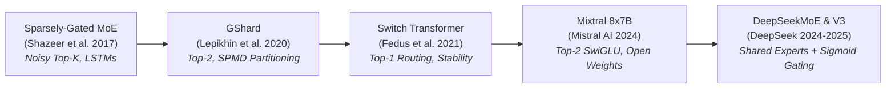
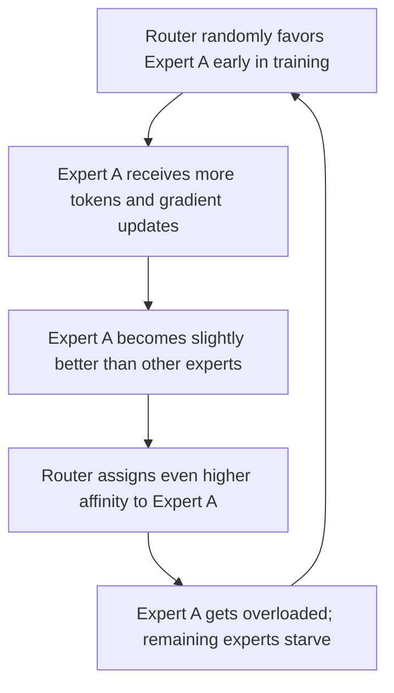

# Mixture of Experts (MoE) in Modern LLMs: Architecture, Math, Systems, and Implementation

Sparsely-gated **Mixture of Experts (MoE)** has become the definitive architectural paradigm for scaling state-of-the-art Large Language Models (LLMs)—from Mixtral 8x7B and Grok-1 to DeepSeek-V2 and DeepSeek-V3. 

Traditional neural networks operate under a **dense compute paradigm**, where every parameter in the model is activated for every single input token. In contrast, MoE introduces **conditional computation**, dynamically routing each token through a specialized subset of feed-forward sub-networks ("experts"). This decouples total model capacity (memory) from per-token compute cost (FLOPs).

This guide walks through the architectural principles, mathematical mechanics, systems-level trade-offs, and practical PyTorch implementation of modern MoE models.

---

## Table of Contents

1. [Why MoE? The Core Motivation & Parameter Arithmetic](#1-why-moe-the-core-motivation--parameter-arithmetic)
2. [Core Routing Mechanics & Mathematical Formulations](#2-core-routing-mechanics--mathematical-formulations)
3. [Load Balancing & Training Stability](#3-load-balancing--training-stability)
4. [Systems & Hardware Execution: Overcoming the Bottlenecks](#4-systems--hardware-execution-overcoming-the-bottlenecks)
5. [Production Architecture Case Studies](#5-production-architecture-case-studies)
6. [From-Scratch Complete PyTorch Implementation](#6-from-scratch-complete-pytorch-implementation)
7. [The ML Engineer's Practical Design Checklist](#7-the-ml-engineers-practical-design-checklist)

---

# 1. Why MoE? The Core Motivation & Parameter Arithmetic

### 1.1 The MLP Bottleneck in Modern LLMs

In standard Transformer layers, parameters and compute are divided between two main sub-layers:
1. **Multi-Head Self-Attention (MHA / GQA)**: Computes dynamic contextual token interactions.
2. **Multi-Layer Perceptron (MLP / Feed-Forward Network)**: Applies point-wise non-linear transformations.

```
Standard Dense Transformer Layer:
[Input: d_model] ──> [ Self-Attention (MHA/GQA) ] ──> [ Add & Norm ] ──> [ Dense MLP / FFN ] ──> [ Output ]
                                                                        └───────┬────────┘
                                                                           ~67-70% of Layer
                                                                           Parameters & FLOPs
```

In modern LLMs using **SwiGLU** gated activations (such as LLaMA, Mistral, and DeepSeek), the feed-forward network requires three projection matrices ($W_{\text{gate}}, W_{\text{up}}, W_{\text{down}}$) with intermediate dimension $d_{\text{ff}} \approx \frac{8}{3}d_{\text{model}}$:

$$
P_{\text{dense\_MLP}} = 3 \cdot d_{\text{model}} \cdot d_{\text{ff}} \approx 8 \cdot d_{\text{model}}^2
$$

When paired with Grouped-Query Attention (GQA), the MLP block accounts for **67% to 70% of all parameters and per-token FLOPs** across the entire model.

> **Key Architectural Insight:** Attention acts primarily as a *routing and routing-alignment mechanism* across sequence positions, whereas the MLP blocks function as *associative key-value memory* storing factual world knowledge. By replacing the single dense MLP with a pool of $E$ sparse expert MLPs while keeping the attention layers shared, we can scale parameter memory by orders of magnitude without increasing per-token FLOPs.

---

### 1.2 Total Parameters ($P_{\text{total}}$) vs. Active Parameters ($P_{\text{active}}$)

The fundamental advantage of MoE lies in the distinction between model footprint and per-token compute:

```
Dense Transformer Layer:
[Input] ───────────────────> ┌───────────────────────────┐ ───────────────────> [Output]
                             │   Single Dense MLP (P)    │ (All parameters active)
                             └───────────────────────────┘

MoE Transformer Layer (E Experts, Top-K Active):
                             ┌───────────────────────────┐
                             │       Router (W_g)        │
                             └─────────────┬─────────────┘
                                           │ (Select K of E)
                                           ▼
[Input] ───────────────────> ├─── [Dispatch to Selected] ──┤ ───────────────────> [Output]
                             │   ├── Expert 1  (Active)  │ │ (Sum weighted outputs)
                             │   ├── Expert 2  (Inactive)│ │
                             │   ├── Expert 3  (Active)  │ │
                             │   └── Expert E  (Inactive)│ │
```

#### Total Parameters ($P_{\text{total}}$)
The total memory footprint required to store the model weights across GPU memory:

$$
P_{\text{total\_MoE}} = E \cdot P_{\text{expert}} + P_{\text{router}} \approx E \cdot \left(3 \cdot d_{\text{model}} \cdot d_{\text{ff}}\right)
$$

$P_{\text{total}}$ scales **linearly with the number of experts $E$**.

#### Active Parameters per Token ($P_{\text{active}}$)
The subset of weights actually computed during a forward pass for an individual token (where $K \ll E$, typically $K=2$ or $K=8$):

$$
P_{\text{active\_MoE}} = K \cdot P_{\text{expert}} + P_{\text{router}} \approx K \cdot \left(3 \cdot d_{\text{model}} \cdot d_{\text{ff}}\right)
$$

$P_{\text{active}}$ remains **constant** regardless of how large the total expert pool $E$ grows.

#### FLOP Arithmetic
For a batch of $N$ tokens:

$$
\text{FLOPs}_{\text{dense\_MLP}} \approx 2 \cdot N \cdot P_{\text{dense\_MLP}} = 6 \cdot N \cdot d_{\text{model}} \cdot d_{\text{ff}}
$$

$$
\text{FLOPs}_{\text{MoE\_MLP}} \approx \underbrace{2 \cdot N \cdot d_{\text{model}} \cdot E}_{\text{Router Overhead (negligible)}} + \underbrace{6 \cdot K \cdot N \cdot d_{\text{model}} \cdot d_{\text{ff}}}_{\text{Active Expert Compute}} \approx \frac{K}{E} \cdot \text{FLOPs}_{\text{total\_experts}}
$$

For instance, in **Mixtral 8x7B** ($E=8, K=2$), the model hosts **46.7B total parameters**, but only executes **12.9B active parameters** of compute per token—achieving a **$3.6\times$ FLOP savings** relative to a dense model of equivalent capacity.

---

### 1.3 Evolution of Modern Sparsity



---

# 2. Core Routing Mechanics & Mathematical Formulations

An MoE layer consists of two components:
1. **The Gating Network (Router)**: Assigns routing weights and selects which expert(s) process each token.
2. **The Expert Sub-Networks**: Independent Feed-Forward Networks running in parallel.

```
                      ┌────────────────────────┐
                      │    Input Token x_t     │
                      └───────────┬────────────┘
                                  │
                                  ▼
             ┌──────────────────────────────────────────┐
             │         Gating Router (W_g)              │
             │           h(x) = x_t · W_g               │
             └────────────────────┬─────────────────────┘
                                  │
                                  ▼
             ┌──────────────────────────────────────────┐
             │       Top-K Sparse Softmax Filter        │
             │   Keep top-K indices; set rest to -inf   │
             └──────────┬───────────────────┬───────────┘
                        │                   │
              Expert e1 │ (Gate g_1)        │ Expert e2 (Gate g_2)
                        ▼                   ▼
                 ┌──────────────┐    ┌──────────────┐
                 │  Expert e1   │    │  Expert e2   │
                 │  FFN_e1(x)   │    │  FFN_e2(x)   │
                 └──────┬───────┘    └──────┬───────┘
                        │                   │
                        └─────────┬─────────┘
                                  ▼
             ┌──────────────────────────────────────────┐
             │ Weighted Sum: y = g_1·FFN_1 + g_2·FFN_2  │
             └──────────────────────────────────────────┘
```

---

### 2.1 Token-Choice Top-$K$ Routing (Softmax Gating)

Used by GShard, ST-MoE, and Mixtral 8x7B, **Token-Choice Top-$K$** evaluates the gating logits for token $x \in \mathbb{R}^{d_{\text{model}}}$ across all $E$ experts:

$$
h(x) = x \cdot W_g \quad \text{where } W_g \in \mathbb{R}^{d_{\text{model}} \times E}
$$

The top-$K$ experts with the highest logits are selected:

$$
\mathcal{T} = \text{TopK}\left(h(x), K\right) = \{ i_1, i_2, \dots, i_K \}
$$

The gating weights for the selected experts are computed by applying a **Softmax normalization over the selected Top-$K$ logits** (renormalization):

$$
g_i(x) = \begin{cases} 
\frac{\exp(h_i(x))}{\sum_{j \in \mathcal{T}} \exp(h_j(x))} & \text{if } i \in \mathcal{T} \\ 
0 & \text{otherwise} 
\end{cases}
$$

The final MoE output $y \in \mathbb{R}^{d_{\text{model}}}$ is the linear combination of the active expert outputs:

$$
y = \sum_{i \in \mathcal{T}} g_i(x) \cdot \text{FFN}_i(x)
$$

#### Why Softmax Renormalization Matters
Computing Softmax strictly over the top-$K$ logits (instead of softmaxing over all $E$ experts and then taking the top-$K$) ensures that $\sum_{i \in \mathcal{T}} g_i(x) = 1.0$. This prevents the router from artificially shrinking token activation magnitudes when non-selected experts hold residual probability mass.

---

### 2.2 Switch Routing ($K=1$ Simplification)

[Switch Transformers (Fedus et al. 2021)](https://arxiv.org/abs/2101.03961) set $K=1$, routing each token to only a single expert:

$$
i^* = \arg\max_{i \in \{1, \dots, E\}} \left( \text{Softmax}(x \cdot W_g)_i \right)
$$

$$
y = \text{Softmax}(x \cdot W_g)_{i^*} \cdot \text{FFN}_{i^*}(x)
$$

**Trade-offs of $K=1$:**
* **Pros**: Halves cross-device communication volume in distributed training; requires smaller expert capacity buffers; computationally minimal routing.
* **Cons**: Limits combinatorial representation capacity. Modern production models overwhelmingly prefer $K \ge 2$ (e.g., Mixtral uses $K=2$, DeepSeek-V3 uses $K=8$) because multi-expert combinations allow richer specialized feature composition.

---

### 2.3 DeepSeekMoE: Shared Experts + Fine-Grained Routed Experts

In conventional MoEs (e.g., 8 large experts with $K=2$), each expert is responsible for learning both general linguistic knowledge and specialized domain knowledge. This leads to **knowledge redundancy**: multiple experts end up wasting capacity learning identical common syntax, punctuation, and stop-word patterns.

[DeepSeekMoE (Dai et al. 2024)](https://arxiv.org/abs/2401.06066) resolves this with two architectural innovations:
1. **Shared Experts ($N_s$)**: Dedicated expert MLPs that are **always active** for every token, capturing common, task-agnostic representations.
2. **Fine-Grained Routed Experts ($N_r$)**: The remaining parameter budget is partitioned into many small experts (e.g., $N_r = 160$ or $256$, with hidden dimension reduced by a factor of $m$). Tokens dynamically activate $K_r$ routed experts.

```
Conventional MoE (e.g., Mixtral):
[Token x] ──> [Router] ──> Selects 2 of 8 Large Experts

DeepSeekMoE Architecture:
                     ┌──────────────────────────────────┐
                     │          Input Token x           │
                     └──────┬────────────────────┬──────┘
                            │                    │
                            ▼ (Always Active)    ▼ (Top-Kr Routed)
                   ┌────────────────────┐   ┌────────────────────┐
                   │  Shared Experts    │   │ Routed Experts     │
                   │  (Common Know.)    │   │ (Specialized)      │
                   │  e.g., N_s = 1     │   │ e.g., K_r = 8/256  │
                   └─────────┬──────────┘   └─────────┬──────────┘
                             │                        │
                             └───────────┬────────────┘
                                         ▼
                             [Sum + Residual Output]
```

#### Mathematical Formulation

$$
y = x + \sum_{i=1}^{N_s} \text{FFN}_i^{(s)}(x) + \sum_{j=1}^{N_r} g_j(x) \text{FFN}_j^{(r)}(x)
$$

#### Combinatorial Capacity Advantage
By segmenting experts into fine grains, the number of possible routing paths explodes combinatorially:
- Standard MoE ($E=8, K=2$): $\binom{8}{2} = 28$ possible pathways.
- DeepSeekMoE ($N_r=160, K_r=6$): $\binom{160}{6} \approx 2.05 \times 10^{10}$ possible pathways.

This allows the model to capture vastly more nuanced specialization at identical active FLOP budgets.

---

### 2.4 Normalized Sigmoid Gating (DeepSeek-V3)

When scaling to hundreds of routed experts ($N_r \ge 160$), standard **Softmax gating** suffers from **competition suppression**: because Softmax computes a global normalization ($\sum e^{z_j}$), a dominant logit on one expert suppresses the probability mass of all other experts, preventing complementary routing.

DeepSeek-V3 replaces Softmax with **Normalized Sigmoid Gating**:

1. **Independent Affinity Scoring**:
   $$
   s_i(x) = \text{Sigmoid}(x \cdot W_g)_i = \frac{1}{1 + e^{-(x \cdot W_g)_i}} \quad \forall i \in \{1, \dots, N_r\}
   $$
2. **Top-$K$ Selection**:
   $$
   \mathcal{T} = \text{TopK}\left(\{ s_1(x), \dots, s_{N_r}(x) \}, K_r\right)
   $$
3. **Normalization over Selected Experts**:
   $$
   g_i(x) = \begin{cases} 
   \frac{s_i(x)}{\sum_{j \in \mathcal{T}} s_j(x)} & \text{if } i \in \mathcal{T} \\ 
   0 & \text{otherwise} 
   \end{cases}
   $$

Sigmoid evaluates each expert's relevance independently, producing cleaner gradient signals for large expert pools.

---

### 2.5 Alternative Routing Paradigms in Perspective

* **Expert-Choice Routing (ECR)**: Instead of tokens choosing top-$K$ experts, experts choose top-$C$ tokens. While this achieves perfect load balancing by construction, **it is incompatible with causal autoregressive generation**: future tokens are unavailable during step-by-step decoding, breaking the global batch-wide token selection.
* **Soft MoE**: Computes continuous, soft linear combinations of all tokens mapped to expert "slots". While effective for Vision Transformers (ViT), it mixes token representations across sequence positions, violating the causal masking requirement of generative LLMs.

---

# 3. Load Balancing & Training Stability

### 3.1 The Routing Collapse Feedback Loop

Without regularization, trainable routers suffer from a pathological failure mode known as **Routing Collapse**:



Under this "rich-get-richer" loop, a few experts do all the work while the rest remain undertrained, collapsing effective model capacity back to a dense model.

---

### 3.2 Auxiliary Load-Balancing Loss (Switch / GShard)

To enforce uniform expert utilization, models add an auxiliary loss to the primary training objective:

$$
\mathcal{L}_{\text{total}} = \mathcal{L}_{\text{task}} + \alpha \cdot \mathcal{L}_{\text{aux}}
$$

Given a batch of $T$ tokens and $E$ experts, the auxiliary loss is defined as the scaled dot-product between the empirical token dispatch fraction vector $f$ and the router probability fraction vector $P$:

$$
\mathcal{L}_{\text{aux}} = E \cdot \sum_{i=1}^E f_i \cdot P_i
$$

Where:
* **$f_i$ (Actual Dispatch Fraction)**: The fraction of tokens routed to expert $i$ (treated as a non-differentiable constant via `stop_gradient`):
  $$
  f_i = \text{stop\_gradient}\left( \frac{1}{K \cdot T} \sum_{t=1}^T \mathbb{1}_{\{i \in \text{TopK}(x_t)\}} \right)
  $$
* **$P_i$ (Router Probability Mass)**: The average routing probability assigned to expert $i$ across the batch (fully differentiable):
  $$
  P_i = \frac{1}{T} \sum_{t=1}^T p_i(x_t)
  $$
* **$\alpha$ (Auxiliary Loss Weight)**: Hyperparameter, typically $\alpha \in [0.001, 0.01]$.

#### Scale Invariance Property
Under perfect balance ($f_i = \frac{1}{E}$ and $P_i = \frac{1}{E}$ for all $i$):

$$
\mathcal{L}_{\text{aux}} = E \cdot \sum_{i=1}^E \left(\frac{1}{E} \cdot \frac{1}{E}\right) = E \cdot E \cdot \frac{1}{E^2} = 1.0
$$

Multiplying by $E$ makes the loss baseline scale-invariant across configurations with 8, 64, or 256 experts.

---

### 3.3 Router $z$-Loss (ST-MoE)

When training large MoE models in lower-precision formats (`bfloat16` or `fp16`), large router pre-softmax logits $h(x)$ trigger numerical instability and discrete routing flips.

[ST-MoE (Zoph et al. 2022)](https://arxiv.org/abs/2202.08906) introduced the **Router $z$-loss** to penalize large logits smoothly:

$$
\mathcal{L}_z = \frac{1}{T} \sum_{t=1}^T \left( \log \sum_{i=1}^E \exp\left(h_i(x_t)\right) \right)^2
$$

Added with a small weight (e.g., $c_z = 10^{-3}$ or $10^{-4}$), $\mathcal{L}_z$ prevents logit drift, suppresses loss spikes, and stabilizes mixed-precision training.

---

### 3.4 Auxiliary-Loss-Free Balancing (Dynamic Router Bias)

While $\mathcal{L}_{\text{aux}}$ prevents routing collapse, it penalizes the router for selecting the mathematically optimal expert, slightly degrading model quality.

**DeepSeek-V3** introduced **Aux-Loss-Free Balancing**:
1. Add a learnable bias term $b_i$ to each expert's routing score:
   $$
   s_i(x) = \text{Sigmoid}(x \cdot W_g + b_i)_i
   $$
2. At the end of each training step, monitor the batch token load $L_i$ of each expert.
3. Dynamically update bias values *outside gradient descent*:
   $$
   b_i \leftarrow b_i + \gamma \cdot \text{sign}\left(\text{Target\_Load} - L_i\right)
   $$
   where $\gamma$ is a small step size (e.g., $0.001$). Overloaded experts see their bias decrease, while underloaded experts see their bias increase—achieving balance without gradient interference on model representations.

---

# 4. Systems & Hardware Execution: Overcoming the Bottlenecks

Translating theoretical MoE FLOP savings into wall-clock speedups on GPU clusters requires overcoming two systems bottlenecks: dynamic tensor shapes and cross-device communication.

### 4.1 The Capacity Factor & Token Dropping Dilemma

GPU Tensor Cores require statically shaped tensors for compiled batched matrix multiplication (GEMM). Because token routing is dynamic, each expert receives a variable number of tokens per step.

Traditional frameworks (GShard, Switch) enforce a static **Expert Capacity ($C$)**:

$$
C = \left\lceil \frac{T \cdot K}{E} \times C_f \right\rceil
$$

Where $C_f \ge 1.0$ is the **Capacity Factor**.

```
Dynamic Token Routing
        │
        ├── Token Count > Capacity C ──> [TOKEN DROPPING]  (Tokens bypass layer via residual; degrades quality)
        └── Token Count < Capacity C ──> [ZERO PADDING]   (Dummy zeros computed; wastes GPU FLOPs & memory)
```

* **$C_f = 1.0$**: Strict capacity. High token dropping rate (5–20% early in training), causing significant quality loss.
* **$C_f = 1.5 - 2.0$**: Reduces dropping to near zero, but wastes 30–50% of GPU compute on zero-padding.

---

### 4.2 Dropless MoE & Grouped GEMM (MegaBlocks / Triton)

Modern production frameworks (MegaBlocks, DeepEP, PyTorch Grouped GEMM) eliminate the capacity factor entirely via **Dropless MoE**:

```
Traditional Padded Batch GEMM:
Expert 0: [ Token 1, Token 2, PADDING, PADDING ] ──> Full Matrix Multiply (50% FLOPs wasted)
Expert 1: [ Token 3, Token 4, Token 5, Token 6 ]

Modern Dropless Grouped GEMM:
Expert 0: [ Token 1, Token 2 ] ─────────┐
Expert 1: [ Token 3, Token 4, Token 5, Token 6 ] ┴──> Executed in single kernel with dynamic offsets.
                                                     (0% Token Dropping, 0% Padding Waste)
```

1. **Permute Tokens**: Group tokens by their routed expert IDs into a contiguous buffer.
2. **Grouped GEMM**: Execute a single GPU kernel that computes matrix multiplications across variable batch sizes per expert using an array of expert pointers and segment offsets.
3. **Un-permute & Scatter**: Scatter output activations back to original sequence positions and multiply by gating weights.

---

### 4.3 Expert Parallelism (EP) & All-to-All Communication Flow

When a model hosts tens or hundreds of billions of parameters, the experts are sharded across multiple GPUs using **Expert Parallelism (EP)**.

```
GPU 0 (Hosts Expert 0, 1)                      GPU 1 (Hosts Expert 2, 3)
┌─────────────────────────┐                   ┌─────────────────────────┐
│ Input Tokens: T1, T2    │                   │ Input Tokens: T3, T4    │
│ Router assigns:         │                   │ Router assigns:         │
│   T1 -> Exp 0 (Local)   │                   │   T3 -> Exp 1 (Remote)  │
│   T2 -> Exp 2 (Remote)  │                   │   T4 -> Exp 3 (Local)   │
└────────────┬────────────┘                   └────────────┬────────────┘
             │                                             │
             └───────────────┐             ┌───────────────┘
                             ▼             ▼
             ═════════════════════════════════════════════
                All-to-All Collective Communication (Dispatch)
             ═════════════════════════════════════════════
                             │             │
             ┌───────────────┘             └───────────────┐
             ▼                                             ▼
┌─────────────────────────┐                   ┌─────────────────────────┐
│ Received Tokens: T1, T3 │                   │ Received Tokens: T2, T4 │
│ Compute Expert 0 & 1    │                   │ Compute Expert 2 & 3    │
└────────────┬────────────┘                   └────────────┬────────────┘
             │                                             │
             └───────────────┐             ┌───────────────┘
                             ▼             ▼
             ═════════════════════════════════════════════
                All-to-All Collective Communication (Combine)
             ═════════════════════════════════════════════
                             │             │
             ┌───────────────┘             └───────────────┐
             ▼                                             ▼
┌─────────────────────────┐                   ┌─────────────────────────┐
│ Reconstructed Output T1,T2                  │ Reconstructed Output T3,T4
└─────────────────────────┘                   └─────────────────────────┘
```

1. **Local Routing**: Each GPU evaluates the router for its local data-parallel tokens.
2. **Dispatch All-to-All**: Tokens assigned to remote experts are transferred across the network interconnect (NVLink / InfiniBand) to the destination GPUs.
3. **Local Expert Computation**: Each GPU computes the forward pass for all tokens routed to its hosted experts.
4. **Combine All-to-All**: Expert output representations are communicated back to their source GPUs and combined via weighted summation.

---

# 5. Production Architecture Case Studies

### 5.1 Mixtral 8x7B (Mistral AI)

| Parameter | Value |
| :--- | :--- |
| **Layers ($n_{\text{layers}}$)** | 32 |
| **Hidden Dimension ($d_{\text{model}}$)** | 4,096 |
| **Attention Mechanism** | Grouped-Query Attention (32 Q heads, 8 KV heads) |
| **Experts per Layer ($E$)** | 8 |
| **Active Experts per Token ($K$)** | 2 |
| **Expert Intermediate Dim ($d_{\text{ff}}$)** | 14,336 (SwiGLU) |
| **Total Parameters ($P_{\text{total}}$)** | **46.7 Billion** |
| **Active Parameters per Token ($P_{\text{active}}$)** | **12.9 Billion** |

* **Routing Behavior**: Mixtral routes tokens primarily based on **syntactic structure and context** rather than high-level topic domains. Words like `"self"` in Python or numbers consistently activate specific experts regardless of the overall document topic.

---

### 5.2 DeepSeek-V2 & DeepSeek-V3 MoE

| Parameter | DeepSeek-V2 | DeepSeek-V3 |
| :--- | :--- | :--- |
| **Total Parameters ($P_{\text{total}}$)** | 236 Billion | 671 Billion |
| **Active Parameters ($P_{\text{active}}$)** | 21 Billion | 37 Billion |
| **Shared Experts ($N_s$)** | 2 (always active) | 1 (always active) |
| **Routed Experts ($N_r$)** | 160 | 256 |
| **Active Routed Experts ($K_r$)** | 6 | 8 |
| **Expert Intermediate Dim ($d_{\text{ff}}$)** | 1,536 | 2,048 |
| **Gating Mechanism** | Softmax Top-$K$ | **Normalized Sigmoid** + Dynamic Bias |
| **Device-Limited Routing** | Max 3 GPUs per token | Max 4 GPUs per token |

* **Device-Limited Routing**: DeepSeek restricts token routing so that all $K_r$ selected experts reside on at most $M$ physical GPUs (e.g., $M=4$). This caps the cross-node All-to-All communication latency while maintaining full model quality.

---

# 6. From-Scratch Complete PyTorch Implementation

Below is a complete, self-contained, and modular PyTorch implementation of an MoE layer—including the **Top-$K$ Router** (with auxiliary load-balancing loss and router $z$-loss), a modern **SwiGLU Expert**, a standard **SparseMoELayer**, and a **DeepSeekMoELayer** with shared experts.

```python
import torch
import torch.nn as nn
import torch.nn.functional as F
from typing import Tuple, Optional


class SwiGLUExpert(nn.Module):
    """
    Standard SwiGLU Feed-Forward Network used in modern LLMs (LLaMA, Mistral, DeepSeek).
    FFN(x) = (SiLU(x * W_gate) * (x * W_up)) * W_down
    """
    def __init__(self, d_model: int, d_ff: int):
        super().__init__()
        self.w_gate = nn.Linear(d_model, d_ff, bias=False)
        self.w_up = nn.Linear(d_model, d_ff, bias=False)
        self.w_down = nn.Linear(d_ff, d_model, bias=False)

    def forward(self, x: torch.Tensor) -> torch.Tensor:
        # x shape: [num_tokens, d_model]
        return self.w_down(F.silu(self.w_gate(x)) * self.w_up(x))


class TopKRouter(nn.Module):
    """
    Learned Top-K Router with:
    1. Softmax Top-K gating and renormalization
    2. Switch/GShard auxiliary load-balancing loss
    3. ST-MoE Router z-loss for numerical stability
    """
    def __init__(
        self,
        d_model: int,
        num_experts: int,
        top_k: int = 2,
        aux_loss_weight: float = 0.01,
        z_loss_weight: float = 0.001,
    ):
        super().__init__()
        self.d_model = d_model
        self.num_experts = num_experts
        self.top_k = top_k
        self.aux_loss_weight = aux_loss_weight
        self.z_loss_weight = z_loss_weight
        
        # Router projection matrix
        self.gate = nn.Linear(d_model, num_experts, bias=False)

    def forward(self, x: torch.Tensor) -> Tuple[torch.Tensor, torch.Tensor, torch.Tensor]:
        """
        Args:
            x: Flattened input tokens [num_tokens, d_model]
        Returns:
            topk_indices: [num_tokens, top_k] - Expert IDs selected per token
            topk_weights: [num_tokens, top_k] - Normalized routing probabilities
            total_aux_loss: Scalar loss tensor to add to the main objective
        """
        num_tokens, d_model = x.shape
        
        # 1. Compute raw routing logits [num_tokens, num_experts]
        logits = self.gate(x)

        # 2. Router z-loss: Penalize large logits to avoid float16/bfloat16 instability
        # L_z = (1 / T) * sum( (log sum(exp(logits)))^2 )
        log_z = torch.logsumexp(logits, dim=-1)
        z_loss = self.z_loss_weight * torch.mean(log_z ** 2)

        # 3. Softmax probabilities over all experts for the load-balancing loss
        router_probs = F.softmax(logits, dim=-1)  # [num_tokens, num_experts]

        # 4. Select Top-K experts per token
        topk_logits, topk_indices = torch.topk(logits, self.top_k, dim=-1)

        # 5. Softmax renormalization strictly over the selected Top-K logits
        topk_weights = F.softmax(topk_logits, dim=-1)  # [num_tokens, top_k]

        # 6. Compute Auxiliary Load-Balancing Loss (Scale-invariant Switch/GShard formula)
        # Empirical token dispatch fraction per expert: f_i
        mask = F.one_hot(topk_indices, num_classes=self.num_experts).float()  # [num_tokens, top_k, num_experts]
        tokens_per_expert = mask.sum(dim=[0, 1])  # [num_experts]
        f = tokens_per_expert / (num_tokens * self.top_k)  # [num_experts]

        # Differentiable mean routing probability per expert: P_i
        P = router_probs.mean(dim=0)  # [num_experts]

        # Aux loss: L_aux = alpha * E * sum(f_i * P_i)
        aux_loss = self.aux_loss_weight * self.num_experts * torch.sum(f.detach() * P)

        total_loss = aux_loss + z_loss
        return topk_indices, topk_weights, total_loss


class SparseMoELayer(nn.Module):
    """
    Standard Sparse Mixture of Experts Layer.
    Dispatches tokens to Top-K selected SwiGLU experts and computes weighted combination.
    """
    def __init__(
        self,
        d_model: int,
        d_ff: int,
        num_experts: int = 8,
        top_k: int = 2,
        aux_loss_weight: float = 0.01,
        z_loss_weight: float = 0.001,
    ):
        super().__init__()
        self.d_model = d_model
        self.num_experts = num_experts
        self.top_k = top_k

        # Router
        self.router = TopKRouter(
            d_model=d_model,
            num_experts=num_experts,
            top_k=top_k,
            aux_loss_weight=aux_loss_weight,
            z_loss_weight=z_loss_weight,
        )

        # Expert Pool
        self.experts = nn.ModuleList([
            SwiGLUExpert(d_model=d_model, d_ff=d_ff) for _ in range(num_experts)
        ])

    def forward(self, x: torch.Tensor) -> Tuple[torch.Tensor, torch.Tensor]:
        """
        Args:
            x: Input activations [batch_size, seq_len, d_model]
        Returns:
            output: MoE output [batch_size, seq_len, d_model]
            aux_loss: Auxiliary loss scalar for load-balancing
        """
        orig_shape = x.shape
        x_flat = x.view(-1, self.d_model)  # [num_tokens, d_model]
        num_tokens = x_flat.size(0)

        # Route tokens
        topk_indices, topk_weights, aux_loss = self.router(x_flat)

        # Initialize flat output buffer
        final_output = torch.zeros_like(x_flat)

        # Dispatch tokens to each expert
        # (For production clusters, this loop is replaced with Grouped GEMM / All-to-All)
        for expert_id, expert in enumerate(self.experts):
            # Find tokens routed to this expert (across any top-k slot)
            token_mask, k_slot = torch.where(topk_indices == expert_id)
            
            if token_mask.numel() == 0:
                continue

            # Gather tokens for this expert
            expert_tokens = x_flat[token_mask]  # [selected_tokens, d_model]
            expert_out = expert(expert_tokens)  # [selected_tokens, d_model]

            # Scale by routing weight and accumulate
            routing_weights = topk_weights[token_mask, k_slot].unsqueeze(-1)
            final_output.index_add_(0, token_mask, expert_out * routing_weights)

        # Restore original tensor shape
        return final_output.view(orig_shape), aux_loss


class DeepSeekMoELayer(nn.Module):
    """
    DeepSeekMoE Layer combining:
    1. Dedicated Shared Experts (Always active for common knowledge)
    2. Fine-Grained Routed Experts (Dynamically activated for specialized knowledge)
    """
    def __init__(
        self,
        d_model: int,
        d_ff: int,
        num_shared_experts: int = 2,
        num_routed_experts: int = 64,
        top_k_routed: int = 4,
        aux_loss_weight: float = 0.01,
        z_loss_weight: float = 0.001,
    ):
        super().__init__()
        self.d_model = d_model
        
        # 1. Shared Experts (Always active)
        self.shared_experts = nn.ModuleList([
            SwiGLUExpert(d_model=d_model, d_ff=d_ff) for _ in range(num_shared_experts)
        ])

        # 2. Routed MoE Layer (Fine-grained specialized experts)
        self.routed_moe = SparseMoELayer(
            d_model=d_model,
            d_ff=d_ff,
            num_experts=num_routed_experts,
            top_k=top_k_routed,
            aux_loss_weight=aux_loss_weight,
            z_loss_weight=z_loss_weight,
        )

    def forward(self, x: torch.Tensor) -> Tuple[torch.Tensor, torch.Tensor]:
        # Shared expert computation (summed over all shared experts)
        shared_out = torch.zeros_like(x)
        for shared_expert in self.shared_experts:
            shared_out = shared_out + shared_expert(x)

        # Routed expert computation
        routed_out, aux_loss = self.routed_moe(x)

        # Combine shared + routed paths
        total_out = shared_out + routed_out
        return total_out, aux_loss


# =====================================================================
# Verification and End-to-End Execution Test
# =====================================================================
if __name__ == "__main__":
    torch.manual_seed(42)

    batch_size, seq_len, d_model, d_ff = 4, 32, 256, 512
    x = torch.randn(batch_size, seq_len, d_model, requires_grad=True)

    print("=== Testing Standard Top-2 SparseMoELayer ===")
    moe = SparseMoELayer(d_model=d_model, d_ff=d_ff, num_experts=8, top_k=2)
    output, aux_loss = moe(x)
    print(f"Input shape:      {x.shape}")
    print(f"Output shape:     {output.shape}")
    print(f"Auxiliary loss:   {aux_loss.item():.6f}")

    # Backward pass verification
    dummy_loss = output.sum() + aux_loss
    dummy_loss.backward()
    print("Backward pass:    SUCCESS (Gradients computed successfully)\n")

    print("=== Testing DeepSeekMoELayer (Shared + Routed) ===")
    x_ds = torch.randn(batch_size, seq_len, d_model, requires_grad=True)
    deepseek_moe = DeepSeekMoELayer(
        d_model=d_model,
        d_ff=d_ff,
        num_shared_experts=2,
        num_routed_experts=16,
        top_k_routed=4
    )
    ds_output, ds_aux_loss = deepseek_moe(x_ds)
    print(f"DeepSeekMoE Out:  {ds_output.shape}")
    print(f"DeepSeekMoE Aux:  {ds_aux_loss.item():.6f}")
    
    (ds_output.sum() + ds_aux_loss).backward()
    print("DeepSeekMoE Grad: SUCCESS")
```

---

# 7. The ML Engineer's Practical Design Checklist

### 7.1 Hyperparameter Rules of Thumb

| Hyperparameter | Recommended Value | Rationale |
| :--- | :--- | :--- |
| **Active Experts ($K$)** | $K=2$ (for $E=8$) or $K=6\text{--}8$ (for $E=160\text{--}256$) | $K=1$ hurts representation composition; $K \ge 2$ enables rich combinatorial multi-expert pathways. |
| **Auxiliary Loss Weight ($\alpha$)** | $0.001\text{ to }0.01$ | Values $>0.05$ over-regularize the router, forcing uniformity at the expense of domain specialization. |
| **Router $z$-loss Weight ($c_z$)** | $10^{-4}\text{ to }10^{-3}$ | Stabilizes `bfloat16`/`fp16` training by keeping pre-softmax logits in a well-behaved $[-10, 10]$ range. |
| **Shared Experts ($N_s$)** | $1\text{ to }2$ experts | Isolates general syntax and stop-word representations, boosting sample efficiency by $2\text{--}3\times$. |
| **Execution Framework** | Dropless Grouped GEMM (MegaBlocks/DeepEP) | Eliminates padding waste (saving 30–50% FLOPs) and prevents token dropping. |

---

### 7.2 Inference & Deployment Strategies

1. **Quantization**: Expert weights can be quantized to **FP8** or **INT4** with minimal degradation. Because only $K$ experts are active per token, non-activated experts can stay in lower-precision memory without incurring precision degradation on dense attention layers.
2. **Expert Offloading**: For memory-constrained devices (e.g., local consumer GPUs), inactive expert weights can be offloaded to CPU RAM or NVMe and prefetched asynchronously based on router score prediction.
3. **KV Cache Footprint**: Note that MoE scales **parameter memory, not KV cache memory**. A 47B MoE model with 13B active parameters has the exact same KV cache memory footprint as a 13B dense model, making long-context serving much cheaper than a 47B dense model.

---

### 7.3 Training Health Diagnostics

When training an MoE model, monitor these metrics:
* **Token Drop Rate**: Should be **$0.0\%$** if using dropless Grouped GEMM. If using capacity buffers, ensure it remains $<0.5\%$.
* **Expert Routing Entropy**: Track $H = -\sum f_i \log f_i$. If $H \to 0$, the router has collapsed to a single expert.
* **Logit Magnitudes**: Monitor $\max(|h(x)|)$. If logits exceed $>50$, increase the router $z$-loss weight.
