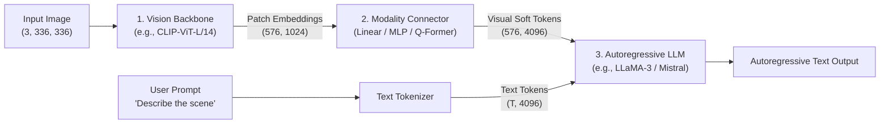
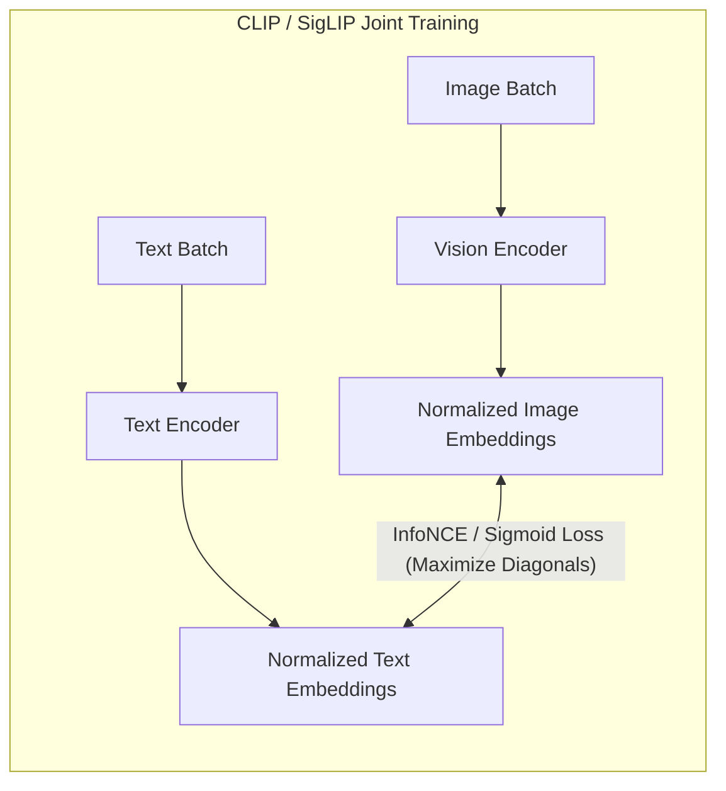
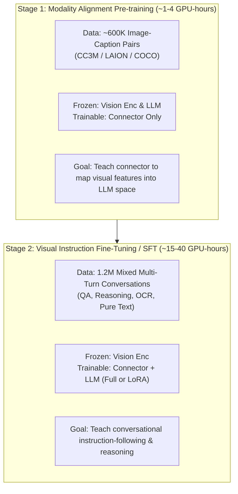
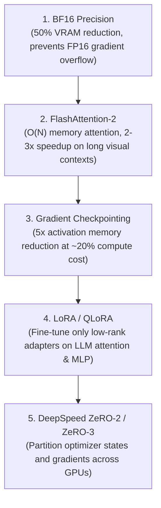
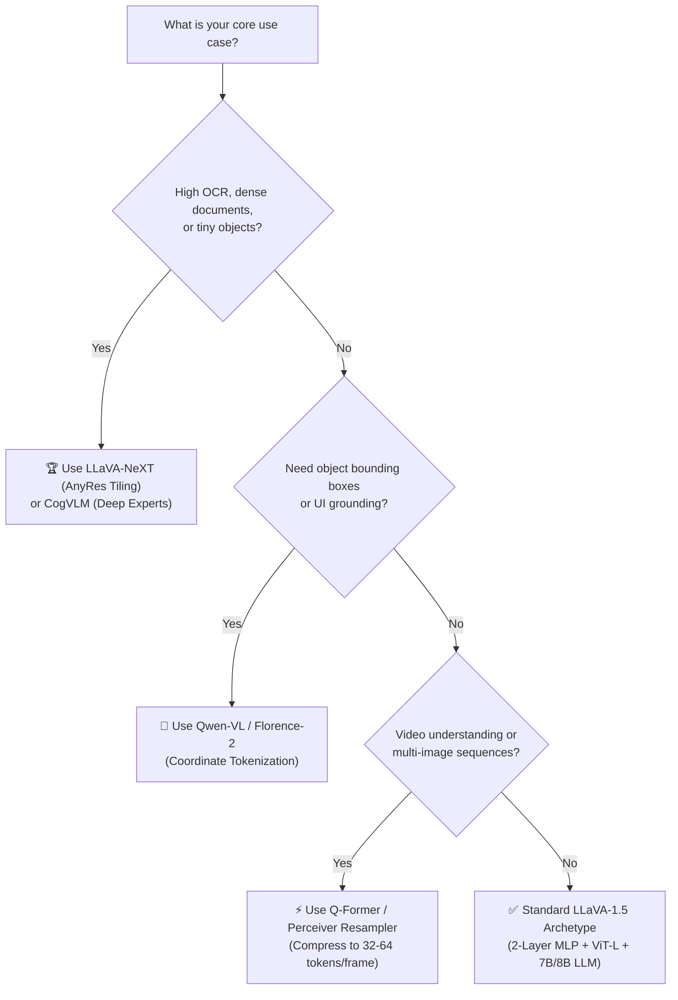

# Building Multi-Modal LLMs: A Practical Engineering Guide

---

## Table of Contents

1. [The Unified MLLM Mental Model](#1-the-unified-mllm-mental-model)
2. [Visual Foundations: From Pixels to Tokens](#2-visual-foundations-from-pixels-to-tokens)
3. [Modality Bridging: The 4 Connector Archetypes](#3-modality-bridging-the-4-connector-archetypes)
4. [The Standard Two-Stage Training Recipe](#4-the-standard-two-stage-training-recipe)
5. [Real-World Training Complexities & Solutions](#5-real-world-training-complexities--solutions)
6. [Practical Engineering & Memory Optimization Stack](#6-practical-engineering--memory-optimization-stack)
7. [Evaluation & Key Failure Modes](#7-evaluation--key-failure-modes)
8. [Architectural Selection Guide & Next Frontiers](#8-architectural-selection-guide--next-frontiers)
9. [Key References](#9-key-references)

---

## 1. The Unified MLLM Mental Model

At its core, a modern **Multi-modal Large Language Model (MLLM)** is not an entirely new model built from scratch. Instead, it is an elegant composition of three modular subsystems:



### The End-to-End Tensor Flow

Understanding the dimensional transformations across the pipeline is essential for debugging and implementing MLLMs:

1. **Input Image:** A raw image $\mathbf{X}_{img} \in \mathbb{R}^{3 \times 336 \times 336}$ is split into non-overlapping $14 \times 14$ patches, yielding $N = (336/14)^2 = 576$ patches.
2. **Vision Encoding:** The vision backbone (e.g., CLIP ViT-L/14) transforms these patches into dense feature representations $\mathbf{Z}_v \in \mathbb{R}^{576 \times 1024}$.
3. **Modality Projection:** A connector module projects the visual hidden dimension ($D_{vis} = 1024$) to match the LLM's embedding space ($D_{LLM} = 4096$):
   $$\mathbf{H}_v = \text{Connector}(\mathbf{Z}_v) \in \mathbb{R}^{576 \times 4096}$$
4. **Context Assembly:** The projected visual vectors $\mathbf{H}_v$ are simply concatenated with the text token embeddings $\mathbf{H}_t \in \mathbb{R}^{T \times 4096}$:
   $$\mathbf{H}_{input} = [\mathbf{H}_v \; ; \; \mathbf{H}_t] \in \mathbb{R}^{(576 + T) \times 4096}$$
5. **Autoregressive Generation:** The LLM treats the 576 image features as standard "soft tokens" in its input context window and generates responses using standard causal self-attention.

> [!TIP]
> From the LLM's perspective, **an image is simply a sequence of special tokens**. The LLM does not need custom visual operators; it attends to visual tokens and text tokens using the exact same multi-head attention mechanism.

---

## 2. Visual Foundations: From Pixels to Tokens

Why do MLLMs use Vision Transformers (ViT) and contrastive backbones (CLIP/SigLIP) rather than traditional CNNs or autoencoders?

### 2.1 Vision Transformers (ViT)

Before Transformers could ingest images, spatial data had to be converted into discrete token sequences:

* **Patching & Projection:** An image is divided into $P \times P$ patches (typically $14 \times 14$ or $16 \times 16$). Each flattened patch $\mathbf{x}_p \in \mathbb{R}^{P^2 \cdot C}$ is linearly projected into dimension $D$ via projection matrix $\mathbf{E}$:
  $$\mathbf{z}_0 = [\mathbf{x}_p^1\mathbf{E}; \; \mathbf{x}_p^2\mathbf{E}; \; \dots; \; \mathbf{x}_p^N\mathbf{E}] + \mathbf{E}_{pos}$$
* **Global Self-Attention:** Unlike CNNs (which apply localized $3 \times 3$ convolutions), ViT computes global $O(N^2)$ self-attention across all patches from layer 1. This captures long-range spatial relationships immediately.

### 2.2 Why CLIP and SigLIP Dominate MLLMs

Not all pre-trained vision models make good MLLM encoders:

| Encoder Type | Pre-training Task | Feature Space Property | Suitability for MLLM |
| :--- | :--- | :--- | :--- |
| **ImageNet Supervised (ResNet/ViT)** | 1,000 discrete object classes | Collapses rich spatial nuance to class labels | ⚠️ Poor (lacks linguistic alignment) |
| **Masked Autoencoders (MAE)** | Pixel reconstruction | Rich in low-level texture, weak on semantics | ⚠️ Moderate (requires heavy fine-tuning) |
| **CLIP / SigLIP (Contrastive)** | Image-text matching on web pairs | **Semantically aligned with language concepts** | ✅ **Ideal (standard across LLaVA, CogVLM)** |



**Key Takeaway:** Because CLIP is pre-trained to align image embeddings with text embeddings in a shared metric space, the LLM adapter only needs to learn a relatively simple geometric translation rather than learning visual semantic concepts from scratch.

---

## 3. Modality Bridging: The 4 Connector Archetypes

The connector layer bridges the representation gap between the vision encoder and the LLM. Four main design archetypes have emerged:

```mermaid
graph TB
    subgraph Archetype1["1. Shallow Projection (LLaVA)"]
        A1_V["Vision Enc"] --> A1_MLP["2-Layer MLP"] --> A1_LLM["LLM Input Embeddings"]
    end
    subgraph Archetype2["2. Query Bottleneck (BLIP-2 / Flamingo)"]
        A2_V["Vision Enc"] --> A2_QF["Q-Former / Perceiver\n(Fixed K queries)"] --> A2_LLM["LLM Input Embeddings"]
    end
    subgraph Archetype3["3. Deep Visual Experts (CogVLM)"]
        A3_V["Vision Enc"] --> A3_EXP["Visual QKV/MLP\nin EVERY LLM layer"]
    end
    subgraph Archetype4["4. Coordinate Grounding (Qwen-VL)"]
        A4_V["Vision Enc"] --> A4_CA["Cross-Attention + Grounding Tokens (<box>)"]
    end
```



---

### 3.1 Shallow Projection (Linear / 2-Layer MLP)

* **Pioneered by:** LLaVA (Linear), LLaVA-1.5 (2-Layer MLP with GELU).
* **Mechanism:** A lightweight Multi-Layer Perceptron projects the vision encoder's patch tokens directly into the LLM token dimension:
  $$\mathbf{H}_v = \mathbf{W}_2 \cdot \text{GELU}(\mathbf{W}_1 \mathbf{Z}_v + \mathbf{b}_1) + \mathbf{b}_2$$
* **Pros:** Extremely simple to implement (<50 lines of PyTorch), trains fast, and preserves complete spatial token arrangement ($1:1$ patch mapping).
* **Cons:** High token footprint (576–2,000+ visual tokens per image), consuming significant LLM context length.

---

### 3.2 Query Bottlenecks & Resamplers (Q-Former / Perceiver)

* **Pioneered by:** Flamingo (Perceiver Resampler), BLIP-2 & InstructBLIP (Q-Former).
* **Mechanism:** A set of $K$ learnable query embeddings (e.g., $K=32$ in BLIP-2 or $K=64$ in Flamingo) cross-attends to the variable-sized visual feature map:
  $$\mathbf{H}_v = \text{CrossAttention}(\mathbf{Q} = \mathbf{queries}, \; \mathbf{K} = \mathbf{Z}_v, \; \mathbf{V} = \mathbf{Z}_v)$$
* **Pros:** Compresses any image or video into a fixed, small token budget ($K=32$ tokens), keeping inference extremely cheap.
* **Cons:** The information bottleneck discards fine-grained spatial details, leading to lower performance on dense OCR, document understanding, and small-object detection.

---

### 3.3 Deep Visual Experts (Layer-by-Layer Fusion)

* **Pioneered by:** CogVLM.
* **Mechanism:** Instead of only projecting features at the input layer, CogVLM adds dedicated **visual expert parameters** inside every single Transformer block of the LLM:
  * For text tokens: Run standard frozen LLM $\mathbf{W}_q, \mathbf{W}_k, \mathbf{W}_v$ and FFN.
  * For visual tokens: Run dedicated trainable $\mathbf{W}_{q,v}, \mathbf{W}_{k,v}, \mathbf{W}_{v,v}$ and visual FFN.
* **Pros:** Eliminates the "alignment tax" where the LLM is forced to process visual tokens purely through text-optimized parameters. Delivers state-of-the-art detail extraction.
* **Cons:** Increases GPU memory usage and custom implementation complexity.

---

### 3.4 Coordinate Grounding & Spatial Tokenization

* **Pioneered by:** Qwen-VL.
* **Mechanism:** Quantizes continuous 2D image coordinates into discrete text tokens $[0, 1000]$ and adds specialized formatting tokens to the vocabulary:
  ```
  <box> (y_min, x_min), (y_max, x_max) </box> <ref> target object </ref>
  ```
* **Pros:** Enables the model to natively output bounding boxes (grounding) and receive bounding box coordinates as user prompt inputs without external detection heads.

---

### Connector Architecture Comparison Matrix

| Archetype | Representative Models | Visual Tokens to LLM | Spatial Detail Preservation | Implementation Complexity | Best Used For |
| :--- | :--- | :---: | :---: | :---: | :--- |
| **MLP Connector** | LLaVA-1.5, LLaVA-NeXT | High (576–2304) | ⭐⭐⭐⭐ | Low (Easy) | General visual conversation, open-domain QA |
| **Q-Former / Resampler** | BLIP-2, Flamingo | Low (32–64) | ⭐⭐ | Medium | Video understanding, multi-image tasks |
| **Deep Visual Expert** | CogVLM | High (576–1024) | ⭐⭐⭐⭐⭐ | High | High-precision OCR, dense chart parsing |
| **Grounding Tokens** | Qwen-VL, Florence-2 | Medium (256) | ⭐⭐⭐⭐ | Medium | Object localization, UI agent navigation |

---

## 4. The Standard Two-Stage Training Recipe

Training an MLLM from pre-trained unimodal backbones follows a structured, two-stage curriculum:



---

### Stage 1: Modality Alignment Pre-training

* **Objective:** Standard autoregressive next-token prediction on caption tokens conditioned on image features:
  $$\mathcal{L} = -\sum_{t=1}^T \log P(w_t \mid \mathbf{H}_v, w_{<t})$$
* **Dataset:** 500K–1.2M filtered image-caption pairs (CC3M, ShareGPT4V, LAION subset).
* **Freeze Strategy:** Freeze both the vision encoder and LLM; train **only** the connector weights.
* **Hyperparameters:**
  * Optimizer: AdamW ($\beta_1=0.9, \beta_2=0.98$), Weight Decay: 0.0.
  * Learning Rate: $1 \times 10^{-3}$ (with cosine warmup for 3% of steps).
  * Batch Size: 256–1024.
  * Epochs: 1 epoch is sufficient (overfitting happens quickly).

> [!WARNING]
> **Do not skip Stage 1.** If you unfreeze the LLM immediately on conversational data without Stage 1 alignment, the unaligned projection layer outputs random noise, destabilizing the LLM's pre-trained attention weights.

---

### Stage 2: Visual Instruction Tuning (SFT)

* **Objective:** Multi-turn instruction following across diverse tasks (reasoning, VQA, OCR, conversation).
* **Dataset Mix (1.2M examples):**
  * Conversational QA (LLaVA-Instruct, ShareGPT4V): 30%
  * Academic VQA (VQA-v2, GQA, OKVQA): 20%
  * OCR & Documents (DocVQA, TextVQA): 15%
  * Multi-step Reasoning (ScienceQA, MathVista): 15%
  * Referring & Grounding (RefCOCO): 10%
  * **Pure Text SFT (ShareGPT / Alpaca): 10%** *(crucial for preventing catastrophic forgetting)*
* **Freeze Strategy:** Keep the vision encoder frozen. Train the **connector** and fine-tune the **LLM** (either full weights or LoRA).

---

### Critical Implementation Trick: Answer-Only Loss Masking

When training on instruction dialogues, you must mask out the prompt/question tokens during loss computation:

```
Input Stream:   <image> What color is the car? \n The car is red. </s>
Token IDs:     [ 32000,   1204, 3450, 318, 1024, 29889, 450, 1024, 318, 2568, 29889, 2 ]
Target Labels: [  -100,   -100, -100, -100, -100, -100,  450, 1024, 318, 2568, 29889, 2 ]
               └───────────────────────────────┘ └───────────────────────────────┘
                     Masked (Label = -100)              Loss Computed Here
```

```python
# PyTorch loss calculation with CrossEntropyLoss
loss_fn = torch.nn.CrossEntropyLoss(ignore_index=-100)
# Any token with label -100 contributes 0 to the gradient
loss = loss_fn(logits.view(-1, vocab_size), labels.view(-1))
```

> [!IMPORTANT]
> If you compute loss on both prompt and answer tokens, the model wastes capacity learning to predict user questions rather than learning to ground answers in visual evidence.

---

## 5. Real-World Training Complexities & Solutions

### 5.1 Catastrophic Forgetting & Modality Collapse

* **The Problem:** Fine-tuning an LLM on multimodal data often degrades its pure text capabilities (coding, multi-step math, reasoning).
* **The Solution:**
  1. **Text Data Blending:** Always mix 10–15% high-quality text-only conversational data (e.g., ShareGPT) into Stage 2 SFT.
  2. **Differential Learning Rates:** Use a learning rate for the LLM that is **$5\times$ to $10\times$ lower** than the adapter learning rate (e.g., LLM: $2 \times 10^{-5}$, Adapter: $2 \times 10^{-4}$).

---

### 5.2 High Resolution via Dynamic Tiling (AnyRes)

Fixed $224 \times 224$ or $336 \times 336$ resolution blurs small text and fine objects. Instead of training massive vision encoders from scratch at high resolutions, modern MLLMs (LLaVA-NeXT, Qwen-VL) use **Dynamic Image Tiling (AnyRes)**:

```
Original Image (672 × 672)
┌──────────────┬──────────────┐
│   Tile (1)   │   Tile (2)   │
│  (336 × 336) │  (336 × 336) │
├──────────────┼──────────────┤
│   Tile (3)   │   Tile (4)   │
│  (336 × 336) │  (336 × 336) │
└──────────────┴──────────────┘
       + Global Thumbnail (336 × 336 downsampled)
```

1. Divide the high-resolution image into a grid of standard $336 \times 336$ tiles.
2. Downsample the entire image into a 5th "overview" thumbnail.
3. Pass all 5 patches through the standard frozen CLIP encoder.
4. Concatenate the tile features with newline separator tokens:
   $$\text{Total Tokens} = 4 \times 576 \; (\text{local}) + 576 \; (\text{global}) = 2,880 \text{ tokens}$$

This allows the model to read fine print and tiny details while reusing standard pre-trained $336\text{px}$ CLIP weights.

---

### 5.3 Synthetic Data Curation

Raw web image alt-texts (from Common Crawl) are notoriously noisy (e.g., "Image of product 12384_final.jpg").

* **The Modern Fix:** Use advanced models (e.g., GPT-4V or ShareCaptioner) to generate detailed, grounded synthetic captions describing spatial relationships, object colors, and background text.
* Training on 1.2M dense synthetic descriptions consistently outperforms training on 100M+ raw web alt-text pairs.

---

## 6. Practical Engineering & Memory Optimization Stack

Training an MLLM requires managing visual token context length and memory footprints. Apply these optimizations in order:



---

### 6.1 LoRA Configuration for MLLMs

When parameter-efficient fine-tuning (PEFT) is needed:

* **Apply LoRA to all linear layers:** Target `q_proj`, `k_proj`, `v_proj`, `o_proj`, `gate_proj`, `up_proj`, `down_proj`.
* **Recommended Hyperparameters:**
  * Rank $r = 64$ to $128$
  * LoRA Alpha $\alpha = 2 \times r$ (e.g., $\alpha=128$ for $r=64$)
  * LoRA Dropout $= 0.05$
* Keep the **modality connector fully trainable** (unfrozen) while applying LoRA to the LLM backbone.

---

### 6.2 Sequence Bucketing (Eliminating Padding Waste)

Multimodal training batches contain mixed text lengths and image counts. Naive padding to maximum sequence length (e.g., 4096) wastes up to 70% of compute on padding tokens:

```python
# Efficient multimodal dataset collator pattern
def collate_multimodal_batch(batch):
    images = [item["image"] for item in batch]  # [B, 3, H, W]
    input_ids = torch.nn.utils.rnn.pad_sequence(
        [item["input_ids"] for item in batch],
        batch_first=True,
        padding_value=tokenizer.pad_token_id
    )
    labels = torch.nn.utils.rnn.pad_sequence(
        [item["labels"] for item in batch],
        batch_first=True,
        padding_value=-100  # Mask out padding in CrossEntropyLoss
    )
    attention_mask = input_ids.ne(tokenizer.pad_token_id)
    return {"images": images, "input_ids": input_ids, "labels": labels, "attention_mask": attention_mask}
```

Use **bucket sampling** (grouping training samples of similar total token lengths into the same batch) to minimize padding overhead.

---

## 7. Evaluation & Key Failure Modes

### 7.1 The 3 Primary Failure Modes

1. **Object Hallucination (Language Prior Bias):**
   * *Symptom:* The model claims an object is in the image because it commonly co-occurs in text (e.g., seeing a kitchen and claiming there is a microwave, even when absent).
   * *Benchmark to test:* **POPE** (Polling-based Object Probing Evaluation) and **CHAIR**.
2. **OCR & Small-Text Blindness:**
   * *Symptom:* Inability to read numbers on receipts, road signs, or dense charts due to resolution bottlenecks or Q-Former compression.
   * *Benchmark to test:* **DocVQA**, **TextVQA**, **ChartQA**.
3. **Spatial Confusion:**
   * *Symptom:* Swapping left/right or above/below relationships ("the dog is to the left of the cat").
   * *Benchmark to test:* **MMBench** (Relation Reasoning dimension) and **VSR** (Visual Spatial Reasoning).

---

### 7.2 Core Evaluation Benchmark Suite

| Benchmark | Primary Capability Tested | Format | Why It Matters |
| :--- | :--- | :--- | :--- |
| **MMMU** | College-level multi-discipline reasoning (diagrams, math, science) | Multiple-choice + Open | Tests genuine deep multimodal reasoning |
| **MMBench** | Fine-grained perception across 20 dimensions | Multiple-choice (GPT-4 judged) | Robust evaluation across specific perception tasks |
| **POPE** | Object hallucination and language prior bias | Binary (Yes/No) | Measures whether model is grounded in pixels vs text priors |
| **DocVQA / TextVQA** | Text reading, chart parsing, document comprehension | Short answer | Critical for enterprise document processing |
| **MathVista** | Mathematical reasoning with visual figures | Multiple-choice & numeric | Tests quantitative visual problem solving |

---

## 8. Architectural Selection Guide & Next Frontiers

### 8.1 Decision Flowchart for ML Engineers



---

### 8.2 The Next Frontier: Stitched vs. Native Multimodality

```
Modular "Stitched" MLLMs (2022–2024)      Native Multimodal Models (2025+)
┌──────────────┐   ┌──────────────┐       ┌──────────────────────────────────┐
│ Vision Enc   │──>│  MLP Adapter │       │     Unified Multimodal Core      │
└──────────────┘   └──────┬───────┘       │   (Joint Interleaved Tokenizer   │
                          ▼               │    + Shared Attention Body)      │
                   ┌──────────────┐       │                                  │
                   │  Frozen LLM  │       │  [Text + Image + Audio + Video]  │
                   └──────────────┘       └──────────────────────────────────┘
• Easy & cheap to train ($1k–$5k)         • Requires massive end-to-end pretraining
• Bound by vision encoder limits          • Seamless omni-modal understanding & generation
```

* **Stitched MLLMs (LLaVA, CogVLM):** Will remain the dominant paradigm for open-source customization, private enterprise models, and domain-specific fine-tuning due to their low training cost ($100–$5,000 compute).
* **Native Multimodal Models (GPT-4o, Gemini):** Train on trillions of interleaved tokens across all modalities simultaneously, eliminating interface bottlenecks and enabling native audio/video generation.

---

## 9. Key References

1. **ViT:** Dosovitskiy et al. (2020). *An Image is Worth 16x16 Words: Transformers for Image Recognition at Scale*. [arXiv:2010.11929](https://arxiv.org/abs/2010.11929)
2. **CLIP:** Radford et al. (2021). *Learning Transferable Visual Models From Natural Language Supervision*. [arXiv:2103.00020](https://arxiv.org/abs/2103.00020)
3. **Flamingo:** Alayrac et al. (2022). *Flamingo: a Visual Language Model for Few-Shot Learning*. [arXiv:2204.14198](https://arxiv.org/abs/2204.14198)
4. **BLIP-2:** Li et al. (2023). *BLIP-2: Bootstrapping Language-Image Pre-training with Frozen Image Encoders and LLMs*. [arXiv:2301.12597](https://arxiv.org/abs/2301.12597)
5. **LLaVA:** Liu et al. (2023). *Visual Instruction Tuning*. [arXiv:2304.08485](https://arxiv.org/abs/2304.08485)
6. **LLaVA-1.5:** Liu et al. (2023). *Improved Baselines with Visual Instruction Tuning*. [arXiv:2310.03744](https://arxiv.org/abs/2310.03744)
7. **CogVLM:** Wang et al. (2023). *CogVLM: Visual Expert for Large Language Models*. [arXiv:2311.03077](https://arxiv.org/abs/2311.03077)
8. **Qwen-VL:** Bai et al. (2023). *Qwen-VL: A Versatile Vision-Language Model for Understanding, Localization, Text Reading, and Beyond*. [arXiv:2308.12966](https://arxiv.org/abs/2308.12966)
9. **POPE:** Li et al. (2023). *Evaluating Object Hallucination in Large Vision-Language Models*. [arXiv:2305.10355](https://arxiv.org/abs/2305.10355)
10. **MMMU:** Yue et al. (2023). *MMMU: A Massive Multi-discipline Multimodal Understanding and Reasoning Benchmark*. [arXiv:2311.16502](https://arxiv.org/abs/2311.16502)
