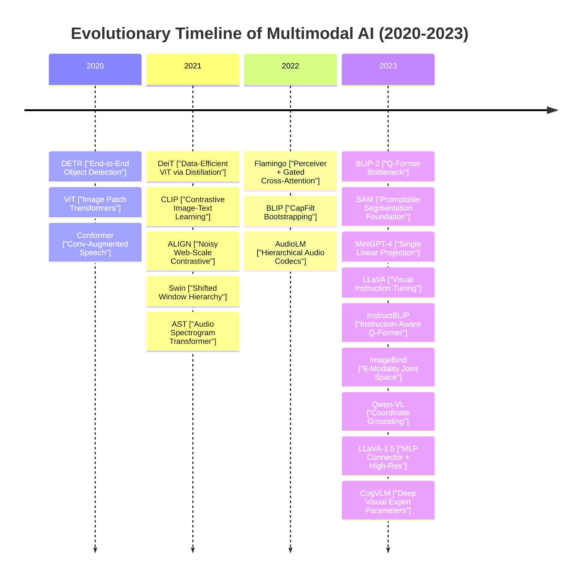
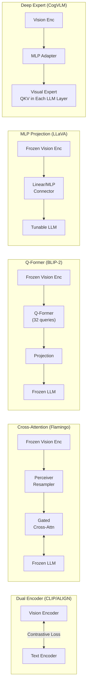
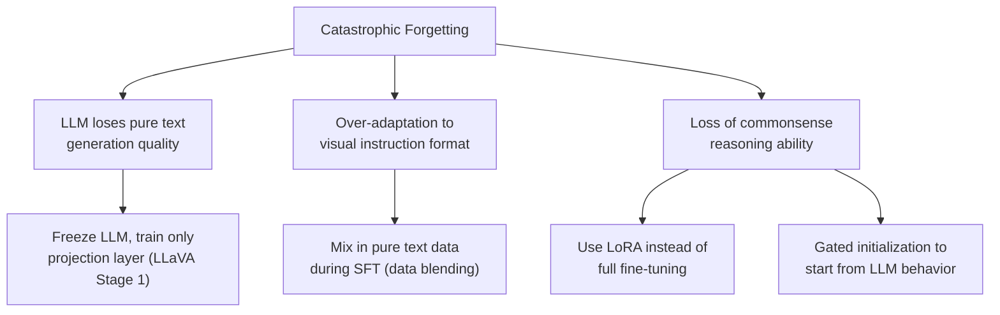
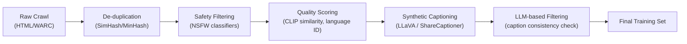
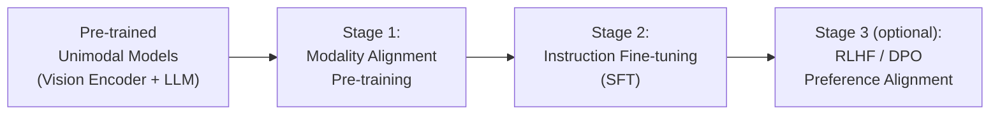
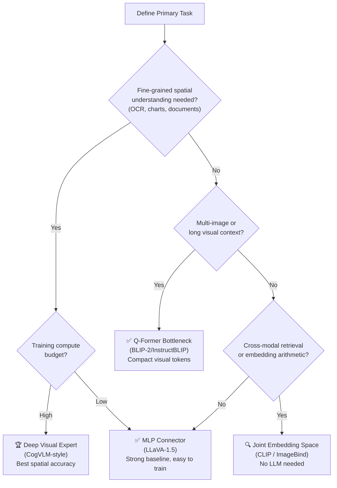

# Multi-modal Foundation Models

---

## Table of Contents

1. [Executive Summary](#1-executive-summary)
2. [Evolution of Multimodal AI (2020–2023)](#2-evolution-of-multimodal-ai-2020-2023)
3. [Unimodal Visual & Spatial Foundations](#3-unimodal-visual--spatial-foundations)
4. [Audio & Speech Transformers](#4-audio--speech-transformers)
5. [Contrastive Joint Space Foundations](#5-contrastive-joint-space-foundations)
6. [Visual-Language LLM Bridging Paradigms](#6-visual-language-llm-bridging-paradigms)
7. [Unified Multi-Modal Spaces: ImageBind](#7-unified-multi-modal-spaces-imagebind)
8. [Comparative Synthesis & Architectural Taxonomy](#8-comparative-synthesis--architectural-taxonomy)
9. [Training Complexities in Multimodal Models](#9-training-complexities-in-multimodal-models)
10. [Pre-training and Fine-tuning Recipes](#10-pre-training-and-fine-tuning-recipes)
11. [Engineering Tips & Tricks](#11-engineering-tips--tricks)
12. [Evaluation of Multimodal Models](#12-evaluation-of-multimodal-models)
13. [Gap Synthesis & 2026 Industry Context](#13-gap-synthesis--2026-industry-context)
14. [Strategic Architectural Selection Recommendations](#14-strategic-architectural-selection-recommendations)
15. [Bibliography & Citation Registry](#15-bibliography--citation-registry)

---

## 1. Executive Summary

The transition of artificial intelligence from unimodal representation learning to unified multimodal alignment represents one of the most critical paradigm shifts in deep learning. This report provides a comprehensive architectural audit of **20 seminal papers** spanning 2020 to 2023. These works collectively laid the foundations for modern multimodal large language models (MLLMs) and cross-modal foundation systems.

We decompose these architectures into five structural paradigms:

1. **Unimodal Visual Foundations:** From rigid CNN spatial priors to global attention backbones ($O(N^2)$ ViT/DeiT), hierarchical local attention ($O(N)$ Swin), and promptable dense detection/segmentation systems (DETR, SAM).
2. **Audio and Speech Representation:** Modeling spectrograms as visual patches (AST), combining localized convolutions with global context (Conformer), and hierarchical neural codecs (AudioLM).
3. **Contrastive Dual-Encoder Alignment:** Joint embedding spaces aligned via symmetric InfoNCE losses under clean (CLIP) and web-scale noisy (ALIGN) supervision.
4. **Visual-Language LLM Interfaces:** Five distinct bridging paradigms — cross-attention bottlenecks (Flamingo), information bottlenecks (BLIP-2/InstructBLIP), shallow projection adapters (LLaVA), deep parameter fusion (CogVLM), and coordinate tokenization (Qwen-VL).
5. **Unified Multi-Modal Spaces:** Six modalities in a single joint latent space using images as a binding anchor (ImageBind).

Beyond architectural analysis, this report provides in-depth treatment of **training complexities** (modality gap, catastrophic forgetting, gradient imbalance, data curation), a structured **pre-training and fine-tuning recipe**, practical **engineering tips and tricks** (LoRA, Flash Attention, DeepSpeed ZeRO), and a comprehensive **evaluation framework** covering perception benchmarks, hallucination metrics, and reasoning tests.

---

## 2. Evolution of Multimodal AI (2020–2023)



The evolution follows three clear phases:

- **Phase 1 (2020–2021): Modality-Specific Transformer Backbones** — ViT, Swin, DeiT, Conformer, AST and DETR demonstrated that the Transformer architecture could serve as a universal backbone for vision and audio, displacing specialized CNNs and RNNs.
- **Phase 2 (2021–2022): Contrastive Alignment & Foundation Bridges** — CLIP, ALIGN, and Flamingo established how to semantically connect modalities using contrastive losses and cross-attention adapters, with training on massive web-scraped datasets.
- **Phase 3 (2022–2023): Conversational Visual-Language Intelligence** — BLIP-2, LLaVA, CogVLM and others built on the foundation of pre-trained LLMs, competing to design the most effective visual-language interface layer.

---

## 3. Unimodal Visual & Spatial Foundations

Before multimodal models could align text with vision, vision itself had to be refactored into the token-based representation space of the Transformer. This section provides in-depth architectural and implementation detail for each visual backbone.

### 3.1 ViT: Replacing Convolutions with Direct Patch Projection

**Alexey Dosovitskiy et al. (2020)** [[1]](#15-bibliography--citation-registry) demonstrated that a standard Transformer encoder can serve as a competitive, highly scalable backbone for computer vision, completely dispensing with convolutional layers.

#### Mathematical Formulation

An image $\mathbf{x} \in \mathbb{R}^{H \times W \times C}$ is split into a sequence of non-overlapping 2D patches $\mathbf{x}_p \in \mathbb{R}^{N \times (P^2 \cdot C)}$, where $P \times P$ is the patch resolution (typically $16 \times 16$) and $N = HW/P^2$ is the resulting number of tokens. Each patch is flattened and projected into the Transformer's latent dimension $D$:

$$
\mathbf{z}_0 = [\mathbf{x}_{class}; \; \mathbf{x}_p^1\mathbf{E}; \; \mathbf{x}_p^2\mathbf{E}; \; \dots; \; \mathbf{x}_p^N\mathbf{E}] + \mathbf{E}_{pos}
$$

where $\mathbf{E} \in \mathbb{R}^{(P^2 \cdot C) \times D}$ is the patch embedding projection matrix, $\mathbf{x}_{class} \in \mathbb{R}^{1 \times D}$ is a learnable classification token analogous to BERT's `[CLS]`, and $\mathbf{E}_{pos} \in \mathbb{R}^{(N+1) \times D}$ is a standard 1D learnable positional embedding.

The $l$-th Transformer block applies Multi-head Self-Attention (MSA) and a Feed-Forward Network (FFN) with pre-layer normalization:

$$
\mathbf{z}'_l = \text{MSA}(\text{LN}(\mathbf{z}_{l-1})) + \mathbf{z}_{l-1}
$$
$$
\mathbf{z}_l = \text{FFN}(\text{LN}(\mathbf{z}'_l)) + \mathbf{z}'_l
$$

#### Key Implementation Details

| ViT Variant | Layers | Hidden Dim $D$ | Attention Heads | Parameters | Patch Size |
| :--- | :--- | :--- | :--- | :--- | :--- |
| ViT-S | 12 | 384 | 6 | 22M | 16×16 |
| ViT-B | 12 | 768 | 12 | 86M | 16×16 |
| ViT-L | 24 | 1024 | 16 | 307M | 16×16 |
| ViT-H | 32 | 1280 | 16 | 632M | 14×14 |

#### Inductive Bias & Scaling Laws

Unlike CNNs which possess strong spatial inductive biases (translation invariance, localized receptive fields), ViT has *minimal* structural priors — self-attention is globally computed across all patch pairs. Consequently, ViT performs poorly on standard datasets like ImageNet-1k when trained from scratch. However, when pre-trained on massive datasets (JFT-300M/JFT-3B) and fine-tuned, ViT exhibits superior scaling limits, outperforming state-of-the-art CNNs at the same compute budget.

> [!NOTE]
> A standard $224 \times 224$ image with patch size $16 \times 16$ produces $N = (224/16)^2 = 196$ tokens. Self-attention over these 196 tokens is fast. The computational bottleneck emerges at higher resolutions: a $1024 \times 1024$ image produces 4,096 tokens, making the $O(N^2)$ self-attention quadratically expensive. This motivated Swin Transformer.

---

### 3.2 DeiT: Attention-Based Knowledge Distillation

**Hugo Touvron et al. (2020)** [[2]](#15-bibliography--citation-registry) addressed ViT's severe data-inefficiency in *Training data-efficient image transformers & distillation through attention*, enabling competitive training on ImageNet-1k alone.

> [!NOTE]
> DeiT introduces a dedicated **distillation token** $\mathbf{z}_{dist}$ alongside the class token. Both tokens participate in the full self-attention mechanism across all patch tokens, allowing the distillation token to accumulate a rich, CNN-biased representation.

#### Distillation Mechanism

The model is trained using a teacher-student paradigm where the teacher is a high-performing CNN (e.g., RegNetY-16GF). Let $\psi$ be the classifier over the class token and $\psi_d$ be the classifier over the distillation token. The combined loss is:

$$
\mathcal{L}_{global} = (1 - \alpha)\,\mathcal{L}_{CE}(\psi(\mathbf{z}_{class}), y) + \alpha\,\mathcal{L}_{dist}(\psi_d(\mathbf{z}_{dist}), y_{teacher})
$$

DeiT supports **hard distillation**, where $y_{teacher} = \operatorname{argmax}(\mathbf{p}_{teacher})$ is the hard class decision of the teacher. Empirically, hard distillation outperforms soft distillation because it forces the student to match the teacher's confident predictions, providing a clear and unambiguous training signal, rather than imitating a soft probability distribution.

#### Why This Matters for Multimodal Models

DeiT showed that a frozen, pre-trained CNN teacher could transfer its local texture and structural inductive bias into a Transformer student. This insight — that powerful pre-trained unimodal models can supervise weaker, more flexible models — is directly echoed in Flamingo (frozen LLM teaching the cross-attention adapters) and BLIP-2 (frozen vision encoder teaching the Q-Former).

---

### 3.3 Swin: Hierarchical Windows and Shifted Window Attention

**Ze Liu et al. (2021)** [[3]](#15-bibliography--citation-registry) solved the $O(N^2)$ quadratic complexity of ViT to make Transformers practical for dense prediction tasks.

#### Shifted Window (S-MSA) Mechanism

Swin restricts self-attention to non-overlapping local windows of size $M \times M$ (default $7 \times 7$), reducing per-block complexity from $O(N^2 D)$ to $O(NM^2 D)$ — linear in image size. To enable cross-window information flow, consecutive layers alternate between two window configurations:

- **Layer $l$ (W-MSA):** Standard local windows, no overlap.
- **Layer $l+1$ (S-MSA):** Windows shifted by $(\lfloor M/2 \rfloor, \lfloor M/2 \rfloor)$ pixels.

```
Layer l (W-MSA):      Layer l+1 (S-MSA with masking):
┌───┬───┬───┬───┐     ┌─┬─────┬─────┬─┐
│ A │ A │ B │ B │     ├─┼─────┼─────┼─┤
├───┼───┼───┼───┤     │ │  A' │  B' │ │
│ A │ A │ B │ B │ ──> ├─┼─────┼─────┼─┤
├───┼───┼───┼───┤     │ │  C' │  D' │ │
│ C │ C │ D │ D │     ├─┼─────┼─────┼─┤
└───┴───┴───┴───┘     └─┴─────┴─────┴─┘
(Regular Windows)     (Shifted + Masked Attention)
```

Shifted windows at boundaries would create irregular sizes. Swin handles this efficiently via **cyclic shifting** of the feature map combined with an **attention mask** that prevents information leakage across true window boundaries — all without padding.

#### Patch Merging (Hierarchical Feature Extraction)

Unlike ViT's flat token sequence, Swin builds a **feature pyramid** by progressively merging adjacent $2 \times 2$ patches at each stage, halving spatial resolution and doubling channel depth, matching the scale structure of CNN feature hierarchies:

| Stage | Resolution | Channels | Tokens |
| :--- | :--- | :--- | :--- |
| Input | $H \times W$ | 3 | — |
| Stage 1 | $H/4 \times W/4$ | 96 (Swin-T) | $HW/16$ |
| Stage 2 | $H/8 \times W/8$ | 192 | $HW/64$ |
| Stage 3 | $H/16 \times W/16$ | 384 | $HW/256$ |
| Stage 4 | $H/32 \times W/32$ | 768 | $HW/1024$ |

This pyramid structure makes Swin directly usable with dense-prediction heads (FPN, UperNet) for object detection and semantic segmentation.

---

### 3.4 SAM: Promptable Vision Foundation

**Alexander Kirillov et al. (2023)** [[16]](#15-bibliography--citation-registry) introduced the *Segment Anything Model (SAM)*, a promptable segmentation foundation model trained on the SA-1B dataset (11M images, 1.1B mask annotations).

#### Architecture

```
┌─────────────────────────────────────────────────────────────┐
│                     SAM Architecture                        │
│                                                             │
│  Image  ──> [ViT-H Image Encoder] ──> Image Embeddings     │
│                                              │              │
│  Prompt (Point/Box/Text) ──> [Prompt Enc]   │              │
│                                │            │              │
│                                └──────> [Mask Decoder] ──> │
│                                          (Transformer)      │
│                                              │              │
│                               Masks + Confidence Scores     │
└─────────────────────────────────────────────────────────────┘
```

1. **Image Encoder (ViT-H, 632M parameters):** Processes the image *once* at high resolution, producing a $64 \times 64$ dense feature grid. Pre-trained with Masked Autoencoders (MAE). The amortized encoding cost per prompt is zero once this embedding is cached.
2. **Prompt Encoder:** Sparse prompts (points → PE + learned embeddings for foreground/background; boxes → corner PE; text → CLIP text encoder). Dense prompts (masks → convolutional embedding) are summed with the image embedding.
3. **Mask Decoder (lightweight, ~4M parameters):** A two-layer Transformer decoder where mask tokens and prompt tokens cross-attend to the image embedding. The decoder outputs up to 3 candidate masks (handling intrinsic ambiguity) with corresponding IoU confidence scores. The entire decode step runs in ~50ms on CPU.

> [!TIP]
> SAM's design principle — a heavy encoder amortized across many lightweight, fast decodes — is a general pattern applicable to other interactive foundation models. Cache the expensive encoder output, then serve prompts cheaply.

---

### 3.5 DETR: End-to-End Set-Based Object Detection

**Nicolas Carion et al. (2020)** [[17]](#15-bibliography--citation-registry) reframed object detection as a direct set prediction problem, eliminating hand-crafted anchors and NMS.

#### Set Prediction via Bipartite Matching

DETR uses a CNN backbone to extract a 2D feature map, which is flattened and fed into a standard Transformer encoder. A Transformer decoder receives a fixed set of $N$ (e.g., 100) **object queries** — learned positional embeddings representing "slots" for potential objects. The decoder cross-attends each query to the encoder output to produce $N$ predictions $\{\hat{c}_i, \hat{b}_i\}_{i=1}^N$ (class + bounding box).

At training time, the Hungarian Algorithm finds the optimal one-to-one bipartite assignment $\hat{\sigma}$ between the $N$ predictions and the (padded) ground-truth set $\{y_i\}$, minimizing a combined matching cost:

$$
\hat{\sigma} = \arg\min_{\sigma \in \mathfrak{S}_N} \sum_i \mathcal{L}_{match}(y_i, \hat{y}_{\sigma(i)})
$$

The training loss then penalizes this optimal assignment:

$$
\mathcal{L}_{Hungarian}(y, \hat{y}) = \sum_i \left[-\log\hat{p}_{\hat{\sigma}(i)}(c_i) + \mathbb{1}_{[c_i \neq \varnothing]}\mathcal{L}_{box}(b_i, \hat{b}_{\hat{\sigma}(i)})\right]
$$

where $\mathcal{L}_{box}$ is a combination of L1 loss and generalized IoU (GIoU) loss to handle scale variation in bounding box regression.

> [!NOTE]
> DETR's bipartite matching is the key implementation insight: each prediction uniquely "owns" one ground-truth box. This eliminates the duplicate prediction problem that NMS was designed to solve. The Hungarian algorithm runs in $O(N^3)$ time, but since $N=100$ is fixed and small, this is negligible.

---

## 4. Audio & Speech Transformers

Audio signals are 1D waveforms characterized by dense temporal dependencies and a mix of local features (phonemes, transients) and global structure (prosody, musical harmony). Transformers offer powerful global modeling but require careful adaptation for the audio domain.

### 4.1 Conformer: Convolution-Augmented Speech Transformers

**Anmol Gulati et al. (2020)** [[19]](#15-bibliography--citation-registry) designed the *Conformer* to capture both global context (self-attention) and fine-grained local features (convolution) for speech recognition.

#### Macaron-Style Block Architecture

Rather than stacking attention and convolution sequentially, the Conformer uses a "Macaron" sandwich with half-step Feed-Forward (FFN) modules bracketing the attention and convolution modules:

$$
\tilde{\mathbf{x}} = \mathbf{x} + \frac{1}{2}\,\text{FFN}(\mathbf{x})
$$
$$
\mathbf{x}' = \tilde{\mathbf{x}} + \text{MHSA}(\tilde{\mathbf{x}})
$$
$$
\mathbf{x}'' = \mathbf{x}' + \text{Conv}(\mathbf{x}')
$$
$$
\mathbf{y} = \text{LayerNorm}\!\left(\mathbf{x}'' + \frac{1}{2}\,\text{FFN}(\mathbf{x}'')\right)
$$

The **Convolution Module** is itself a sophisticated sub-block:

```
Input
  │
  ▼
LayerNorm
  │
  ▼
Pointwise Conv (expand channels 2×)
  │
  ▼
GLU (Gated Linear Unit) — halves channels back
  │
  ▼
1D Depthwise Conv (kernel=31, captures 31-frame local context)
  │
  ▼
BatchNorm + Swish activation
  │
  ▼
Pointwise Conv (project back to model dim)
  │
  ▼
Dropout
```

> [!TIP]
> The choice of **BatchNorm** (rather than LayerNorm) inside the convolution module is deliberate: BN normalizes across the time axis within a feature dimension, helping stabilize the depthwise convolution's output. In contrast, the attention modules use LayerNorm for sequence-level normalization.

#### Relative Positional Encoding

The Conformer's multi-head attention uses **relative positional encodings** (Shaw et al. 2018, implemented via the Transformer-XL sinusoidal scheme). This is critical for speech, where the model must generalize to longer utterances than those seen during training. Absolute positional embeddings (as used in the original Transformer) would fail to generalize at test time to sequences longer than the training sequence length.

| Conformer Size | Parameters | Encoder Layers | Model Dim | FFN Dim | Conv Kernel | WER (test-clean) |
| :--- | :--- | :--- | :--- | :--- | :--- | :--- |
| S | 10M | 16 | 144 | 144 | 31 | 2.1% |
| M | 30M | 16 | 256 | 256 | 31 | 2.3% |
| L | 118M | 17 | 512 | 2048 | 31 | **1.9%** |

---

### 4.2 AST: Audio Spectrogram Transformers

**Yuan Gong et al. (2021)** [[18]](#15-bibliography--citation-registry) demonstrated that the ViT architecture could be adapted directly to audio classification with zero convolutions.

#### Spectrogram Patching and Transfer from ImageNet

The 1D raw waveform is transformed into a 2D log-mel spectrogram of shape $128 \times T$ frequency-time bins (e.g., $128 \times 1000$ for a 10-second clip at 100fps hop rate). The spectrogram is split into $16 \times 16$ patches with a 6-pixel overlap in both time and frequency axes, yielding $N = 12 \times 101 = 1212$ tokens for a 10-second clip.

**Key implementation detail:** AST transfers weights from a ViT pre-trained on ImageNet-1k. The positional embeddings must be adapted from the 2D image grid (e.g., $14 \times 14$ for $224 \times 224$ images with $16 \times 16$ patches) to the audio grid (e.g., $12 \times 101$). This is done via bilinear interpolation of the 2D positional embedding matrix:

$$
\mathbf{E}_{pos}^{audio} = \text{BilinearInterp}(\mathbf{E}_{pos}^{image}, \; (12 \times 101) \to (14 \times 14))
$$

This transfer is critical — training from scratch without ImageNet pre-training loses approximately 0.8–1.0 mAP on AudioSet, demonstrating that low-level spatial patch statistics transfer meaningfully from natural images to spectrograms.

---

### 4.3 AudioLM: Hierarchical Audio Tokenization

**Zalán Borsos et al. (2022)** [[20]](#15-bibliography--citation-registry) cast audio generation as language modeling over discrete audio codebooks, eliminating the need for text transcriptions or labels.

> [!IMPORTANT]
> AudioLM's key insight is that audio has a natural semantic-acoustic hierarchy: **what is being said** (semantics) and **how it sounds** (acoustics) operate at different timescales and information rates. Modeling both at once in a flat token sequence is intractable. AudioLM separates them into two independent codebook levels.

#### Hierarchical Tokenization Architecture

```
Raw Audio Waveform (16kHz)
         │
         ├─────────────────────────────────────────┐
         ▼                                         ▼
┌────────────────────┐                  ┌──────────────────────┐
│  w2v-BERT (frozen) │                  │  SoundStream (frozen) │
│  Semantic Encoder  │                  │  Neural Audio Codec   │
└────────────────────┘                  └──────────────────────┘
         │                                         │
         ▼                                         ▼
  Semantic Tokens                        Acoustic Tokens
  (25Hz, 500 vocab)                    (50Hz, 8 RVQ levels,
  Coarse phonetic structure             1024 vocab per level)
         │                                         │
         ▼                                         ▼
  ┌─────────────────┐               ┌──────────────────────────┐
  │  Semantic LM    │               │ Coarse Acoustic LM        │
  │  (Transformer)  │───────────>   │ (Levels 1-4, conditioned │
  └─────────────────┘               │  on semantic tokens)      │
                                    └──────────────────────────┘
                                                   │
                                                   ▼
                                    ┌──────────────────────────┐
                                    │ Fine Acoustic LM          │
                                    │ (Levels 5-8, conditioned  │
                                    │  on coarse acoustic)      │
                                    └──────────────────────────┘
```

**SoundStream** is a neural codec that compresses raw waveforms using a convolutional encoder + Residual Vector Quantization (RVQ). RVQ encodes audio as a sequence of codes at multiple quantization levels, where each successive level refines the residual error of the previous. The top levels ($1$–$4$) capture coarse phonetic structure; the bottom levels ($5$–$8$) capture fine acoustic details.

The three sequential autoregressive Transformers allow each stage to focus on a different granularity of audio, making the overall generation tractable.

---

## 5. Contrastive Joint Space Foundations

Dual-encoder networks establish a shared latent space where disparate modalities can be compared directly via distance metrics like cosine similarity.

### 5.1 CLIP: Aligning Vision and Language at Scale

**Alec Radford et al. (2021)** [[4]](#15-bibliography--citation-registry) trained a dual-encoder on 400M curated image-text pairs from the web, demonstrating that rich, transferable visual representations can be learned purely from natural language supervision.

#### Symmetric Contrastive InfoNCE Loss

Given a batch of $N$ (image, text) pairs, let $\mathbf{I}_i \in \mathbb{R}^D$ and $\mathbf{T}_j \in \mathbb{R}^D$ be $\ell_2$-normalized embeddings from the image and text encoder, respectively. The cosine similarity matrix is:

$$
\mathbf{S}_{i,j} = \mathbf{I}_i^\top \mathbf{T}_j \cdot e^\tau
$$

where $\tau$ is a learnable log-temperature parameter (initialized to $\ln(1/0.07)$). The symmetric cross-entropy loss maximizes similarity for the $N$ matched diagonal pairs while pushing apart the $N(N-1)$ off-diagonal negative pairs:

$$
\mathcal{L}_{img} = -\frac{1}{N}\sum_{i=1}^N \log \frac{e^{\mathbf{S}_{i,i}}}{\sum_{j=1}^N e^{\mathbf{S}_{i,j}}}, \quad
\mathcal{L}_{txt} = -\frac{1}{N}\sum_{j=1}^N \log \frac{e^{\mathbf{S}_{j,j}}}{\sum_{i=1}^N e^{\mathbf{S}_{i,j}}}
$$

$$
\mathcal{L}_{CLIP} = \frac{1}{2}\left(\mathcal{L}_{img} + \mathcal{L}_{txt}\right)
$$

> [!IMPORTANT]
> The **batch size is critical** to CLIP's performance. Each sample's negative examples are all other images and texts in the batch. CLIP was trained with enormous batch sizes (up to **32,768**), which provides $32,767$ negatives per anchor and creates a very discriminative training signal. For practitioners with limited GPU memory, using **distributed negatives** across GPUs (gathering all embeddings before computing the loss) is essential to maintain a large effective batch.

#### Zero-Shot Transfer Mechanism

Zero-shot image classification requires no additional training: for a dataset with $K$ classes, create $K$ text prompts of the form `"a photo of a {class}"`. Compute all $K$ text embeddings. At inference, compute the image embedding and find the class whose text embedding has the highest cosine similarity. Prompt engineering (e.g., `"a satellite photo of a {class}"` for aerial imagery) significantly improves accuracy.

| CLIP Variant | Image Encoder | Text Encoder | Params (Total) | ImageNet Zero-Shot |
| :--- | :--- | :--- | :--- | :--- |
| CLIP RN50 | ResNet-50 | Transformer (63M) | 102M | 59.6% |
| CLIP ViT-B/32 | ViT-B | Transformer (63M) | 150M | 63.3% |
| CLIP ViT-B/16 | ViT-B | Transformer (63M) | 150M | 68.3% |
| CLIP ViT-L/14 | ViT-L | Transformer (123M) | 428M | 75.3% |
| CLIP ViT-L/14@336 | ViT-L (336px) | Transformer (123M) | 428M | **76.2%** |

---

### 5.2 ALIGN: Scaling with Noisy Web Supervision

**Chao Jia et al. (2021)** [[5]](#15-bibliography--citation-registry) proved that scale could compensate for extreme label noise, training on **1.8 billion** raw, uncleaned image-alt-text pairs.

#### Noisy Text Robustness

Unlike CLIP's curated WIT dataset, ALIGN used raw internet image-alt-text pairs with only minimal filtering (removing short texts <3 tokens, sexually explicit content, and exact duplicate images). The model (EfficientNet-L2 vision encoder + BERT-Large text encoder) was trained with the same symmetric InfoNCE loss.

The critical finding: at 1.8B scale, the noise in captions (e.g., navigational text, product codes) is drowned out by the sheer volume of correctly-associated pairs. This demonstrated a **noise-robustness scaling law** — as dataset size increases, the contrastive objective becomes an increasingly powerful denoising signal.

> [!TIP]
> For practitioners building CLIP-style models on private/domain-specific data, ALIGN's finding implies a key design decision: if you can collect or scrape raw paired data in the hundreds of millions, forgo expensive manual curation. If your dataset is in the low millions (< 10M pairs), invest heavily in data quality filtering.

---

## 6. Visual-Language LLM Bridging Paradigms

Connecting a pre-trained unimodal vision encoder to a pre-trained autoregressive LLM requires a carefully designed **modality interface layer**. The choice of this layer determines training efficiency, visual detail preservation, instruction-following ability, and downstream task performance.



---

### 6.1 Flamingo: Gated Cross-Attention Bridging

**Jean-Baptiste Alayrac et al. (2022)** [[6]](#15-bibliography--citation-registry) designed *Flamingo* to support **few-shot multimodal learning** on interleaved image-video-text sequences, while preserving all pre-trained LLM capabilities.

#### Perceiver Resampler (Variable → Fixed Tokens)

Visual features from the vision encoder (NFNet-F6 or CLIP ViT) vary in size with resolution and video length. The Perceiver Resampler compresses these into exactly 64 visual tokens via cross-attention between a fixed set of 64 learned latent queries $\{\mathbf{q}_k\}_{k=1}^{64}$ and the full visual feature set:

$$
\text{PerceiverOutput} = \text{CrossAttention}(\mathbf{Q}=\mathbf{q}, \; \mathbf{K}=\mathbf{V}=\mathbf{z}_{visual})
$$

The Perceiver Resampler adds ~200M parameters and is trained end-to-end. Its fixed 64-token output is fed to the gated cross-attention layers in the frozen LLM.

#### Gated Cross-Attention Layers (GALA Blocks)

Flamingo inserts trainable **Gated Attention-Dense (GALA)** blocks between existing self-attention and FFN layers of the frozen Chinchilla LLM. A tanh-gated residual connection ensures the LLM's behavior is unchanged at initialization:

$$
\mathbf{x} \leftarrow \mathbf{x} + \tanh(\alpha) \cdot \text{CrossAttn}(\text{LN}(\mathbf{x}), \; \mathbf{z}_{visual})
$$

where $\alpha$ is a scalar gating parameter initialized to $0$, so $\tanh(0) = 0$. At initialization, the model behaves exactly as the base text-only Chinchilla LLM. Gradient flow through $\tanh(\alpha)$ slowly opens the gate as training progresses, preventing catastrophic early training instability.

| Flamingo Variant | Base LLM | Approx. Total Params | Training Compute | 4-shot VQAv2 |
| :--- | :--- | :--- | :--- | :--- |
| Flamingo-3B | Chinchilla 1.4B | ~3B | Moderate | 49.2% |
| Flamingo-9B | Chinchilla 7B | ~9B | High | 56.3% |
| Flamingo-80B | Chinchilla 70B | ~80B | Very High | **67.6%** |

---

### 6.2 BLIP and the CapFilt Pre-training Pipeline

**Junnan Li et al. (2022)** [[7]](#15-bibliography--citation-registry) introduced BLIP, which solved two distinct problems at once: a unified architecture for both vision-language *understanding* and *generation*, and an automated pipeline for bootstrapping cleaner training data.

#### Multimodal Mixture of Encoder-Decoder (Med)

BLIP's architecture is a single model that can operate in three modes:

1. **Unimodal Encoder (Image/Text):** Standard self-attention, used for contrastive image-text matching.
2. **Image-grounded Text Encoder:** Adds cross-attention layers over image features (between self-attention and FFN), used for image-text matching (ITM).
3. **Image-grounded Text Decoder:** Replaces the bidirectional self-attention in the encoder with causal self-attention + cross-attention over image features, used for image captioning.

#### CapFilt: Captioner and Filter

The **CapFilt** pipeline bootstraps cleaner training data from noisy web image-text pairs:

1. **Captioner (fine-tuned Med decoder):** Generates synthetic captions for each web image.
2. **Filter (fine-tuned Med encoder):** Removes noisy pairs — both the original web-scraped captions *and* the synthetic ones — using the ITM head as a binary classifier.

The retained, clean synthetic captions replace noisy web captions, dramatically improving downstream performance. This is a powerful example of **model-bootstrapped data curation** that predates the LLM-as-labeler paradigm.

---

### 6.3 BLIP-2 and InstructBLIP: The Q-Former Paradigm

**Junnan Li et al. (2023)** [[8]](#15-bibliography--citation-registry) introduced the **Querying Transformer (Q-Former)** to bridge frozen visual encoders and frozen LLMs at minimal compute cost.

#### Q-Former Architecture

The Q-Former is a lightweight 12-layer BERT-style Transformer with **shared self-attention layers** across two inputs:
- A fixed set of $K=32$ learned query embeddings $\{\mathbf{q}_k\}$.
- Text tokens from the paired description.

The queries can only attend to image features via **cross-attention** (not to each other's visual features, preventing shortcutting). The resulting 32 query embeddings become a compact, fixed-length visual representation regardless of the image encoder's output size.

#### Two-Stage Pre-training

```
━━━━━━━━━━━━━━━━━━━━━━━━━━━━━━━━━━━━━━━━━━━━━━━━━━━━━━━━
Stage 1: Vision-Language Representation Learning
━━━━━━━━━━━━━━━━━━━━━━━━━━━━━━━━━━━━━━━━━━━━━━━━━━━━━━━━
  [Image] → [Frozen ViT-g] → Visual Features
                                     │
  [32 Learned Queries] ─────── [ Q-Former ] ──── [Text Tokens]
                                     │
      Three simultaneous objectives:
      ① ITC: Contrastive alignment of query outputs and text CLS token
      ② ITM: Binary matching classification using full query-text interaction
      ③ ITG: Causal text generation conditioned on query outputs

━━━━━━━━━━━━━━━━━━━━━━━━━━━━━━━━━━━━━━━━━━━━━━━━━━━━━━━━
Stage 2: Generative Language Pre-training
━━━━━━━━━━━━━━━━━━━━━━━━━━━━━━━━━━━━━━━━━━━━━━━━━━━━━━━━
  [Image] → [Frozen ViT-g] → Visual Features
                                     │
  [32 Learned Queries] ──────  [Q-Former]  ──> 32 Query Embeddings
                                                        │
                                              [Linear Projection]
                                                        │
                                            [Frozen LLM (OPT/Flan-T5)]
                                                        │
                                              Autoregressive Text
```

> [!NOTE]
> The Q-Former acts as an **information bottleneck**: the 32 learned queries must extract all task-relevant visual information through the constrained cross-attention to the image encoder. This is both a strength (efficient, compact visual representation) and a weakness (fine-grained spatial details, like OCR characters, may be discarded at the bottleneck).

#### InstructBLIP: Making Q-Former Instruction-Aware

**Wenliang Dai et al. (2023)** [[9]](#15-bibliography--citation-registry) refined BLIP-2 with a critical modification: the text instruction is fed *into* the Q-Former's text self-attention during inference. This causes the 32 learned queries to cross-attend to image features that are **selectively relevant to the instruction**:

- Prompt: `"Describe the background."` → Queries attend to background regions.
- Prompt: `"What is the person doing?"` → Queries attend to human/action regions.

This doubles the effective capacity of the Q-Former bottleneck without adding parameters, and improves zero-shot generalization across diverse tasks by **49% on average** over BLIP-2.

---

### 6.4 LLaVA, LLaVA-1.5, and MiniGPT-4: Shallow Projection Alignment

**Haotian Liu et al. (2023)** [[10]](#15-bibliography--citation-registry) demonstrated that simple projection adapters — when paired with high-quality instruction-following data — can produce surprisingly capable multimodal models.

#### Visual Instruction Tuning Data Pipeline

LLaVA's data was generated by prompting **text-only GPT-4** with:
1. Image captions and bounding box descriptions (COCO annotations) as context.
2. A prompt asking GPT-4 to generate multimodal conversations, complex reasoning chains, or detailed descriptions *as if it could see the image*.

This produced 158K instruction-following examples categorized as:
- **Conversational (58K):** Multi-turn QA dialogues about the image.
- **Detailed Description (23K):** Rich, long-form visual descriptions.
- **Complex Reasoning (77K):** Multi-step logical inference from visual cues.

#### Alignment Implementation

LLaVA connects a pre-trained CLIP ViT-L/14 encoder (which outputs a grid of 256 patch features) to a LLaMA-13B via a single trainable linear layer $\mathbf{W} \in \mathbb{R}^{D_{visual} \times D_{LLM}}$:

$$
\mathbf{H}_v = \mathbf{Z}_v \mathbf{W}
$$

The projected visual tokens $\mathbf{H}_v \in \mathbb{R}^{256 \times D_{LLM}}$ are prepended to the tokenized text instruction and fed to the LLM. The entire image is treated as 256 "soft tokens" in the LLM's context window.

**Training stages:**
1. **Feature Alignment Pre-training:** Freeze CLIP and LLaMA; train only $\mathbf{W}$ on 595K image-caption pairs. (~1 hour on 8× A100).
2. **Visual Instruction Fine-tuning:** Unfreeze LLaMA; train $\mathbf{W}$ + all LLaMA layers on the 158K instruction dataset. (~15 hours on 8× A100).

#### LLaVA-1.5 Improvements

LLaVA-1.5 [[11]](#15-bibliography--citation-registry) replaced the linear projection with a **two-layer MLP connector** (with GELU activation), increased visual resolution to $336 \times 336$ (yielding 576 tokens per image), and trained on a curated mix of academic task-oriented datasets (VQA-v2, GQA, TextVQA, OKVQA, COCO, etc.):

$$
\mathbf{H}_v = \text{MLP}(\mathbf{Z}_v) = \sigma(\mathbf{Z}_v \mathbf{W}_1 + \mathbf{b}_1)\mathbf{W}_2 + \mathbf{b}_2
$$

Despite these simple changes and only 1.2M training examples, LLaVA-1.5 outperformed BLIP-2 (with 129M pre-training pairs) on 11 of 12 standard benchmarks.

**MiniGPT-4** [[12]](#15-bibliography--citation-registry) paralleled LLaVA's approach: connecting a frozen BLIP-2 visual encoder (ViT + Q-Former) to Vicuna-13B via a single projection layer. MiniGPT-4 demonstrated that GPT-4 level visual conversation could be achieved with just 10 hours of training on a single GPU, revealing that the Vicuna LLM's latent knowledge is the primary driver, not the visual adapter.

---

### 6.5 CogVLM: Deep Visual Expert Fusion

**Weihan Wang et al. (2023)** [[13]](#15-bibliography--citation-registry) challenged the premise of shallow alignment, arguing that all projection-based methods create an **alignment tax**: the LLM must re-interpret visual features through its text-optimized parameters, discarding spatial precision.

#### Dedicated Visual Expert Modules

CogVLM keeps the vision encoder (EVA2-CLIP-E, 4.4B) and LLM (Vicuna-7B) frozen, but adds a **trainable visual expert** inside every single Transformer block of the LLM. Within each block, text and visual tokens are processed by entirely separate parameter sets:

| Token Type | QKV Projection | MLP | Parameters |
| :--- | :--- | :--- | :--- |
| Text tokens | Original frozen LLM weights | Original frozen LLM weights | Not updated |
| Visual tokens | **New trainable visual QKV** | **New trainable visual MLP** | Fully trained |

The visual expert effectively **doubles** the parameter count of each Transformer block for visual tokens, without adding FLOPs (since text and visual tokens never mix within a single attention computation):

$$
\text{Attn}(\mathbf{X}) = \text{Softmax}\!\left(\frac{\mathbf{Q}\mathbf{K}^\top}{\sqrt{d_k}}\right)\!\mathbf{V}
$$

where $(\mathbf{Q}_t, \mathbf{K}_t, \mathbf{V}_t)$ are computed with frozen LLM weights for text tokens, and $(\mathbf{Q}_v, \mathbf{K}_v, \mathbf{V}_v)$ are computed with trainable visual expert weights for visual tokens. A final MLP adapter (SwiGLU, 2-layer) projects EVA2-CLIP-E features into the LLM's token space before entering the first block.

---

### 6.6 Qwen-VL: Visual Grounding and Coordinate Tokenization

**Jinze Bai et al. (2023)** [[14]](#15-bibliography--citation-registry) designed Qwen-VL to unify visual understanding, fine-grained localization, and multi-image reasoning in a single model.

#### Architecture

- **Vision Encoder:** ViT-bigG (1.9B parameters), trained with OpenCLIP's ViT-bigG weights, processes $448 \times 448$ images, yielding $1024$ patch features.
- **Visual-Language Adapter:** A cross-attention-based compressor (with learnable queries) reduces the 1024 patch features to 256 tokens, significantly reducing sequence length for the LLM.
- **LLM:** Qwen-7B (base).

#### Grounding via Coordinate Tokenization

Qwen-VL introduces specialized bounding box tokens. All coordinates $(x_{min}, y_{min}, x_{max}, y_{max})$ are normalized to $[0, 1000]$ and formatted as a special token string:

```
<box> (x_min, y_min), (x_max, y_max) </box>
<ref> {referring text} </ref>
```

This is added to the vocabulary so the model can both **output** bounding boxes (grounding tasks) and **consume** bounding box prompts (prompted region analysis). By training on 1.4B image-text pairs and specialized grounding/OCR datasets, Qwen-VL achieves state-of-the-art on RefCOCO grounding (77.7% AP) and Chinese OCR tasks simultaneously.

---

## 7. Unified Multi-Modal Spaces: ImageBind

**Rohit Girdhar et al. (2023)** [[15]](#15-bibliography--citation-registry) extended contrastive alignment beyond vision-text pairs to **six simultaneous modalities** in a single joint embedding space.

### 7.1 Six-Modality Architecture

```
         ┌──────────────────────────────────────────┐
         │          ImageBind Joint Embedding Space  │
         │                                          │
  Text ──┤──> Text Encoder (CLIP transformer)       │
         │               ↕ contrastive              │
Image ───┤──> Image Encoder (ViT, CLIP-init)  ←─── Anchor
         │               ↕ contrastive              │
 Audio ──┤──> Audio Encoder (ViT on spectrograms)   │
         │               ↕ contrastive              │
 Depth ──┤──> Depth Encoder (ViT)                  │
         │               ↕ contrastive              │
Thermal ─┤──> Thermal Encoder (ViT)                │
         │               ↕ contrastive              │
   IMU ──┤──> IMU Encoder (Transformer)             │
         └──────────────────────────────────────────┘
```

### 7.2 Image-Anchored Training

ImageBind avoids the need for any dataset where all six modalities are simultaneously paired. Instead, it trains each non-image modality $M$ with the image modality as the anchor:

$$
\mathcal{L}_{total} = \sum_{M \in \{\text{text, audio, depth, thermal, IMU}\}} \mathcal{L}_{InfoNCE}(E_{img}(\mathbf{I}), E_M(\mathbf{m}))
$$

This works because of **emergent alignment**: if audio is aligned to images, and text is aligned to images, then audio and text are implicitly aligned to each other — even though the model never saw direct audio-text pairs. This enables downstream zero-shot tasks such as:
- **Audio-driven visual search:** Find the image that sounds like a given audio clip.
- **Embedding arithmetic:** `embedding("photo of a dog") + embedding(audio of barking) ≈ embedding("photo of a barking dog")`.
- **Cross-modal generation:** Use audio embeddings as conditioning for image generation models (by substituting into DALL-E 2's CLIP image embedding input).

---

## 8. Comparative Synthesis & Architectural Taxonomy

| # | Model | Primary Modalities | Bridging Interface | Parameters | Pre-training Data | Key Benchmark | Core Contribution |
| :---: | :--- | :--- | :--- | :--- | :--- | :--- | :--- |
| 01 | **ViT** | Vision | Patch Linear Projection | 86M–632M | JFT-300M | 88.5% ImageNet | First Transformer to surpass CNNs on image classification |
| 02 | **DeiT** | Vision | Distillation Token | 5M–86M | ImageNet-1k | 83.1% ImageNet | Data-efficient ViT via attention-based CNN knowledge distillation |
| 03 | **Swin** | Vision | Shifted Window MSA | 29M–197M | ImageNet-1k | 87.3% ImageNet | Linear-complexity hierarchical ViT; universal vision backbone |
| 04 | **CLIP** | Vision + Text | Dual-Encoder Contrastive | 150M–428M | WIT 400M | 76.2% ImageNet 0-shot | Contrastive pre-training enables powerful zero-shot visual transfer |
| 05 | **ALIGN** | Vision + Text | Dual-Encoder Contrastive | ~800M | 1.8B noisy pairs | 58.6% COCO 0-shot | Scale over quality — noisy data at 1.8B pairs rivals curated CLIP |
| 06 | **Flamingo** | Vision + Video + Text | Perceiver Resampler + Gated Cross-Attn | 3B / 9B / 80B | MultiModal MassiveWeb | 67.6% VQAv2 (4-shot) | Few-shot multimodal learning on interleaved image-video-text streams |
| 07 | **BLIP** | Vision + Text | Med Encoder-Decoder | ~220M | COCO + LAION | 80.6% NLVR² | CapFilt: model-bootstrapped data cleaning from noisy web pairs |
| 08 | **BLIP-2** | Vision + Text | Q-Former (32 queries) | 188M + LLM | LAION + CC + SBU | SOTA zero-shot VQA | Efficient frozen bridge using two-stage Q-Former pre-training |
| 09 | **InstructBLIP** | Vision + Text | Instruction-aware Q-Former | 188M + LLM | 26 tasks | SOTA on MME | Instruction-conditioned visual query extraction |
| 10 | **LLaVA** | Vision + Text | Linear Projection | 7B / 13B | LLaVA-Instruct 158K | 81.3% ScienceQA | Visual instruction tuning using GPT-4 generated multimodal data |
| 11 | **LLaVA-1.5** | Vision + Text | Two-Layer MLP Adapter | 7B / 13B | 1.2M mixed | 85.9% MMBench | MLP connector + mixed academic data beats much larger models |
| 12 | **MiniGPT-4** | Vision + Text | Linear Projection | 7B / 13B | ~5K curated | Competitive VQA | Minimal alignment cost: one projection layer, 10 GPU-hours |
| 13 | **CogVLM** | Vision + Text | Deep Visual Expert (in every LLM block) | 17B | 1.5B image-text | 85.3% MME | Per-layer dedicated visual QKV/MLP parameters avoid projection bottleneck |
| 14 | **Qwen-VL** | Vision + Text | Cross-Attention Compressor + LLM | 9.6B | 1.4B + grounding | 77.7% RefCOCO | Native bounding box coordinate tokenization for grounding |
| 15 | **ImageBind** | 6 Modalities | Image-Anchored Joint Embedding | ~300M+ | Multiple paired datasets | High cross-modal 0-shot | Single embedding space for 6 modalities via image anchoring |
| 16 | **SAM** | Vision | Prompt Encoder + Mask Decoder | 632M | SA-1B (1.1B masks) | SOTA promptable segmentation | Foundation model for promptable zero-shot image segmentation |
| 17 | **DETR** | Vision | Hungarian Set Matching + Object Queries | 41M | COCO | 44.9 AP COCO | End-to-end detection via bipartite matching, eliminating NMS/anchors |
| 18 | **AST** | Audio | Spectrogram Patch Projection | 86M | AudioSet | 0.485 mAP AudioSet | First convolution-free audio classification Transformer |
| 19 | **Conformer** | Speech | Macaron Conv + MHSA | 10M–118M | LibriSpeech | 1.9% WER | Conv+attention hybrid captures local and global speech dependencies |
| 20 | **AudioLM** | Audio | Hierarchical Neural Codecs | Multi-stage | Proprietary speech/music | Exceptional acoustic fidelity | Hierarchical semantic+acoustic tokenization enables high-quality speech generation |

---

## 9. Training Complexities in Multimodal Models

Training multimodal models is substantially harder than training unimodal models. The key complexities arise from bridging modalities with fundamentally different statistical structures, optimizing multiple competing objectives, and managing scale across heterogeneous data.

### 9.1 The Modality Gap Problem

The **modality gap** is the phenomenon where embeddings from different modalities, even after contrastive alignment, occupy geometrically distinct, non-overlapping regions of the joint embedding space. This is caused by:

1. **Initialization Asymmetry:** Different encoders are initialized independently and occupy different regions of the embedding space before any joint training begins.
2. **Contrastive Learning Dynamics:** InfoNCE pushes negatives far apart, but because all image embeddings start in a similar cone and all text embeddings in another, this push selectively moves each modality into its own cluster without necessarily merging the cluster centers.
3. **Learnable Temperature:** The temperature parameter $\tau$ modulates the effective learning rate — if $\tau$ collapses too small early in training, the gradients spike, destabilizing the embeddings.

**Mitigation strategies:**

| Strategy | Description | Tradeoff |
| :--- | :--- | :--- |
| **Temperature scheduling** | Warm up $\tau$ from a large value, progressively sharpening | Adds a hyperparameter schedule |
| **Modality swapping** | Randomly swap image and text embeddings at the batch level | Disruptive for small batches |
| **Per-dimension normalization** | Normalize each embedding dimension independently before cosine similarity | Reduces effective embedding geometry |
| **Optimal transport alignment** | Use OT to globally align the two modality distributions | Computationally expensive (O(N² log N)) |
| **Gated initialization** (Flamingo) | Initialize cross-attention gates to zero, so training begins from the frozen base model | Only applies to cross-attention architectures |

---

### 9.2 Catastrophic Forgetting in Multimodal Fine-tuning

When a pre-trained LLM is fine-tuned on vision-language data, it can rapidly degrade its original language generation quality — a phenomenon called **catastrophic forgetting**. Multimodal fine-tuning exacerbates this because:

- Visual features occupy a very different distribution than text tokens, creating large gradient updates.
- Instruction-following datasets are typically small (~100K–2M samples) compared to the LLM's original training corpus (hundreds of billions of tokens).
- The LLM's attention heads were optimized for pure text; forcing them to process visual tokens disrupts established attention patterns.



**Practical mitigations:**

1. **Freeze-then-Finetune Curriculum:** In Stage 1, freeze the LLM and only train the projection adapter. In Stage 2, unfreeze the LLM with a very low learning rate (e.g., $2 \times 10^{-5}$) compared to the adapter (e.g., $2 \times 10^{-4}$).
2. **Data Blending:** Mix 10–20% of the original LLM's training distribution (or a representative text-only dataset) into the multimodal SFT dataset to continually rehearse pure language capabilities.
3. **LoRA Fine-tuning:** Apply LoRA to the LLM, restricting parameter updates to low-rank subspaces. This dramatically limits the magnitude of weight shifts, acting as a natural regularizer against forgetting.
4. **EWC (Elastic Weight Consolidation):** Compute the Fisher Information Matrix for the LLM's original parameters and penalize large deviations from the original weights during multimodal fine-tuning.

---

### 9.3 Gradient Imbalance Across Modalities

In a multimodal loss $\mathcal{L} = \lambda_1 \mathcal{L}_{visual} + \lambda_2 \mathcal{L}_{text} + \lambda_3 \mathcal{L}_{contrastive}$, different loss components have gradients of wildly different magnitudes. If the contrastive loss produces gradients 10× larger than the generation loss, the model will disproportionately optimize for contrastive alignment at the expense of generation quality.

**Root causes:**
- Different loss scales: cross-entropy (typically 1–4 nats) vs. cosine similarity losses (bounded $[-1, 1]$) have different natural ranges.
- Different convergence speeds: contrastive losses converge quickly with large batches; generation losses need longer exposure to sequential token prediction.
- Different batch compositions: balancing image-text pairs vs. text-only examples within a batch changes the effective gradient direction at each step.

**Mitigation strategies:**

| Strategy | Mechanism | Implementation Cost |
| :--- | :--- | :--- |
| **Manual loss weighting** | Set $\lambda_i$ empirically by monitoring per-loss gradients | Low — requires monitoring |
| **GradNorm** | Dynamically rescale each loss's gradient to maintain a target norm ratio | Medium — requires custom backward hook |
| **PCGrad** | Project conflicting gradients onto each other's perpendicular plane | Medium — modifies optimizer step |
| **Uncertainty weighting** (Kendall et al.) | Learn $\lambda_i$ as task-dependent log-variance parameters | Low — add 1 learnable param per loss |
| **Curriculum mixing** | Start with easy single-modality batches; introduce harder mixed batches over time | Medium — requires curriculum scheduler |

---

### 9.4 Data Curation Challenges

Training data quality is the single largest factor in multimodal model performance. The challenges at scale are severe:

**Quality challenges:**
- **Caption-image misalignment:** Alt-text from the web describes products, navigation links, or author metadata — not the image content. Up to 80% of raw web image-text pairs have poor semantic alignment.
- **Duplicates and near-duplicates:** Web-crawled datasets contain millions of near-identical images with different captions, biasing the training distribution.
- **Harmful content:** Explicit imagery, copyrighted material, and personally identifiable information must be filtered at scale.
- **Domain imbalance:** Web data over-represents English-language, Western, e-commerce, and news imagery while under-representing medical, scientific, and geographic diversity.

**Modern curation pipeline:**



> [!WARNING]
> Synthetic captioning (using a VLM like LLaVA to re-describe raw web images) dramatically improves data quality but introduces **model bias**: the training data distribution now reflects the strengths and weaknesses of the captioning model. Fine-tuning a model on synthetically captioned data from a weaker model can create a skill ceiling at the captioner's quality level.

---

### 9.5 Memory and Compute Scaling

The compute requirements of large multimodal models are dominated by three factors:

```
Total Training FLOPs ≈ 6 × N_params × N_tokens_text + 2 × N_image_tokens × D × N_layers × N_images
```

| Model Component | Typical Memory Footprint (bf16) | Notes |
| :--- | :--- | :--- |
| Vision Encoder (ViT-L) | ~1.2 GB | Usually frozen; no gradient storage |
| Vision Encoder (ViT-bigG) | ~7 GB | Used in Qwen-VL |
| LLM (7B) | ~14 GB (bf16) | 28 GB for Adam optimizer states in fp32 |
| LLM (70B) | ~140 GB (bf16) | Requires 4+ A100 80GB or ZeRO-3 sharding |
| Activation memory (7B, seq=2048) | ~12 GB | Reduced 5-10× with gradient checkpointing |
| Visual tokens per image (LLaVA-1.5) | ~576 tokens × D_LLM × bf16 | 576 × 4096 × 2 bytes = ~4.7 MB per image |

---

## 10. Pre-training and Fine-tuning Recipes

This section codifies the standard training pipeline used across the models in this report, providing a stage-by-stage recipe with concrete implementation details.

### 10.1 The Standard Two-Stage Training Paradigm

Almost all models surveyed follow a two-stage training paradigm:



---

### Stage 1: Modality Alignment Pre-training

**Goal:** Teach the bridging layer (projection/Q-Former/cross-attention) to translate visual features into a representation the LLM can understand.

| Hyperparameter | Typical Value | Notes |
| :--- | :--- | :--- |
| Dataset | CC3M/CC12M/LAION-2B + COCO | 595K–10M image-caption pairs |
| Frozen Components | Vision Encoder + LLM | Only the projection/adapter is trained |
| Batch Size | 256–1024 | Larger is better for contrastive objectives |
| Learning Rate | 1e-3 to 1e-4 | High LR acceptable since LLM is frozen |
| LR Schedule | Cosine decay with linear warmup (500–2000 steps) | |
| Training Duration | 1–5 epochs on ~600K samples | Short; ~1–4 GPU-hours on 8× A100 |
| Loss | Language Modeling (next-token prediction) or ITC+ITM+ITG | |
| Resolution | 224×224 or 336×336 | Higher resolution = more tokens = more VRAM |
| Objective | Caption reconstruction: `[Image] → [Caption]` | |

**Common mistake:** Many practitioners skip Stage 1 and go directly to instruction tuning. Without alignment pre-training, the projection layer outputs garbage to the LLM, causing the LLM to hallucinate wildly, as the visual tokens have no semantic meaning.

---

### Stage 2: Visual Instruction Fine-tuning (SFT)

**Goal:** Teach the model to follow complex, multi-turn visual instructions in a conversational format.

**Data composition:** A well-performing SFT dataset balances multiple task types:

| Task Type | Representative Dataset | ~Proportion |
| :--- | :--- | :--- |
| General VQA | LLaVA-Instruct-150K, ShareGPT4V | 20–30% |
| Academic VQA | VQA-v2, GQA, OKVQA | 15–20% |
| OCR & Document | TextVQA, DocVQA | 10–15% |
| Grounding | RefCOCO, Visual7W | 10–15% |
| Detailed Captioning | ShareGPT4V-1.2M, COCO | 10–15% |
| Science / Reasoning | ScienceQA, AI2D, ChartQA | 10–15% |
| Pure Text (anti-forgetting) | Alpaca, ShareGPT | 5–10% |

| Hyperparameter | Typical Value | Notes |
| :--- | :--- | :--- |
| Dataset Size | 150K–2M instruction pairs | |
| Frozen Components | Vision Encoder only | LLM (or LoRA) is trained |
| LLM Learning Rate | 2e-5 to 5e-5 | Must be much lower than adapter LR |
| Adapter Learning Rate | 1e-4 to 2e-4 | |
| Batch Size | 128–512 | |
| Training Duration | 1–3 epochs | |
| Sequence Format | `<image>\nHuman: {question}\nAssistant: {answer}` | Follow model-specific chat template |
| Loss Masking | Mask loss on instruction tokens; compute only on answer tokens | Prevents the model from learning to "predict" the question |

> [!IMPORTANT]
> **Loss masking is critical.** If you compute cross-entropy loss on both the instruction (question) tokens AND the answer tokens, the model learns to predict the question, which wastes capacity and can cause degenerate outputs. Only backpropagate through the answer portion of each training example.

---

### Stage 3 (Optional): RLHF and Direct Preference Optimization (DPO)

After SFT, models may exhibit hallucinations, verbosity, or subtle factual errors. Preference alignment further refines model behavior:

- **RLHF (Reinforcement Learning from Human Feedback):** A reward model $r_\phi$ trained on human preference pairs $(y^+, y^-)$ scores model outputs. PPO updates the SFT model to maximize $r_\phi$ while minimizing KL divergence from the SFT policy.
- **DPO (Direct Preference Optimization):** Directly optimizes the preference objective without a separate reward model, treating the language model itself as an implicit reward:

$$
\mathcal{L}_{DPO} = -\mathbb{E}\left[\log \sigma\left(\beta \log \frac{\pi_\theta(y^+ | x)}{\pi_{ref}(y^+ | x)} - \beta \log \frac{\pi_\theta(y^- | x)}{\pi_{ref}(y^- | x)}\right)\right]
$$

For multimodal models, preference pairs are typically constructed as $x = (\text{image}, \text{question})$, $y^+ = \text{accurate, grounded answer}$, $y^- = \text{hallucinated or incorrect answer}$.

---

### Full End-to-End Training Recipe Summary

```
┌─────────────────────────────────────────────────────────────────────────┐
│              Full Multimodal LLM Training Recipe                        │
├─────────────────┬────────────────────────────────────────────────────────┤
│ Pre-requisites  │ Pre-trained Vision Encoder (CLIP/ViT)                 │
│                 │ Pre-trained LLM (LLaMA-2, Mistral, Vicuna)            │
├─────────────────┼────────────────────────────────────────────────────────┤
│ Stage 1         │ Freeze Vision Enc + LLM                               │
│ (Alignment)     │ Train: Linear/MLP projection only                     │
│                 │ Data: ~600K image-caption pairs (CC3M, CC12M)         │
│                 │ Objective: Next-token prediction on captions          │
│                 │ Duration: 1 epoch, ~1–4 GPU-hours (8×A100)            │
├─────────────────┼────────────────────────────────────────────────────────┤
│ Stage 2         │ Freeze Vision Enc only                                │
│ (Instruction    │ Train: LLM (full or LoRA) + projection layer          │
│  Tuning)        │ Data: 1.2M mixed instruction-following examples       │
│                 │ Objective: Next-token prediction, answer tokens only  │
│                 │ Duration: 1–2 epochs, ~15–40 GPU-hours (8×A100)       │
├─────────────────┼────────────────────────────────────────────────────────┤
│ Stage 3         │ Train: LoRA adapter (avoid full fine-tune in RLHF)    │
│ (Preference,    │ Data: ~50K–200K preference pairs (won/lost)           │
│  optional)      │ Method: DPO or PPO                                    │
│                 │ Duration: 1–3 epochs, ~5–20 GPU-hours (8×A100)        │
└─────────────────┴────────────────────────────────────────────────────────┘
```

---

## 11. Engineering Tips & Tricks

This section compiles the most impactful practical techniques for building, training, and deploying multimodal models efficiently.

### 11.1 Memory Optimization Stack

Enable these techniques in order of priority (least disruptive first):

```
Priority 1: BF16 Training (free speedup, prevents NaN, ~50% memory reduction vs FP32)
     ↓
Priority 2: Gradient Checkpointing (20-30% slower, but 5-10× less activation memory)
     ↓
Priority 3: LoRA on LLM (reduces trainable parameters by 95%+, minimal performance loss)
     ↓
Priority 4: Flash Attention 2 (up to 2× speedup, significant memory reduction for long sequences)
     ↓
Priority 5: DeepSpeed ZeRO-2 (partition optimizer states and gradients across GPUs)
     ↓
Priority 6: DeepSpeed ZeRO-3 (partition model parameters — required for >30B models)
     ↓
Priority 7: CPU Offload (ZeRO-Offload — last resort, significant throughput penalty)
```

---

### 11.2 Flash Attention 2

Standard self-attention naively reads and writes $O(N^2 D)$ data to HBM (High Bandwidth Memory on GPU). Flash Attention 2 (Dao, 2023) restructures attention computation into tiles that fit in SRAM, reducing HBM reads/writes to $O(N)$:

- **Speedup:** 2–4× faster than standard attention on A100.
- **Memory:** $O(N)$ instead of $O(N^2)$ for intermediate attention matrices.
- **Critical for long sequences:** For a 4096-token sequence with ViT visual tokens prepended (e.g., 576 + 3520 = 4096 total), the attention matrix is $4096^2 = 16.7$M entries — Flash Attention makes this tractable.

```python
# Using Flash Attention 2 with HuggingFace Transformers
from transformers import AutoModelForCausalLM
model = AutoModelForCausalLM.from_pretrained(
    "llama-2-7b",
    attn_implementation="flash_attention_2",  # Key flag
    torch_dtype=torch.bfloat16,
)
```

---

### 11.3 LoRA for Parameter-Efficient Fine-Tuning

LoRA (Hu et al., 2022) decomposes weight updates into low-rank matrices:

$$
\mathbf{W}' = \mathbf{W}_0 + \Delta\mathbf{W} = \mathbf{W}_0 + \frac{\alpha}{r}\mathbf{B}\mathbf{A}
$$

where $\mathbf{W}_0 \in \mathbb{R}^{d_{out} \times d_{in}}$ is the frozen pre-trained weight, $\mathbf{A} \in \mathbb{R}^{r \times d_{in}}$ and $\mathbf{B} \in \mathbb{R}^{d_{out} \times r}$ are trainable with rank $r \ll \min(d_{in}, d_{out})$, and $\alpha$ is a scaling hyperparameter.

**Best practices for multimodal LoRA:**

| Setting | Recommended Value | Rationale |
| :--- | :--- | :--- |
| Rank $r$ | 64–128 for full SFT; 8–16 for light adaptation | Higher rank = more capacity but more memory |
| Alpha $\alpha$ | 2× rank (e.g., 128 for $r=64$) | Empirical rule from LoRA paper |
| Target modules | All linear layers (`q,k,v,o,up,down,gate`) | Applying to all layers outperforms attention-only |
| Dropout | 0.05–0.1 | Helps generalization on small instruction datasets |
| LLM base precision | BF16 or 4-bit (QLoRA) | 4-bit saves ~4× memory at ~5% throughput cost |

> [!TIP]
> Apply LoRA to **all linear projection layers** (attention QKV/O projections AND FFN up/gate/down projections), not just attention. Ablation studies consistently show that full-layer LoRA outperforms attention-only LoRA by 2–5% on downstream benchmarks.

---

### 11.4 Distributed Training with DeepSpeed ZeRO

For multi-GPU training of large multimodal models:

| ZeRO Stage | What is Partitioned | Memory per GPU | Throughput | Recommended For |
| :--- | :--- | :--- | :--- | :--- |
| ZeRO-1 | Optimizer states | ~2× reduction | ~95% | 7B models on 8× A100 40GB |
| ZeRO-2 | Optimizer states + gradients | ~4× reduction | ~90% | 7–13B models |
| ZeRO-3 | Params + optimizer + gradients | ~8×+ reduction | ~70% | 30B–70B models |
| ZeRO-3 + CPU Offload | All + offload to CPU RAM | Maximum reduction | ~40% | >70B or memory-limited setups |

**Multimodal-specific tip:** When training with a frozen vision encoder and a trainable LLM, use **parameter grouping** to exclude the vision encoder from ZeRO's parameter partitioning. This avoids unnecessary communication overhead for frozen parameters:

```python
# DeepSpeed config excerpt for multimodal training
{
  "zero_optimization": {
    "stage": 2,
    "ignore_unused_parameters": true,  # Crucial for frozen vision encoder
    "overlap_comm": true,
    "allgather_bucket_size": 2e8,
    "reduce_bucket_size": 2e8
  }
}
```

---

### 11.5 Data Loading and Preprocessing Tips

**Image preprocessing pipeline best practices:**
1. **On-the-fly augmentation:** Apply color jitter, random crop, and horizontal flip during training. For instruction tuning (SFT), use minimal augmentation to preserve visual fidelity.
2. **Packing sequences:** Pack multiple short instruction-answer pairs into a single sequence to maximize token efficiency. Use position IDs and attention masks to prevent cross-contamination.
3. **Dynamic resolution:** Support variable image resolutions by splitting high-resolution images into tiles (e.g., $336 \times 336$ tiles from a $1344 \times 336$ document image), each processed independently by the vision encoder, then concatenated.
4. **Pre-tokenization:** Pre-tokenize all text data offline and cache to disk. Text tokenization is surprisingly slow and can become a data loading bottleneck.

```python
# Example: Efficient multimodal data collation
def collate_fn(batch):
    images = [b["image"] for b in batch]
    input_ids = pad_sequence([b["input_ids"] for b in batch], batch_first=True)
    labels = pad_sequence([b["labels"] for b in batch], batch_first=True, padding_value=-100)
    # -100 masks the loss for padded tokens AND instruction tokens
    attention_mask = (input_ids != tokenizer.pad_token_id).long()
    return {"images": images, "input_ids": input_ids,
            "labels": labels, "attention_mask": attention_mask}
```

---

### 11.6 Key Tips & Tricks Summary

> [!TIP]
> **Temperature matters critically for CLIP-style training.** The temperature $\tau$ controls the sharpness of the softmax distribution over negatives. Too small → exploding gradients and training instability. Too large → weak gradient signal. Start at $\tau = 0.07$ (CLIP's value) and consider a linear warmup from $0.1$ down to $0.07$ over the first 10K steps.

> [!TIP]
> **Use high-resolution images incrementally.** Start Stage 1 at $224 \times 224$ and Stage 2 at $336 \times 336$. Jumping directly to $448 \times 448$ (1024 tokens) in Stage 1 is 3× more expensive and rarely improves alignment performance.

> [!TIP]
> **Monitor per-modality validation loss separately.** A single combined loss can mask a collapsing modality. If the visual token perplexity grows while text perplexity drops, the LLM is ignoring visual inputs (the classic "modality collapse" failure mode).

> [!WARNING]
> **Avoid training the vision encoder in Stage 1.** While it can improve detail extraction, the vision encoder's gradients are typically 10–100× smaller than the LLM's, causing highly unequal learning dynamics. Always fine-tune the vision encoder (if at all) in a separate, later stage with a much lower learning rate ($<$ 1e-6).

> [!WARNING]
> **Padding in batches is expensive for long sequences.** If your dataset contains a wide distribution of sequence lengths (e.g., 128 to 4096 tokens), naive static batching will cause every short sequence to be padded to 4096. Use **bucket sampling** (group sequences by length into buckets and batch within buckets) to reduce wasted computation by 50–70%.

---

## 12. Evaluation of Multimodal Models

Evaluating MLLMs is significantly more complex than evaluating unimodal models. A rigorous evaluation framework covers: perception accuracy, reasoning depth, hallucination rates, robustness, and conversational quality. No single benchmark is sufficient.

### 12.1 Benchmark Taxonomy

```mermaid
graph TD
    Root["MLLM Evaluation Benchmarks"]

    Root --> Perc["Perception & Understanding"]
    Root --> Reason["Reasoning & Cognition"]
    Root --> Hall["Hallucination & Faithfulness"]
    Root --> Ground["Grounding & Localization"]
    Root --> Conv["Conversational Quality"]

    Perc --> VQAv2["VQA-v2\n(General VQA, 1.1M QA pairs)"]
    Perc --> SeedBench["SEED-Bench\n(34 dimensions, 19K MC questions)"]
    Perc --> MMBench["MMBench\n(20 fine-grained dimensions)"]

    Reason --> MMMU["MMMU\n(College-level multi-discipline)"]
    Reason --> MME["MME\n(14 Perception + Cognition subtasks)"]
    Reason --> ScienceQA["ScienceQA\n(Multi-hop scientific reasoning)"]
    Reason --> MathVista["MathVista\n(Mathematical visual reasoning)"]

    Hall --> POPE["POPE\n(Object presence polling)"]
    Hall --> CHAIR["CHAIR\n(Caption hallucination ratio)"]
    Hall --> MMHal["MMHal-Bench\n(Multi-type hallucination)"]

    Ground --> RefCOCO["RefCOCO/+/g\n(Referring expression grounding)"]
    Ground --> VSR["VSR\n(Spatial relationship reasoning)"]

    Conv --> LLaVABench["LLaVA-Bench (in-the-Wild)\n(GPT-4 judged open-ended)"]
    Conv --> MMVet["MM-Vet\n(Integrated capability scoring)"]
```



---

### 12.2 Perception and Understanding Benchmarks

#### VQA-v2

The Visual Question Answering benchmark (Goyal et al., 2017) provides 1.1M question-answer pairs over ~200K COCO images. Each question has 10 human-annotated answers, and accuracy is computed as:

$$
\text{VQA Accuracy} = \min\!\left(\frac{\text{count of matching human answers}}{3}, 1\right)
$$

This soft accuracy metric rewards common answers even if not all annotators agreed. **Limitation:** VQA-v2 questions are often answerable from language statistics alone (e.g., "What color is the sky?" → "blue"), limiting its ability to distinguish vision-grounded from language-prior-dependent models.

#### MMBench

MMBench (Liu et al., 2023) defines ~20 granular capability dimensions including:
- **LR (Logical Reasoning):** Multi-step inference from visual evidence.
- **AR (Attribute Recognition):** Correctly identifying color, shape, material.
- **RR (Relation Reasoning):** Spatial and functional relationships between objects.
- **FP (Fine-grained Perception):** Object part recognition and detail discrimination.
- **Social Reasoning:** Emotion, intent, and interaction inference.

Answers are multiple-choice (A/B/C/D). GPT-4 is used as a judge to match free-form model outputs to the correct option, making evaluation robust to phrasing variations.

#### SEED-Bench

SEED-Bench (Li et al., 2023) contains 19,242 multiple-choice questions across 34 dimensions, generated by humans and annotated with ground truth labels. Crucially, SEED-Bench-2 extends to videos and tests **temporal understanding** — making it one of the few benchmarks that meaningfully evaluates video MLLMs.

#### MMMU (Massive Multitask Multimodal Understanding)

MMMU (Yue et al., 2023) consists of 11,532 questions from college-level subjects (Art, Business, Medicine, Science, Technology, Social Science). Questions require processing complex interleaved figures (charts, diagrams, equations, tables) and applying domain knowledge. State-of-the-art models (2024) score ~60%, while GPT-4V scores ~56% — demonstrating that MMMU genuinely tests understanding rather than pattern matching.

---

### 12.3 Hallucination Benchmarks

Hallucination — generating text that is inconsistent with the visual input — is the primary reliability failure mode of MLLMs.

#### Taxonomy of Visual Hallucinations

| Hallucination Type | Definition | Example |
| :--- | :--- | :--- |
| **Object (Category)** | Describes objects not present in the image | "There is a cat" when image shows a dog |
| **Attribute** | Incorrect object properties (color, size, shape) | "The car is blue" when the car is red |
| **Relation** | Wrong spatial/functional relationship | "The book is on the right" when it is on the left |
| **Event/Action** | Incorrectly describes activities | "The person is running" when they are standing |
| **Factual** | Incorrect world-knowledge claims about visual content | Wrong identification of a landmark |

#### POPE (Polling-based Object Probing Evaluation)

POPE (Li et al., 2023) probes object hallucination via binary yes/no questions: "Is there a {object} in the image?" Objects are drawn from three populations:
- **Random:** Random objects not in the image.
- **Popular:** Most frequently appearing objects in COCO.
- **Adversarial:** Objects that frequently co-occur with objects that *are* in the image.

POPE scores are computed as standard F1, precision, and recall. The gap between random and adversarial scores measures the model's susceptibility to **language prior bias** — hallucinating co-occurring objects.

#### CHAIR (Caption Hallucination Assessment with Image Relevance)

CHAIR (Rohrbach et al., 2018) evaluates free-form captions by computing what fraction of mentioned objects do not appear in the ground-truth COCO annotation:

$$
\text{CHAIR}_I = \frac{|\{\text{hallucinated objects}\}|}{|\{\text{all mentioned objects}\}|}
$$

$$
\text{CHAIR}_S = \frac{|\{\text{captions with hallucinations}\}|}{|\{\text{all captions}\}|}
$$

Lower is better. A well-calibrated model should have $\text{CHAIR}_I < 5\%$.

#### MMHal-Bench

MMHal-Bench extends hallucination evaluation beyond binary object presence to more nuanced failures across:
- Attribute hallucinations (color, material, shape).
- Adversarial questions (asking about absent objects with high-confidence phrasing).
- Complex scene understanding where language priors are misleading.

---

### 12.4 Grounding and Localization Benchmarks

#### RefCOCO / RefCOCO+ / RefCOCO-g

Referring Expression Comprehension: given a natural language description ("the woman in the red jacket"), locate the referred object in the image by predicting a bounding box. Evaluated as:

$$
\text{Accuracy} = \frac{|\{\text{predictions with } IoU(pred, gt) \geq 0.5\}|}{|\{\text{total examples}\}|}
$$

RefCOCO uses short, positional expressions; RefCOCO+ bans location words to test attribute-based grounding; RefCOCO-g uses longer, more complex descriptions.

#### VSR (Visual Spatial Reasoning)

VSR (Liu et al., 2022) tests a model's ability to reason about spatial relationships between objects (left/right/above/below/in-front-of/behind), requiring fine-grained geometric understanding rather than semantic recognition.

---

### 12.5 Reasoning and Cognition Benchmarks

#### MME (Multimodal Evaluation)

MME is designed with manually crafted instruction-answer pairs to reduce prompt sensitivity. It covers 14 subtasks:
- **Perception:** Existence, Count, Position, Color, OCR, Poster, Celebrity, Scene, Landmark, Artwork.
- **Cognition:** Commonsense Reasoning, Numerical Calculation, Text Translation, Code Reasoning.

Each task is scored as a sum of binary correctness: $\text{Score} = \sum_{i} \mathbb{1}[\text{answer}_i = \text{correct}_i] \times 100$. Maximum possible score is 2800 (Perception) + 800 (Cognition) = 3600. CogVLM achieves ~1738/2800 on Perception.

#### MathVista

MathVista (Lu et al., 2023) is a composite benchmark of 6,141 mathematical problems requiring visual reasoning (geometry, function graphs, tables, charts). It tests whether models can genuinely process quantitative visual information rather than retrieving memorized numerical facts.

---

### 12.6 Conversational Quality: LLaVA-Bench and MM-Vet

#### LLaVA-Bench (in-the-Wild)

60 challenging, open-ended questions about diverse images (indoor scenes, outdoor, memes, paintings). Answers are scored by GPT-4 on a scale of 1–10 across:
- **Accuracy:** Factual correctness.
- **Detail:** Completeness of visual description.
- **Reasoning:** Depth of causal/inferential analysis.

$$
\text{Relative Score} = \frac{\text{Model Score}}{\text{GPT-4V Score}} \times 100
$$

A score of 100 indicates GPT-4V parity.

#### MM-Vet

MM-Vet (Yu et al., 2023) evaluates 16 integrated VL capabilities defined by combining 6 core skills: Recognition, OCR, Knowledge, Spatial Awareness, Math, and Language Generation. The 200 samples span complex multi-step tasks that require simultaneously deploying multiple capabilities (e.g., reading a graph, performing arithmetic, and writing an explanation).

---

### 12.7 Evaluation Best Practices

> [!IMPORTANT]
> **Report results on multiple benchmarks.** Models that top-load a single benchmark (e.g., VQA-v2) may have learned superficial shortcuts. A credible evaluation suite should include: at least one perception benchmark (MMBench/SEED), one reasoning benchmark (MMMU/MME), one hallucination benchmark (POPE/CHAIR), and one open-ended quality benchmark (MM-Vet/LLaVA-Bench).

> [!WARNING]
> **Benchmark contamination is a real problem.** Many publicly available VQA datasets have been scraped into LLM pre-training corpora, meaning models may have "seen" the answers during pre-training. Always test on held-out splits and consider testing on private internal benchmarks for production deployment decisions.

> [!TIP]
> **Use LLM-as-judge carefully.** GPT-4 evaluation (as in LLaVA-Bench) is reproducible and correlates well with human judgments, but different GPT-4 versions can give significantly different scores. Always report which GPT-4 version you used as the judge, and ideally report inter-annotator agreement or correlation with human evaluation for your specific domain.

**Standard Evaluation Protocol:**

```python
# Standard multimodal evaluation setup
evaluation_suite = {
    "perception":   ["MMBench", "SEED-Bench", "VQA-v2"],
    "reasoning":    ["MME", "MMMU", "ScienceQA", "MathVista"],
    "hallucination":["POPE (adversarial)", "CHAIR_I", "CHAIR_S"],
    "grounding":    ["RefCOCO", "RefCOCO+", "RefCOCO-g"],
    "open_ended":   ["LLaVA-Bench-Wild", "MM-Vet"],
}

# For each benchmark, report:
# - Primary metric (accuracy/F1/score)
# - Confidence interval (3 seeds for stochastic decoding)
# - Comparison to published baselines on same split
```

---

## 13. Gap Synthesis & 2026 Industry Context

### 13.1 From Stitched Modular Architectures to Native Multimodality

The dominant paradigm from 2020 to 2023 was **modular assembly** — taking a frozen pre-trained vision encoder (CLIP, EVA-CLIP) and a frozen pre-trained LLM (LLaMA, Vicuna) and training a small bridging layer between them. The appeal was clear: preserve all pre-trained knowledge, add minimal parameters, and train quickly.

> [!WARNING]
> While compute-efficient, modular stitching introduces fundamental architectural limitations:
> - **Lossy Projection:** Forcing 2D spatial features through a low-dimensional bottleneck (Q-Former's 32 queries, or a single linear layer) discards spatial precision, causing poor OCR, chart, and document understanding.
> - **Language Prior Dominance:** The LLM, trained on orders-of-magnitude more text than image data, tends to over-rely on text priors rather than visual evidence, a root cause of hallucination.
> - **Resolution Constraints:** CLIP's visual encoder was trained at fixed resolutions (224px or 336px), creating a mismatch when deployed on high-resolution documents, medical images, or satellite imagery.

By 2026, the industry transitioned to **native unified multimodal models** (Gemini 1.5 Pro, GPT-4o, Gemini 2.0 Flash). These models are trained from initialization on interleaved token sequences of text, image, audio, and video using:

- **Unified tokenization:** Images are encoded as discrete visual tokens via vector-quantized (VQ) codebooks, placing them in the same token vocabulary as text.
- **Shared self-attention:** All modality tokens interact through the same self-attention layers, with modality-specific input encoders but no modality-specific processing inside the model body.
- **Massive data scale:** Native multimodal pre-training datasets contain trillions of tokens across all modalities, dwarfing the SFT-scale datasets used for stitched models.

### 13.2 Remaining Open Challenges (as of 2026)

| Challenge | Status | Active Research Direction |
| :--- | :--- | :--- |
| Fine-grained spatial grounding | Partially solved (Qwen-VL, SAM) | Unified detection-VQA models |
| Long-form video understanding | Active research | Efficient temporal encoders, event-level tokens |
| 3D scene understanding | Early stage | Depth estimation, point cloud integration |
| Multimodal reasoning faithfulness | Active research | Grounded chain-of-thought, RLHF from visual feedback |
| Audio-visual synchronization | Early stage | Native audio-video cross-attention |
| On-device deployment | Active research | 4-bit quantization, model distillation, MoE |

---

## 14. Strategic Architectural Selection Recommendations

When designing a production multimodal pipeline, the choice of visual interface layer is a critical design decision with cascading implications for training cost, inference speed, and task performance.



| Use Case | Recommended Architecture | Why |
| :--- | :--- | :--- |
| General visual chat/QA | LLaVA-1.5 (MLP + ViT-L + 7B LLM) | Simple, fast, strong baseline |
| OCR / Document analysis | CogVLM or Qwen-VL | Deep fusion / grounding preserves spatial detail |
| Multi-image analysis | BLIP-2 / InstructBLIP | Q-Former provides compact fixed-size tokens per image |
| Cross-modal search | CLIP or ImageBind | No LLM overhead; fast embedding lookup |
| Few-shot adaptation | Flamingo-style | Gated cross-attention supports in-context few-shot examples |
| Audio + Vision fusion | ImageBind (embeddings) + LLM | Modality arithmetic enables zero-shot audio-visual tasks |
| Low-resource fine-tuning | MiniGPT-4 or LLaVA + QLoRA | Trainable in < 10 GPU-hours |

---

## 15. Bibliography & Citation Registry

1. **ViT:** Dosovitskiy, A., Beyer, L., Kolesnikov, A., Weissenborn, D., et al. (2020). *An Image is Worth 16x16 Words: Transformers for Image Recognition at Scale*. arXiv:2010.11929.
2. **DeiT:** Touvron, H., Cord, M., Douze, M., Massa, F., et al. (2020). *Training data-efficient image transformers & distillation through attention*. arXiv:2012.12877.
3. **Swin:** Liu, Z., Lin, Y., Cao, Y., Hu, H., et al. (2021). *Swin Transformer: Hierarchical Vision Transformer using Shifted Windows*. arXiv:2103.14030.
4. **CLIP:** Radford, A., Kim, J. W., Hallacy, C., Ramesh, A., et al. (2021). *Learning Transferable Visual Models From Natural Language Supervision*. arXiv:2103.00020.
5. **ALIGN:** Jia, C., Yang, Y., Xia, Y., Chen, Y. T., et al. (2021). *Scaling Up Visual and Vision-Language Representation Learning With Noisy Text Supervision*. arXiv:2102.05918.
6. **Flamingo:** Alayrac, J. B., Donahue, J., Luc, P., Miech, A., et al. (2022). *Flamingo: a Visual Language Model for Few-Shot Learning*. arXiv:2204.14198.
7. **BLIP:** Li, J., Li, D., Xiong, C., Hoi, S. (2022). *BLIP: Bootstrapping Language-Image Pre-training for Unified Vision-Language Understanding and Generation*. arXiv:2201.12086.
8. **BLIP-2:** Li, J., Li, D., Savarese, S., Hoi, S. (2023). *BLIP-2: Bootstrapping Language-Image Pre-training with Frozen Image Encoders and Large Language Models*. arXiv:2301.12597.
9. **InstructBLIP:** Dai, W., Li, J., Li, D., Tiong, A. M. H., et al. (2023). *InstructBLIP: Towards General-purpose Vision-Language Models with Instruction Tuning*. arXiv:2305.06500.
10. **LLaVA:** Liu, H., Li, C., Wu, Q., Lee, Y. J. (2023). *Visual Instruction Tuning*. arXiv:2304.08485.
11. **LLaVA-1.5:** Liu, H., Li, C., Li, Y., Lee, Y. J. (2023). *Improved Baselines with Visual Instruction Tuning*. arXiv:2310.03744.
12. **MiniGPT-4:** Zhu, D., Chen, J., Shen, X., Li, X., Elhoseiny, M. (2023). *MiniGPT-4: Enhancing Vision-Language Understanding with Advanced Large Language Models*. arXiv:2304.10592.
13. **CogVLM:** Wang, W., Lv, Q., Yu, W., Hong, W., et al. (2023). *CogVLM: Visual Expert for Large Language Models*. arXiv:2311.03077.
14. **Qwen-VL:** Bai, J., Bai, S., Yang, S., Wang, S., et al. (2023). *Qwen-VL: A Versatile Vision-Language Model for Understanding, Localization, Text Reading, and Beyond*. arXiv:2308.12966.
15. **ImageBind:** Girdhar, R., El-Nouby, A., Liu, Z., Singh, M., et al. (2023). *ImageBind: One Embedding Space To Bind Them All*. arXiv:2305.05665.
16. **SAM:** Kirillov, A., Mintun, E., Ravi, N., Mao, H., et al. (2023). *Segment Anything*. arXiv:2304.02643.
17. **DETR:** Carion, N., Massa, F., Synnaeve, G., Usunier, N., et al. (2020). *End-to-End Object Detection with Transformers*. arXiv:2005.12872.
18. **AST:** Gong, Y., Chung, Y. A., Glass, J. (2021). *AST: Audio Spectrogram Transformer*. arXiv:2104.01778.
19. **Conformer:** Gulati, A., Qin, J., Chiu, C. C., Parmar, N., et al. (2020). *Conformer: Convolution-augmented Transformer for Speech Recognition*. arXiv:2005.08100.
20. **AudioLM:** Borsos, Z., Marinier, R., Vincent, D., Kharitonov, E., et al. (2022). *AudioLM: a Language Modeling Approach to Audio Generation*. arXiv:2209.03143.

